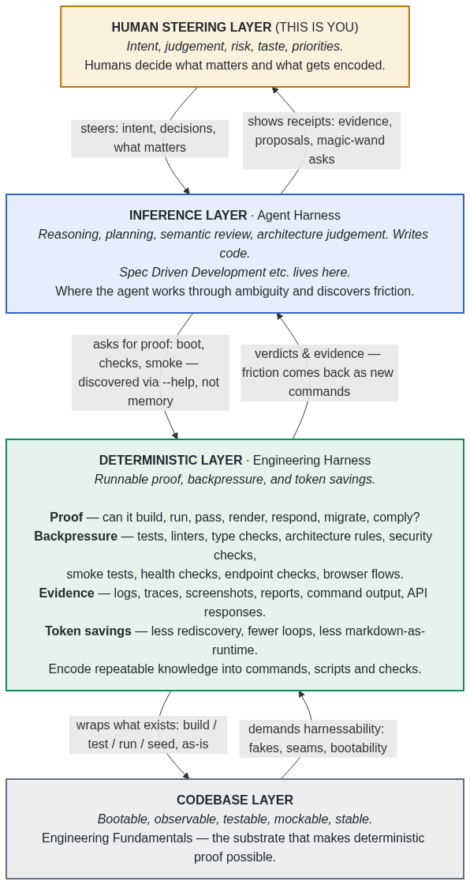

# The Engineering Harness

An engineering harness productises the software-development loop so humans and agents can move from intent to evidence, then encode what they learn into the next run.

> **💡 Fastest start — let your agent do it.** Copy this into Claude Code / Copilot / Cursor / Codex in your repo:
>
> ```text
> Install the engineering harness from https://github.com/AI-Substrate/harness-engineering
> and adopt it in this repo: read that repo's README and skills/README.md, install the
> skills with npx skills, then run the eng-harness-0-adopt skill.
> ```

## The problem

Out of all the problems with agent-driven development, two matter most:

- **The loop closes too slowly.** The agent takes too long to get real feedback from your codebase, so it guesses, loops, or waits for a human.
- **The loop is hard to trust.** "Looks good to me" from a model is inference, not proof.

Underneath both: every agent session is a fresh developer onboarding into your repo — cold. If the supported path lives in scattered scripts, docs, and tribal memory, the agent has to infer it, and you pay for that inference every session, on every dev machine.

> Can a fresh human or agent move from clean start to proved product behaviour without private tribal knowledge?

If the answer is no, the engineering harness is the surface to improve.

## The loop

An engineering harness makes the **product-development loop** explicit and operable:

```text
Boot -> Backpressure Check -> Do Work and Observe -> Retro and Magic Wand -> Improve
```

- **Boot** proves the product can start from a known state.
- **Backpressure Check** is an LLM-assisted, advisory survey of the current scope against the deterministic sensors the repo exposes.
- **Do Work and Observe** exercises real product behaviour through supported surfaces and captures what happened in inspectable forms.
- **Retro and Magic Wand** turns friction, missing signals, and improvement wishes into reviewable candidates.
- **Improve** encodes what was learned so the next run is faster, clearer, safer, or backed by stronger signals.

The harness is not throwaway scaffolding. It is a **productised development surface**: the repo-local commands, fixtures, docs, checks, state, workflows, proof paths, and feedback loops every future feature, experiment, human, and agent passes through.

## The layers

Intent flows down. Evidence flows up. The engineering harness is the **deterministic layer** — the one your repo probably doesn't have as a first-class thing.

<!-- Diagram source: docs/media/harness-layers.mmd — re-render to docs/media/harness-layers.png
     (image, not a ```mermaid block, so it renders on npm too — npm doesn't render Mermaid). -->


## The focal point

Reduce all that diffuse engineering-environment information to a single focal point — the harness CLI — and you get three things:

- **A — Discover, in one place.** `--help` instead of tribal memory. Months of team encoding shows up in help text, fetched on demand, not stuffed into agent context.
- **B — Prove, with backpressure.** One place deterministic verdicts live: yes or no, evidence attached. The agent can claim it's done; the harness decides whether the claim is supported.
- **C — Improve, on rails.** When friction shows up there's a tangible place to encode the fix — a new command, check, fixture, or sensor — and everyone on the repo, human or agent, gets it.

The agent explores it the way it explores the git CLI: it has never seen your repo, but it knows how to work a CLI. The nucleus, in one line:

```text
[CLI focal point + required agent use] + [deterministic backpressure]
  + [friction capture] + [human-selected encoding] = engineering harness nucleus
```

## See the full intro

- **[The full deck](https://ai-substrate.github.io/harness-engineering/)** — readable scrolling page with commentary, or hit `P` to present it.
- **[The layers, one page](https://ai-substrate.github.io/harness-engineering/layers.html)** — the layer model as a self-contained visual explainer.
- The canonical deck source lives at [`docs/harness-presentations/intro-to-harness.md`](docs/harness-presentations/intro-to-harness.md).

## Install the skills

This repo publishes a **setup group** (`skills/eng-harness-setup/`) and an **interactive loop group** (`skills/eng-harness-loop/`), consumable by [`npx skills@latest`](https://github.com/vercel-labs/skills):

```bash
npx skills@latest add AI-Substrate/harness-engineering/skills -a claude-code -g
```

Swap `-a` for `github-copilot`, `codex`, `cursor`, `opencode`, `pi`…; drop `-g` for a project-local install; add `-s <skill-name>` for a single skill. The harness CLI also wraps this as `harness skills install` (and `harness skills update` to refresh to latest **and prune** skills this repo has renamed or removed). The full per-CLI / global-vs-local matrix is in [`INSTALL.md`](./INSTALL.md), and [`skills/README.md`](skills/README.md) explains when to run each skill.

## Engineering harness versus agent harness

This repo is about the **engineering harness**, not agent runtimes themselves. (You'll hear the practice called "harness engineering" in the wild — we lead with *engineering harness*, the artifact, so it never gets tangled with agent-harness engineering.)

| Layer | Makes operable | Examples | Proves |
|---|---|---|---|
| Engineering harness | The product and its development loop | boot commands, build/test/run flows, seed data, fixtures, health checks, diagnostics, proof bundles, retros, encoded improvements | Whether the actual product can run and prove behaviour |
| Agent harness | The model as a tool-using agent | tool dispatch, permissions, context, session management, orchestration, memory, execution environment | Whether an agent can attempt or coordinate work |

An agent harness can drive an engineering harness, but it cannot replace one. If the product cannot boot, run, seed, observe, and prove behaviour, the agent has nothing reliable to operate.

## Backpressure

A useful harness is also a **backpressure system**: project-side feedback that makes wrong, unsafe, incomplete, or unproven work hard to continue and easy to correct. It is how the harness says: **not yet, and here is why.**

Good backpressure includes type checks, compilers, linters, schemas, tests and proof gates; health checks, doctor commands, browser traces, logs, screenshots and database checks; structured command output with failure categories and next actions; proof artefacts that show what passed and how to rerun; and human judgement routes for decisions machines cannot make.

Prompts and checklists are useful guides, but high-risk or repeated invariants should move into the strongest practical refusal surface: a command, type, schema, fixture, validation, generated guard, diagnostic, or reviewable proof path. The goal is not ceremony — it is to stop wasting human attention on machine-checkable failure and reserve human judgement for ambiguity, product intent, tradeoffs, taste, and risk.

## What's in this repo

| Area | What it is |
|---|---|
| [`harness-foundations/`](harness-foundations/) | The thesis: [first principles](harness-foundations/first-principles.md), [patterns that work](harness-foundations/patterns-that-work.md), [directives](harness-foundations/directives.md), [the simple version](harness-foundations/simple-mode.md), and [source notes](harness-foundations/source-notes/). |
| [`harness/cli/`](harness/cli/) | The harness CLI core — npx-installed, upgradeable, extended per repo from `.harness/extensions/`. |
| [`skills/`](skills/) | The deployable skills. Adoption: [`eng-harness-0-adopt`](skills/eng-harness-setup/eng-harness-0-adopt/SKILL.md), [`eng-harness-0-harnessability-assessment`](skills/eng-harness-setup/eng-harness-0-harnessability-assessment/SKILL.md), [`eng-harness-0-add-extension`](skills/eng-harness-setup/eng-harness-0-add-extension/SKILL.md). Loop: `eng-harness-1-boot`, `eng-harness-2-backpressure`, `eng-harness-4-retro`. See [`skills/README.md`](skills/README.md). |
| [`docs/`](docs/) | How-to guides ([records](docs/how/record-and-record-types.md), [architecture conformance](docs/how/architecture-conformance.md), [dogfooding](docs/how/dogfood-harness-flow.md)), presentations, plans, and project rules. |

Start with [first-principles](harness-foundations/first-principles.md) for the thesis, [patterns-that-work](harness-foundations/patterns-that-work.md) for practical moves, or [directives](harness-foundations/directives.md) for the shortest operating version.

## About this repo

This is the **home of the harness product itself**: the CLI and skills are authored here and deployed into *other* repos. We also **dogfood** the harness on this repo — *editing* the CLI or skills is product development that ships to every consumer; *running* the loop skills is dogfooding this checkout. See [`AGENTS.md`](./AGENTS.md#this-repos-dual-role) and the constitution ([`docs/project-rules/constitution.md`](docs/project-rules/constitution.md) §1).

The CLI's hexagonal architecture is itself under deterministic backpressure: `harness arch-check` proves the import graph against committed dependency-cruiser rules on every PR. Two dogfood extensions exercise the harness against real, unfamiliar repos (`harness validate-harnessability`, `harness validate-harness-flow`) — collected retros are **surfaced, never auto-implemented**. See [`docs/how/dogfood-harness-flow.md`](docs/how/dogfood-harness-flow.md).

**Publication boundary**: this repo distils private and public research into general, publication-safe principles. Raw notes and private source material live outside the public surface. Public content should avoid private names, internal codewords, local paths, unreleased details, and exact private metrics unless explicitly approved.
