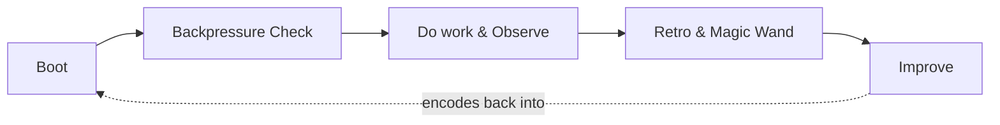

# The Harness Loop

> **One loop, five moves.** The mental model the whole harness is built around. ~7 min.

Everything the harness does fits one loop. A human or agent moves from *intent* to *evidence* to *improvement*, and each pass can make the next one faster, clearer, or safer.



If the diagram does not render, the loop is simply: **Boot → Backpressure Check → Do work & Observe → Retro & Magic Wand → Improve**, and Improve feeds back into the next Boot.

## The five moves

1. **Boot** — prove the product can start from a known state. Boot is the *first* proof: if it cannot boot, nothing downstream can be trusted. A boot or doctor command both validates readiness *and* reminds the operator how the project wants to be run.
2. **Backpressure Check** — an advisory, LLM-assisted survey over the current scope and the deterministic sensors your repo exposes (build, test, lint, typecheck, smoke, architecture, schema, security…). **The check is not the proof** — it asks *"can this work be proved well enough, and what sensor is missing?"* The proof still comes from the sensors. See [11 · Backpressure Patterns](11-backpressure-patterns.md).
3. **Do work & Observe** — make the change through supported product surfaces, and make the result inspectable: logs, traces, screenshots, responses, database checks. Observation turns hidden state into portable evidence. Capture friction as you go with `harness observe`.
4. **Retro & Magic Wand** — at the end of a meaningful run, ask the two questions that turn usage into improvement signal:
   > *"If you had a magic wand, what one command, flag, output field, fixture, check, or workflow change would make the next run easier, safer, or higher quality?"*
   > *"What did you have to infer that the harness should have proved?"*
5. **Improve** — encode the best answer back into the harness as a command, check, fixture, default, or sensor. **Improve is what makes the harness compound** — without it, you only have a test rig.

[09 · Operating the Loop](09-operating-the-loop.md) shows this loop as the rhythm of an actual working session.

## Where your workflow plugs in: the router

You do not run these moves by hand every time. The `/eng-harness-flow` **router** skill drives the loop and exposes named **touchpoints (hooks)** so your workflow — whatever it is — can call the harness at the right moments:

| Hook | `--event` alias | Fires… |
|---|---|---|
| `pre-flight` | `session-start` | at the start of a session / before work |
| `pre-coding` | `post-spec` | after a spec/plan, before implementation |
| `coding` | `pre-implement` | entering implementation |
| `post-coding` | `task-pause` / `phase-end` | after a task or phase (retro moment) |
| `post-flight` | `plan-complete` | when the work is done |

```bash
/eng-harness-flow --hook pre-flight     # e.g. boot + orient at session start
/eng-harness-flow --hook post-coding    # e.g. retro + magic-wand after a phase
```

You choose how many of these to wire in. [08 · Fitting Your Workflow](08-fitting-your-workflow.md) covers that decision.

> **One name, three things — keep them straight.** `/eng-harness-flow` is the **router** skill that drives this loop. It is *not* `the-flow` (a separate spec-driven-development workflow), and it is *not* `harness flow` (a CLI verb). [08 · Fitting Your Workflow](08-fitting-your-workflow.md) untangles all three.

## Keep reading
- The loop and its operating principles in depth: [`harness-foundations/directives.md`](../../harness-foundations/directives.md).
- The loop as a working rhythm → [09 · Operating the Loop](09-operating-the-loop.md).

---

<sub>[← Prev: What Is an Engineering Harness?](02-what-is-an-engineering-harness.md) · [↑ Start Here](README.md) · [Next: Adopting the Harness →](04-adopting-the-harness.md)</sub>
