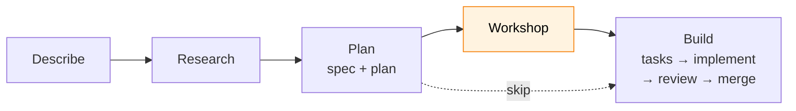
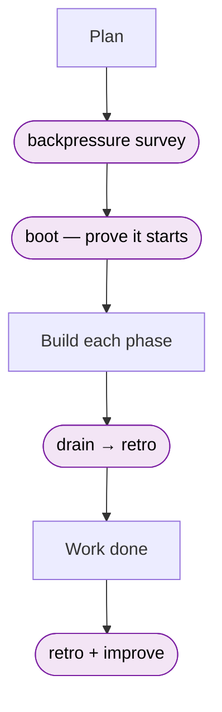
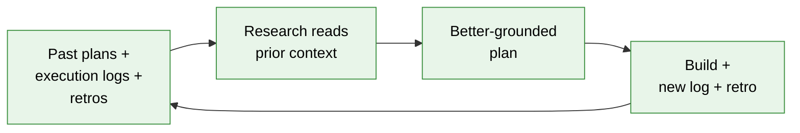

# Using the Flow

> **The flow is optional.** A guided, **spec-driven** loop you drive in plain words — describe → research → plan → build. Skip it entirely if you have a workflow you like. ~9 min.

`the-flow` is a simple way to take a problem from idea to merged code. You describe what you want; it writes the **spec and the plan first**, then implements against them — instead of an agent guessing from a one-line prompt. It is a **separate, optional companion skill**: the harness runs happily without it, and you can stop at any step.

## Install it

The flow ships from the `jakkaj/tools` skills repo and installs with [`npx skills`](https://github.com/vercel-labs/skills) — no harness setup required. Pick your agent CLI:

```bash
# Claude Code (global)
npx skills@latest add jakkaj/tools --skill the-flow -a claude-code -g

# GitHub Copilot CLI (project-local — drop -g to write to ./.copilot/skills/)
npx skills@latest add jakkaj/tools --skill the-flow -a github-copilot
```

Reload skills (or restart your agent), then type `/the-flow`. The [`jakkaj/tools` README](https://github.com/jakkaj/tools#install-the-skills) covers the other CLIs and install patterns.

## Why a spec-driven flow

Writing the intent down before the code is what makes agents reliable. In short:

- **Less ambiguity** — the spec pins down goals, edge cases, and *done*-conditions, so the agent isn't guessing.
- **One source of truth** — you, your teammates, and any agent all work from the same document.
- **Deterministic acceptance** — success is written as checkable criteria, so output is easy to review and trust.
- **Less rework** — staged checkpoints (spec → plan → build) catch conceptual mistakes *before* code exists.

And it compounds: every run leaves durable artifacts behind, which the *next* run reads — more on that in [It gets better over time](#it-gets-better-over-time).

## How it flows

You drive one step at a time. The flow **prints the next command and asks before running it**, so you stay in control and can stop anywhere.



*Orange marks the one optional stop — the workshop. Skip it when there's no design to pin down.*

## What each stage does

**Describe** — type `/the-flow` and say what you want. It captures your ask verbatim (so intent never drifts) and opens a plan folder under `docs/plans/`.

**Research** — grounds the work in your real codebase before planning:
- spins up parallel sub-agents to study patterns, conventions, and similar code
- **reads your past plans and execution logs** for context — so it gets sharper on every job
- writes it up as a `research-dossier.md`

**Plan** — the heart of it. First it asks a few front-loaded questions, then writes **one document** (a plain-language spec on top, the implementation plan below):
- **Simple or Full** — a direct one-to-few-phase task, or a larger multi-phase job with all the checks
- **Testing** — full TDD (tests first), lightweight, manual, or hybrid
- **Documentation** — README, `docs/how/`, both, or none for trivial work
- then it **validates** the plan automatically, so gaps surface while they're cheap

**Workshop** *(optional)* — pin down a design before building:
- a focused back-and-forth on one decision — the shape of a **CLI**, an **API**, a **data model**
- writes an authoritative `workshops/*.md` that the plan is regenerated to honour

**Build** — turn the plan into code:
- **tasks** *(Full mode)* — break one phase into a checkable table
- **implement** — write the code and append an `execution.log.md` (what changed, and the proof — diffs, test results); add `--companion` for a live reviewer on each commit
- **review**, then **merge** — nothing irreversible happens without you typing an explicit confirmation

## The harness rides along

The flow is one loop; the **harness has its own**, running quietly alongside. You don't drive it — if the engineering harness is installed, it just adds a few **advisory check-ins** as you go (it informs, it never gates or blocks). They come through one door: `/eng-harness-flow`, the harness's loop skill — separate from the `/the-flow` you're driving.



In plain terms: before you build, it asks *can we prove this is done?* — a **backpressure survey**. It **boots** the product before each phase to prove it still starts. And at each phase end (and at the finish) it **drains and improves** — turning the friction you hit into a fix, so the next run is easier. As you work, a lightweight `harness observe` note captures friction the moment it bites; that feeds the retro.

No harness installed? You get the same flow, minus these check-ins. (`/the-flow`, `/eng-harness-flow`, and `harness flow` are three different things — [08 · Fitting Your Workflow](08-fitting-your-workflow.md) keeps them straight.)

## It gets better over time

Every run leaves a durable trail in `docs/plans/<nnn>-<slug>/`: the original ask, the spec + plan, the execution log of how it was built, and the retro of what to improve. Nothing hard-won is thrown away.



Because the research stage reads that history, the flow becomes **more contextual the more you use it** — each job starts already knowing how the last ones went. Coupled with retros, the folder doubles as an audit trail and a dataset: what was decided, how it was built, and what you'd do better. No context is lost between sessions.

## Picking up where you left off

You can stop anytime and resume later. Close your laptop, start a new session, or `/compact` to clear context — then just run `/the-flow` again and it picks up right where you left off (it can even **adopt** a plan you started by hand). It manages this with a **flight plan** — `the-flow.json`, rendered to a readable `the-flow.md` — kept current by `harness flow` commands on the CLI, so the whole journey is tracked across sessions.

## Where next
- Choosing the flow vs your own workflow → [08 · Fitting Your Workflow](08-fitting-your-workflow.md).
- The harness loop those seams drive → [03 · The Harness Loop](03-the-harness-loop.md).
- The daily rhythm once you're building → [09 · Operating the Loop](09-operating-the-loop.md).

> **Everything here is optional.** The flow never gates, scores, or blocks you. Skip any stop, stop after any step, or don't use the flow at all — the harness works exactly the same. Prefer your own workflow? That's a first-class path: [08 · Fitting Your Workflow](08-fitting-your-workflow.md).

---

<sub>[← Prev: Fitting Your Workflow](08-fitting-your-workflow.md) · [↑ Start Here](README.md) · [Next: Operating the Loop →](09-operating-the-loop.md)</sub>
