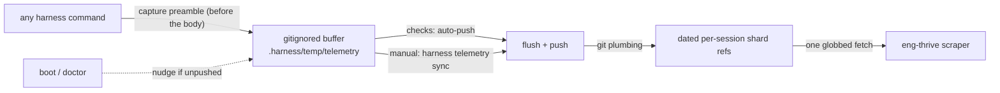
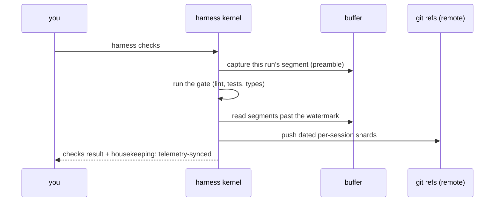

# Metrics & Measures

What the harness lets you measure, how the telemetry sensor behind it works, and how to choose what to steer by. For leads, managers, and the repo owner running the loop.

## The inner loop, instrumented

You likely already measure delivery in depth — DORA, deployment frequency, change-failure, AI-adoption. The harness adds a complementary layer alongside them: the **inner loop** — the stretch between picking up a change and proving it safe — recorded first-hand as the work happens, with **nothing extra to install on any dev's machine**. Every time someone runs a harness command, a counts-only record is collected automatically and committed to a **hidden git ref** (never a branch you'd see, never in a diff or PR). Per command it captures:

- **token usage** and **model choice**
- **skills** invoked, **tools** used, **bash commands** run
- **files** and **plans** touched, plus compaction / error events
- and two harness-health indicators: **bypass rate** (how often the paved path was skipped) and **change rate** (how often friction got encoded into a permanent fix)

Because the flow records each stage, you also get **time spent planning vs coding vs reviewing** — and the gaps between them.

Joined to the DORA and quality series you already keep, it lets you test questions like these directly on your own data:

- *Teams that spend more time planning open fewer new issues on their backlog.*
- *Teams that use — and keep improving — the harness see token usage fall over time* (the loop getting leaner, not just busier).
- *Teams that lean on deterministic tooling over ad-hoc agent calls ship higher quality.*
- *A falling bypass rate tracks a falling change-failure rate.*
- *More encoded fixes → less recurring friction → faster onboarding.*

None of these are promises — they're **hypotheses the data lets you check**. The harness doesn't replace your dashboards; it adds the inner-loop layer alongside them.

## Measure vs metric

- **Measure** — a fact the system emits.
- **Metric** — a measure you chose, gave context, and attached a target to. Promoting one is a values statement; do it deliberately.
- The harness emits honest measures. You decide which few become metrics — and keep the fact separate from the interpretation.
- Prefer **idea-to-customer over lines of code**, **outcomes over activity**, **value over motion**.
- Feeds DORA / SPACE / EngThrive (Speed · Ease · Quality, with Thriving as a guardrail). Doesn't replace them.

## Two measures you get for free

- **Harness bypass** — every time the paved path was avoided, with *why*. Trending down = the paved path is winning. (Low capture is itself a signal — the seam isn't being used.)
- **Encoded-mitigation (harness change)** — every time recurring friction became a permanent, runnable fix. The compounding signal: the loop getting better, not just busier.
- Both are leading/diagnostic and extensible. Full contract: [harness-value-measures.md](../how/harness-value-measures.md).

## A starter set (keep it small)

A couple of signals per dimension, one telemetry measure balanced against one survey question. Choose measures where gaming them means doing the right thing.

| Dimension | Outcome measure | Diagnostic / compounding |
|---|---|---|
| **Value / Speed** | idea-to-customer time | flow-stage shape |
| **Ease** | harness bypass rate | onboarding time-to-first-contribution |
| **Quality** | change-failure / bugs-to-backlog (feeds DORA) | encoded-mitigation rate |
| **Thriving** *(guardrail)* | a "bad developer day" pulse: build failures, lost focus, toil | — |

Activity counts (tokens-per-run, skills usage) are **diagnostics only** — never what you steer by. They come from the telemetry sensor below.

---

## How the telemetry sensor works

The sensor is what produces the activity diagnostics above. It runs on **every** harness command, captures a **counts-only** record, buffers it out of your working tree, and flushes it to **out-of-tree git refs** — never touching your branch or PR.



Two properties make it safe to run everywhere: **zero host impact** (capture is wrapped so it can never change a command's stdout/stderr/exit code), and **PR-invisible** (the buffer self-ignores, and the durable write is an out-of-tree ref via plumbing, so `git status --porcelain` is byte-identical across a capture and a flush).

### What it collects (counts only)

A normalized `segment` per session, carrying counts and identifiers — **never content** (no prompt/message text, no file contents, no free-form tool-arg strings, which could leak secrets).

| Group | Fields | Notes |
|---|---|---|
| Context | `command`, `harness`, `harness_session_id`, `branch`, `timecode`, `window` | session id is **opaque**, not a person |
| Volume | `tokens{…}`, `models{turns, output_tokens}` | `null` when a source is unavailable, never estimated |
| Activity | `skills{}`, `tools{}`, `subagents[]` | histograms / counts |
| Files & plans | `files{written, edited}`, `plans_touched[]` | repo-relative paths; a path outside the repo → **basename only** |
| Events | `events{compactions, api_errors, local_commands}` | counts |
| Reasoning | `effort`, `thinking{blocks}` | nullable |

A representative segment:

```json
{
  "schema_version": "1.0",
  "command": "flow",
  "harness": "claude-code",
  "harness_session_id": "<opaque id>",
  "timecode": "2026-06-23T11:00:00Z",
  "window": { "since": "last-command", "from": 8, "to": 14 },
  "branch": "034-harness-telemetry-collection",
  "branch_changed": false,
  "tokens": { "input": 120, "output": 680, "cache_create": 0,
              "cache_read": 0, "total": 1540, "subagent_tokens": 0, "grand_total": 2340 },
  "models": { "claude-opus-4-8": { "turns": 6, "output_tokens": 340 } },
  "effort": "high",
  "skills": { "the-flow": 1 },
  "tools": { "Edit": 3, "Bash": 2 },
  "subagents": [],
  "files": { "written": ["harness/cli/src/services/telemetry/sync-service.ts"], "edited": [] },
  "plans_touched": ["034-harness-telemetry-collection"],
  "events": { "compactions": [], "api_errors": 0, "local_commands": 0 },
  "thinking": { "blocks": 4 }
}
```

Every top-level key is always present (a stable shape for the scraper); only *values* reflect availability. The full enumerated schema is `harness/cli/src/services/telemetry/segment.schema.json`.

### The commands — capture, push, and reminders

Capture is automatic; **pushing** is decoupled and happens three ways:

| Command | Telemetry behaviour |
|---|---|
| *any* `harness <verb>` | captures one segment into the buffer (the preamble, before the body) |
| `harness telemetry sync` | **manual flush + push** of everything buffered |
| `harness checks` | **auto-pushes** (the capture already happened first — capture precedes push) |
| `harness boot` · `harness doctor` | **remind only** — warn if telemetry is unpushed; never push |

The reminders and the auto-push surface as an additive `housekeeping[]` field on the command's JSON envelope (and one stderr line in human mode). It **never changes the command's own status or exit code**:

```jsonc
// harness doctor / boot — a backlog is waiting
"housekeeping": [{ "kind": "telemetry-unpushed", "message": "23 telemetry segment(s) not yet pushed",
                   "command": "harness telemetry sync", "details": { "count": 23, "sessions": 1 } }]

// harness checks — flushed alongside the gate
"housekeeping": [{ "kind": "telemetry-synced", "message": "auto-pushed 4 telemetry segment(s)",
                   "details": { "count": 4, "sessions": 1 } }]

// harness checks — push could not land (offline/no-auth); reported, checks unaffected
"housekeeping": [{ "kind": "telemetry-autosync-failed", "message": "telemetry auto-sync failed: …",
                   "command": "harness telemetry sync" }]
```

A `checks` run, end to end — note capture lands **before** the push:



### Where it gets pushed

Not one shared ref — that would make a team's concurrent pushes collide. Each flush targets its **own** ref, sharded by **capture-date and session**, so every push is a clean create-or-fast-forward:

```
refs/harness-telemetry/2026/03/23/<sessionA>     commit tree → 1.json  2.json
refs/harness-telemetry/2026/03/23/<sessionB>     commit tree → 1.json
refs/harness-telemetry/2026/03/24/<sessionA>     commit tree → 3.json   (work crossed midnight)
```

The date+session live in the ref name; each commit tree is a flat set of `<seq>.json` segments. A central scraper collects **everything in one fetch** (a globbed refspec is a single round-trip), and the date prefix doubles as the prune key:

```bash
git fetch origin '+refs/harness-telemetry/*:refs/harness-telemetry/*'    # all sessions, one fetch
git log  --oneline refs/harness-telemetry/2026/03/23/<sessionA>          # the flush history
git ls-tree -r     refs/harness-telemetry/2026/03/23/<sessionA>          # the <seq>.json segments
git push origin --delete 'refs/harness-telemetry/2026/03/23/<sessionA>'  # prune after ingest
```

### How to disable it

| Variable | Effect |
|---|---|
| `HARNESS_NO_TELEMETRY=1` | **Off entirely** — no capture, no sync, no ref writes. |
| `HARNESS_NO_TELEMETRY_AUTOSYNC=1` | **Unprompted pushes off** — capture and manual `harness telemetry sync` still work; the automatic pushes (`checks`, the post-commit hook, the harness-loop close, the-flow `ship`) are suppressed (`checks` falls back to a nudge). |

### Privacy

Team/repo-grained **by construction** — never per-individual. Commits are authored by a fixed non-individual identity (`harness-telemetry <noreply@…>`); your `git config user.email` is never read or stored; shards are keyed by session, not engineer. Token counts and the like are aggregate diagnostics, **not** performance management.

The exhaustive reference — offline behaviour, the watermark/consume mechanism, server-side ref-hiding, and the full field contract — is [Harness telemetry](../how/telemetry.md).

---

## What this is not

- **Not individual measurement** — team/repo signals only, never a per-person scoreboard. Surveillance destroys the trust that keeps data honest.
- **Not a replacement** for DORA / SPACE / EngThrive — it feeds them.
- **Not a dashboard or scanner** — the harness emits signals; external tools read them.

## See also

- [harness-value-measures.md](../how/harness-value-measures.md) — the two measures in detail: bypass rate, change rate, the PR denominator, DORA correlation, anti-gaming guardrails.
- [telemetry.md](../how/telemetry.md) — the sensor reference: capture, push, segment contract, offline behaviour, disabling.
- [10 · Encoding & Learning Loops](10-encoding-and-learning-loops.md) — how friction becomes an encoded fix.

Source: EngThrive — Houck, Bozarth, Liu, Carignan, *Make It Fast and Easy to Do Great Work*, Microsoft Research 2026 (arXiv:2605.04259).

---

<sub>[← Prev: Maintaining the Harness](13-maintaining-the-harness.md) · [↑ Start Here](README.md) · [Next: Where to Next →](15-where-to-next.md)</sub>
