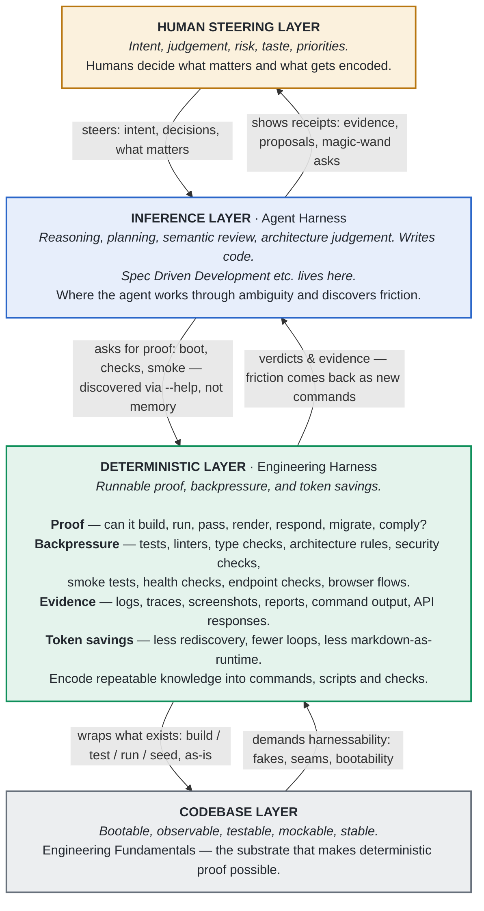

- As you work, you find things annoying or repetitive, or you just want to standardise for the team.
- So you build scripts. As humans we do this all the time.
- Agents don't get to do this. Every session, the agent has never seen your repo before this minute — even if you've worked on it for a year.
- This concept is encoding stuff into the engineering environment so the agent (and the whole team) gets to live in it too.

# Sound familiar?

- The agent says "done" — you take a look and wonder what it was up to the whole time. (→ backpressure)
- How many times has your team solved the same setup problem? (→ encode it once)
- Tests are green, everything passed… first real run, instantly broken. (→ evidence)
- "Did you even try to run this?" (→ backpressure)
- Can your agent even run and interact with your project? (→ harnessability)
- 25 minutes of the agent looping just to boot the app and hit one endpoint. (→ fewer tokens)
- And the kicker: it's you and the agent *together* that made these problems. With the correct environment, most of them don't happen.

## Speaker Notes

The agent is confident, the tests look green, and then you actually open it and something obvious is wrong. And it's you and the agent together that have made this problem — properly prompted, with the correct environment set up, it probably wouldn't have made these mistakes.

You have to wonder how many times people on your team have solved the same problem. You might not even be aware of it — while the agent's ticking away, if there's friction in the code, chances are it's happening on multiple dev machines and you won't know. Even an agent looping 20 times to get something going is friction. Fixed properly in the engineering environment, that might be one loop — and a lot fewer tokens.

Tests are green, everything passed, but when you actually try the app it's broken. Why was the agent not able to collect evidence like a human could? Why is it left up to the human to find that evidence? Why can't we make the agent find that evidence?

That classic "did you even try to run this?" — unless the agent has a very clear pathway to run something, it might not figure out how, or it'll do it off the rails. It can't be left open to inference: "run it". You have to put all of this on rails.

And every new Cursor or Copilot window: the agent has never seen this repo before this minute, even if you've been working on it for a year. How do you rapidly onboard it — how it runs, how it's checked, all of it — into this moment right now?

Each of these is a fixable harness defect, not just "the agent being dumb". The agent stumbling is usability research on your engineering environment. We'll spend the rest of the session on how to capture that and pay it forward.

And here's the thing — you've probably already fixed some of these. Maybe all of them. Maybe the fix lived in a script someone wrote, or a message in a thread. Most likely it's instructions in a markdown file. An engineering harness takes that instinct — encoding the answer so the problem never bites again — and makes it a first-class concept: it gives it a defined home. Discoverable, runnable, and shared with everyone (and every agent) on the repo.

It is the productisation of the engineering environment.

# Agenda

- Framing the problem: what an engineering harness actually is
- The layers: one picture for the whole talk
- Engineering harness vs agent harness
- Encoding your team project memory
- Backpressure, and why the deterministic kind wins
- Do as much work deterministically as possible (and why tokens make it urgent)
- Harnessability: shaping the codebase for agents
- The focal point
- CLI as the front door
- Recap: the layers
- The harness in your development flow
- Retrospective and the magic wand
- Installing the harness

## Speaker Notes

What we want to do with this deck is establish why you'd even want an engineering harness, and what it is — and establish the value prop for teams. But not by promising "you'll reduce your tokens by 50% and ship twice as much product". I want to talk about the core concepts and really focus in on the problem points engineers have with their engineering environment.

The aim is to bring engineering fundamentals and the engineering environment right up to the front of the mindset of folks using agents — it should be right there, tapping them on the shoulder every turn: hey, engineering environment, engineering environment.

One thread to watch for: the **deterministic layer**. Every slide from the layers picture onward is about making that one layer real. Call it out as the thread up front so the audience tracks it.

# Framing the problem

- Why do we need an engineering harness at all? What is it?
- An engineering harness is the productisation of your engineering environment.
  - Turning a diffuse concept (scripts, docs, makefiles, tribal steps) into a first-class concept: easy to discover, easy to understand, one focal point for improvement. On rails — not guardrails, rails.
- Two problems we're solving (out of ~50 principles, these two matter most):
  - **Problem 01 — the loop closes too slowly.** The agent takes too long to get real feedback from your codebase, so it guesses, loops, or waits for a human.
  - **Problem 02 — the loop is hard to trust.** "Looks good to me" from a model is inference, not proof.
- Two answers, matched to the problems:
  - a) Create the best possible environment for agents and humans to work together — and encode learnings and structure back into it, in a structured manner.
  - b) Systemise deterministic backpressure to raise quality and speed — encode tribal knowledge into the environment so the agent can lean on it.

> **Deterministic layer thread:** both answers land in the same place — a layer of runnable, deterministic capability sitting between the agent and your codebase. That's the next slide.

## Speaker Notes

What an engineering harness really is, is the productisation of your engineering environment. It's creating a focal point and bringing it up to be first class. Right now it's probably a diffuse concept: scripts, documentation, commands, makefiles. We want to turn it into something easy to discover, easy to understand — a cohesive system that is on rails.

I've indexed somewhere around fifty principles that matter here, but these are the two most important. We need the best possible environment for agents and humans to work together, and to encode our learnings and structure back into the engineering environment in a structured manner. That matters because all those tokens being burned figuring stuff out across your team — you're not even aware of it happening. And you shouldn't have to be.

And second: we need to systemise deterministic backpressure to raise quality and speed. Backpressure gets its own slide — for now, treat providing it as an absolute principal goal of the engineering system.

# The Layers

One picture for the whole talk. Intent flows down. Evidence flows up.

- The deterministic layer is the one your repo probably doesn't have as a first-class thing. It's the thread for the rest of this deck — every slide from here is about making that layer real.
- "If the agent had to infer it twice, encode it here."

## Speaker Notes

Walk the stack top to bottom, and narrate the paired flows — they're the point of the picture.

Humans steer down: intent, decisions, what matters. The stack shows receipts back up: evidence, proposals, magic-wand asks. Nothing below this layer chooses what matters.

The inference layer is the agent harness — where the agent reasons, plans, writes code, and discovers friction. It asks the layer below for proof — boot, checks, smoke — discovered via --help, not memory. And it gets verdicts and evidence back up. Friction comes back as new commands.

The deterministic layer is the engineering harness. Runnable proof. Trusted backpressure. Fewer tokens. Build, run, test, lint, typecheck, smoke. Probe endpoints, drive the browser, capture logs. Show evidence. Rerun until green. If the agent had to infer it twice, encode it here — that line is the thread for the rest of the talk.

The deterministic layer wraps what already exists in the codebase — build, test, run, seed, as-is — and in return it demands harnessability from the codebase: fakes, seams, bootability.

(Maintenance note: `docs/static-site/layers.html` and `docs/static-site/index.html` (the full deck) mirror this slide's wording — this slide owns the canonical wording; keep them in sync.)

# Engineering Harness vs Agent Harness

- The harness word is hot right now, probably overused.
- We mean engineering harnesses here, not agent harnesses.
- In layer terms: the agent harness is the **inference layer**; the engineering harness is the **deterministic layer**. Different layers — don't conflate them.
  - Agent harness: the runtime that drives the model (Copilot, Claude Code, Codex, Cursor) — the agentic loop, tools, skills, MCP servers feeding the LLM.
  - Engineering harness: the project-side loop it drives. Its birth name is "the productisation of the engineering environment" — engineering harness is just easier to say.
- Highly cohesive: a better engineering harness means better agent outcomes, whatever runtime you use. Invest in the loop, not just the model.

> **Deterministic layer thread:** the engineering harness *is* the deterministic layer — with a name, and (soon) a front door.

## Speaker Notes

Just want to quickly deconflate a couple of terms, because people keep conflating them.

If you're doing agent-harness engineering, you're working on the skills, the prompts, the tools, the MCP servers — the stuff feeding the actual LLM. The engineering harness is the project-side loop that the agent harness drives. They're highly cohesive — the engineering harness will probably ship some skills of its own, for example — but they're different layers of the stack.

The engineering harness's longer full name — its birth name — is the productisation of the engineering environment: the first-class-concept focal point. "Engineering harness" is just the simple way to say that.

# Encoding your team project memory

- The engineering harness is about building the thing that builds the thing.
- Creating and encoding team/project memory as deterministic code where possible, with markdown as fallback.
- Rather than writing down a memory — "hey, we discovered this, here's how you solve it" — **just solve it**. Put the fix where the problem lives.
- The payoff: nobody has to read it, search for it, or load it into agent context. It just exists. Because it exists, it's how it works. It becomes physical.
- Pushing for creative, innovative ways to create deterministic backpressure in the codebase.
- It's a team sport, akin to a chess game played by mail. The game is to create an executable version of the team's memory and learnings.

> **Deterministic layer thread:** team memory you don't have to remember — it's executable, so it's just how the repo works now.

## Speaker Notes

Your engineering environment is the thing that builds the thing. We want to take all the loops we have and encode them as deterministic memory.

It's the whole: rather than write down a memory somewhere — hey, we discovered this and this is how you solve it — just solve it. Just put it there. We're giving it somewhere to do that. All the learnings, all the friction. As the agent works it keeps an eye out for these and has a way, and a place, to push them.

And this is the bit to land hard: this virtual team memory — the memory of all the agent sessions and everything they've learned — goes into your engineering environment and then it just exists. You don't have to read it. You don't have to search for it or load it into your agent context. Because it exists, it's how it works. It becomes physical. That's what the engineering harness is.

# Backpressure

- The agent says it's done — but did it even run the code? That review reflex is backpressure, the human kind.
- The agent's had a crack at it — but with no backpressure it doesn't know if the crack's correct. Sensors and probes give it a signal to steer by.
- Human backpressure is tribal knowledge: unevenly spread, some people better at it than others. Encode it into the physical system instead.
- Kinds of backpressure, least to most reliable:
  - Inferred / LLM-driven: "do a code review" — non-deterministic, even with an advanced prompt that checks architecture.
  - Deterministic: the best kind. Take the inference of correctness **out of the LLM** and put it **into deterministic code**.
- Deterministic backpressure, from obvious to advanced:
  - Unit tests — agents are very good at red/green TDD. But tests won't validate architecture.
  - Architecture as a rule set: 10,000 pages of clean-architecture markdown vs a CodeQL / Roslyn check the agent runs. It doesn't have to know any of it — it just gets yes or no.
  - Closing the loop: a harness command to build, host, and connect a Playwright browser so the agent physically tests the shiny new button it just added.
- When a deterministic check is wrong, it's not a judgement call anymore — you just fix the check, and everyone gets the fix.
- Instead of "remember to start the app this weird way" → `harness boot`. Instead of "check this follows our architecture" → `harness check architecture`. Instead of "manually open the app and see if the button works" → `harness smoke checkout-flow`.
- The point: move as much backpressure from the inferred world to the deterministic world — and push for creative, innovative ways to create backpressure we can trust.

> **Deterministic layer thread:** backpressure is what the deterministic layer pushes back *up* the stack — verdicts and evidence, not vibes.

## Speaker Notes

This is something we really want to push on in teams. It's not that backpressure doesn't exist in repos — it's that it's hidden. We want to take what's there, bubble it up to first class and high visibility, and then strive to build more.

The human kind first: the agent does the work, you run it up, click around, and go "no, fix this, fix that". That's backpressure — you're guiding the agent with pressure toward the proper result. It's had a crack at it, but with no backpressure it doesn't know if the crack's correct. You're creating sensors and probes so it can act in the environment and get a signal back that guides it.

We want to get away from human-only backpressure. Some humans are better at it than others — that's tribal knowledge. If we could bring all of that knowledge and encode it into the physical system, that would be pretty sick, right?

Inferred backpressure — "do a code review" — is non-deterministic. Even with an advanced prompt checking architecture, it's different every time. Models are pretty good, don't get me wrong, but where you can, go one step further: deterministic backpressure. Actual checks in code.

Architecture is the big example. You might have 10,000 pages of markdown on clean architecture, hexagonal design, ports and adapters, dependency injection — and you say to the agent "implement this way, don't fail me". Or: you use CodeQL or Roslyn to build a rule set that checks the implementation takes the shape. The agent doesn't have to know any of it. It just gets an answer: yes it is good, or no it is not. And when you're reviewing as a human and you spot the architecture check missed something — it's exceptionally obvious where the fix goes. It's not a judgement call anymore. You just fix the check. That's what giving it a focal point means.

(If asked how the agent uses this, the answer that worked live: the harness gives the agent commands it can run. The commands are deterministic, so the signal is highly trustable — and if they're not quite right, there's a very obvious way to fix them. The agent is in charge of the loop; we've just taken the inference of correctness out of the LLM and put it into deterministic code.)

Unit tests are the most obvious deterministic form — agents are very good at red/green TDD. But that won't validate architecture or do end-to-end. Then there's closing the loop: harness commands that build and host the product and let the agent connect Playwright to actually look at and click on what it built.

This is the thing teams need to get good at if they're going to have trustable, predictable engineering environments that agents can work on.

# Do as much work deterministically as possible.

- Deterministic = code and scripts: runnable, probably idempotent, and it can have unit tests. Validate your validators.
- Skills and markdown are great — but not good enough on their own. Move as much of it as possible into deterministic capability.
  - New service in your app? Scaffold it from templates — tests included — and run architecture validation as part of the test plan. Don't describe the shape in markdown; generate the shape.
- Tokens make this urgent:
  - Ten hours a week of code-review tokens per developer — can deterministic checks make it eight?
  - Never re-discover the same thing twice, even across different dev machines.
  - If the agent loops 20 turns to figure something out, that's the signal: encode it, and it's one loop next time.
- Deterministic processes are more trustable, and when they break you get an obvious target to fix — and everyone on the repo gets the fix too.
- Don't tell me how to fix it — just fix it.

> **Deterministic layer thread:** every loop you encode moves work out of the expensive, fuzzy inference layer into the cheap, repeatable deterministic layer.

## Speaker Notes

When agent harnesses came out and we got skills and markdown, people started putting all their engineering stuff into skills: run this script, this is how you write these functions, here's my project constitution and architecture. They're all great — but they're not good enough. You have to move as much of that as possible into deterministic capability. If you're creating a new service in your app, scaffold it from templates, scaffold the tests, and run architecture validation as part of the test plan.

Deterministic basically means scripts and code — anything runnable as code. It's probably idempotent, so you can run it over and over and get the same result. It's predictable. And you can unit test it — you can double-check that your deterministic checks are themselves tested. Validate your validators.

Why the urgency: tokens are expensive. If we're doing ten hours of code reviews a week per developer just burning tokens, can deterministic checks get that to eight? And any tokens we spend figuring something out — that's the trigger to ask whether it should be encoded into the environment for the rest of the team and our future selves. Never re-discover something twice, even on different developer machines. Twenty loops to figure something out is a strong signal the engineering environment needs improvement.

This was obvious in the past — a hard or arcane process, we'd write a script for ourselves, our peers, and CI. These days it's become too easy to just update an agents file. Choose what goes where wisely, but lean deterministic. Rather than write the learning in a file, build the learning as a fix or feature. Don't tell me how to fix it, just fix it.

# Harnessability

- The engineering environment isn't the only thing to improve — your codebase may need to change so agents can operate more freely.
- The real measure: how **adaptable** is your codebase to creating the backpressure a given task needs?
- Agent onboarding: how easy is it to run your system?
  - Could you conceivably run it up and do full end-to-end checks, real pipelines, in an isolated CI run? That's the top of the castle: an agent pulls a PR and just works, with all the deterministic backpressure and tools of a local machine. It just works.
- Fakes and seams: can the agent stand the system up locally — faking the connection to an upstream system, or running the database and downstream services locally? Editing/creating DB tables, seeding records — the whole shebang.
- A well-composed codebase (composability, dependency injection, seams) is one the agent can work on more efficiently.
- There's a harnessability assessment skill that scores exactly this: how fast an agent goes from zero to run/build/test on your repo, and how adaptable the codebase is.
- If the engineering environment is stretched thin by the codebase, maybe it's time to update the codebase.

> **Deterministic layer thread:** the codebase is the substrate — the deterministic layer can only prove what the codebase lets it touch.

## Speaker Notes

The engineering environment is not the only thing that might need improving. The codebase itself might need to change in ways that improve the quality you can produce when working on it.

How easy is it to run your system? Are you able to fully run your application on a local dev machine, end to end, full stack? Could you conceivably run it up and do full end-to-end checks using real pipelines in an isolated environment like a CI run? That's peak onboarding: an agent pulls a PR and just works.

The reason this matters: the agent can work far more efficiently on a codebase that's well composed, where it can fake in pieces. Instead of connecting to a real database on a remote machine, it fakes the connection to the upstream system, or runs that database — or that downstream service — locally. How easy is it for your harness to run the code up on your machine and adapt and modify it rapidly? Look for signals like composability and dependency injection.

And it all rolls up to one question: how adaptable is the codebase to being changed to create the backpressure required for the given task? We have a harnessability assessment skill that checks for these signals — onboarding, run/build/test from zero, the lot.

# Focal Point

- Reduce diffuse information to a single focal point. You get three things:
  - **A — Discover.** One place to look and see everything the engineering environment can do. Seed a database and connect your product to it? That's one discoverable command.
  - **B — Prove.** One place backpressure lives. Pre-check work before you start: "if we do this work, how will the system deterministically validate it?"
  - **C — Improve.** Friction encoding on rails — the process is fully defined, and it's obvious where a fix lives and where it goes. A deterministic check misbehaving? Fix it, in place.
- A and C are both sides of the same coin: make capabilities super discoverable, and make encoding new ones the easy, on-rails path.
- The harness gives the pre-check question far more context and affordance — the team gathers the concept quickly.

> **Deterministic layer thread:** discover, prove, improve only work because the layer has *one surface*. That surface is the next slide.

## Speaker Notes

We want to put on rails the process through which friction — and any features the engineering environment needs — gets encoded. Fully defined, and very obvious as to where it lives and where it should go.

The idea is three-fold. Discover: make the features of the engineering environment as discoverable as possible — go look in one place and see everything it can do. If you can seed a new database and connect to it with your product, that's a single command, discoverable in the harness. Prove: it's where the backpressure lives, and you can pre-check work — if we do this work, how will the system deterministically validate it? And improve: you're giving a target for improvement. Something would have made this way easier next time? Add it to the harness. A deterministic check not working as expected? Fix it.

Discover and improve are both sides of the same coin — not only make the capabilities super discoverable, but make encoding the fixes the easy, on-rails path in the first place.

# CLI as the front door

- This is where it gets physical: everything we've talked about, made manifest — your harness CLI.
- CLI is a magnificent focal-point mechanism for agents. They understand them; they're highly trained on them.
- Months of team encoding shows up in `--help` — it doesn't get stuffed into the context as skills. Think of it as encouraging *deterministic skills*.
- agents.md stays a single paragraph: "the harness can see databases, run smoke tests, …" — the details live behind `--help`, fetched on demand.
- The agent explores it the way it explores the git CLI: it has never seen your repo, but it knows how to work a CLI. This is that, for your codebase.
- Every session is a cold onboarding — wrap what you already have (build/test/lint/doctor/boot/smoke/seed) to give a front door.
- If it's designed well, pointing the agent at the CLI is *almost* enough — the harness can just about take care of itself.

> **Deterministic layer thread:** the CLI is the deterministic layer made tangible — the front door to every proof the repo can offer.

## Speaker Notes

We've talked a lot about the engineering environment so far, but not about physical things. This is what's made manifest from all of it: your harness CLI.

CLIs serve as a magnificent focal point for agents — they understand them, they're very highly trained on them. All that stuff we've been collecting and encoding for months as a team shows up in help commands. It doesn't get stuffed into the context as skills. If the agent needs to see the database, it goes and looks in the harness; the agents.md file might say "you can see databases, you can do this and this" — just a single paragraph — and the help command can dump a little prompt that tells it how. It's like a skill, except we're encouraging the encoding of deterministic skills.

Every session in a new agent is cold onboarding — how quickly can you bootstrap an empty session? CLIs are fantastic for that. The agent can explore the git CLI and know how to do everything about git even if it had never seen it before. This is that, for your codebase.

If it's designed well, you might not need much other prompting. The harness can just about take care of itself.

# Recap: The layers

The stack, one more time:

- **Human steering** — decides what matters, and what gets encoded. Steers ↓, receives receipts ↑.
- **Inference (agent harness)** — reasons, plans, writes code, discovers friction. Asks for proof ↓, receives verdicts & evidence ↑.
- **Deterministic (engineering harness)** — runnable proof, trusted backpressure, fewer tokens. Wraps the codebase ↓, demands harnessability ↑.
- **Codebase** — bootable, observable, testable, mockable, stable. The substrate.

How you operate it:

- Assume friction will happen — especially while the harness is new. It's your job to make it do the things it doesn't do yet.
- Give the repo one focal operating surface: the CLI.
- Instruct the agent to use the CLI, not guess around it.
- Strive to make the agent use deterministic means for backpressure.
- Capture friction as improvement feedback. Ask what the agent had to infer that the harness should have proved.
- Human chooses what matters.
- Encode the chosen fix into the engineering environment (via the harness).
- Repeat.

\[CLI focal point + required agent use of said CLI\] + \[deterministic backpressure\] + \[friction capture\] + \[human-selected encoding\] = engineering harness nucleus.

## Speaker Notes

To summarise all of that in one hit. We assume friction will happen — the agent is probably not going to sail through clear skies, especially early on. This is especially important when the harness is new, because it won't do much yet — you haven't run into all the problems. Part of what we see when installing for teams: "oh, it doesn't do this, it doesn't do that". Right — it's your job to make it do that now.

Then: one focal operating surface, the CLI, and the agent is instructed to use it, not guess around it. We query the environment — including backpressure — before we even start work: are we confident the ways the harness provides backpressure will satisfy this task in a non-risky way?

We capture friction as improvement feedback — encoded into the skills, the agent writes retros at the end of its work. The human keeps it honest — "why did you take twenty turns there? Is that an opportunity?" — and then we either put tasks on the board or just fix it then, re-encoding the fix into the engineering environment. It's on us to pay that forward.

And that's the nucleus: CLI focal point plus required use of said CLI, plus deterministic backpressure, plus friction capture, plus human-selected encoding. That's what we've been building.

# Engineering harness in your development flow.

- A good engineering harness adapts to your existing environment and flows, shaping to your repo and process as you build. Your flows should only adapt a little.
- Teams are (rightly) particular about their workflows — the harness enhances the flow, it doesn't stomp on it. It just keeps tapping you on the shoulder.
- The harness has a loop of its own that lives inside your existing flow (spec-driven development flows are best).
- Canonical flow: **Boot → Backpressure Check → Do work and observe → Retro & magic wand → Improve (encode the fix) → repeat.**
  - Boot — "if your environment isn't working before you start, it certainly won't be working after you start mucking around with it."
  - Backpressure Check — sometimes you stop and build the backpressure *first*. Side missions that run a day are worth it.
  - Do work and observe
  - Retro & magic wand
  - Improve (encode the fix)
- Bypassing the harness = burning tokens without paying the discoveries forward.

> **Deterministic layer thread:** the loop exists to grow the layer — every pass through it should leave the deterministic layer a little bigger.

## Speaker Notes

Teams are pretty particular when it comes to mucking around with their established workflows, and we want to be really careful about that — no stomping, no teaching anyone to suck eggs. Done well, the harness sits inside the flow and enhances it; it shouldn't have to change much. It's just constantly tapping you on the shoulder.

Boot: before you start your work — probably after planning, before implementation — you boot the harness. Can it build? Depending on the codebase, boot might fire up the code with hot reload, or stand up an endpoint and validate you can ping it. Because if your engineering environment is not working before you start, it certainly won't be working after you start mucking around with it. Boot also reminds the agent how to work with the harness — probably a skill: use the harness, provide feedback, all that.

Backpressure Check: a skill takes the planned work and checks that we'll be able to use deterministic backpressure where possible, and highlights options for improvement. Score the risk a little: is the validation deterministic or not, how complex is the task? Sometimes the right call is to stop and go do a piece of engineering work to create the backpressure first. I've had side missions that ran for a day building backpressure for a single task — totally worth it. In one case (Huxley) we demonstrably proved the agent found it very difficult to operate without it.

During do-work, the agent takes notes — frictions, places it got stuck, thin confidence — while using the harness to capture real evidence: logs, health, smoke responses, screenshots, artifacts. Physical, real evidence. If the evidence is light, the environment should be improved.

Then the retro and the magic wand question, then the human reviews and encodes. And a warning: if folks bypass the harness and don't improve it, they're just burning tokens. They will run into things, and they will fix them by hand-cranking the prompt window — and none of it gets paid forward. It might feel like a cliff face at the start, but it's super important.

# Retrospective and Magic Wand and the compounding pay off

- Watch someone hand-crank an agent: they fix a problem using five years of built-in knowledge of the codebase. Why isn't that encoded back in? Because there's been no standardised way to. Now there is.
- Retro vs magic wand:
  - Retro: "this was hard, that was easy, here's what could have gone better."
  - Magic wand: "add this command to the harness — and here's why it would be cool."
- The magic-wand question really is magic — well-prompted, the agent makes great suggestions. I've re-encoded some fantastic ones.
- Expect the harness to show up in your dashboards: change failure rate, time from implementation to delivery, token usage. Tokens spike at first — you're building the whole damn thing — then compound down.
- After even a few iterations in the team, the payoffs start to compound.

> **Deterministic layer thread:** the magic wand is the layer's growth engine — every good answer becomes a new command, check, or sensor.

## Speaker Notes

Watching people manually use Cursor to do work, I'm constantly thinking: oh, I would have captured that. That sounds like something someone else on the team would want. Why did you prompt it that way? You just used five years of built-in knowledge from working on this codebase to fix that problem — why wasn't that encoded back in? And the answer is: because there's no way to do that. No standardised way in the team. We're providing that standardised way for all teams.

When the harness is really singing, at the end of a run you ask: if you had a magic wand, what would you have done here? The retro is "this was hard, that was easy, here's what could have gone better". The magic wand is different — it's "you should add a whole new command to the harness to do X, and here's why that would be cool". And then you can go and do that. I've seen this pay off in some absolutely magnificent ways over the last year or so of working with harnesses.

Even after just a few iterations in the team you should expect to see it — and expect the harness to show up in your dashboards. Change failure rate, time from implementation to delivery, token usage. Tokens will spike at first because you've got to build the whole damn thing — then you should see the compounding as the team learns to improve its own environment and treats it as a first-class consideration.

# Installing the harness.

- Two parts:
  - Core — installed via NPX, upgradeable. New capability can ship to every repo later (e.g. metrics: token usage, skills usage, harness bypass rate — correlate against PR approval times).
  - Extensions — created per repo, gathered at runtime from the `.harness` folder.
- Teams don't start from scratch: every repo gets the same extensions concept and the same base skills, improving over time.
- On install it's minimal — almost no features, just the will to improve and take the shape your environment needs.
- Super easy to install in any repo — no ceremony, just install it.
- The installation skill runs an initial harnessability survey and recommends first extensions (test, build, lint etc), plus the skills that assist with the harness loop (boot, observe, retro).

## Speaker Notes

We're trying to make all of that into a system you can install — think about how hard that is for a minute.

The core is installed via NPX and is upgradeable, so it can grow new features later. For example, if an engineering org decides to add metrics collection — token usage, skills usage, time from PRD to PR, harness bypass rate (was the harness used as part of this work?) — that can be encoded into the core and correlated with things like reduction in PR approval times. Data that matters.

Extensions are created per repo: run the CLI in a repo with a `.harness` folder and those extensions get picked up and become available in the CLI. Best of both worlds — upgradeable core, per-repo extensions. When teams install it they don't start from scratch, and every codebase shares the same extensions concept and the same base skills that drive it.

On install it's minimal — almost no features other than the will to improve and take the shape your environment needs. The installation skill runs a harnessability survey to have a good look at the codebase, then recommends your first extensions — build, lint, test — plus the skills that assist with the harness loop: boot, observe, retro.
