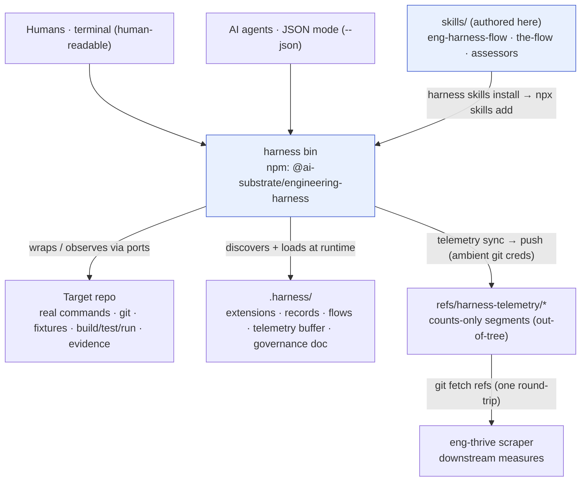
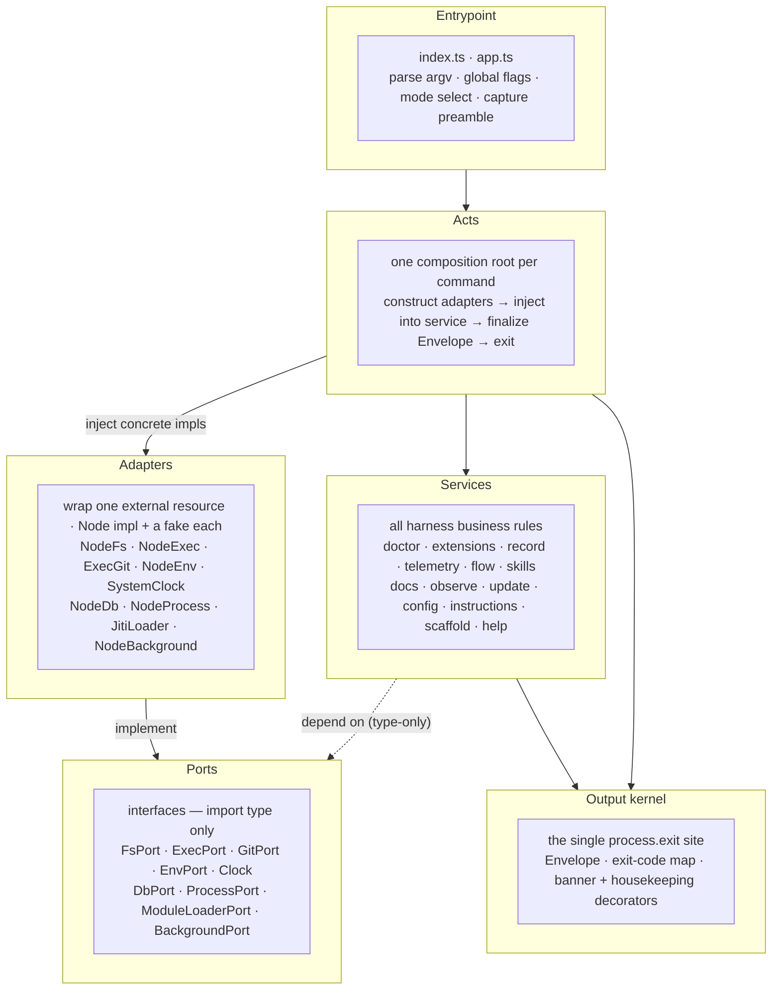
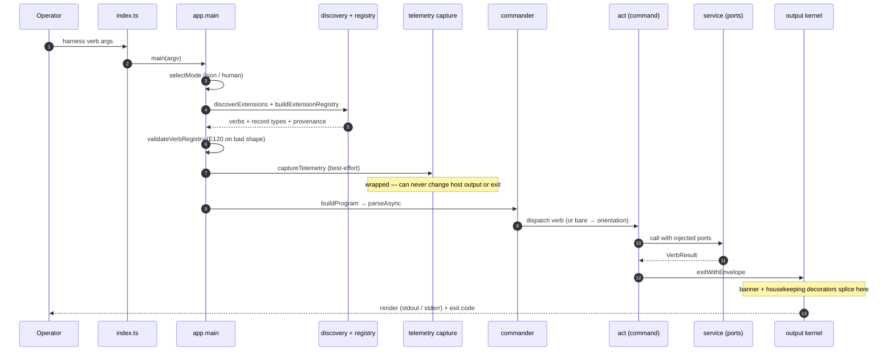
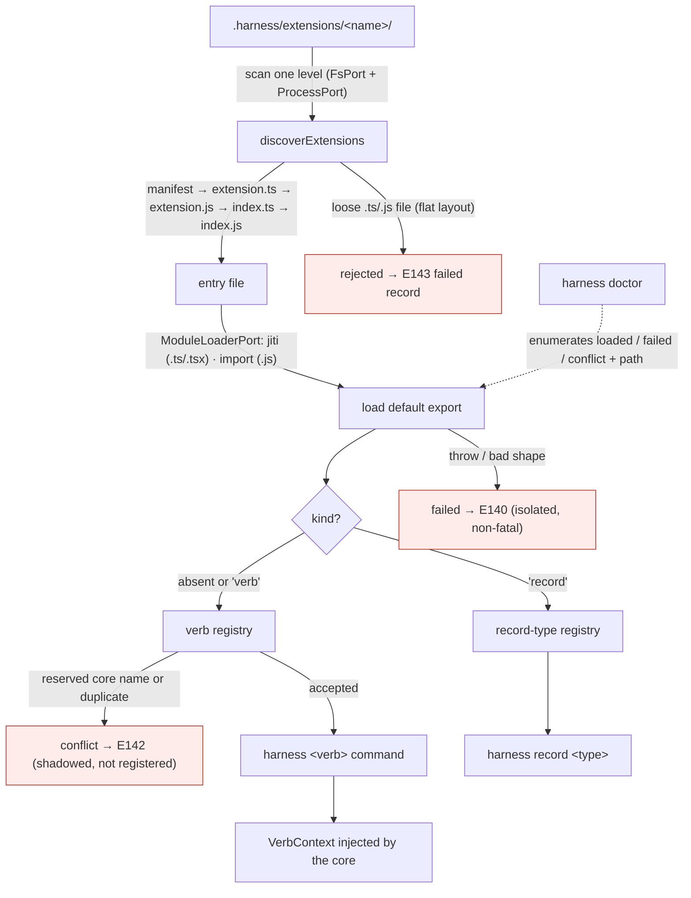
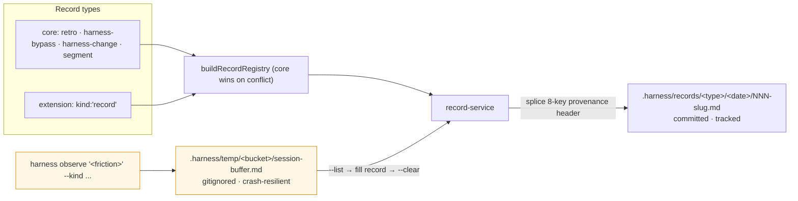
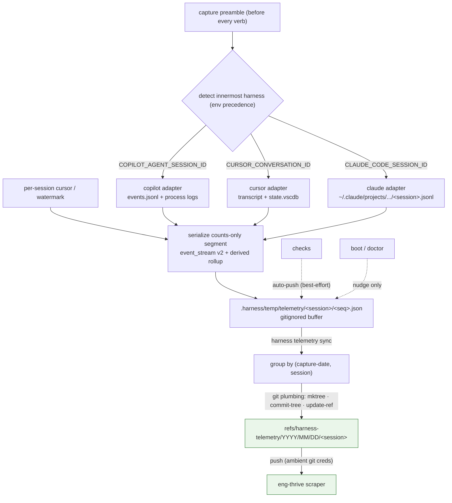
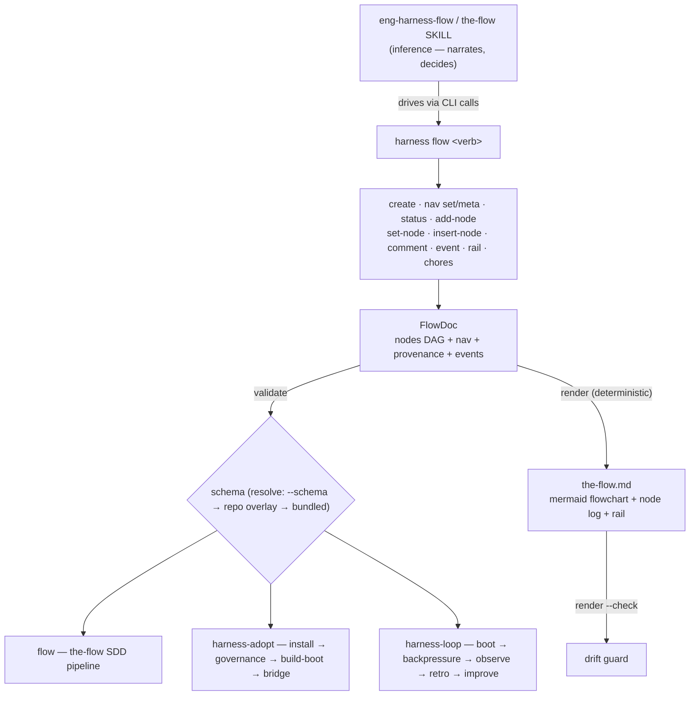
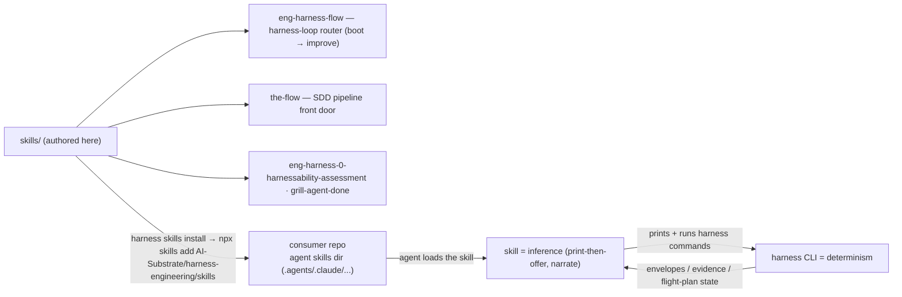
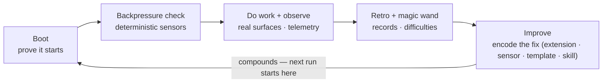

# Detailed system overview

A whole-system architecture map of the harness — from how extensions plug in, to
the hexagonal core, to skills, records, telemetry, and the flight-plan engine —
told in nine focused diagrams. It is the *tie-it-together* view; each subsystem
has a dedicated how-to that goes deeper (linked at the end of every section).

---

## What this system is (and its dual role)

The **Harness CLI** (`@ai-substrate/engineering-harness`, bin `harness`) is the
**agent-friendly front door** to a repo's engineering harness — a deterministic
Node CLI a human or agent drives the way it already drives familiar tooling such
as `git`. It holds no
model and no agents of its own (skills aside); it *wraps and observes* the
commands, fixtures, and proof a repo already has, and fills only the genuine
gaps.

This repository plays **two roles at once** (see [`AGENTS.md`](../../AGENTS.md)):

- **Product home / source** — the CLI (`harness/cli/`) and the eng-harness
  skills (`skills/`) are *authored here* and *deployed out* to consumer repos via
  `npx skills` / `harness skills install`. A change here propagates to every
  consumer.
- **Dogfooding site** — the harness is also *used* on this repo (extensions in
  `.harness/extensions/`, a governance doc, `minih` agents).

It is an **engineering** harness, not an **agent** harness: it proves the
*product* loop (boot, backpressure, observe, retro, improve), not the runtime
around the *model*. The agent harness (Claude Code, Copilot CLI, Cursor, `minih`)
*drives* this CLI; this CLI does not replace it.

**See also:** [`docs/project-rules/architecture.md`](../project-rules/architecture.md)
· [`docs/guide/03-the-harness-loop.md`](../guide/03-the-harness-loop.md).

---

## 1. The hexagonal core (ports and adapters)

The CLI is **Hexagonal / Ports & Adapters** with a Clean-Architecture use-case
layer (the *acts*). **Dependencies point inward**: the entrypoint selects an act;
acts construct concrete adapters and inject them into services; services depend
only on **port interfaces** (`import type`, erased at runtime), never on a Node
side-effect module; adapters wrap exactly one external resource and stay leaves;
the **output kernel** owns the single `process.exit`.

The contract is **deterministically enforced**, not just documented: seven
[dependency-cruiser rules](architecture-conformance.md) plus point-check tests
fail the build when a layer is crossed.

| Layer | Responsibility | Must not |
|---|---|---|
| **Entrypoint** (`src/index.ts`, `src/app.ts`) | parse argv, resolve mode once, discover extensions, fire the telemetry preamble, build the program, route every failure through the kernel | hold business logic; import `node:fs`/`child_process`/git directly |
| **Acts** (`src/acts/*`) | per-command composition root: build adapters, inject into a service, turn the result into an Envelope, exit | implement harness logic; emit raw strings |
| **Services** (`src/services/*`) | the business rules — receive ports as parameters | import Node side-effect modules; call `process.exit` |
| **Adapters** (`src/adapters/*`) | wrap one external resource behind a `*-port.ts`; ship a Node impl **and** a fake | contain business rules |
| **Output kernel** (`src/output/*`) | Envelope type, exit-code map, human/JSON renderer, the lone exit | be bypassed by ad-hoc `console.log`/`process.exit` |

**See also:** [Architecture conformance](architecture-conformance.md) ·
[`architecture.md` §2](../project-rules/architecture.md).

---

## 2. The output contract (the CLI's public API)

Every command returns a single **Envelope** — the stable, MCP-friendly shape both
humans and agents read. Authors return *intent*; the kernel owns `command`,
`timestamp`, exit code, and the only `process.exit`. Additive notices
(`update_available`, `housekeeping[]`) are spliced **only at the exit chokepoint**
so they never disturb a command's own data or snapshots.

| Field | Notes |
|---|---|
| `status` | `ok` · `degraded` · `unconfigured` · `error` |
| `command`, `timestamp` | stamped by the kernel (timestamp from the `Clock` port) |
| `data?` | present on `ok`/`degraded` |
| `error?` | `{ code, message, details? }` — present on `error` |
| `evidence?` | `[{ label, path?, none? }]` — durable proof pointers |
| `next_action` | **required** whenever `status !== 'ok'` |
| `update_available?`, `housekeeping?` | additive, exit-chokepoint only |

**Exit codes:** `ok`/`degraded → 0`, `unconfigured → 2`, `error → 1`. **Mode
selection:** `--json`/`--no-json` flag → `HARNESS_JSON=1` → TTY detection. JSON
goes to **stdout** (one line); human diagnostics go to **stderr**, the summary to
stdout.

---

## 3. Command dispatch lifecycle

One pass per invocation: resolve mode, **discover + load extensions**, validate
the assembled registry, fire the **counts-only telemetry preamble** (before the
command body, wrapped so it can never change output or exit), then hand off to
commander. The kernel's exit decorators fire last.

`--no-extensions` / `HARNESS_NO_EXTENSIONS=1` skips discovery entirely (core
commands only). Three error boundaries keep the kernel the sole exit: an
unexpected discovery error → `E100`; a malformed registry → `E120`; a commander
parse error → an actionable `E108` (help/version print and exit 0).

---

## 4. The extension system (how verbs and record types plug in)

**Verbs are dynamic and owned by extensions** — the core ships *no* built-in verb
list. A repo drops a little package under `.harness/extensions/<name>/`; the core
discovers it at runtime and turns its default export into a top-level
`harness <verb>` (or a `harness record <type>`). One discovery pass loads both
verbs and record types, routed by a `kind` discriminator.

- **Discovery** scans `.harness/extensions/` **one level**. An extension is a
  *folder*; the entry resolves by `package.json` `harness.extensions[]` manifest →
  `extension.ts` → `extension.js` → `index.ts` → `index.js`. A loose flat file is
  refused (`E143`) with an actionable fix. Paths are normalized to logical POSIX
  once, at the boundary.
- **Isolation by construction:** each file loads in its own `try`; a load throw or
  bad export → `E140` `failed` (never crashes the others); a name claimed by a
  core command or earlier extension → `E142` `conflict` (shadowed, dropped).
  `doctor` reports every outcome without running a single handler.
- **Reserved core commands** an extension may not shadow: `help`, `doctor`, `new`,
  `docs`, `skills`, `record`, `instructions`, `observe`, `init`, `flow` (plus the
  `update` and `telemetry` acts). `doctor`/`help` stay **core**, never verbs.

### What an extension author writes (the contract)

A default export is a `HarnessVerb`, a `HarnessRecordType`, or an array mixing
both (imported as types from `@ai-substrate/engineering-harness/contract`, so even
a plain `.js` extension needs no runtime dependency on the core). A verb's
`run(ctx)` receives a **`VerbContext`** of injected capabilities and returns a
`VerbResult` the kernel finalizes:

| `ctx` capability | Purpose |
|---|---|
| `exec(cmd, args?)` | run a **real repo command** — "wrap, don't rebuild" |
| `fs` / `fsWrite?` | read; optional confined write (mkdirp, atomic write, CWE-59-safe copy) |
| `background?` | optional detached fire-and-forget spawn (portable, injection-safe) |
| `git`, `env`, `clock` | repo/branch, env reads, ISO time + fakeable `sleep` |
| `ok` / `degraded` / `unconfigured` / `error` | Envelope helpers (no kernel import) |

The split it encodes: **the verb brings determinism, the agent brings inference**
— each extension also ships an `instructions.md` briefing served verbatim by
`harness instructions <verb>`.

**See also:** [Extend the harness](extend-the-harness.md) ·
[Cross-platform verbs](cross-platform-verbs.md) ·
`harness/cli/src/services/extensions/`.

---

## 5. Records and observations (durable memory vs transient scratch)

A **record** is a structured markdown file an agent or human fills; a **record
type** is the template it is scaffolded from. The CLI is deliberately
schema-agnostic — it knows only four fields (`kind`, `type`, `description`,
`template`) — so a new type is *a template plus four fields*, never a code change.
Records are **committed team memory**; **observations** are gitignored in-flight
scratch that drains into a record.

- **Placement is locked:** `.harness/records/<type>/<YYYY-MM-DD>/<NNN>-<slug>.md`,
  per-day per-type ordinal, never clobbered. No `.harness/` → `unconfigured`
  (exit 2), writes nothing.
- **Provenance** is an 8-key frozen header (7 spliced from git/clock/version +
  template-owned `schema_version`), so every record joins to repo, branch, time,
  agent, and plan with no manual bookkeeping.
- The `harness-bypass` and `harness-change` core types make the deterministic
  layer **self-documenting**: every shortcut taken and every fix encoded becomes a
  joinable record (they roll up into bypass/change rates).
- **`harness observe`** captures friction (`difficulty`, `magic-wand`, `win`, …)
  into a buffer the CLI owns (sequential IDs, schema validation, gitignore
  self-heal); it survives `/compact`, then drains into a committed record.

**See also:** [Record and record types](record-and-record-types.md) ·
[Harness value measures](harness-value-measures.md).

---

## 6. Telemetry (the counts-only sensor)

A fail-safe **capture preamble** runs before *every* command: it detects the
innermost agent harness, reads everything since the last command via a per-session
cursor, and writes one **counts-only** `segment` to a gitignored buffer. A
separate `harness telemetry sync` flushes buffered segments to **per-(date,
session) sharded git refs** out of tree — invisible to branches and PRs, safe for
concurrent team writers. It is a **sensor, not an analyst**: it emits faithful
counts and never content (no prompt text, no file contents, no tool-arg strings).

- **What it reads:** each agent harness has a dedicated adapter that locates that
  tool's transcript/log artifacts; the cursor marks where the last read stopped so
  each segment is the delta since the previous command.
- **The segment** carries token buckets, per-model turn counts, skill/tool
  histograms, subagent identity, repo-relative file paths, plan links, and (v2.0)
  an ordered, timestamped `event_stream[]` plus a derived `rollup` (activity /
  working-ratio, flow-stage time, outcomes). Absent data is `null`, never
  estimated.
- **Safe on the hot path:** zero host impact (any error swallowed) and PR-invisible
  (buffer self-ignores; the durable write is an out-of-tree ref). Sharding by
  session makes every push a clean create-or-fast-forward.
- **Attribution is team/repo-grained, never per-person** (fixed non-individual
  commit identity; shards keyed by opaque session id). Disable with
  `HARNESS_NO_TELEMETRY=1` (all off) or `HARNESS_NO_TELEMETRY_AUTOSYNC=1` (no
  unprompted pushes).

**See also:** [Harness telemetry](telemetry.md) ·
`harness/cli/src/services/telemetry/segment.schema.json`.

---

## 7. The flow engine (flight plans)

`harness flow` is the deterministic mechanics for a **flight-plan DAG** — the
state substrate that loop skills drive. A `FlowDoc` is a set of nodes (a spine
plus excursions) with a `nav` position object (`now` / `next` / `intent` / a
free-form `bag`), provenance, and an append-only event log. The CLI is the **only
writer**; `render` turns the JSON into deterministic markdown (a mermaid diagram
plus a node log), and `render --check` guards against drift.

The same engine backs **two flight families**: the **the-flow** SDD pipeline
(research → plan → implement → review → ship) and the **engineering-harness loop**
(`harness-adopt` onboarding + the cycling `harness-loop`). Skills supply the
inference; the CLI supplies the determinism and the durable state — pre-2024
hand-cranked flows are a clean `E308` stop, never silently migrated.

**See also:** [The harness flow](harness-flow.md) ·
[canonical flight plan example](examples/canonical-flight-plan.md) ·
`harness/cli/src/services/flow/`.

---

## 8. Skills (authoring and deployment)

The harness ships its **skills** alongside the CLI. A skill is *inference layer*
— agent-facing reasoning that **drives** the deterministic CLI; it is authored in
this repo's `skills/` tree and deployed into a consumer's agent-skills directory
by a thin pass-through to the Vercel `skills` installer.

- `harness skills install` resolves a source (default
  `AI-Substrate/harness-engineering/skills`, `--branch`/`#ref` aware), then shells
  out: `npx skills@latest add <source> -a <target> [-g] -s <slug> -y`. `harness
  skills update` refreshes and prunes renamed/removed slugs.
- The CLI only *invokes* the installer; the Vercel `skills` tool owns the
  target-specific destination. Skills never load implicitly into `minih` — they are
  wired explicitly (see [`AGENTS.md`](../../AGENTS.md) and
  [`skills/README.md`](../../skills/README.md)).

**See also:** [`skills/README.md`](../../skills/README.md) ·
[INSTALL.md](../../INSTALL.md) · `harness/cli/src/services/skills/`.

---

## 9. How it composes — the harness loop

Every subsystem above serves one purpose: a fast, observable, repeatable
**product-development loop** that compounds. Boot proves the product starts;
backpressure makes unproven work hard to continue; observe + telemetry make the
session inspectable; records turn friction into reviewable candidates; improve
**encodes the fix, not the memory** so the next session starts ahead.

| Loop stage | Backed by |
|---|---|
| **Boot** | `harness boot`/`doctor`, the flow engine (`harness-adopt`/`harness-loop`) |
| **Backpressure** | extension verbs wrapping real checks (e.g. `arch-check`, `markdown-lint`), the Envelope's `degraded`/`error` |
| **Observe** | `harness observe`, the telemetry sensor (§6) |
| **Retro** | `record` types `retro` / `harness-bypass`, observation drain (§5) |
| **Improve** | new extensions (§4), `harness-change` records, encoded sensors |

---

## Module map (the de-facto domains)

No formal domain registry is initialized yet (Constitution §5): the
**harness-cli** and **repo engineering substrate** are tracked as *conceptual*
domains, and the architectural boundaries in §1 are the enforced rules. The
service decomposition below is the practical domain map.

| Module (`harness/cli/src/...`) | Surface | Responsibility |
|---|---|---|
| `services/extensions` | (loader) | discover + load `.harness/extensions/`, route by `kind`, registry |
| `services/record` | `record` | record types, registry, placement, provenance splice |
| `services/observe` | `observe` | transient friction buffer + drain |
| `services/telemetry` | `telemetry`, preamble | counts-only segment capture, sharded-ref sync, housekeeping |
| `services/flow` | `flow` | flight-plan DAG mechanics, schema validation, deterministic render |
| `services/skills` | `skills` | install/update pass-through to `npx skills` |
| `services/doctor` | `doctor` | health: extensions, instructions, record types, toolchain |
| `services/docs` | `docs` | serve bundled docs corpus |
| `services/instructions` | `instructions` | serve per-verb / core agent briefings verbatim |
| `services/scaffold` | `new` | scaffold extension/record packages |
| `services/update` | `update` + banner | self-update + update-available notice |
| `services/init` | `init` | seed the governance doc (idempotent) |
| `services/config` | (preflight) | validate the assembled verb registry |
| `services/help` | `help` | render the discovered command surface |
| `adapters/*`, `output/*` | — | the ports/adapters + Envelope kernel (§1, §2) |

---

## Source map (where each claim lives)

| Subsystem | Authoritative source |
|---|---|
| Dispatch / composition root | `harness/cli/src/app.ts`, `src/index.ts` |
| Output kernel | `harness/cli/src/output/{envelope,exit,output-port}.ts` |
| Extension contract | `harness/cli/src/services/extensions/contract.ts` |
| Discovery + registry | `harness/cli/src/services/extensions/{discovery,registry}.ts` |
| Architecture rules | `.dependency-cruiser.cjs`, `harness/cli/test/architecture/` |
| Records | `harness/cli/src/services/record/` |
| Telemetry | `harness/cli/src/services/telemetry/` (+ `segment.schema.json`) |
| Flow engine | `harness/cli/src/services/flow/` |
| Skills install | `harness/cli/src/services/skills/`, `src/acts/skills.ts` |

This page is a synthesis; when the code and this doc disagree, the code wins —
update this overview as part of the change.
