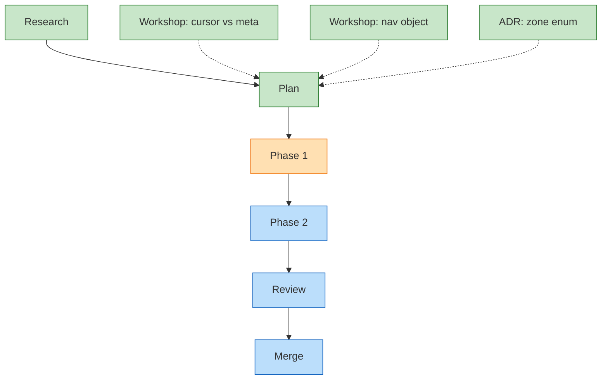

<!-- GENERATED by `harness flow render` — do not hand-edit; regenerate from the flow JSON. -->
# Flow · canonical-flight-plan

**Kind**: flight-plan · **Now**: p1 · **Next**: p2 · **Intent**: Phase 2 — wire the renderer · **Nodes**: 9 · **Events**: 11

**Rail**: ◆─◆─[ ◐─◇ ]─◇─◇  Research · Plan ─ [ Phase 1 · Phase 2 ] ─ Review · Merge

**Legend**: 🟩 done · 🟧 in-progress · 🟥 blocked · 🟦 known (designed) · ⬜ assumed (speculative) · 🔶 decision · 🗣 user input · 🟪 harness loop · 🤖 companion · 🛠 worker.
