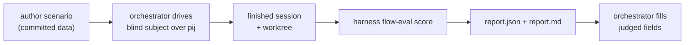

# Flow-conformance evaluation

`harness flow-eval` is a **generic, config-driven evaluator** for the engineering
harness flow. It grades a *finished* agent session against a scenario's
assertions and writes a report — deterministically, from telemetry and the
filesystem, with a thin LLM-judged layer on top.

The idea: pick a checkpoint in a repo, hand an agent the **same** task every
time, and tell it only that it is being evaluated and how to report — never *how*
to do the work. Then prove, from evidence, whether it drove the flow properly:
did it run the skills, hit the back-pressure seam, compact before implementing,
drain a retro, leave a working artifact? Because the answer comes from telemetry
and the worktree, the result is reproducible and comparable across models
(Opus vs GPT vs …).

> **Where docs live (for now):** user guides live under `docs/how/`. This guide
> is standalone so it can be promoted/indexed later without moving.

## The model in one minute

Two roles, two trees, one read-only verb.

- The **orchestrator** (you, or a host LLM) drives a **blind subject** through
  the-flow over **pij** in the shell.
- `harness flow-eval` is **not** the driver — it only *reads* the finished
  session afterwards: it fetches the subject's telemetry once, resolves each
  assertion, and writes a report. It never spawns or steers pij.



A scenario is **pure data**. Adding a new evaluation costs an `assertions.json`,
not an engine change — the engine under `.harness/extensions/flow-eval/` is
frozen and generic.

## The two trees

Committed inputs and throwaway outputs live apart:

```text
live-testing/scenarios/<slug>/        # COMMITTED source of truth (version-controlled)
  scenario.json                       # task · base ref · subject defaults · flow choreography
  assertions.json                     # the config-driven checks
  prompts/
    subject.md                        # the BLIND packet — eval framing + report contract ONLY
    orchestrator.md                   # how the orchestrator drives the-flow over pij

.harness/live-testing/<slug>/<run-id>/   # COMMITTED output (per run — the durable evidence)
  report.json                         # machine verdict (deterministic results + judged fields)
  report.md                           # human-readable rendering
.harness/live-testing/<slug>/ledger.jsonl  # append-only RunRecords — the longitudinal record
```

Scenario definitions are reusable, reviewed inputs and belong in git — and since
2026-07-03 so do the run outputs: the append-only `ledger.jsonl` is what
`--compare` groups on across batches, and the per-run reports are its evidence,
so both must survive clones and machines (they were gitignored as "ephemeral"
pre-046; the ledger design superseded that). `<run-id>` is a timestamp plus a
short session suffix, so repeated runs of the same scenario (Opus vs GPT) never
collide.

The worked example shipped with the harness is
[`live-testing/scenarios/md-to-pdf/`](../../live-testing/scenarios/md-to-pdf/scenario.json) —
read it alongside this guide.

## Authoring a scenario

1. **Scaffold the bundle.** This writes a valid, loadable skeleton (one assertion
   per lane) and refuses to clobber an existing one:

   ```text
   harness flow-eval scaffold --slug my-scenario
   ```

2. **Fill `scenario.json`** — the task, the pinned base ref, the subject knob, the
   flow choreography (see the field table below).
3. **Write the BLIND `prompts/subject.md`** — eval framing plus the
   report-to-orchestrator contract, and nothing about *how* to do the work. Keep
   the forbidden-content checklist at the foot of the file (behind a reviewer-only
   divider that is stripped before delivery) and confirm every box.
4. **Write `prompts/orchestrator.md`** — the drive runbook over pij/flow-pair as a
   real, ordered step-list.
5. **Write `assertions.json`** — one row per claim, each mapped to a registry
   `type` and its lane (see the registry below).

### `scenario.json` fields

| Field | Meaning |
|-------|---------|
| `slug` | Bundle id; the directory name under `live-testing/scenarios/`. |
| `title` | Human title for the report. |
| `task` | The one-paragraph brief the subject is given — the single source of the WHAT. |
| `base` | `{ repo, ref }`; `ref` is a real tag/SHA so every subject worktree starts from the same checkpoint. |
| `subject` | `{ harness, model, effort? }` — the **matrix knob**; re-run with a different model/harness to compare. |
| `flow` | `{ mode, stages[] }` — the choreography (e.g. `mode: "simple"`, the explore→…→validate stage list). |
| `prompts` | Relative paths to `orchestrator` and `subject` packets. |
| `assertions` | Relative filename of the assertions bundle (usually `assertions.json`). |

## Assertions and the type registry

`assertions.json` is one flat list. Each row declares the claim, the resolver
`type`, and the **lane** (`source`) that proves it.

| Field | Required | Meaning |
|-------|----------|---------|
| `id` | yes | Stable handle, referenced in the report (e.g. `A1`). |
| `type` | yes | Resolver key (registry below). |
| `source` | yes | Lane — `telemetry` \| `fs` \| `fs+telemetry` \| `judged`; validated against the type. |
| `params` | yes | Type-specific arguments. |
| `required` | no | A required row resolving `fail` caps the run verdict to `FAIL` (default `false`). |
| `weight` | no | Contribution to the deterministic score (default `1`). |
| `describe` | no | Human label for the report row. |

There are **13 types** across four lanes. The lane decides what evidence is read.

### Lane — telemetry

Reads the subject's `SessionEvidence` (the `harness telemetry get --json`
payload, joined on the pij session id). If telemetry is unavailable, these
resolve `unknown`, never `fail`.

| `type` | `params` | Proves |
|--------|----------|--------|
| `skill-called` | `{ skill, min? }` | a skill ran at least `min` times |
| `skill-sequence` | `{ skills[], ordered? }` | skills appeared (in order, by default) |
| `flow-seam-fired` | `{ hook }` | a flow/harness seam fired (e.g. `pre-coding`) |
| `harness-verb-ran` | `{ verb, min? }` | a harness verb ran (e.g. `checks`, `retro`) |
| `checks-ran` | `{ status? }` | `harness checks` ran (optionally with a status) |
| `tool-used` | `{ tool, min? }` | a tool was used (e.g. `Write`, `Edit`) |
| `compaction-occurred` | `{ min? }` | a compaction happened |

### Lane — fs

Reads the subject's worktree (`--worktree`). Always resolvable, so `pass`/`fail`,
never `unknown`.

| `type` | `params` | Proves |
|--------|----------|--------|
| `file-created` | `{ glob \| path }` | an output file exists |
| `file-content-matches` | `{ path, pattern }` | a regex matches a file's content |
| `artifact-exists` | `{ glob }` | an artifact exists (plan doc, record, …) |
| `command-succeeds` | `{ cmd, cwd?, expect_exit? }` | a real command exits as expected (run in the worktree) |

### Lane — fs+telemetry

A three-valued AND of both lanes (`fail` dominates, then `unknown`) — the
two-signal proof for facts neither lane closes alone.

| `type` | `params` | Proves |
|--------|----------|--------|
| `retro-drained` | `{ evidence_glob, min? }` | the `retro` verb ran AND a retro record exists |

### Lane — judged

Not resolved deterministically — surfaced as a field for the orchestrator LLM to
fill after the run.

| `type` | `params` | Proves |
|--------|----------|--------|
| `judged` | `{ field, prompt, rubric? }` | a quality call (e.g. "is the back-pressure checker proper?") |

### Three-valued verdicts

Every deterministic row resolves to one of:

- **pass** / **fail** — the evidence is present and decisive.
- **unknown** — the evidence needed isn't available (a telemetry capability gap,
  not a subject failure). `unknown` is **excluded from the score denominator** —
  it never counts against the subject; the report lists it so the gap is visible.

This is the **determinism boundary**: pass/fail is earned only where the evidence
is real; everything else is honestly `unknown` or `judged`.

## Running an evaluation

The full choreography lives in each scenario's
[`prompts/orchestrator.md`](../../live-testing/scenarios/md-to-pdf/prompts/orchestrator.md).
In outline:

1. `pij spawn` the subject (the matrix-knob harness/model) and **canary-verify**
   it is the model you asked for.
2. Deliver the **blind** packet (the above-the-divider part of `subject.md`).
3. Drive the-flow over pij — for the worked example: explore → `plan --simple` →
   validate → **compact** → implement → review → fix → validate.
4. When the subject reports done, capture its **session id** and **worktree path**.
5. Resolve any subject-specific assertion (e.g. a placeholder validator command).
6. Score the finished session:

   ```text
   harness flow-eval score --scenario <slug> --session <pij-id> --worktree <path>
   ```

The evaluator fetches telemetry once, resolves every assertion, and writes the
report. Check `data.telemetry.available` — if `false`, the telemetry lane
resolved `unknown` (confirm the session id and worktree before trusting the
verdict). The verb **never drives pij**: the only `harness` call it makes is the
read-only `telemetry get`, and the only other commands it runs are the
scenario-authored `command-succeeds` checks against the worktree.

## Reading a report

`report.json` is the machine verdict; `report.md` renders the same data as a
results table, a judged section, and a one-line verdict.

```json
{
  "scenario": "md-to-pdf",
  "run_id": "20260629-0410Z-ab12cd",
  "subject": { "harness": "claude", "model": "opus", "pij_session_id": "pij-ab12cd" },
  "base_ref": "v0.6.0",
  "deterministic": {
    "score": 0.9,
    "axis_scores": { "process": 0.83, "capability": 1.0 },
    "passed": 9, "failed": 0, "unknown": 1, "total": 10,
    "required_failed": 0,
    "results": [
      { "id": "A1", "type": "skill-called", "status": "pass", "source": "telemetry", "required": true, "weight": 1, "axis": "process" }
    ]
  },
  "judged": [
    { "id": "A11", "field": "backpressure_quality", "verdict": null, "rationale": null, "by": null }
  ],
  "alarms": [],
  "verdict": "PASS_WITH_NOTES"
}
```

The scoring is explicit:

- `score = Σ(weight of pass) / Σ(weight of pass + fail)` — `unknown` is excluded.
- The run **verdict** is `PASS` (no fail, no unknown), `PASS_WITH_NOTES` (some
  fail and/or unknown, but no required fail), or `FAIL` (any **required** row
  failed — `required_failed > 0`).
- A `FAIL` verdict is still a *successful* evaluation (the envelope status is
  `ok`); it means the run found non-conformance, not that the tool errored.

**Filling the judged layer.** Each `judged` row lands in `judged[]` with
`verdict: null`. After the run, answer its `prompt` against the evidence and
worktree, then write `verdict` / `rationale` / `by` into `report.json` and
re-render (`harness flow-eval render`). The deterministic core never guesses
these — that is the human/LLM-in-the-loop boundary.

## Reading the numbers — the statistics behind a report

This section is the data-science contract: what every number is, how it is
computed, and what it can and cannot claim. (Engine sources:
`.harness/extensions/flow-eval/scorer.ts` and `ledger-view.ts`; decisions:
plan 041 workshops 003–004, hardened in plan 046.)

### The two axes — process vs capability

Every assertion `type` maps to a fixed **axis** (`scenario.ts` →
`ASSERTION_AXES`); the report scores each axis independently as an
unknown-excluded pass-rate:

| Axis | What it measures | Types on it | Can it cap the verdict? |
|------|------------------|-------------|--------------------------|
| **process** | the prescribed ritual — did the subject *work the way we teach* | `skill-called`, `skill-sequence`, `flow-seam-fired`, `harness-verb-ran`, `checks-ran`, `tool-used`, `compaction-occurred`, `retro-drained`, `judged` | never — a process fail informs the axis score but cannot force `FAIL` |
| **capability** | the working artifact — does *the thing it built actually work* | `file-created`, `file-content-matches`, `artifact-exists`, `command-succeeds` | yes, when `required: true` |
| **safety** | the guardrail (`forbidden-state`) | cap-only | yes — it caps, it is never averaged into a score |

Two consequences worth internalising:

- **A cheap model cannot be failed for style.** Only capability/safety rows can
  cap a run to `FAIL`; the process axis records ritual fidelity without holding
  the artifact hostage to it.
- **`unmeasured` ≠ `0.00`.** An axis with *no* scorable (pass/fail) row renders
  `unmeasured`, never `0.00` — a `0.00` is only legal for an axis that had real
  evidence and scored zero. If a report says `process unmeasured`, the telemetry
  lane was blind (usually a base-ref predating env-capture), not a zero-conformance
  subject.

### The mimicry alarm

`alarms: ["mimicry"]` fires when **process ≥ 0.80 AND capability ≤ 0.40, with
both axes actually measured**. It is the "right ritual, broken artifact" signal —
a subject that *looks* like it followed the flow but shipped something that
doesn't work. The both-axes-measured gate means a run with no artifact evidence
can never false-claim "broken artifact".

### Three-valued rows and where `unknown` goes

Every deterministic row is `pass` / `fail` / `unknown`. `unknown` means *the
evidence channel was unavailable* (telemetry gap), never "the subject failed" —
and it is **excluded from every score denominator**. Read the unknown count as a
measurement-coverage number, not a quality number: `3p/0f/7u` means "we could
measure 3 of 10 claims and all 3 passed", not "30%".

The compare board applies the same rule: a lane with no scorable verdict in a
group renders `—` (k=0, no CI), never `0.00` — so a blind telemetry lane can
never read as universal failure.

### The ledger, seed tuples, and when comparison is valid

Every score appends one **RunRecord** to
`.harness/live-testing/<slug>/ledger.jsonl` (append-only; corrections happen by
`supersede`, never rewrite). Each record carries a **seed tuple**:

```text
{ model, harness, base_ref, scenario_hash, prompt_hash }
```

- `scenario_hash` = content hash of `scenario.json` + `assertions.json` (the
  rubric); `prompt_hash` = content hash of the subject packet (packet drift).
- **`--compare` refuses (`E_COMPARE`) unless every compared group shares one
  `scenario_hash` + `base_ref`.** A comparison across a rubric or base change is
  not a comparison; the guard makes that a hard error rather than a footnote.
- Superseded runs are excluded from comparison automatically.

### The compare board (`ledger --compare A --compare B`)

For each model group of K runs it derives, per lane and per axis:

- **`pass^1`** — the mean pass rate, with a **95% Wilson score interval**
  `[lo–hi]`. Wilson (not normal-approximation) because K is tiny; at K=1 the
  interval is honestly enormous (e.g. `1.00 [0.21–1.00]`) — that width *is* the
  message.
- **`pass^k`** — observed all-K reliability (1 only if every run passed), shown
  alongside **`est p̂^K`** (the rate the mean implies under independence). Never
  read `pass^k` without its `pass^1`; a single flaky pass hides in either alone.
- **McNemar's test** on paired runs — pairs by **trial key** across groups: the
  seed tuple minus the model (`scenario_hash | base_ref | prompt_hash | harness |
  effort`) plus a timestamp-ordered ordinal, so two runs of *different* models
  that shared everything else are "the same trial". It counts discordant pairs
  (A-pass/B-fail vs B-pass/A-fail) and runs χ² on them; only pass/fail-vs-pass/fail
  pairs are eligible (unknowns never pair). It is **omitted, stated openly, when
  trial keys don't align 1:1** (unequal K) — an omitted test is honest; a forced
  one is not.
- **✱ significance marker** — only when Wilson intervals are fully separated or
  McNemar reaches significance. No asterisk = no claim; a difference without ✱
  is "n.s." and should be narrated as such.
- **Cost columns are displayed but never ranked** (cache economics differ per
  harness; ranking them would reward the wrong thing).

### What a reader should ask, in order

1. **What's n?** One run per cell is a smoke signal, not a distribution. Wilson
   widths tell you this at a glance.
2. **Same seed tuple?** Check `base_ref` + `scenario_hash` before comparing
   anything across columns.
3. **Unknowns or fails?** `7u` is a telemetry-coverage statement; `7f` is a
   subject statement. Never conflate.
4. **Axis split?** `capability 1.00 · process unmeasured` (can't see the ritual)
   reads completely differently from `capability 1.00 · process 0.20` (saw it,
   it wasn't followed) — and `process 1.00 · capability 0.30` should have a
   mimicry alarm next to it.
5. **Any required row failed?** That, and only that, is what forced a `FAIL`.
6. **What did the judge layer add?** Judged verdicts are labelled with `by` and
   a rationale; they are quality calls layered on top, never inputs to the
   deterministic score.

### Writing the analysis up — numbers are generated, never hand-placed

The cross-run analysis page (the HTML report an orchestrator writes after a
batch) follows the same discipline the telemetry-insights pipeline enforces
mechanically: **every number in a table flows from one data block into the
markup via a generator** — tuples or JSON at the top of a script render the
`<td>` cells; the author never hand-transcribes a figure into position. The
motivating incident is on the record: a hand-authored batch-2 table shipped
with a swapped cost/tools cell pair, and the author had half-noticed — writing
a caveat sentence restating the correct values instead of fixing the row.
Generation removes the failure class; a post-generation spot-check (extract one
row, compare against its source tuple) catches regressions in the generator
itself. Prose may **restate** a generated number verbatim; it never derives a
new one.

### The LLM-judged layer — criteria and containment

Two distinct judged surfaces exist, both deliberately narrow:

- **Orchestrator-judged fields** (`judged` rows, e.g. `backpressure_quality`,
  `flow_fidelity`): filled after the run against a written `prompt` + `rubric`
  from the assertion itself, recorded with `verdict`/`rationale`/`by`. The
  rubric is committed data — the judge answers *it*, not a vibe.
- **The scenario `judge` block** (artifact-only review): pinned model + version,
  **different family than the subject**, temperature 0, identity-stripped,
  fed **only verified artifacts** (report rows, session export, worktree files —
  never subject prose or self-report), with an explicit anti-verbosity
  instruction. Criteria are enumerated in `scenario.json` (e.g.
  `plan-coherence`, `explanation-matches-telemetry`).

The containment rule for both: **the LLM never produces a number that enters the
deterministic score.** Judges classify against rubrics; the arithmetic upstream
of every score, CI, and test is deterministic code.

### Placeholder resolution (`placeholder_policy`)

Some `command-succeeds` assertions are authored as placeholders
(`SUBJECT_EXTENSION_HELP`) because only the subject knows its own verb — the
orchestrator resolves them per run with `--resolve <id>='<cmd>'`, and the
resolved command is recorded in the report + ledger provenance. Under
`placeholder_policy: "unknown"` an unresolved placeholder scores `unknown`;
legacy scenarios without the policy raw-exec the bare token (which false-fails)
— always pass every `--resolve`.

## Authoring scenario #2 — a checklist

A fresh reader can stand up a second scenario by repeating the recipe:

- [ ] `harness flow-eval scaffold --slug <slug>` and fill `scenario.json` (real
      `base.ref`, the subject knob, the flow stages).
- [ ] Write a **blind** `subject.md` (task + report contract only) and confirm
      its forbidden-content checklist.
- [ ] Write `orchestrator.md` as a real, ordered step-list of pij/harness verbs.
- [ ] Write `assertions.json` — every row a registry `type` with the right lane;
      reserve `judged` for genuinely subjective quality calls.
- [ ] Dry-run the scoring half over a fixture/synthetic session, then run it live.

## Stage semantics — what mandating the flow buys the analysis

Conformance scoring is only half the value of a flow-driven run. The other half
is that **the flow's structure gives telemetry its semantics**: once a subject
drives `/the-flow`, its session stops being an undifferentiated stream of
commands and becomes *attributable stage windows* — and that is what makes
economic comparisons across a fleet possible at all.

The mechanism (see `harness/cli/src/services/telemetry/report.ts`):

- **Windows** — nav-derived `flow` events bracket each stage window; the window
  is labelled with the `the-flow.json` nav node id it was inside (e.g.
  `phase-1`, `review-1`).
- **Semantic projection** — a **versioned stage map**
  (`provenance.flow_stage_map_version`) projects node ids onto the five
  canonical stages: `research / plan / implement / review / ship`. Versioned so
  a map change can never silently relabel old reports.
- **Mechanism honesty** — every window records *how* it was labelled
  (`flow_stage_mechanism`: `flow` = real nav events, `digit` = fallback,
  `unlabeled` = recorded absence). An unlabeled window is reported as
  unlabeled, never guessed into a stage.
- **Economics per window** — the `flow_stage` lens carries `time_s` and token
  rollups per window, which is what the insights layer's `stage_economics`
  section aggregates.

What this unlocks across a fleet (the questions the eval matrix exists to feed):

- **Stage cost profiles per model** — minutes and tokens in `plan` vs
  `implement` vs `review`, per subject, from committed telemetry alone.
- **Planning-investment correlations** — e.g. "do runs with a larger `plan`
  share spend fewer tokens overall?" — comparable *because* every subject's
  stages mean the same thing (same skill, same semantic map version, same
  scenario seed).
- **Same-model, cross-harness splits** — the harness changes, the stage
  semantics don't, so differences localise to the harness.
- **Beyond the-flow** — any skill family that emits nav/skill events gets the
  same treatment via the `skill` lens (this-call → next-call windows); the-flow
  is simply the richest current source of stage boundaries.

Two disciplines carry over from the cohort-insights layer (see
[cohort telemetry insights](./cohort-telemetry-insights.md)): claims are
**correlational only** (a fleet of K=4 supports "correlates with", never
"causes"), and **every number is generator-computed** — the LLM narrates
computed rows verbatim, with each row's `n` and caveat, and never derives a
number itself.

This is also why the mandated-flow scenario variant exists (next section): with
no flow driven, there are no stage boundaries, and every stage-economics
section is honestly empty — the 2026-07-03 ambient batch demonstrated exactly
that.

## The two scenario variants (what question is being asked)

The shipped scenarios form a deliberate pair — read a report knowing which
question its scenario asks:

| Scenario | Method in the packet | Question | Process lane |
|----------|---------------------|----------|--------------|
| `md-to-pdf` | fully blind — no method at all | **ambient adoption**: does the subject reach for the flow/harness unprompted? | often `unknown`-heavy by design (autonomous subjects, old base) |
| `md-to-pdf-flow` | `/the-flow` mandated (only that) | **flow fidelity + stage economics**: given the flow, is it driven honestly, and what does each stage cost? | fully scoreable; A6 (CLI-written flight plan) required; A13 judges fidelity vs mimicry |

The mandated variant also bakes the **eng-harness loop's own conduct into the
deterministic lane** — not judged, not narrated: `harness-verb-ran {verb:
"observe"}` proves in-flight observations were captured (A14), `retro-drained`
proves the drain verb ran AND a record exists (A11), and `artifact-exists` over
`.harness/records/retro/**` makes the record itself a scored artifact (A15).
Because these are deterministic rows, the report/insight layer reads a subject's
suggested retro items and observations straight from evidence, never from its
self-report. (Caveat under repair: evidence globs currently match records
committed at the base ref too — scope to new-since-base when judging, tracked
as a resolver improvement.)

One practical prerequisite the hard way taught: **the pinned `base.ref` must
carry current telemetry capture** (env-join key, skill events) or the entire
telemetry lane resolves `unknown` — pin old bases only when you *want* the
ambient/capability-only reading.

## See also

- [Harness telemetry](./telemetry.md) — the `SessionEvidence` the telemetry lane reads.
- [Extend the harness](./extend-the-harness.md) — how the `flow-eval` extension itself is built.
- The engine: `.harness/extensions/flow-eval/` (loader, resolvers, scorer, report writer).
- The contract behind the schema: `docs/plans/041-flow-conformance-eval/workshops/001-scenario-and-assertion-schema.md`.
- The scoring/statistics decisions: `docs/plans/041-flow-conformance-eval/workshops/` — 003 (two-axis + mimicry) and 004 (ledger, seed tuples, comparison validity).
- The run loop skill: `/flow-eval-run` (`.claude/skills/flow-eval-run/SKILL.md`).
