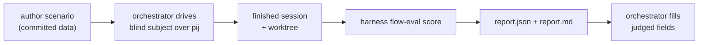

# Flow-conformance evaluation

`harness flow-eval` is a **generic, config-driven evaluator** for the engineering
harness flow. It grades a *finished* agent session against a scenario's
assertions and writes a report — deterministically, from telemetry and the
filesystem, with a thin LLM-judged layer on top.

The idea: pick a checkpoint in a repo, hand an agent the **same** task every
time, and tell it only that it is being evaluated and how to report — never *how*
to do the work. Then prove, from evidence, whether it drove the flow properly:
did it run the skills, hit the back-pressure seam, compact before implementing,
drain a retro, leave a working artifact? Because the answer comes from telemetry
and the worktree, the result is reproducible and comparable across models
(Opus vs GPT vs …).

> **Where docs live (for now):** user guides live under `docs/how/`. This guide
> is standalone so it can be promoted/indexed later without moving.

## The model in one minute

Two roles, two trees, one read-only verb.

- The **orchestrator** (you, or a host LLM) drives a **blind subject** through
  the-flow over **pij** in the shell.
- `harness flow-eval` is **not** the driver — it only *reads* the finished
  session afterwards: it fetches the subject's telemetry once, resolves each
  assertion, and writes a report. It never spawns or steers pij.



A scenario is **pure data**. Adding a new evaluation costs an `assertions.json`,
not an engine change — the engine under `.harness/extensions/flow-eval/` is
frozen and generic.

## The two trees

Committed inputs and throwaway outputs live apart:

```text
live-testing/scenarios/<slug>/        # COMMITTED source of truth (version-controlled)
  scenario.json                       # task · base ref · subject defaults · flow choreography
  assertions.json                     # the config-driven checks
  prompts/
    subject.md                        # the BLIND packet — eval framing + report contract ONLY
    orchestrator.md                   # how the orchestrator drives the-flow over pij

.harness/live-testing/<slug>/<run-id>/   # EPHEMERAL output (per run — gitignore it)
  report.json                         # machine verdict (deterministic results + judged fields)
  report.md                           # human-readable rendering
```

Scenario definitions are reusable, reviewed inputs and belong in git; run reports
are evidence per run and should be gitignored. `<run-id>` is a timestamp plus a
short session suffix, so repeated runs of the same scenario (Opus vs GPT) never
collide.

The worked example shipped with the harness is
[`live-testing/scenarios/md-to-pdf/`](../../live-testing/scenarios/md-to-pdf/scenario.json) —
read it alongside this guide.

## Authoring a scenario

1. **Scaffold the bundle.** This writes a valid, loadable skeleton (one assertion
   per lane) and refuses to clobber an existing one:

   ```text
   harness flow-eval scaffold --slug my-scenario
   ```

2. **Fill `scenario.json`** — the task, the pinned base ref, the subject knob, the
   flow choreography (see the field table below).
3. **Write the BLIND `prompts/subject.md`** — eval framing plus the
   report-to-orchestrator contract, and nothing about *how* to do the work. Keep
   the forbidden-content checklist at the foot of the file (behind a reviewer-only
   divider that is stripped before delivery) and confirm every box.
4. **Write `prompts/orchestrator.md`** — the drive runbook over pij/flow-pair as a
   real, ordered step-list.
5. **Write `assertions.json`** — one row per claim, each mapped to a registry
   `type` and its lane (see the registry below).

### `scenario.json` fields

| Field | Meaning |
|-------|---------|
| `slug` | Bundle id; the directory name under `live-testing/scenarios/`. |
| `title` | Human title for the report. |
| `task` | The one-paragraph brief the subject is given — the single source of the WHAT. |
| `base` | `{ repo, ref }`; `ref` is a real tag/SHA so every subject worktree starts from the same checkpoint. |
| `subject` | `{ harness, model, effort? }` — the **matrix knob**; re-run with a different model/harness to compare. |
| `flow` | `{ mode, stages[] }` — the choreography (e.g. `mode: "simple"`, the explore→…→validate stage list). |
| `prompts` | Relative paths to `orchestrator` and `subject` packets. |
| `assertions` | Relative filename of the assertions bundle (usually `assertions.json`). |

## Assertions and the type registry

`assertions.json` is one flat list. Each row declares the claim, the resolver
`type`, and the **lane** (`source`) that proves it.

| Field | Required | Meaning |
|-------|----------|---------|
| `id` | yes | Stable handle, referenced in the report (e.g. `A1`). |
| `type` | yes | Resolver key (registry below). |
| `source` | yes | Lane — `telemetry` \| `fs` \| `fs+telemetry` \| `judged`; validated against the type. |
| `params` | yes | Type-specific arguments. |
| `required` | no | A required row resolving `fail` caps the run verdict to `FAIL` (default `false`). |
| `weight` | no | Contribution to the deterministic score (default `1`). |
| `describe` | no | Human label for the report row. |

There are **13 types** across four lanes. The lane decides what evidence is read.

### Lane — telemetry

Reads the subject's `SessionEvidence` (the `harness telemetry get --json`
payload, joined on the pij session id). If telemetry is unavailable, these
resolve `unknown`, never `fail`.

| `type` | `params` | Proves |
|--------|----------|--------|
| `skill-called` | `{ skill, min? }` | a skill ran at least `min` times |
| `skill-sequence` | `{ skills[], ordered? }` | skills appeared (in order, by default) |
| `flow-seam-fired` | `{ hook }` | a flow/harness seam fired (e.g. `pre-coding`) |
| `harness-verb-ran` | `{ verb, min? }` | a harness verb ran (e.g. `checks`, `retro`) |
| `checks-ran` | `{ status? }` | `harness checks` ran (optionally with a status) |
| `tool-used` | `{ tool, min? }` | a tool was used (e.g. `Write`, `Edit`) |
| `compaction-occurred` | `{ min? }` | a compaction happened |

### Lane — fs

Reads the subject's worktree (`--worktree`). Always resolvable, so `pass`/`fail`,
never `unknown`.

| `type` | `params` | Proves |
|--------|----------|--------|
| `file-created` | `{ glob \| path }` | an output file exists |
| `file-content-matches` | `{ path, pattern }` | a regex matches a file's content |
| `artifact-exists` | `{ glob }` | an artifact exists (plan doc, record, …) |
| `command-succeeds` | `{ cmd, cwd?, expect_exit? }` | a real command exits as expected (run in the worktree) |

### Lane — fs+telemetry

A three-valued AND of both lanes (`fail` dominates, then `unknown`) — the
two-signal proof for facts neither lane closes alone.

| `type` | `params` | Proves |
|--------|----------|--------|
| `retro-drained` | `{ evidence_glob, min? }` | the `retro` verb ran AND a retro record exists |

### Lane — judged

Not resolved deterministically — surfaced as a field for the orchestrator LLM to
fill after the run.

| `type` | `params` | Proves |
|--------|----------|--------|
| `judged` | `{ field, prompt, rubric? }` | a quality call (e.g. "is the back-pressure checker proper?") |

### Three-valued verdicts

Every deterministic row resolves to one of:

- **pass** / **fail** — the evidence is present and decisive.
- **unknown** — the evidence needed isn't available (a telemetry capability gap,
  not a subject failure). `unknown` is **excluded from the score denominator** —
  it never counts against the subject; the report lists it so the gap is visible.

This is the **determinism boundary**: pass/fail is earned only where the evidence
is real; everything else is honestly `unknown` or `judged`.

## Running an evaluation

The full choreography lives in each scenario's
[`prompts/orchestrator.md`](../../live-testing/scenarios/md-to-pdf/prompts/orchestrator.md).
In outline:

1. `pij spawn` the subject (the matrix-knob harness/model) and **canary-verify**
   it is the model you asked for.
2. Deliver the **blind** packet (the above-the-divider part of `subject.md`).
3. Drive the-flow over pij — for the worked example: explore → `plan --simple` →
   validate → **compact** → implement → review → fix → validate.
4. When the subject reports done, capture its **session id** and **worktree path**.
5. Resolve any subject-specific assertion (e.g. a placeholder validator command).
6. Score the finished session:

   ```text
   harness flow-eval score --scenario <slug> --session <pij-id> --worktree <path>
   ```

The evaluator fetches telemetry once, resolves every assertion, and writes the
report. Check `data.telemetry.available` — if `false`, the telemetry lane
resolved `unknown` (confirm the session id and worktree before trusting the
verdict). The verb **never drives pij**: the only `harness` call it makes is the
read-only `telemetry get`, and the only other commands it runs are the
scenario-authored `command-succeeds` checks against the worktree.

## Reading a report

`report.json` is the machine verdict; `report.md` renders the same data as a
results table, a judged section, and a one-line verdict.

```json
{
  "scenario": "md-to-pdf",
  "run_id": "20260629-0410Z-ab12cd",
  "subject": { "harness": "claude", "model": "opus", "pij_session_id": "pij-ab12cd" },
  "base_ref": "v0.6.0",
  "deterministic": {
    "score": 0.9,
    "passed": 9, "failed": 0, "unknown": 1, "total": 10,
    "required_failed": 0,
    "results": [
      { "id": "A1", "type": "skill-called", "status": "pass", "source": "telemetry", "required": true, "weight": 1 }
    ]
  },
  "judged": [
    { "id": "A11", "field": "backpressure_quality", "verdict": null, "rationale": null, "by": null }
  ],
  "verdict": "PASS_WITH_NOTES"
}
```

The scoring is explicit:

- `score = Σ(weight of pass) / Σ(weight of pass + fail)` — `unknown` is excluded.
- The run **verdict** is `PASS` (no fail, no unknown), `PASS_WITH_NOTES` (some
  fail and/or unknown, but no required fail), or `FAIL` (any **required** row
  failed — `required_failed > 0`).
- A `FAIL` verdict is still a *successful* evaluation (the envelope status is
  `ok`); it means the run found non-conformance, not that the tool errored.

**Filling the judged layer.** Each `judged` row lands in `judged[]` with
`verdict: null`. After the run, answer its `prompt` against the evidence and
worktree, then write `verdict` / `rationale` / `by` into `report.json`. The
deterministic core never guesses these — that is the human/LLM-in-the-loop
boundary.

## Authoring scenario #2 — a checklist

A fresh reader can stand up a second scenario by repeating the recipe:

- [ ] `harness flow-eval scaffold --slug <slug>` and fill `scenario.json` (real
      `base.ref`, the subject knob, the flow stages).
- [ ] Write a **blind** `subject.md` (task + report contract only) and confirm
      its forbidden-content checklist.
- [ ] Write `orchestrator.md` as a real, ordered step-list of pij/harness verbs.
- [ ] Write `assertions.json` — every row a registry `type` with the right lane;
      reserve `judged` for genuinely subjective quality calls.
- [ ] Dry-run the scoring half over a fixture/synthetic session, then run it live.

## See also

- [Harness telemetry](./telemetry.md) — the `SessionEvidence` the telemetry lane reads.
- [Extend the harness](./extend-the-harness.md) — how the `flow-eval` extension itself is built.
- The engine: `.harness/extensions/flow-eval/` (loader, resolvers, scorer, report writer).
- The contract behind the schema: `docs/plans/041-flow-conformance-eval/workshops/001-scenario-and-assertion-schema.md`.
