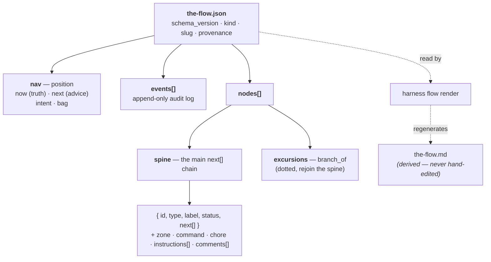
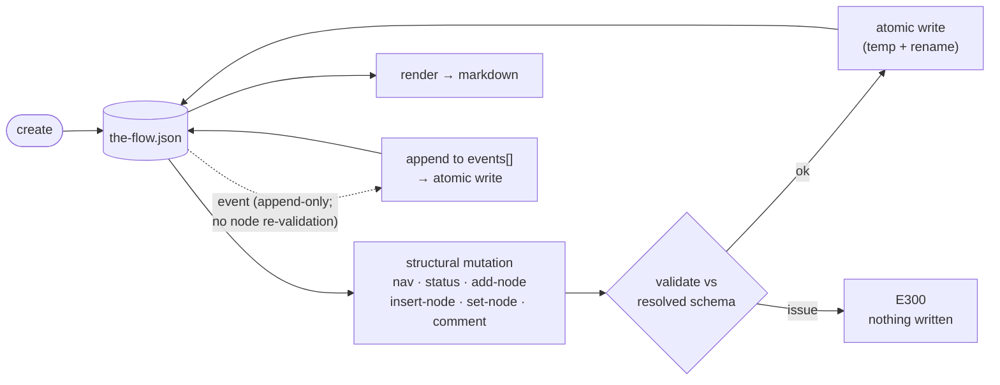
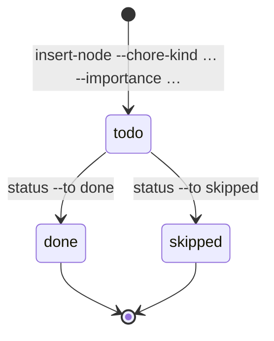

# The `harness flow` verb family

Deterministic **flow mechanics** on the command line: create a flow, mutate it with
small atomic verbs, append a timestamped event/comment log, and render it to
markdown — so an agent (or a human) never hand-edits a flow's JSON or re-computes
its diagram by hand.

A *flow* is a small DAG of work — spec, plan, build, review — that an agent walks.
The CLI is the **single writer** of that DAG's state; everything you see (the
diagram, the rail, the progress) is *derived* from one JSON document.

> **Where docs live (for now):** user guides live under `docs/how/`. Documentation
> is planned to become a first-class, CLI-surfaced concept later; this guide is
> written standalone so it can be promoted/indexed without moving.

> **Mechanics, not routing.** `harness flow` is the *deterministic substrate* —
> mutation, history, render. It does **not** decide what to do next; routing
> policy stays with the agent / the prose flow that drives these verbs (plan 024
> Non-Goal). The CLI persists position; the LLM dispatches.

---

## The model in one minute

A **flow** is a cursor-spine DAG persisted as one JSON document (`the-flow.json`
shape). One file holds the whole journey; the rendered `.md` is a throwaway view of
it.



- **nodes[]** — each a `{ id, type, label, status, next[] }` (+ optional
  `branch_of`, `zone`, `command`, `chore`, `instructions[]`, `user_input`,
  `comments[]`, timestamps). `zone` (`preflight | flight | postflight`) places the
  node in a rail band; unset → a default by node type. `instructions[]` is authored
  guidance an agent *reads* — surfaced in full by `orient`, marked by a `📝N` badge
  in the diagram (§ Node `instructions`).
- **nav** — the position object `{ now, next, intent?, bag? }`. `now` is the
  validated current node id (the truth); `next` is an advisory node id or `null`
  (the LLM dispatches — the CLI never routes); `intent` is free text; `bag` is a
  free-form, shallow qualifier map (no schema).
- **events[]** — a flow-scoped, append-only audit log: engine-fired built-ins
  (`created`/`cursor-moved`/`status-changed`/`node-created`/`node-updated`),
  public-manual kinds (`build-run`/`test-run`/…), and duck-typed `custom`
  telemetry. Ids are `<PREFIX>-<NNN>`.
- **comments[]** — per-node, append-only narrative (`{ at, text, source?, kind?, refs? }`).
- **provenance** — a 7-key block stamped once at `create` (the signal that
  distinguishes a CLI-shaped flow from a legacy hand-written one).

Every timestamp is ISO-8601 UTC from the injected clock; durations are derived at
read time, never stored.

---

## The verb pipeline

Every **structural** mutation runs the same deterministic loop: read → mutate a
**deep clone** → validate the result against the resolved schema → write atomically.
A mutation that would make the flow invalid (a bad status, an unknown node type, a
cycle) is **refused with nothing written** — so the persisted flow is never left
half-mutated.



> **`event` is the one exception.** `harness flow event` is an *append-only* write
> to the `events[]` log — it appends the event and writes atomically, but it does
> **not** re-validate node/status/type shape (there's nothing structural to check).
> Every *other* mutation runs the full validate-before-write loop above.

All verbs live under the nested `harness flow` group. Each resolves its flow by
`--path <file>` **or** `--slug <name>` (→ `.harness/flows/<slug>.json`), mutates,
re-validates against the resolved schema, and writes atomically (temp + rename).

| Verb | What it does |
|------|--------------|
| `create <type> --slug <s>` | Instantiate a flow from its type's template (root identity + provenance stamped). `--bare` for root-only; `--schema`/`--template` to override; `--agent <name>` + `--plan-id <id>` stamp provenance (the rail-title source); `--title <t>` sets an explicit rail label. The template's `nodes[]` are copied **verbatim** (all fields — `next[]`/`branch_of`/`chore`/`instructions[]`), so a template may carry a complete **seed**, not just a bare spine (see § Seed templates). |
| `new <type>` | Scaffold a custom flow-type **schema overlay** into `.harness/schemas/flows/<type>.schema.json`. |
| `show` | Read a flow and print its summary envelope. |
| `list` | Discover flows under `.harness/flows/` (or `--dir`). |
| `nav show` | Print the position: `{ nav: {now,next,intent,bag} \| null, predecessors, successors, due_chores }`. `due_chores` lists the chores anchored at `nav.now` still outstanding — the "what's due here?" read. |
| `nav set [--now <id>] [--next <id> \| --clear-next] [--intent <t>]` | Move position (`--now`, validated → `E305`, fires `cursor-moved`), set/clear the advisory next, and/or set the intent. |
| `nav meta set <k> <v>` / `nav meta get [k]` | Shallow-merge one key into the free-form `bag` / read one key (or the whole bag). |
| `rail [--chores show\|collapse\|hide]` | Emit the one-line rail: `[<title>] <pips>  <names>`, banded `pre ─ [ flight ] ─ post`. `--chores` controls chore-name visibility (default `collapse`). |
| `status --node <id> --to <status>` | Set a node status (stamps `ran_at` on `done`/`blocked`). |
| `add-node --id --type --label [--status --next --artifacts --zone --command --chore-kind --importance]` | Append a node (`--command` sets its ref; `--chore-kind`+`--importance` mark it a chore). |
| `set-node --node <id> [--label --note --user-input --artifacts --command --zone --chore-kind --importance --add-instruction --instructions --clear-instructions]` | Merge fields into a node. `--command`/`--zone`/`--chore-kind`+`--importance` let you **flag an existing node as a chore** in place (e.g. turn a the-flow seam node into a chore — plan 032 R-1). The instruction flags edit `instructions[]` (§ Node `instructions`): `--add-instruction "<t>"` appends (the common path), `--instructions "<a||b>"` replaces (`||`-separated), `--clear-instructions` empties. Cannot re-parent. |
| `insert-node --id --type --label (--after\|--before\|--branch-of) [--zone --command --chore-kind --importance]` | Insert + splice edges deterministically; the DAG is re-checked before write. |
| `comment --node <id> --text <t> [--source --kind --refs]` | Append a timestamped comment. |
| `chores [--at <node>] [--list] [--json]` | List the flow's chore nodes (status · importance · kind · anchor · ref). `--at <node>` filters to chores anchored at that node — the position-aware "due at `<node>`" read. |
| `event <name> [--value --type \| --kind --description]` | Append a manual or duck-typed custom event. |
| `render [--output --check --against]` | Render the flow to deterministic markdown (below). |

Outcomes are the standard envelope: `ok → 0`, `error → 1`, `unconfigured → 2`.

---

## Position, intent & the rail — `nav` + `rail`

Position lives in one **`nav`** object, not scattered fields. The agent moves it as
work progresses and reads it back to orient (e.g. after a context reset):

```bash
harness flow nav set --slug my-flow --now build --next review --intent "ship X"
harness flow nav meta set --slug my-flow replan_reason draft   # stash a qualifier
harness flow nav show  --slug my-flow                          # now/next/intent/bag + neighbours
harness flow rail      --slug my-flow                          # the glanceable progress line
```

The **rail** is the glanceable progress view, reusable by any flow type. It walks
the main spine, fills one pip per node from **live** status (no stored counters → no
drift), and groups nodes into zone bands. Read it like this:

```text
[the-flow]   ◆─◆─[ ◐─□ ]─◇   ◆ Spec · ◆ Plan · [ ◐ Build · □ Validate ] · ◇ Review
└─ title     └─ top pip row          └─ names, each with its OWN pip; bands joined by ·
             (the regular rail,          (spine = diamond ◆◐◇ · chore = square ■□▨▣;
              one pip per node)            open/half/closed by status; [ … ] = flight band)
```

- **`now` is truth, `next` is advice.** The CLI validates that `now`/`next`
  reference real nodes (`E305`) and persists them — it never decides the journey
  (routing stays with the driving skill).
- **Pips** read from live status: `done → ◆`, `in_progress → ◐`, `blocked → ✗`,
  else hollow `◇`. (Chore nodes use *squares* — see below.)
- The **`[<title>]`** prefix is `provenance.agent` (so a flow created
  `--agent the-flow` rails as `[the-flow]`) → an explicit `--title` → the slug.
- **Zones** (`--zone` on `add-node`/`insert-node`) place each node in a band;
  unset, a node defaults by type (lead-up types → `preflight`, `phase` → `flight`,
  review/merge/retro → `postflight`, anything else → `flight`).

> **Clean break:** `nav` replaced the old top-level `cursor`/`recommended_next`,
> and the `cursor` verb was removed (no alias). A flow written in the old shape
> still *reads* (extra fields are tolerated); call `nav set` to adopt the new
> position model.

### `orient` — where am I, what do I do next

`nav show` + `rail` + `chores --at` answer "where am I" in three commands. **`orient`**
folds them into one read so a weak model (or a freshly-reset context) sees its next
step in a single call instead of inferring it:

```bash
harness flow orient --slug my-flow          # DEFAULT: human text — rail + the now-node + its chores
harness flow orient --slug my-flow --json   # opt into the structured envelope
```

The **default is the human text** — orient exists for a weak model (or a freshly-reset
context) to *read* its next step, so JSON is opt-in via `--json`. (Unlike most reads,
the format is driven by the flag, not by whether stdout is a TTY.)

For the node at **`nav.now`** it prints, in order:

1. **The rail** — the same line as `harness flow rail` (reused, not reimplemented).
2. **The current node** — its `label`, its `command`, and its **full `instructions[]`
   text, verbatim**. (This is the *one* surface that prints instruction text — the
   diagram never shows it; a `📝N` badge marks its presence there.)
3. **The chores anchored here** — every chore anchored at `nav.now`, in **all**
   statuses (not just the outstanding ones), each with a status pip:
   `■` done · `▨` skipped · `□` to-do · `▣` to-do & strongly-recommended. Seeing the
   done ones tick is the point — the checklist visibly completes.

`orient` is a pure **read** — it never mutates and writes nothing. The `--json` form
emits `{ now, rail, node: { id, label, command, instructions }, chores: [ …, pip ] }`.
A **set-but-dangling `nav.now`** (it names a node that isn't in `nodes[]` — a corrupt
flow) is an **error** (`E305`), not a silent `node: null`; a flow with *no* position
set degrades gracefully (the rail still prints).

---

## Node `instructions` — authored guidance an agent reads

`instructions[]` is a `string[]` of authored, imperative guidance for the LLM driving
the flow — the static *what / how / done-signal* for a node (it mirrors `artifacts`;
entries are free prose and may contain `\n`). It is **read**, never executed:

- **`orient` prints it in full** at `nav.now` — the *one* surface that shows
  instruction text. The diagram never does; it marks presence with a **`📝N` badge**
  (like `💬N`/`📄N`), so a weak model re-reads its current step every turn instead of
  inferring it.
- **Authored two ways.** Baked into a **seed template** (the static "bone" — e.g.
  the-flow's full-seed flight-plan template authors instructions on every node), and
  edited at runtime via `set-node`. An agent can both enrich an existing node and
  create nodes that carry instructions.
- **Edit with `set-node`** — composed in this order against the node's current list:
  `--clear-instructions` empties → `--instructions "a||b"` replaces (`||`-separated,
  since instruction prose commonly contains commas) → `--add-instruction "<t>"`
  appends one line (the common path). Passing no instruction flag leaves the field
  untouched.
- **Boundary.** Instructions are the forward-looking imperative bone; a node
  `comment` is the backward-looking timestamped log. A driving skill's coaching voice
  may *elaborate* on instructions but should not *contradict* them.

## Seed templates — a template can carry a whole starter, not just a spine

`create --template <file>` copies the template's `nodes[]` **verbatim** — every field,
including `branch_of` excursions, `chore` flags, and `instructions[]` — and stamps
root identity (provenance / events / nav / per-node `created_at`). So a template is
free to ship a **complete seed**, not just a bare spine: the-flow's
`flight-plan.template.json`, for example, is a full 10-node starter (the 5-node SDD
spine — research → plan → phase-1 → review-1 → ship — **plus** 5 baked-in harness
chores, each with authored `instructions[]`), so a
freshly-created flow is fully ready with zero inference. `--bare` skips the template
entirely for a root-only flow you build up with `add-node`; the two bundled
`harness-adopt`/`harness-loop` templates (§ The bundled flows) are seeds in the same
way.

---

## Chores — cross-cutting upkeep on the spine

Some work isn't a *stage*, it's **upkeep**: compact the context, run a validation
pass, fire a harness-loop seam. A **chore** marks any node as that kind of
cross-cutting task — *without* changing what the node fundamentally is. A chore is
an **orthogonal attribute**, not a node type: any node can carry one.

A chore carries two things — **what to run** and **how strongly it's advised**:

```jsonc
{
  "id": "validate", "type": "tasks", "label": "Validate", "status": "todo",
  "command": "/validate-v2",                       // what to run (the ref)
  "chore": { "kind": "command", "importance": "recommended" }
}
```

- **`kind`** — how it's carried out: `skill` · `command` · `builtin` · `manual`.
  (`builtin`/`manual` are noted "agent can't run" in the listing — they're a CLI
  built-in or a human action.)
- **`importance`** — advisory strength: `strongly-recommended` · `recommended` ·
  `optional` · `informational`. There is **no `required`** level by design — a
  chore *never gates or blocks*; the strongest level only refuses to be hidden from
  the rail. (The harness invariant: advise, don't enforce.)

Chores have their own lifecycle, declared by the flow's overlay as the statuses
`todo` / `done` / `skipped`:



**Author** a chore by adding the flags to `add-node`/`insert-node` (they assemble
the nested `chore` object; an invalid kind/importance is rejected pre-write with
`E108`, nothing written):

```bash
harness flow insert-node --slug my-flow --id validate --type tasks --label Validate \
  --after plan --command "/validate-v2" --chore-kind command --importance recommended
```

**See** the pending upkeep at a glance:

```bash
harness flow chores --slug my-flow            # a table: status · importance · kind · anchor · ref
harness flow chores --slug my-flow --json     # the same as a machine-readable envelope
harness flow chores --slug my-flow --at plan  # only chores ANCHORED at `plan` — the "due at <node>" read
```

**"What's due *here*?"** — a chore is *anchored* to the spine node it belongs to (its
`branch_of`, else its first predecessor). `nav show` surfaces the chores anchored at the
current `nav.now` as a `due_chores` array, so a driver can deterministically see which
upkeep belongs to the node it's on — an anchored chore is a check, not a floating box
(a chore with no anchor renders disconnected and has no deterministic run point):

```bash
harness flow nav show --slug my-flow --json
# … "due_chores": [ { id, label, status, kind, importance, command, anchor, runnable }, … ]
```

### Chores on the rail

Chores render as **squares**, distinct from the diamond spine, so upkeep never reads
as a stage:

| pip | meaning |
|-----|---------|
| `□` | chore, `todo` |
| `■` | chore, `done` |
| `▨` | chore, `skipped` |
| `▣` | chore, `todo` **and** `strongly-recommended` (draws the eye) |

Square **pips always show** — they're the cheap "something lives here" signal. Only
the chore *names* collapse, controlled by `rail --chores`:

```text
rail --chores show       [ ◐─□ ]   [ ◐ Build · □ Validate ]   (every chore named; each item carries its own pip)
rail --chores collapse   [ ◐─□ ]   [ ◐ Build · [*] ]          (default: recommended/optional → [*] / [*N])
rail --chores hide       [ ◐─□ ]   [ ◐ Build ]                (chore name gone; its pip stays in the top row)
```

- `collapse` (default): `strongly-recommended` chores stay named (they refuse to
  hide); `recommended`/`optional` fold into a `[*]` / `[*N]` marker; `informational`
  drop from the names entirely.
- `hide`: every un-named chore vanishes from the names — but the **pip remains**, so
  you can always `chores --list` to see what's there.

> **The bigger picture (plan 028).** Chores are how a host flow (`the-flow`) can
> carry the engineering-harness loop *inside its own spine* — the boot / backpressure
> / retro seams ride along as chores — without the stateless `eng-harness-flow`
> router needing a state file of its own. One source of truth (the host's
> `the-flow.json`), statelessness preserved.

---

## Rendering — `harness flow render`

`render` turns a flow into a deterministic markdown document: a `mermaid`
flowchart (spine + dotted excursions + 🗣 genesis bubbles + harness-seam nodes +
a `decision` fork + chore nodes in their own class + an agents subgraph) plus a
per-node **body-log** of the `comments[]`. Output is **byte-stable** across runs and
OS — the same flow always renders the same bytes.

```bash
# Print to stdout (human: raw markdown; --json: markdown rides in data.rendered):
harness flow render --slug my-flow

# Write it to a file (must be inside the repo):
harness flow render --slug my-flow --output docs/plans/…/the-flow.md

# CI drift guard — re-render and compare to the committed sibling .md; non-zero on drift:
harness flow render --slug my-flow --check
```

- **`--path`/`--input`** (aliases) and **`--slug`** select the flow; `--path`/`--input`
  win over `--slug`.
- **`--check`** re-renders and diffs the **committed sibling `.md`** — the input
  path with `.json`→`.md` in the same directory, or `--against <path>` to override.
  A drift (or a missing committed render) exits non-zero with `E310`. `--check`
  **never writes** — it is a read-only guard.
- The render is a **derived artifact**: treat the `.md` like generated code — never
  hand-edit it; regenerate from the JSON.
- The body-log is **render-only**: the markdown is never parsed back into state —
  `comments[]` JSON is the single source of truth.

---

## The bundled flows — `harness-adopt` & `harness-loop`

Two overlays ship with the CLI (bundled via `gen:flows`, alongside the-flow's
`flight-plan`). They are the two first-class flows `eng-harness-flow` drives — the
**harness-loop analogue of the-flow**. Unlike the-flow's single linear journey, these
are **two mutually-exclusive flows**: the adoption gate (`S0 install ∧ S2 governance ∧
S4 boot`) picks the live one — satisfied → ⚙️ loop, else 🧰 adopt. They never co-run.

| Overlay | Shape | Spine (node ids) | Node types | Terminal |
|---|---|---|---|---|
| `harness-adopt` | finite, once per repo | `install → governance → build-boot → bridge` (`scout` branch_of `install`, `inject` branch_of `governance`) | `install · scout · governance · inject · build-boot · decision` | `bridge` (a `decision`; the adopt→loop gate) |
| `harness-loop` | cycling, every session | `boot → backpressure → observe → drain-gate → retro-drain → retro-harvest → improve` | `boot · backpressure · observe · retro · improve · decision` | `improve` (`next:[]`; the cycle is a **nav reset**, so the DAG stays acyclic) |

```bash
harness flow create harness-adopt --slug adopt --path .harness/flows/adopt.json --title adopt
harness flow create harness-loop  --slug loop  --path .harness/loop.flow.json   --title harness-loop
```

- **Zones are explicit.** The renderer's `ZONE_BY_TYPE` default map has no adopt/loop
  node types, so every node in these templates sets an explicit `--zone` — the bands
  render correctly without a CLI change.
- **Decision nodes render as a rhombus.** `bridge` (adopt) and `drain-gate` (loop) are
  `type: decision` → `{"…"}:::decision` in the mermaid, an orange dashed class.
- **The loop's four fire nodes** (`boot`/`backpressure`/`retro-drain`/`retro-harvest`)
  carry `command: run /eng-harness-flow --hook <hook>`, so the standalone loop is
  self-documenting; `observe`/`improve`/`drain-gate` carry none.

### Chore injection — the loop alongside an active the-flow

When the loop runs **alongside an active `the-flow.json`**, `eng-harness-flow` does not
author a separate loop plan — it injects the four fire hooks as **chores** onto the
the-flow flight plan, so the-flow's rail tracks them and they stop getting missed:

```bash
# add a fire-hook chore inline on the spine (rides the rail):
harness flow insert-node --path the-flow.json --after plan \
  --id ehf-pre-coding --type chore --label "pre-coding hook" --status todo \
  --chore-kind command --importance recommended \
  --command "run /eng-harness-flow --hook pre-coding" --zone flight
# or flag an existing the-flow seam node as a chore in place (R-1 — no duplicate):
harness flow set-node --path the-flow.json --node harness-boot \
  --chore-kind command --importance strongly-recommended \
  --command "run /eng-harness-flow --hook pre-flight"
```

The dedup key is the `--hook <X>` token in `command` — exactly one chore per hook, so
re-running the injection is idempotent. The result is visible on the-flow's rail as
chore square pips (`harness flow rail --chores show`):

```
[the-flow] ◆─▣─□─◆─[ ◇ ]─□─□  ◆ Research · ▣ pre-flight hook · □ pre-coding hook · ◆ Plan · [ ◇ Ship ] · □ post-coding hook · □ post-flight hook
```

## Authoring a custom flow type

The CLI ships two layers: a universal **shared core** (field shape — including the
chore `kind`/`importance` vocabulary) and a per-flow **overlay** that declares the
`kind` + its `statuses` + `nodeTypes`. To add your own:

```bash
harness flow new my-flow                    # scaffolds .harness/schemas/flows/my-flow.schema.json
# edit the statuses / nodeTypes, then:
harness flow create my-flow --slug demo     # instantiate it
```

**Schema resolution precedence** (AC-11): `--schema <path>` (absolute, out-of-repo
allowed) › `.harness/schemas/flows/<type>.schema.json` › the bundled built-in
(`harness-loop` — the shared core is not itself creatable) › `E304`.

A consumer that owns its own schema **passes `--schema`** pointing at its copy
rather than bundling a second one — single owner per schema, no drift. (`the-flow`
does exactly this for its flight-plan schema; the harness-loop schema is the
CLI-bundled built-in.)

> **Chore statuses are overlay-declared.** `todo`/`skipped` aren't hard-coded — a
> flow type opts into the chore lifecycle by listing them in its overlay's
> `statuses[]` (the bundled `harness-loop` and `the-flow`'s flight-plan overlay both
> do). The chore `{kind, importance}` *validation*, by contrast, is shared-core, so
> it applies to every flow automatically.

---

## Legacy flows — the clean break

Flows written **before** this CLI (hand-authored JSON with no `provenance` block)
are **not migrated**. Any verb that reads one fails with `E308 FLOW_LEGACY_FORMAT`
and an honest `next_action` — the file is either a genuine pre-CLI flow (re-create
it with `harness flow create`) or it's malformed. There is no tolerant load: a
clean break beats silently mis-reading an old shape.

---

## Regenerating the golden render fixtures (maintainers)

The render goldens under `harness/cli/test/services/flow/fixtures/render/` are
**derived** — each `<name>.json` has a committed `<name>.md` that is exactly what
`harness flow render` emits for it. They are regenerated, never hand-edited:

```bash
npm run build              # the generator drives the BUILT CLI (dist) — build first
npm run gen:flow-fixtures  # re-render every fixtures/render/*.json → sibling .md
```

`npm run check:flows` guards them in CI (alongside the bundled-schema drift check):
it runs `gen:flows`, asserts the bundle is unchanged, then `flow render --check`
over every committed fixture. **Rule:** the goldens come from the *built* CLI, so
run `npm run build` before regenerating them.

---

## See also

- The act: [`harness/cli/src/acts/flow.ts`](../../harness/cli/src/acts/flow.ts)
- The renderer: [`harness/cli/src/services/flow/flow-renderer.ts`](../../harness/cli/src/services/flow/flow-renderer.ts)
- Records & record types: [`record-and-record-types.md`](./record-and-record-types.md)
- Extending the harness: [`extend-the-harness.md`](./extend-the-harness.md)
