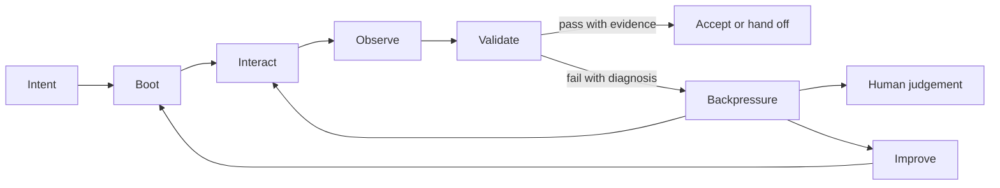

# Research Report: Backpressure and Harness Foundations

**Generated**: 2026-05-21T09:28:26+10:00
**Research Query**: "Explore the concept of backpressure and how it might modify the harness-foundations thesis, wording, directives, first principles, and patterns."
**Mode**: Pre-Plan
**Location**: `docs/plans/001-backpressure-harness-foundations/research-dossier.md`
**FlowSpace**: Not available, standard tools and subagents used
**Findings**: 60 subagent findings synthesised from 6 focused research passes

## Executive Summary

### What It Does

This research explores whether **backpressure** should become an explicit concept in the public harness foundations. The current foundation already contains most of the mechanics under different names: validation verdicts, layered termination, WIP control, proof loops, guides and sensors, diagnostics, proof artefacts, friction ledgers, and encoded improvement.

The new value of the term is that it names the useful resistance created by the engineering harness when work is wrong, incomplete, unproven, or outrunning downstream proof capacity.

### Business Purpose

Backpressure helps explain how an engineering harness makes AI-assisted work safer and more trustworthy. It shifts attention away from asking the model to be smarter and toward shaping the project-side substrate so humans and agents receive fast, concrete, actionable feedback.

### Key Insights

1. **Backpressure is latent but unnamed.** The existing foundation already says product proof belongs to the engineering harness, completion belongs to evidence, and repeated friction should become encoded improvement.
2. **Backpressure is not ordinary friction.** Useful backpressure is fast, specific, repeatable, and actionable. Bad friction is vague, slow, manual, flaky, or unrelated to correctness.
3. **The strongest public framing is substrate-level refusal.** Prompts and checklists guide behaviour, but structural gates such as types, schemas, tests, compilers, proof checks, diagnostics, and proof bundle validation can refuse weak claims inside their scope.
4. **Human attention is scarce backpressure.** The harness should spend human judgement on meaning, risk, tradeoffs, and acceptance decisions, not repeated imports, setup errors, missing fixtures, or vague proof gaps.
5. **The concept should modify wording, not replace the thesis.** Backpressure strengthens Boot → Interact → Observe → Validate → Improve. It should not become a new top-level ideology that overbakes the foundation.

### Quick Stats

- **Primary public foundation files reviewed**: 6
- **Private/public source notes reviewed**: 4 source-note families
- **External public sources reviewed**: 4 primary, 6 adjacent citation candidates
- **Relevant existing concepts**: validation verdict, WIP=1, layered termination, guides/sensors, computational controls, proof levels, friction lifecycle, encoded mitigation, false-pass rate
- **Domains**: no formal domain system in this repo. The relevant boundary is engineering harness vs agent harness.
- **Prior Learnings**: multiple relevant learnings in source notes around friction, proof, measurement, diagnostics, and compounding.

## How It Currently Works

### Current Foundation Position

The repo currently defines harness engineering as productising the software-development loop so humans and agents can move from intent to evidence, then encode what they learn into the next run.

The core loop is:

```text
Boot → Interact → Observe → Validate → Improve
```

Backpressure is not named in the current tracked foundation files, but its mechanics appear across the corpus.

### Existing Concept Anchors

| Anchor | Current location | Backpressure relevance |
|---|---|---|
| Product proof belongs to the engineering harness | `harness-foundations/first-principles.md` | Backpressure must be project-side proof, not agent confidence. |
| Validation must produce a verdict | `harness-foundations/first-principles.md` | A verdict becomes useful backpressure when it guides the next run. |
| Completion belongs to evidence | `harness-foundations/first-principles.md` | Backpressure prevents premature victory. |
| Termination should be layered | `harness-foundations/first-principles.md` | Cheap refusal should happen before expensive proof. |
| Do less but finish | `harness-foundations/first-principles.md` | WIP control is a form of loop backpressure. |
| Guides and sensors | `harness-foundations/patterns-that-work.md` | Backpressure is the loop effect when sensors feed actionable refusal back into work. |
| Tier computational and inferential controls | `harness-foundations/patterns-that-work.md` | Deterministic gates are the strongest repeatable backpressure where contracts are expressible. |
| Friction lifecycle | `harness-foundations/patterns-that-work.md` | Repeated human correction should become encoded backpressure. |
| Proof levels and false-pass rate | `harness-foundations/source-notes/notes3.md` | Backpressure strength depends on proof depth and reproducibility. |

## Source Analysis

### Source S005: Structural Backpressure Beats Smarter Agents

Core thesis in harness language:

> Important invariants should move out of prompt reminders and review checklists into structural gates that can refuse incorrect artefacts inside their scope.

Reusable public concepts:

- behavioural gates depend on model memory and reviewer consistency;
- structural gates include compilers, type checkers, test runners, linters, proof checkers, generated guards, and audit scripts;
- the useful signal is the short, mechanical refusal that tells the loop what failed;
- better models do not remove the need for substrate-level evidence;
- structural gates do not guarantee total correctness and should not be overclaimed.

Foundation implication:

> Backpressure should be framed as useful, actionable refusal from the product-development substrate, not as faith in model reliability.

### Source S006: Don't waste your back pressure

Core thesis in harness language:

> Agents become more useful when they receive automated quality and correctness feedback directly, so humans do not spend attention on trivial, repeatable corrections.

Reusable public concepts:

- build systems, type systems, tests, LSPs, browser tools, proof assistants, fuzzing, and generated docs can all be backpressure surfaces;
- good error messages matter because agents consume them directly;
- human backpressure should be spent on higher-complexity judgement;
- stronger feedback lets agents work on longer-horizon tasks.

Foundation implication:

> If a human repeatedly gives the same correction, the harness should ask whether that correction can become a check, fixture, type, schema, diagnostic, template, or proof gate.

## Working Definition

Recommended public definition:

> **Backpressure is project-side feedback that makes wrong, incomplete, or unproven work hard to continue.** In an engineering harness, it appears as checks, diagnostics, types, schemas, tests, product observations, proof gates, and structured evidence that refuse weak claims and guide the next iteration.

Shorter version:

> **Backpressure is how the harness says: not yet, and here is why.**

Structural variant:

> **Structural backpressure** is backpressure encoded into the substrate itself: types, schemas, constructors, linters, compilers, tests, proof checks, or gates that make important invariants difficult to bypass by accident.

## Backpressure Versus Friction

| Term | Meaning | Healthy example | Unhealthy example |
|---|---|---|---|
| Friction | Resistance experienced while trying to work | A known hard decision requiring human judgement | Hidden setup, flaky tests, vague errors |
| Backpressure | Useful resistance that redirects work toward proof | Typecheck fails with clear fix, proof bundle rejects missing scenario | Slow gate with no diagnosis, noisy red build |
| Structural backpressure | Refusal encoded into the substrate | Schema rejects invalid state, compiler rejects wrong shape | Overly broad rule that blocks valid work |
| Human backpressure | Human feedback or judgement | Product owner decides non-executable acceptance with evidence | Reviewer repeats the same import/style/setup correction forever |

Key distinction:

> Productive backpressure teaches the next action. Ordinary friction merely slows the work.

## Architecture and Design Implications

### Backpressure in the Operating Loop



Backpressure is not a new stage. It is the force that connects Observe, Validate, and Improve back to the next safe action.

### Backpressure Surface Types

| Surface | What it catches | Where it belongs |
|---|---|---|
| Compiler/typecheck | shape and type errors | fast common loop |
| Lint/schema rules | repeatable conventions and contract shape | fast common loop |
| Tests | known behaviour and regression cases | common loop and proof loop |
| Health/doctor | environment, readiness, dependency, fixture issues | boot and diagnostics |
| Browser/UI trace | rendered behaviour, console/network errors | interaction and observation |
| Proof bundle schema | missing evidence, missing rerun command, weak proof | validation and handoff |
| Generated guard/audit | drift from declared invariant | structural proof loop |
| Human judgement route | non-executable product decisions | completion control |
| Friction ledger | repeated correction and improvement backlog | Improve stage |

### Backpressure Quality Criteria

Good backpressure is:

- close to the failure;
- cheap enough to run at the right loop stage;
- specific about what failed;
- actionable for a human or agent;
- stable enough to trust;
- scoped to a real risk;
- measured for false positives and bypass;
- connected to Improve when it repeats.

Bad backpressure is:

- slow without stronger proof;
- vague or noisy;
- flaky;
- impossible for agents to interpret;
- a proxy for productivity theatre;
- a human repeating the same correction;
- a prompt reminder for an invariant that should be checked.

## Modification Considerations

### Safe to Modify

1. **Add source-note coverage for public backpressure sources.**
   - Low risk.
   - Public citations are available.
   - Keep source-specific machinery generalised.

2. **Add one pattern to `patterns-that-work.md`.**
   - Best initial public edit.
   - Patterns can carry implementation vocabulary without overloading first principles.

3. **Add one sentence to an existing directive.**
   - Safer than adding a new directive immediately.
   - Directive 2 or Directive 4 can mention useful backpressure.

### Modify with Caution

1. **Add a new first principle.**
   - Risk: overbaking or duplicating validation/completion control.
   - Mitigation: keep it concise and place it near verification, not ontology.

2. **Use the phrase “structural backpressure beats smarter agents.”**
   - Risk: reads as anti-model or overgeneralised.
   - Mitigation: cite as source framing, but soften in foundation wording.

3. **Promote formal methods examples.**
   - Risk: readers infer a full formal-methods requirement.
   - Mitigation: present proof assistants and generated guards as advanced examples, not baseline harness requirements.

### Danger Zones

1. **Collapsing backpressure into agent-harness throttling.**
   - This repo is about the engineering harness, not runtime rate limiting or model orchestration.

2. **Claiming correctness guarantees.**
   - Structural gates are scoped. Specs can be wrong, generators can drift, and tests can miss cases.

3. **Turning every preference into a gate.**
   - Backpressure should encode repeated pain, material risk, or clear team decisions. It should not compound clutter.

4. **Adding slow gates to the common loop.**
   - Fast feedback and proof feedback serve different jobs. Slow gates in the wrong place cause bypass.

## Prior Learnings

### Prior Learning PL-01: Product proof belongs to the project-side loop

**Source**: existing foundation and source-note synthesis

**What was found**:

The agent harness can coordinate work, but only the engineering harness can prove product behaviour.

**Why this matters now**:

Backpressure should be framed as a property of the project-side development loop, even when an agent runtime consumes the feedback.

**Action**:

Use “project-side feedback” and “engineering harness” in definitions. Avoid “agent backpressure” as the primary phrase.

### Prior Learning PL-02: Validation needs verdicts, not vibes

**Source**: existing first principles and patterns

**What was found**:

Validation should produce pass, fail, degraded, expected, or actual outcomes. Completion should route to checks or human judgement.

**Why this matters now**:

Backpressure is the actionability of those verdicts. A red signal without a next step is friction, not good backpressure.

**Action**:

Tie backpressure to verdict plus diagnosis plus next action.

### Prior Learning PL-03: Guides and sensors already explain the mechanism

**Source**: current patterns

**What was found**:

Guides shape work before action. Sensors make outcomes visible after action.

**Why this matters now**:

Backpressure can be introduced as the force created when sensors and gates are wired back into the next iteration.

**Action**:

Do not replace guides/sensors. Extend them.

### Prior Learning PL-04: Proof levels are the measurement bridge

**Source**: measurement source notes

**What was found**:

Proof levels distinguish claim, command output, static/build/test, runtime interaction, side-effect proof, reproducible clean rerun, and production/customer outcome.

**Why this matters now**:

Backpressure strength depends on what kind of proof a gate can actually provide.

**Action**:

Use proof levels when deciding how strong a backpressure surface should be.

### Prior Learning PL-05: Repeated friction must become encoded improvement

**Source**: compounding/foundation source notes

**What was found**:

Feedback only compounds when captured, bubbled, harvested, prioritised, encoded, and later validated.

**Why this matters now**:

Human backpressure should not be wasted. Repeated correction should become a harness task.

**Action**:

Add “do not waste human backpressure” as a pattern-level idea.

## Domain Context

No formal domain registry exists in this repo. The relevant boundaries are conceptual:

| Boundary | Backpressure implication |
|---|---|
| Engineering harness vs agent harness | Backpressure belongs here when it improves product-side proof and loop control. |
| Public foundation vs private sources | Backpressure sources can be cited publicly, but private synthesis must stay generalised. |
| First principles vs patterns | The thesis should stay compact; detailed gate taxonomies belong in patterns or tutorials. |
| Harness vs business domain | Product examples can illustrate backpressure, but harness prose should not become domain-specific. |

## Critical Discoveries

### Critical Finding 01: Backpressure is missing as a named concept, not as a mechanism

**Impact**: High

**What**: Current foundations already contain validation, completion control, WIP, diagnostics, guides/sensors, proof loops, and encoded improvement, but they do not name the common force connecting those ideas.

**Why It Matters**: Adding backpressure can improve conceptual clarity without changing the core thesis.

**Required Action**: Add one concise definition and one practical pattern before considering broader rewrites.

### Critical Finding 02: Backpressure must stay project-side

**Impact**: High

**What**: Public agent writing often talks about agents consuming feedback. This repo must keep the engineering harness / agent harness boundary explicit.

**Why It Matters**: If backpressure becomes runtime throttling, orchestration, or model-control language, the foundation drifts.

**Required Action**: Define it as project-side feedback/refusal from the engineering harness.

### Critical Finding 03: Good backpressure is not more gates everywhere

**Impact**: High

**What**: A gate can become harmful if slow, vague, flaky, overbroad, or placed in the wrong loop.

**Why It Matters**: Overbaked backpressure would make the harness easier to bypass, contradicting the current thesis.

**Required Action**: Pair backpressure with quality criteria: close, cheap, specific, actionable, scoped, stable, and connected to Improve.

### Critical Finding 04: Human judgement remains necessary

**Impact**: Medium

**What**: Not every acceptance criterion can be reduced to a deterministic check.

**Why It Matters**: Backpressure should not imply automation decides product judgement.

**Required Action**: Preserve current wording: executable contracts use checks; non-executable contracts route to humans with evidence.

## Candidate Foundation Changes

### Candidate First Principle

Recommended location: `first-principles.md`, in “Verification and completion control,” near validation verdicts and layered termination.

Candidate wording:

> **Backpressure should be concrete enough to change the next run**
>
> A useful harness does not only report that work failed. It returns checks, observations, errors, and evidence that make the next safe action clear. The strongest backpressure is executable or structural: a test, type check, schema, compiler error, proof gate, diagnostic, or product observation that refuses weak claims before they become accepted work.

### Candidate Pattern

Recommended location: `patterns-that-work.md`, after “Tier computational and inferential controls” or after “Keep the common loop fast and the proof loop trustworthy.”

Candidate wording:

> **Pattern N. Build backpressure where mistakes repeat**
>
> When the same mistake reaches review or handoff more than once, do not only add another instruction. Ask what feedback would have made the mistake difficult to continue: a type, schema, lint rule, test, fixture, diagnostic, smoke check, proof gate, or clearer command output.
>
> Good backpressure is close to the failure, cheap enough to run at the right point in the loop, and specific enough to guide repair. Prefer deterministic controls where the contract is expressible. Use inferential or human judgement where meaning and tradeoffs cannot be reduced to a check.
>
> Minimal version: pick one repeated failure, add one gate or diagnostic that fails for it, and make the failure message say what happened and what to do next.
>
> Watch for: replacing judgement with fake certainty, adding slow gates to every edit, or encoding every preference as permanent law.

### Candidate Directive Addition

Recommended location: Directive 2 or Directive 4, not a new directive yet.

Candidate sentence:

> The loop should create useful backpressure: concrete feedback that refuses weak claims, identifies the failed layer, and guides the next run.

## Recommendations

### If Modifying the Foundations

1. Start with a small source-note addition for public backpressure sources.
2. Add one pattern before adding a new first principle.
3. If the term still proves useful after the pattern, add the concise first principle.
4. Add only one directive sentence unless backpressure becomes a top-level organising idea.
5. Validate for boundary drift, overclaiming, and style consistency.

### If Extending Into Tutorial Material

1. Build a tiny example where a prompt-only instruction fails.
2. Add a deterministic gate that catches it.
3. Show an agent or human consuming the failure and correcting the work.
4. Add a proof bundle or evidence note.
5. Convert the repeated failure into an encoded harness improvement.

### If Keeping It as Research Only

1. Keep S005/S006 in private source registry.
2. Use “backpressure” in future discussions as shorthand for useful refusal.
3. Defer public edits until a concrete docs-change spec is requested.

## External Research Opportunities

### Research Opportunity 1: Public lineage of backpressure in agent coding loops

**Why Needed**: The two public articles are strong, but Geoff Huntley/Ralph and Codex goal-loop references need direct verification before citation.

**Impact on Plan**: Helps decide whether backpressure should be cited as an emerging public pattern or only as two-source synthesis.

**Ready-to-use prompt:**

```text
/deepresearch "Research the public lineage of 'backpressure' in AI coding-agent loops. Start from Reuben Brooks 'Structural Backpressure Beats Smarter Agents', Moss 'Don't waste your back pressure', Geoff Huntley/Ralph, Codex goal-loop references, and Birgitta Böckeler's harness-engineering article. Identify primary URLs, dates, definitions, whether each source uses backpressure explicitly, and which claims are safe to cite in a public engineering-harness foundations guide. Distinguish project-side engineering harness feedback from agent-runtime orchestration."
```

### Research Opportunity 2: Practical taxonomy of structural gates for ordinary product teams

**Why Needed**: The structural source includes formal/spec-derived gates, but the foundation needs examples ordinary teams can adopt without formal methods.

**Impact on Plan**: Helps keep the public pattern practical and avoid overclaiming.

**Ready-to-use prompt:**

```text
/deepresearch "Build a practical taxonomy of structural gates for AI-assisted software engineering teams. Include type systems, schemas, linters, architecture rules, tests, browser traces, proof bundles, CI branch rules, generated-code audits, and proof assistants. For each, explain what kind of invariant it can enforce, what evidence it produces, where it fits in a fast loop versus proof loop, and what its limits are. Keep the framing aligned with engineering harnesses as project-side product-development loops."
```

## Appendix: File Inventory

### Core Public Files

| File | Purpose | Backpressure relevance |
|---|---|---|
| `harness-foundations/first-principles.md` | Main conceptual foundation | Add or adjust one principle near verification/completion. |
| `harness-foundations/patterns-that-work.md` | Practical moves | Best place for backpressure pattern. |
| `harness-foundations/directives.md` | Operating commitments | Possible one-sentence addition, not a new directive yet. |
| `harness-foundations/source-notes/notes.md` | Early source synthesis | Contains loop/friction/proof concepts. |
| `harness-foundations/source-notes/notes2.md` | Compounding/friction source synthesis | Strong link to repeated correction and encoded improvement. |
| `harness-foundations/source-notes/notes3.md` | Measurement/proof source synthesis | Useful for proof levels, false-pass, and measurement vocabulary. |

### Public Citation Candidates

| Source | URL | Use |
|---|---|---|
| Reuben Brooks, “Structural Backpressure Beats Smarter Agents” | https://reubenbrooks.dev/blog/structural-backpressure-beats-smarter-agents/ | Structural gates, substrate move, scoped refusal. |
| Moss, “Don't waste your back pressure” | https://banay.me/dont-waste-your-backpressure/ | Human attention, automated feedback, agent self-correction. |
| Birgitta Böckeler, “Harness engineering for coding agent users” | https://martinfowler.com/articles/harness-engineering.html | Public bridge between harness engineering and coding agents. |
| Reactive Streams | https://www.reactive-streams.org/ | Canonical systems metaphor for demand signalling. |
| Martin Fowler, “Continuous Integration” | https://martinfowler.com/articles/continuousIntegration.html | Automated feedback discipline. |
| Playwright trace viewer | https://playwright.dev/docs/trace-viewer | UI/browser feedback as inspectable artefact. |
| TypeScript Handbook | https://www.typescriptlang.org/docs/handbook/intro.html | Typed constraints as mainstream structural feedback. |
| Lean | https://lean-lang.org/ | Proof assistant as high-rigor structural gate. |

## Next Steps

1. Decide whether to proceed with a small docs-change spec.
2. If yes, run `/plan-1b-specify "Add backpressure to harness foundations"`.
3. If design depth is needed first, run `/plan-2c-workshop "Backpressure as a harness-foundations concept"`.
4. If editing directly later, start with one pattern and source-note update, then validate before considering a new first principle.

**Research Complete**: 2026-05-21T09:28:26+10:00
**Report Location**: `docs/plans/001-backpressure-harness-foundations/research-dossier.md`
