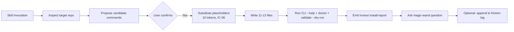

# Research Report: Engineering Harness Setup Skill

**Generated**: 2026-05-22T11:05:00+10:00
**Research Query**: "How should the *Engineering Harness Setup Skill* described in `source-prompt.md` be authored, scoped, and landed — as a portable skill package — given this repo's `harness-foundations/`, the existing 001 dossier, the absence of domain/compound/governance infrastructure, and the existing `engineering-harness-v2` / `agent-harness-v2` agents that already overlap with parts of the brief?"
**Mode**: Pre-Plan (deliverable framing confirmed: **portable skill package**)
**Location**: `docs/plans/002-engineering-harness-setup-skill/research-dossier.md`
**FlowSpace**: Not available — Standard Mode (lean-ctx tools).
**Source prompt**: `docs/plans/002-engineering-harness-setup-skill/source-prompt.md` (2236 lines, copied from `scratch/paste/20260522T003427.md`).
**Findings**: ~80 lens findings synthesised from 8 parallel research passes (`lenses/{ia,dc,ps,qt,ic,de,pl,db}-*.md`, 2444 total lines).

> ⚠️ **Post-research decisions** live in `decisions.md` alongside this dossier. The 2026-05-22 standalone-deliverable decision resolves **CF-01** and **CF-05** below. The dossier text is preserved as-is for the research record; the spec should follow `decisions.md` where the two diverge.

---

## Executive Summary

### What this skill is

The *Engineering Harness Setup* skill is a portable, interactive setup skill that installs the **first useful version** of a repo-local engineering harness in any target repo. When invoked, it inspects the target, asks a short decision flow, then materialises a root `HARNESS.md`, a `harness/` folder, a minimal Python or Node CLI (`harness/bin/harness.{py,mjs}`), a config map (`harness/config.json`), a future-session onboarding guide, and friction-tracking state — and patches `AGENTS.md` to route future agents at the harness.

### Why this is worth building

This repo already publishes the philosophy (`harness-foundations/`). The next step in the "encode, don't document" arc is to ship an **executable starting point** — so a fresh team or agent in an arbitrary repo can install the foundation's first three patterns (front-door CLI, encoded command map, friction loop) in one move, instead of reading 3000+ lines of prose and rebuilding the scaffolding from memory each time.

### Key insights

1. **Every brief principle has a publication-safe ancestor in `harness-foundations/`.** Brief §1.1–1.8 maps 1:1 onto `directives.md` D1–D6 + `simple-mode.md` Rules 1–5 + `first-principles.md` #10–17, #18, #19, #27–29, #44–47, #51, #55. The skill is a *realisation*, not a re-derivation. (DE-02, PS-09, IA-02)
2. **The skill is complementary to `engineering-harness-v2`, not a duplicate.** New skill = **bootstrap** (creates substrate when nothing exists). `engineering-harness-v2` = **govern + validate** (creates `docs/project-rules/engineering-harness.md` on top of an existing substrate). They should chain. (DC-05)
3. **Three boundaries dominate everything else**: engineering-vs-agent harness (DB-01), tracked-vs-`scratch/` (DB-02), and authoring-repo-vs-target-repo (DB-03). Any wording slip across these inverts or leaks. The skill must encode one canonical sentence per boundary and lint for it. (DB-01, DB-07)
4. **Four reconciliation decisions block authoring** and should be batched into the next clarification round: magic-wand wording (DC-03, DE-07), placeholder count (IC-06, DC-10), single-file vs multi-file skill packaging (DC-11), and friction-log overlap with the `compound-*` family (DC-06).
5. **A non-trivial original contribution**: there is no public pattern for *regression-testing a portable setup skill*. The QT lens derives one (golden-fixtures + known-bad + re-run idempotence) by transposing pattern P21 one level up. Worth naming as project-original. (QT-10)
6. **The skill must teach by example.** Its own install report cannot say "✅ Done." Its own validation must invoke the CLI it just created. Its own templates must use neutral language because they ship to other repos. (PL-02, PL-03, PL-04, PL-08)

### Quick stats

- **Source prompt**: 2236 lines across 37 sections; canonical for templates §9–§24.
- **Foundation files relied on**: 8 (4 principle files + 3 source-notes + AGENTS.md + 001 dossier).
- **Skill-package files to ship**: ~14 templates + `SKILL.md` + optional `references/` (IA-10).
- **Target-repo files produced per run**: 11–13 (IC-03 file-write manifest).
- **CLI surface**: 12 subcommands × 2 implementations (Python + Node) with identical contract, 3 exit codes (0/1/2), 2 global flags (`--json`, `--dry-run`).
- **Placeholders to substitute**: 10 tokens (brief §32.2 lists only 7 — drift, IC-06).
- **Sibling agents already installed**: `engineering-harness-v2`, `agent-harness-v2`, `harness-is-the-product-v2`, the `compound-*` family — must be coordinated, not collided.
- **Prior plan precedent**: `001-backpressure-harness-foundations/research-dossier.md` (488 lines, same dossier format).
- **Domain registry / compound system / engineering-harness governance file in this repo**: ❌ none — Standard Mode throughout.
- **Engineering substrate in this repo**: minimal (`justfile` with one `compact` recipe; no build/test/run loop). This is a foundations/docs repo, not a runnable product. **Flagged as a finding**: per plan-1a Part 1, agent-harness work in this repo is blocked until a substrate exists. For *authoring* the skill (which only writes Markdown + template code), this gap is acceptable; for *dogfooding* the skill, a separate target-repo experiment is needed.

---

## How It Currently Works

### Source-prompt anatomy

The brief is organised in 37 sections grouped into four bands:

| Band | Sections | What it specifies |
|---|---|---|
| **Philosophy** | 1.1–1.8 | The 8 principles the skill must preserve (boundary, loop, paved path, encode, deterministic validation, friction, magic-wand, low ceremony). All derivable from foundations. (DE-02) |
| **Scope** | 2, 3 | What the skill does (interactive setup, 13 numbered steps) and 11 non-goals. (IC-02, QT-07) |
| **Artifact spec** | 4, 5, 12, 13, 14 | Skill package tree, target-repo file tree, `harness/config.json` schema, Python CLI skeleton, Node CLI skeleton. Largely new material vs foundations. (DE-08, IC-03–IC-06) |
| **Process & safety** | 6–11, 15–34 | Decision questions, repo inspection heuristics, install flow, templates, safety contract, brownfield/idempotent handling, magic-wand close-out, education-at-decision-points. (PS-01–PS-07, QT-01–QT-09, IC-09) |

### Relationship to foundations

```
Private sources (referenced from scratch/, never copied tracked)
  ↓ sanitise
harness-foundations/source-notes/{notes,notes2,notes3}.md
  ↓ promote
harness-foundations/{first-principles,patterns-that-work,directives,simple-mode}.md
  ↓ first concept research
docs/plans/001-backpressure-harness-foundations/research-dossier.md
  ↓ next deliverable framing
docs/plans/002-engineering-harness-setup-skill/source-prompt.md   ← brief (this work)
  ↓ 8-lens research fan-out (this dossier)
docs/plans/002-engineering-harness-setup-skill/research-dossier.md
  ↓ spec (next step)
docs/plans/002-engineering-harness-setup-skill/spec.md
  ↓ implementation
skills/engineering-harness-setup/                 ← portable artifact in this repo
  ↓ install (out of repo)
~/.pi/agent/skills/engineering-harness-setup/     ← agent runtime install
  ↓ invocation against any target repo
target-repo/{HARNESS.md, AGENTS.md (patched), harness/...}
```

(Trace from IA-03 + DC-01 + DE-01.)

### Existing concept anchors in foundations

| Anchor | Source | Skill realisation |
|---|---|---|
| The agent harness drives. The engineering harness proves. | `directives.md` D1, `simple-mode.md` L33–41, `AGENTS.md` L14–19 | Canonical sentence in `HARNESS.md`, `AGENTS.md` patch, `SKILL.md` (DB-01) |
| Boot → Interact → Observe → Validate → Improve | `first-principles.md` #10, `directives.md` D2 L19, source-prompt §1.2 L36 | Operating loop in `HARNESS.md` template (PS-08) |
| Encode the fix, not the memory | `simple-mode.md` Rule 2, source-prompt §1.4 | Magic-wand → friction-log → maintenance → encoded fix (PL-11) |
| Paved path beats shortcut | `directives.md` D3, `simple-mode.md` Rule 1 | Front-door CLI, AGENTS.md routing patch (PS-03) |
| CLI is the API | `first-principles.md` #21, `patterns-that-work.md` P11/P12 | `print_result` envelope, exit codes 0/1/2, --json (PS-04, IC-04) |
| Diagnostics prescribe the fix | `first-principles.md` #22, `patterns-that-work.md` P13 | `doctor` command with layered checks + `next_action` (PS-05) |
| Fast loop vs proof loop | `patterns-that-work.md` P3, source-prompt §29 | `validation.{fast,quick,proof}` in `config.json` (PS-02) |
| Friction lifecycle | `patterns-that-work.md` P10, source-prompt §27 | `friction-log.md` + magic-wand close + maintenance review (PL-11, PS-07) |
| Idempotent cleanup | `first-principles.md` #37 | Re-run safety contract (PL-01, QT-05) |
| Dogfood the supported surface | `first-principles.md` #25 | Skill validates via the CLI it just created (PL-03) |

### What "running the skill" does (end-to-end trace)

Per IA-06, one invocation of the skill in a fresh target repo touches files in this order:

1. **Inspect**: Read `package.json`, `pyproject.toml`, `Makefile`, `Justfile`, `Dockerfile`, etc. (read-only).
2. **Propose**: Present candidate-commands table; user confirms / edits.
3. **Decide**: Ask required questions (Section 6.1 — CLI language, permissions, commands, health, execution).
4. **Write** (in order):
   - `HARNESS.md` (root) — §9 template
   - `AGENTS.md` (append or create) — §10 snippet
   - `harness/README.md`, `harness/proofs/.gitkeep`, `harness/state/{known-difficulties,friction-log}.md`, `harness/templates/{proof-note,friction-entry}.md`, `harness/skills/onboard-agent-session.md`
   - `harness/config.json` (placeholders filled)
   - `harness/bin/harness.py` **OR** `harness.mjs` (exactly one)
5. **Validate** (if approved): `<CLI> --help`, `<CLI> doctor`, `<CLI> validate --dry-run`.
6. **Report**: §24 setup report (configured/unconfigured, proven/unproven).
7. **Close**: ask magic-wand question, optionally append to friction-log.

**Minimum viable v0.1 run**: 7 files + 1 patch + 3 CLI invocations (Section 36 of brief). (IA-10)

---

## Architecture & Design

### Skill package layout (proposed)

Per IA-01, IA-09, PS-10, DC-11 — adopt the **multi-file** package shape from brief §4, with a canonical slug `engineering-harness-setup` (no `-skill` suffix, no number):

```
skills/engineering-harness-setup/                ← authoring home in THIS repo
  SKILL.md                                       ← entry point with required frontmatter
  AUTHORING.md                                   ← repo-internal notes; not materialised
  templates/
    root-HARNESS.md                              ← brief §9
    agents-md-snippet.md                         ← brief §10
    harness-README.md                            ← brief §11
    harness-config.json                          ← brief §12
    harness-config.schema.json                   ← NEW (DB-08)
    cli-python-harness.py                        ← brief §13
    cli-node-harness.mjs                         ← brief §14
    harness-onboard-agent-session.md             ← brief §15
    harness-known-difficulties.md                ← brief §16
    harness-friction-log.md                      ← brief §17
    harness-proof-note.md                        ← brief §18
    friction-entry.md                            ← brief §19
    cli-command-contract.md                      ← brief §20 + CLI parity checklist
    install-report.md                            ← brief §24
    magic-wand-prompt.md                         ← NEW (single source of truth, DE-07)
  references/                                    ← optional
    cli-contract.md
    lifecycle-contract.md
  tests/                                         ← regression infra (QT-02, QT-03, QT-05)
    acceptance-checklist.md
    rejection-rules.md
    fixtures/
      a-node/
      b-python/
      c-brownfield/
      d-existing/
    regression/
      broken-detection/
      long-running-boot/
      health-missing/
      re-run-idempotence/
```

Frontmatter (per PS-10):

```yaml
---
name: engineering-harness-setup
description: Set up the first useful version of a repo-local engineering harness — HARNESS.md, harness/, a small CLI, and an AGENTS.md pointer — for humans and coding agents.
version: 0.1.0
---
```

Forbidden frontmatter keys (per `~/.pi/agent/skills/install-hve-core-rpiv/references/generated-skill-contract.md`): `agent`, `agents`, `handoffs`, `disable-model-invocation`.

### Target-repo file-write manifest (the artifact the skill produces)

Per IC-03 + IA-06:

| # | Path | Action | Source template | Required for v0.1? |
|---|---|---|---|---|
| 1 | `AGENTS.md` | patch-or-create | brief §10 | Yes |
| 2 | `HARNESS.md` | create (fail-loud if present) | brief §9 | Yes |
| 3 | `harness/README.md` | create | brief §11 | Yes |
| 4 | `harness/config.json` | create | brief §12 | Yes |
| 5 | `harness/bin/harness.py` | create (only if CLI lang = python) | brief §13 | One of 5/6 |
| 6 | `harness/bin/harness.mjs` | create (only if CLI lang = node) | brief §14 | One of 5/6 |
| 7 | `harness/skills/onboard-agent-session.md` | create | brief §15 | Yes |
| 8 | `harness/state/known-difficulties.md` | create | brief §16 | Yes |
| 9 | `harness/state/friction-log.md` | create | brief §17 | Yes |
| 10 | `harness/templates/proof-note.md` | create | brief §18 | Yes |
| 11 | `harness/templates/friction-entry.md` | create | brief §19 | Yes |
| 12 | `harness/proofs/.gitkeep` | create | none | Recommended |
| 13 | `harness/templates/cli-command-contract.md` | create | brief §20 | Optional (resolve §20 ambiguity, IC-03) |

**Mutually exclusive constraint**: items 5 and 6 — never both. (IA-04, IC-03)

### CLI surface (Python ≡ Node parity)

Per IC-04, IC-05, PS-04:

| Subcommand | Action | --dry-run? | Exit codes |
|---|---|---|---|
| `doctor` | Report harness readiness | no | 0 / 1 |
| `install`/`build`/`test`/`lint`/`format_check`/`run`/`smoke` | Run configured command | yes | 0 / 1 / 2 |
| `health` | HTTP GET configured URL | yes | 0 / 1 / 2 |
| `validate` | Layered: build → test → health (currently hardcoded; should read `config.json.validation.*`) | yes | 0 / 1 / 2 |
| `onboard` | Print onboarding checklist | n/a | 0 |
| `magic-wand` | Print canonical magic-wand prompt | n/a | 0 |

**Global flags**: `--json`, `--dry-run`.
**Exit-code contract**: `0` pass / `1` fail / `2` unconfigured (load-bearing distinction — IC-04).
**JSON envelope**: `{status, title|command, messages: string[], next_action?: string}` (IC-10).

### The four most important contract surfaces

1. **The boundary sentence** (DB-01): *"The agent harness drives. The engineering harness proves."* — must appear byte-identical in `SKILL.md`, `HARNESS.md` template, `AGENTS.md` snippet, onboarding guide, install report. Add a lint check.
2. **The routing contract** (DB-07): *"AGENTS.md routes. HARNESS.md is the source of truth. `harness/config.json` is the executable encoding."* — same lint discipline.
3. **The exit-code contract** (IC-04, PS-04): `0/1/2` semantics; `unconfigured` is a first-class verdict, not a soft failure.
4. **The magic-wand prompt** (DE-07, PS-09): a single canonical wording in `magic-wand-prompt.md`; CLI reads it from there so all surfaces emit identical bytes.

### Data flow (skill → target repo)



The brief is unambiguous about **two stages with a hard gate between them** (DB-06): Stage A is discovery (produces candidates with confidence); Stage B is installation (writes files). The gate is the user's confirmation of Stage A.

---

## Dependencies & Integration

### Upstream (what this skill consumes)

| Source | Used for |
|---|---|
| `harness-foundations/first-principles.md` | 8 principle citations (DE-02) |
| `harness-foundations/patterns-that-work.md` | P3 / P4 / P10 / P11 / P12 / P13 / P14 / P21 / P22 (PS-02–PS-07) |
| `harness-foundations/directives.md` | D1–D6 inline references in HARNESS.md template |
| `harness-foundations/simple-mode.md` | Five-rule shape for HARNESS.md (DE-01, IA-02) |
| `harness-foundations/source-notes/notes3.md` | Proof-level vocabulary L0–L6 (QT-06, PL-12) |
| `docs/plans/001-backpressure-harness-foundations/research-dossier.md` | Format precedent, "verdicts not vibes", PL findings (PL-02, PL-09) |
| `AGENTS.md` | Publication boundary rules (PL-04, PL-05, DB-02, DB-05) |
| Python 3.10+ stdlib only | CLI skeleton imports (`argparse`, `json`, `os`, `subprocess`, `sys`, `time`, `urllib.request`, `pathlib`) — no third-party deps (DC-09) |
| Node 18+ stdlib only | CLI skeleton imports (`node:child_process`, `node:fs`, `node:path`, `node:url`); requires global `fetch` (Node 18+) (DC-09) |

### Downstream (what depends on the skill's output)

| Consumer | Contract |
|---|---|
| Future agent sessions in target repos | Read `AGENTS.md` → routed to `HARNESS.md` → invoke `<CLI> --help`/`doctor` (IC-08) |
| `harness/skills/onboard-agent-session.md` reader | 7-step protocol; per-session permission grant (IC-08) |
| `engineering-harness-v2 --validate` (if also installed) | Reads `docs/project-rules/engineering-harness.md`; skill should optionally write a one-line pointer to coordinate (DC-05) |
| Pipeline plan-* skills | Read `AGENTS.md`; the patch must preserve their routing (DC-08, PS-03) |
| In THIS repo | Future tutorial plans; eventual public README section about authored skills (IA-05) |

### Lateral coordination (sibling skills already installed)

| Sibling | Overlap? | Coordination |
|---|---|---|
| `engineering-harness-v2` | **Complementary**: bootstrap vs govern (DC-05) | Setup skill writes a pointer; declares "not a maintenance tool" in `SKILL.md` |
| `agent-harness-v2` | Lateral; covers agent-runtime governance | No direct overlap with the new skill |
| `harness-is-the-product-v2` | Philosophical companion (DC-07) | Setup skill references it in `SKILL.md` ("for deeper grounding, run this first") |
| `compound-*` family (setup/track/bubble/harvest) | **Friction-tracking surface overlap** (DC-06) | If `docs/compound/` exists in target, friction-log should be a 5-line pointer; default `friction-log.md` is the fallback |
| `plan-1a-v2-explore` and family | No overlap with skill's output, but the skill's AGENTS.md patch must not break their routing |

### External dependencies & runtime ambiguity

- **Either Python ≥ 3.10 OR Node ≥ 18** must be present in the target repo for the chosen CLI to run. (DC-09)
- **No third-party libraries.** Both CLI skeletons use only stdlib. The skill never writes to `requirements.txt`, `pyproject.toml`, or `package.json` to add deps.
- **Global `harness` binary is NOT assumed.** The skill emits invocations that always include the runtime path (`python harness/bin/harness.py`, `node harness/bin/harness.mjs`, etc.). (DC-09)
- **A target repo with neither runtime available** is a real edge case — the brief assumes one is present. Recommended: write the templates, mark the CLI as unconfigured, log it as the first friction entry (DC-09 recommendation).

### Backward-compatibility matrix (target may already have…)

Per DC-10:

| Pre-existing artifact | Skill behaviour | Risk |
|---|---|---|
| `AGENTS.md` | Append router section, never overwrite | Low |
| `HARNESS.md` | Read first; offer merge / replace / skip / show-patch | Medium — "merge" semantics undefined |
| `harness/` directory | File-by-file decision; never silent overwrite | Medium |
| `harness/config.json` with conflicting schema | **Not explicitly addressed in brief** | **High** — silent overwrite would lose user's command map |
| `docs/project-rules/engineering-harness.md` (from `engineering-harness-v2`) | Not addressed; should write a pointer | Medium (DC-05) |
| `docs/compound/` (from `compound-*` family) | Not addressed; should route friction-log | Medium (DC-06) |
| Global `harness` binary | Already mitigated by always-prefixed invocation | Low |

---

## Quality & Testing

### Three-layer acceptance gate

Per QT-01, QT-02, QT-03, QT-05:

**Gate 1 — Behavioural-plus-artifact acceptance checklist** (merge of brief §23 + §32.4 + §36):
- 11 behavioural items (the skill *did* the right things)
- 8 artifact items (the skill *left* the right files)
- 7 minimum-floor items (Section 36 fallback for time-constrained runs)

**Gate 2 — Four-fixture proof matrix** (target-repo end-to-end runs):
- **Fixture A — Node greenfield**: `package.json` + `pnpm-lock.yaml` + scripts; expect detected commands + health=unconfigured.
- **Fixture B — Python greenfield**: `pyproject.toml` + `uv.lock` + pytest; expect detected test command + missing build/run marked unconfigured.
- **Fixture C — Brownfield with no signals**: empty repo; expect all command slots empty, every slot flagged as improvement candidate, no fabricated commands.
- **Fixture D — Pre-existing harness**: target already has `HARNESS.md` and `AGENTS.md`; expect no silent overwrite, patch summary shown, merge/skip prompt.

**Gate 3 — Known-bad regression set** (mirrors pattern P21 one level up):
- **broken-detection**: `package.json` build script does `rm -rf dist && deploy.sh`; skill must show the raw command, not silently encode.
- **long-running-boot**: `"dev": "next dev"`; skill must encode but NOT execute without explicit per-command approval.
- **health-missing**: any of A/B/C; skill must mark `health` unconfigured with explicit "improvement candidate", not `passed`.
- **re-run-idempotence** (Fixture E): run skill twice in same repo; assert friction-log entries preserved, CLI files untouched on no-edit second run, user `config.json` values preserved.

### Claim-safety hardening

Per QT-04, QT-06, PL-02, PL-08, PL-12:

1. **Sharpen the §24 report template**: replace `Result` column with two columns — `Ran` (`yes`/`no`/`dry-run`/`unconfigured`) and `Outcome` (`pass`/`fail`/`degraded`/`n/a`). Only `ran=yes` + `outcome=pass` may appear in "What is proven." (QT-04)
2. **Proof-level ceiling**: the skill maxes out at L2 (commands ran), never L3+ (product runtime). The §24 report must say this verbatim:
   > *This setup proves at most L2 (harness commands ran and any approved build/test passed). It does not and cannot prove L3+ (product runtime behaviour). Use the harness loop — Boot → Interact → Observe → Validate — to reach higher proof levels in subsequent sessions.*
3. **Verbs to forbid**: "validated", "complete", "done", "✅", "success" — unless tied to a specific exit-0 evidence row. (PL-02, PL-08)
4. **Long-running boot lockdown** (QT-09): the CLI's `run` subcommand must default to **dry-run** unless `--execute` is passed; the `validate` composite must skip `run`; the long-running-boot fixture must assert no leftover child processes.

### Non-goals as rejection rules

Per QT-07, the 11 non-goals in brief §3 should be restated as mechanical reject-if-X rules (e.g. "CLI skeleton > 300 lines fails review"; "`pnpm build` encoded without proposed-commands table confirmation fails review"; "report has any 'proven' bullet without matching `ran=yes,outcome=pass` row fails review"). Ship as `tests/rejection-rules.md`.

### Foundation citation discipline

Per QT-08: every template that paraphrases a foundation principle should carry an HTML-comment citation: `<!-- foundations: first-principles#27, patterns-that-work#P7 -->`. Greppable, invisible in rendered output, makes drift detectable. A sync check verifies cited principles still exist with stable numbers.

### Acknowledged original contribution

Per QT-10: there is no public canonical pattern for regression-testing a *portable setup skill*. The QT lens derives one by transposing P21 (regression-test the harness) one level up. The skill's `SKILL.md` should name this lineage transparently rather than imply it's established practice. Candidate for a future public-tutorial topic in this repo.

---

## Modification Considerations

(Mirroring 001 dossier's safe/caution/danger structure.)

### ✅ Safe to author / write

1. **Lift Section 1 of brief into `SKILL.md` Principles section verbatim.** Every sub-section has a clean foundation ancestor (DE-02); no re-derivation needed.
2. **Adopt brief §13/§14 CLI skeletons as canonical.** They're contract-correct (IC-04, IC-05) modulo small drift fixes.
3. **Adopt brief §9–§19 template bodies as canonical.** Roughly 6 of 12 templates can lift donor prose from `simple-mode.md` + `directives.md` (IA-02). Keep brief wording, harmonise voice.
4. **Multi-file skill package shape** (`SKILL.md` + `templates/`). Consistent with ecosystem (PS-10, DC-11 — pending confirmation).
5. **Adopt the 4-fixture × 4-regression test matrix.** Original contribution but well-grounded in P21 (QT-02, QT-03, QT-10).
6. **Repo-level integration**: new `skills/README.md` index + `README.md` "Skills authored here" section + `AGENTS.md` framing extension (IA-05, PL-06).

### ⚠️ Modify with caution

1. **Re-run idempotence semantics** (PL-01, QT-05, DC-10). The brief says "never silently overwrite" but doesn't specify per-file merge behaviour. Lock it in spec: AGENTS.md = append-only with sentinel; HARNESS.md = read-first then offer choices; `config.json` = merge-and-preserve user values; friction-log + known-difficulties = never overwrite content; CLI files = no-op on no-edit second run.
2. **Long-running boot policy** (QT-09, DE-04). Brief §22 is deliberately soft. For v0.1, harden to: `run` is dry-run by default; `validate` never runs `run`; orphan-process check is part of long-running-boot fixture.
3. **Doctor exit code on missing config** (IC-04). Both skeletons exit `1`; brief §20 contract says `2` for "unconfigured". Pick one.
4. **`validate` step list hardcoding** (IC-04, IC-05). Both skeletons hardcode `["build", "test"]` and ignore `config.json.validation.{fast,quick,proof}`. Either align skeletons with config or remove the validation keys from `config.json`.
5. **JSON envelope key ordering** (IC-05). Python uses sorted keys; Node uses insertion order. Pick one and update both.
6. **`onboard` and `magic-wand` not honouring `--json`** (IC-04, IC-05). Refactor both to use `print_result`/`printResult` so they participate in the envelope.
7. **Two onboarding sources of truth** (IC-08): CLI `onboard` subcommand has a hardcoded 6-step checklist; `harness/skills/onboard-agent-session.md` has 7 steps. Unify (have CLI echo the file, or extract a shared source).
8. **AGENTS.md framing change in THIS repo** (PL-06). This skill expands the repo's intent from "foundations-only" to "foundations + installable scaffolding." Per `AGENTS.md` maintenance note, that needs an explicit paragraph update — should be a deliverable of the spec phase, not a follow-up.

### 🚫 Danger zones

1. **Embedding private-source content into templates** (PL-04, DB-02, DB-05). Templates ship to other repos. No source IDs (S001…), no `scratch/` content, no direct quotes from `source-notes/`. Add a pre-commit grep.
2. **Drifting the boundary sentence** (DB-01). *"The agent harness drives. The engineering harness proves."* must appear byte-identical wherever it appears. Lint required.
3. **Templates referencing this authoring repo's paths** (DB-03). No `harness-foundations/`, `docs/plans/`, `scratch/` references in any file under `templates/`. Pre-commit grep.
4. **Silent overwrites on second run** (PL-01, QT-05, DC-10). The friction-log is regenerable from template but its *contents* are not regenerable. Any second-run path that loses friction-log content is a release-blocking bug.
5. **Auto-applying magic-wand answers** (PL-11). The contract is staged review. Auto-encoding makes the human a rubber stamp.
6. **Conflating "skill package" with "harness package"** (DB-04). Two trees, two evolution cycles, two audiences. Use distinct vocabulary.

---

## Prior Learnings

(15 findings from PL lens; ordered by criticality.)

### 📚 PL-01: Setup must be idempotent
**Source**: `first-principles.md` #37; `notes2.md` §14
**Why it matters now**: A setup skill *will* be re-run. Clobbering hand-edits violates its own teaching.
**Action**: Every file-write guarded by read-first-then-merge-or-skip. See QT-05 fixture E.

### 📚 PL-02: Final report must not say "done" because the skill ran
**Source**: `first-principles.md` #28, #36; 001 dossier PL-02
**Why it matters now**: The skill *teaches* "agent confidence is not completion evidence." Its own report must demonstrate that rule.
**Action**: §24 template uses verdict columns; forbid "✅" / "complete" / "validated" unless tied to a specific exit-0 row.

### 📚 PL-03: Dogfood — the skill must run the harness it just installed
**Source**: `first-principles.md` #25; `notes.md` L189
**Why it matters now**: If the skill bypasses its own CLI in validation, it demonstrates on day one that the shortcut wins.
**Action**: Step 10 invokes the new CLI by name; install-report records the invocation; if CLI can't run, report it honestly and stop, do not fall back to raw commands.

### 📚 PL-04: Templates must never hard-code private terminology
**Source**: `AGENTS.md` L18–24; source-notes Handling blocks
**Why it matters now**: Templates ship to other repos. A leak propagates to every install.
**Action**: Neutral vocabulary only; greppable pre-commit check for `S001`, `S002`, `S003`, `S004`, `scratch/`, `source-notes/`.

### 📚 PL-05: Skill must respect `scratch/` and `git status` boundary
**Source**: `AGENTS.md` L18–25; `.gitignore` L146
**Why it matters now**: When dogfooding in *this* repo, the skill would create `harness/` at root — a tracked location colliding with foundations content.
**Action**: SKILL.md non-goals include "do not write transient logs into target repo"; respect `harness/proofs/` gitignore decision (brief §6.2).

### 📚 PL-06: This skill changes the publication boundary — `AGENTS.md` needs updating
**Source**: `AGENTS.md` L37–39 (maintenance note)
**Why it matters now**: Repo evolves from "foundations-only" to "foundations + installable scaffolding."
**Action**: AGENTS.md edit is a spec deliverable, not a follow-up. Add a paragraph about authored skills + the "no private terminology in templates" rule.

### 📚 PL-07: Not "more gates everywhere" — anti-bloat is first-class
**Source**: 001 dossier Critical Finding 03; `patterns-that-work.md` P4/P22 "Watch for"
**Why it matters now**: A setup skill is naturally prone to enthusiasm. Every template wants to grow.
**Action**: HARNESS.md max ~150 lines; resist CLI subcommand creep beyond brief §6 set; don't pre-seed friction-log with placeholder lessons; explicit SKILL.md non-goal.

### 📚 PL-08: Don't measure by file count — measure by failures caught
**Source**: `patterns-that-work.md` P21 "Watch for"; `first-principles.md` #49
**Why it matters now**: §24's lead-with-file-list is honest but easily misread as "harness is real."
**Action**: Reshape report so the first substantive section is proven/unproven/next-improvement, not the file inventory.

### 📚 PL-09: Verdicts not vibes — every CLI command produces a verdict
**Source**: 001 dossier PL-02; `first-principles.md` #15, #21, #22
**Why it matters now**: Skeletons implement the envelope, but soft prose can creep in.
**Action**: CLI command contract enumerates `status` enum: `{pass, fail, degraded, dry-run, unconfigured, running, skipped, unknown}`; commands without a `next_action` on failure are incomplete.

### 📚 PL-10: Project-side framing — avoid agent-runtime drift
**Source**: 001 dossier CF-02, PL-01
**Why it matters now**: The skill is invoked from inside an agent harness; natural framing slips into "agent does X."
**Action**: Templates use "the next session" / "fresh agent or human" / "harness state"; never "agent's memory" / "agent's context."

### 📚 PL-11: Friction-loop hygiene — backlog, not diary
**Source**: `notes2.md` §7–8; `patterns-that-work.md` P10 "Watch for"; `first-principles.md` #48, #51
**Why it matters now**: If the template encourages free-form prose, the log becomes a diary on day one.
**Action**: Entry template enforces structure (severity/recurrence/layer/candidate fix); at session end propose *at most one* candidate; staged review only — never auto-apply.

### 📚 PL-12: Proof levels — don't overclaim
**Source**: `notes3.md` L101–114 (L0–L6 ladder); 001 dossier PL-04
**Why it matters now**: Default safe path produces L1; brief §24 risks reading like L3.
**Action**: Tag verified items with proof level; legend at top of report; forbid "the product is validated" — say "the build command exited 0."

### 📚 PL-13: Plan-directory convention
**Source**: `docs/plans/001-backpressure-harness-foundations/research-dossier.md`
**Why it matters now**: This dossier mirrors the established location and format.
**Action**: Lens outputs in `lenses/<lens>.md`; synthesis in `research-dossier.md`; reuse 001's section layout (this dossier does).

### 📚 PL-14: Brownfield reality — partial setup is the norm
**Source**: brief §31; `notes.md` L75–79; `first-principles.md` #6
**Why it matters now**: Most real targets have *some* existing harness-shaped artifact.
**Action**: Inspection (§7) also detects partial state; existing `Makefile`/`Justfile` become wrapped targets; install-report has "Pre-existing artifacts preserved" section.

### 📚 PL-15: Let it cook — the skill itself is iterative
**Source**: `first-principles.md` #8; 001 dossier Recommendations
**Why it matters now**: v1 is a first useful version. Templates over-anticipating future needs become bloat.
**Action**: SKILL.md states "first useful version"; ship a friction-log entry about the skill's own development; resist scope creep into adjacent skills.

### Prior Learnings — at a glance

| ID | Source | Action |
|---|---|---|
| PL-01 | F#37 idempotence | Read-first-then-merge for all writes; Fixture E |
| PL-02 | F#28 confidence ≠ evidence | §24 report uses verdict columns |
| PL-03 | F#25 dogfood | Skill validates via its own CLI |
| PL-04 | AGENTS.md L18–24 | No private terms in templates; pre-commit grep |
| PL-05 | AGENTS.md L18–25 | Respect scratch/ boundary; no transient logs |
| PL-06 | AGENTS.md L37–39 | Spec includes AGENTS.md framing update |
| PL-07 | P4/P22 Watch-for | HARNESS.md ≤ ~150 lines; no template bloat |
| PL-08 | P21 Watch-for | Report leads with proven/unproven |
| PL-09 | F#15, P12 | Status enum + `next_action` mandatory |
| PL-10 | 001 PL-01 | Project-side language; no "agent's memory" |
| PL-11 | P10 Watch-for | Backlog not diary; staged review only |
| PL-12 | notes3 L101–114 | Proof-level legend; forbid "validated" |
| PL-13 | 001 dossier | Reuse format and location |
| PL-14 | brief §31 | Detect partial state; wrap not replace |
| PL-15 | F#8 iterative | v1 = first useful version |

---

## Domain Context

No formal domain registry exists in this repo. The relevant boundaries are conceptual.

### Boundaries the skill MUST respect

(From DB lens. Same numbering as DB-01–DB-08.)

| # | Boundary | Category | Implication for skill |
|---|---|---|---|
| 1 | Engineering harness ↔ agent harness | Existing | Canonical sentence, lint, anti-example block |
| 2 | Tracked content ↔ `scratch/` | Existing | No source IDs / scratch prose / source-notes quotes in templates |
| 3 | Authoring repo ↔ target repo | Existing | Templates only reference target-relative paths; SKILL.md restricts authoring-repo refs to a non-materialised section |
| 4 | Skill package ↔ harness package | Boundary risk | Distinct vocabulary; path-map table |
| 5 | Public-safe neutral wording | Existing | Allowed/disallowed vocabulary list in SKILL.md |
| 6 | Substrate discovery ↔ overlay installation | Boundary risk | Two stages with a hard gate; candidate table required before any write |
| 7 | AGENTS.md ↔ HARNESS.md ↔ config.json routing | Contract opportunity | Single canonical sentence; doctor checks it |
| 8 | `harness/config.json` shape | Contract opportunity | Ship JSON Schema; doctor validates it |

### Grey zone the skill must name (not resolve)

Per DB cross-lens note: friction-log and magic-wand workflows are **engineering**-harness practices even though they are usually surfaced by **agent**-harness session prompts. `AGENTS.md` L19 already accepts this framing:
> *"Practices like magic-wand retrospectives, difficulty ledgers, and self-improving feedback loops are engineering-harness practices when they improve the project/product development loop, even if an agent harness helps collect or enforce them."*

The skill should **lift this sentence verbatim** into `HARNESS.md` so future readers don't try to draw an artificial line through a working workflow.

### Potential domain extractions (no domain system in repo)

If a domain system is ever added to this repo, candidate domains visible from this research:

| Proposed domain | Evidence | Boundary |
|---|---|---|
| Engineering harness (operating loop) | `harness-foundations/*` philosophy + skill output | Substrate + overlay; Boot→Interact→Observe→Validate→Improve |
| Skill authoring / portable packages | new `skills/` folder + this skill | Authoring conventions, frontmatter, templates, lints |
| Source handling / publication boundary | `AGENTS.md`, `harness-foundations/source-notes/` | Sanitisation, neutral wording, pre-commit checks |

---

## Critical Discoveries

### 🚨 Critical Finding 01: The skill is bootstrap, not maintenance — and the sibling installed agent already handles maintenance

> ✅ **Resolved 2026-05-22**: human confirmed the skill is **standalone** with no sibling-skill coordination. No pointer into `docs/project-rules/engineering-harness.md`; no lifecycle-position framing in `SKILL.md`. See `decisions.md`.

**Impact**: High
**Source**: DC-05
**What**: The user already has `engineering-harness-v2` installed in `~/.pi/agent/skills/`. It produces `docs/project-rules/engineering-harness.md` (governance + L0–L4 maturity), assumes a substrate exists, and auto-seeds from `docs/compound/`. The new skill produces `HARNESS.md` + `harness/` + CLI and assumes no substrate exists.
**Why it matters**: Without explicit positioning, a repo running both ends up with three places that look like "the harness front door": `HARNESS.md`, `docs/project-rules/engineering-harness.md`, and `harness/`. Agents will be confused which to read first.
**Required action**: SKILL.md declares lifecycle position ("This is bootstrap. After substrate exists, `engineering-harness-v2 --validate` is the maintenance tool."). On first run, write a one-line pointer into `docs/project-rules/engineering-harness.md` if absent, saying *"See ../../HARNESS.md for runtime rules; see harness/config.json for the current command map."*

### 🚨 Critical Finding 02: The boundary sentence is the single most important contract — and it's already at risk

**Impact**: High
**Source**: DB-01, PL-10, DE-06
**What**: *"The agent harness drives. The engineering harness proves."* appears in 5+ tracked locations and is the load-bearing concept of the entire foundation. A single word slip ("the harness drives") inverts the model.
**Why it matters**: The skill ships templates that will be installed in many target repos. If the sentence drifts in any template, it inverts the model for every install.
**Required action**: Treat the sentence as a frozen string in a single source-of-truth file (`templates/canonical-boundary.txt` or inline constant in SKILL.md). Lint check: greppable assertion across all templates. Anti-example block in `AUTHORING.md`.

### 🚨 Critical Finding 03: Two onboarding sources of truth exist in the brief — must unify before authoring

**Impact**: Medium-High
**Source**: IC-08
**What**: Brief §15 (`harness/skills/onboard-agent-session.md` file) has a 7-step checklist. Both CLI skeletons (§13/§14) have an `onboard` subcommand with a *different* hardcoded 6-step list.
**Why it matters**: Future agent sessions running `harness onboard` get a different checklist than the file they read directly. This is exactly the drift the skill is meant to prevent.
**Required action**: Pick one source. Recommended: `onboard-agent-session.md` is the source of truth; the CLI `onboard` subcommand reads it and prints it. Single canonical checklist.

### 🚨 Critical Finding 04: Multi-file vs single-file packaging is unresolved

**Impact**: Medium-High
**Source**: DC-11, IA-08, PS-10
**What**: Brief §4 proposes a multi-file shape (`SKILL.md` + `templates/`). Most existing skills in `~/.pi/agent/skills/` are single-file. The brief is explicit that either works ("If the skill runtime only supports a single instruction file, embed the templates inside `SKILL.md`").
**Why it matters**: The choice determines whether templates load via filesystem reads or via inline materialisation. It also affects discoverability across host runtimes (pi vs Claude Code vs Cursor).
**Required action**: Confirm pi runtime supports multi-file skills. If yes (recommended, given the 14-template volume), adopt brief §4 layout. If no, single-file SKILL.md with inline templates and a documented materialisation procedure.

### 🚨 Critical Finding 05: Friction-log overlap with `compound-*` family needs a policy

> ✅ **Resolved 2026-05-22**: human confirmed the skill is **standalone** with no sibling-skill coordination. `harness/state/friction-log.md` is always the canonical friction surface; no detection of `docs/compound/`. See `decisions.md`.

**Impact**: Medium
**Source**: DC-06
**What**: If `docs/compound/` exists (from `compound-0-setup` having been run), the new skill's `harness/state/friction-log.md` creates a parallel friction-tracking surface. Friction captured by `compound-1-track` goes to `docs/compound/_buffers/`; friction captured manually goes to `harness/state/friction-log.md`. Neither sees the other.
**Why it matters**: Two friction surfaces is worse than one — entries fragment, nothing compounds.
**Required action**: Detect `docs/compound/` at setup time. If present: `friction-log.md` becomes a 5-line pointer ("This repo uses `docs/compound/` for friction tracking — see `compound-2-bubble` at session end"). If absent: `friction-log.md` is the fallback. Default policy: **option (b)** from DC-06 — pointer file.

### 🚨 Critical Finding 06: Magic-wand wording drift — pick one canonical form before authoring

**Impact**: Medium
**Source**: DE-07, DC-03, PS-09
**What**: At least 5 wordings of the magic-wand question exist across foundations and brief:
- brief §1.7 / §9 / §17 / §24: *"easier, safer, faster, or higher quality"* ← 4 adjectives
- brief §8 Step 11: variant list ("check" instead of "flag"+"template"); ends "more useful for the next session"
- `simple-mode.md` Rule 5: *"easier, safer, or higher quality"* ← 3 adjectives (no "faster")
- `patterns-that-work.md` P10: "concrete" added; ends "easier" only
- `first-principles.md` #46: "concrete"; no template; no four-adverb tail

**Why it matters**: This is the most-quoted sentence in the entire skill. CLI's `magic-wand` subcommand, HARNESS.md, friction-log template, install report, AGENTS.md patch all need identical bytes or the cue dilutes.
**Required action**: Canonical version: brief §1.7 wording. Ship as `templates/magic-wand-prompt.md` (or inline constant); all surfaces read from there. Optionally patch `simple-mode.md` Rule 5 to add "faster" — but that's a foundation edit, separate plan.

### 🚨 Critical Finding 07: Placeholder count drift (7 enumerated, ~10 used)

**Impact**: Medium
**Source**: IC-06, DC-10
**What**: Brief §32.2 enumerates 7 placeholders. Templates actually use 10: the 7 plus `{{LINT_COMMAND}}`, `{{FORMAT_CHECK_COMMAND}}`, `{{harness_cli_file}}`.
**Why it matters**: An authoring agent that follows §32.2 strictly will leave 3 literal `{{…}}` markers in `harness/config.json`. The CLI then tries to execute `{{BUILD_COMMAND}}` as a shell command — a real footgun.
**Required action**: Expand §32.2 to the full 10-token list. Replace "leave visibly empty" rule with three rules per IC-06: prose files = always resolve; `config.json` = always resolve (empty string `""` if unknown); commit messages = `{{…}}` acceptable. Add self-check: skill refuses to finish if any literal `{{…}}` remains in any written file.

---

## Supporting Documentation

### Related repo files (used as upstream sources)

- `harness-foundations/first-principles.md` (259 lines, 58 principles) — primary citation source.
- `harness-foundations/patterns-that-work.md` (275 lines, 22 patterns) — pattern citations + "Watch for" warnings.
- `harness-foundations/directives.md` (53 lines, 6 directives) — boundary sentences and core rules.
- `harness-foundations/simple-mode.md` (166 lines, 5 rules) — most-recent canonical prose; closest match to brief structure.
- `harness-foundations/source-notes/notes.md`, `notes2.md`, `notes3.md` — sanitised research; cite principles, not text (DB-02).
- `docs/plans/001-backpressure-harness-foundations/research-dossier.md` — format precedent; PL-01–PL-05 directly applicable.
- `AGENTS.md` — publication boundary, source handling, neutral language rules.

### Sibling skills already installed (used as ecosystem evidence)

- `~/.pi/agent/skills/engineering-harness-v2/SKILL.md` — sibling agent; lifecycle position must be declared (DC-05).
- `~/.pi/agent/skills/agent-harness-v2/SKILL.md` — lateral, no overlap.
- `~/.pi/agent/skills/harness-is-the-product-v2/SKILL.md` — philosophical companion (DC-07).
- `~/.pi/agent/skills/compound-{0,1,2,3}-*/SKILL.md` — friction-tracking ecosystem the new skill must coordinate with (DC-06).
- `~/.pi/agent/skills/install-hve-core-rpiv/references/generated-skill-contract.md` — frontmatter schema source (PS-10).

### Historical context

The intellectual progression (mtimes from `harness-foundations/`):
- May 19: `directives.md` + `notes2.md` (early)
- May 19: `patterns-that-work.md`
- May 19: `notes.md` + `first-principles.md` (rigour layer)
- May 20: `notes3.md` (measurement layer)
- May 22 10:39: `source-prompt.md` (this skill's brief)
- May 22 11:00: `simple-mode.md` (most recent — public blog distillation)

`simple-mode.md` is the latest canonical statement; brief §1 maps 1:1 onto it. When brief and foundations disagree on wording, simple-mode wins on prose voice; first-principles wins on rigour/citation. (DE-01)

---

## Recommendations

### If authoring the skill now

1. **Resolve the 4 critical findings first** (CF-04, CF-06, CF-07, CF-03 — multi-file packaging, magic-wand wording, placeholder count, onboarding source-of-truth). These are unlocking decisions; everything else flows from them.
2. **Lift the brief verbatim** into the skill package. Section 1 → `SKILL.md` Principles. Sections 9–24 → `templates/*`. Sections 13/14 → `templates/cli-*-harness.{py,mjs}`.
3. **Add the three "small but load-bearing" artifacts**: `magic-wand-prompt.md` (single source of truth), `harness-config.schema.json` (JSON Schema), `cli-command-contract.md` with the Python/Node parity checklist.
4. **Write the four-fixture × four-regression test matrix** alongside the skill. Don't ship without it. (QT-02, QT-03)
5. **Update `AGENTS.md` in THIS repo** as part of the same change-set (PL-06 + IA-05). Repo intent is expanding from "foundations" to "foundations + installable scaffolding."
6. **Hard-lint the boundary sentence and the routing contract sentence.** Pre-commit grep. (DB-01, DB-07)

### If preparing the spec

1. The spec should answer the 7 critical findings explicitly.
2. The spec should include the v0.1 / v0.2 split (IA-10) — what ships, what defers.
3. The spec should include the §24 report template with the sharpened `Ran`/`Outcome` columns (QT-04) and the L1–L2 ceiling sentence (QT-06).
4. The spec should include the placement decision: `skills/engineering-harness-setup/` (no `-skill` suffix, IA-01, IA-09).
5. The spec should include the foundation-citation discipline (QT-08) and the `tests/rejection-rules.md` (QT-07).

### If dogfooding before publishing

1. **Pick at least one target-repo fixture** outside this authoring repo (this repo has no substrate to harness around). Recommended: a small Node or Python repo with real scripts.
2. **Run the skill end-to-end** with `--execute` permission for build/test only (never `run` in v0.1).
3. **Verify all 4 acceptance gates** pass (QT-01 checklist + QT-02 fixtures + QT-03 regression set + Fixture E re-run).
4. **Capture friction in `harness/state/friction-log.md`** in the dogfood target — those entries become the first improvements for v0.2.

---

## External Research Opportunities

Two genuine gaps the codebase + foundations can't answer:

### Research Opportunity 1: Skill-package schema conventions across agent harnesses

**Why needed**: Brief §4 is intentionally agnostic about which agent-harness runtime's schema the skill conforms to. PS-10 found ecosystem evidence in `~/.pi/agent/skills/` (frontmatter: `name`/`description`/optional `version`; forbidden: `agent`/`agents`/`handoffs`/`disable-model-invocation`), but doesn't cover Claude Code subagents, Cursor rules, or Copilot CLI prompt files.

**Impact**: Determines whether the skill is installable across host runtimes or pi-only. v0.1 can be pi-only; v0.2+ should be portable.

**Source findings**: IA-08, DC-11, PS-10, DE-10

**Ready-to-use prompt**:
```
/deepresearch "Document the skill-package schema for the major AI coding-agent runtimes used today: pi (~/.pi/agent/skills/), Claude Code subagents (.claude/agents/), Cursor rules (.cursor/rules/), GitHub Copilot custom instructions (.github/copilot-instructions.md), Cline rules, and OpenAI custom-GPT skill files. For each, document: install path, required and forbidden frontmatter keys, multi-file vs single-file support, how templates and placeholders are loaded, and how the skill is discovered and invoked. Identify the minimum common subset that a portable skill package can target. Output a compatibility matrix and concrete examples."
```

**Results location**: `docs/plans/002-engineering-harness-setup-skill/external-research/skill-package-schemas.md`

### Research Opportunity 2: Empirical target-repo language availability

**Why needed**: Brief §6.1 question 1 assumes either Python or Node is present in the target repo. IA-07 and DC-09 flag the "neither available" case as undefined. Real-world frequency of "Python and Node both present", "only one", "neither" determines whether the skill needs a third option (shell wrapper? Rust? Go? Just/Make?).

**Impact**: Affects how the SKILL.md frames the language question and what's recorded as the first friction entry when neither runtime is present.

**Source findings**: IA-07, DC-09

**Ready-to-use prompt**:
```
/deepresearch "Survey representative real-world repositories across major ecosystems (frontend Node/TypeScript, backend Python/Django/Flask/FastAPI, Go services, Rust services, .NET, Java/Kotlin, Ruby/Rails, embedded C/C++, mobile iOS/Android). For each: is Python 3 commonly available on developer machines? Is Node 18+? What proportion of repos have NEITHER as a developer prerequisite? What's the conventional 'minimum runtime' assumption? Identify the smallest universal scripting prerequisite a portable agent skill can assume across these ecosystems. Cite GitHub Octoverse, JetBrains DevEcosystem, StackOverflow Developer Survey, and similar empirical sources."
```

**Results location**: `docs/plans/002-engineering-harness-setup-skill/external-research/target-repo-language-availability.md`

(Skip-or-proceed: both opportunities are nice-to-have, not blocking. v0.1 can ship with pi-only packaging and the "Python OR Node" assumption documented as a known limitation in SKILL.md.)

---

## Appendix: File Inventory

### Authoring-side files (this repo)

| File | Purpose | Status |
|---|---|---|
| `docs/plans/002-engineering-harness-setup-skill/source-prompt.md` | Authoring brief (2236 lines) | exists (copy of `scratch/paste/20260522T003427.md`) |
| `docs/plans/002-engineering-harness-setup-skill/lenses/ia-implementation.md` | Implementation Archaeologist lens (362 lines) | exists |
| `docs/plans/002-engineering-harness-setup-skill/lenses/dc-dependencies.md` | Dependency Cartographer lens (356 lines) | exists |
| `docs/plans/002-engineering-harness-setup-skill/lenses/ps-patterns.md` | Pattern & Convention Scout lens (304 lines) | exists |
| `docs/plans/002-engineering-harness-setup-skill/lenses/qt-quality.md` | Quality & Testing Investigator lens (186 lines) | exists |
| `docs/plans/002-engineering-harness-setup-skill/lenses/ic-interface.md` | Interface & Contract Analyst lens (420 lines) | exists |
| `docs/plans/002-engineering-harness-setup-skill/lenses/de-evolution.md` | Documentation & Evolution Historian lens (406 lines) | exists |
| `docs/plans/002-engineering-harness-setup-skill/lenses/pl-prior-learnings.md` | Prior Learnings Scout lens (226 lines) | exists |
| `docs/plans/002-engineering-harness-setup-skill/lenses/db-domain-boundary.md` | Domain & Boundary Scout lens (184 lines) | exists |
| `docs/plans/002-engineering-harness-setup-skill/research-dossier.md` | This file | this work |
| `docs/plans/002-engineering-harness-setup-skill/spec.md` | Feature spec | not yet authored — next step |
| `skills/engineering-harness-setup/` | Authoring home for the skill | not yet created |
| `skills/README.md` | Index of authored skills | not yet created (IA-05) |

### Target-repo files (produced when skill runs)

See IC-03 manifest above. 11–13 files per run.

### Existing repo files that need updating (per IA-05, PL-06)

| File | Update | Why |
|---|---|---|
| `AGENTS.md` | Add paragraph on authored skills + "no private terms in templates" rule | Repo intent expanding (PL-06) |
| `README.md` | Add "Skills authored here" section pointing at `skills/engineering-harness-setup/` | Discoverability (IA-05) |
| `justfile` (optional) | Add `just skill-package <slug>` and `just skill-lint <slug>` recipes | Defer to v0.2 |
| `.gitignore` | No changes needed | Top-level `skills/` already tracked |

---

## Next Steps

**Recommended (with this dossier complete):**

1. **Run `/plan-1b-v2-specify "Engineering Harness Setup Skill"`** to create the spec. The spec should:
   - Answer the 7 critical findings (CF-01 through CF-07)
   - Lock the v0.1 / v0.2 split (IA-10)
   - Adopt the file-write manifest (IC-03), the sharpened §24 report (QT-04), the proof-level ceiling (QT-06)
   - Include the boundary/routing canonical sentences (DB-01, DB-07) and the JSON Schema commitment (DB-08)
   - Specify the test matrix (QT-02 × QT-03)
   - Include the AGENTS.md update (PL-06)

**Alternatives:**

- **Run `/plan-2c-v2-workshop`** if deeper design exploration is needed first — e.g. if the multi-file packaging decision (CF-04) needs a workshop with empirical pi-runtime testing.
- **Run the two `/deepresearch` prompts** above before specifying, if the skill needs to be portable beyond pi from v0.1.
- **Run `/plan-2-v2-clarify`** to batch the 7 critical-finding decisions into a single Q&A round before specifying.

**Skip:**
- Going straight to implementation without spec: this dossier surfaced enough decisions (7 critical findings) that the spec is the correct next gate.

---

## CRITICAL: STOP AND WAIT

This is a read-only research command. The research is complete. The user will decide what to do next — run `/plan-1b-v2-specify`, run the `/deepresearch` prompts, ask follow-up questions, or take a different direction.

**Research Complete**: 2026-05-22T11:05:00+10:00
**Report Location**: `docs/plans/002-engineering-harness-setup-skill/research-dossier.md`
