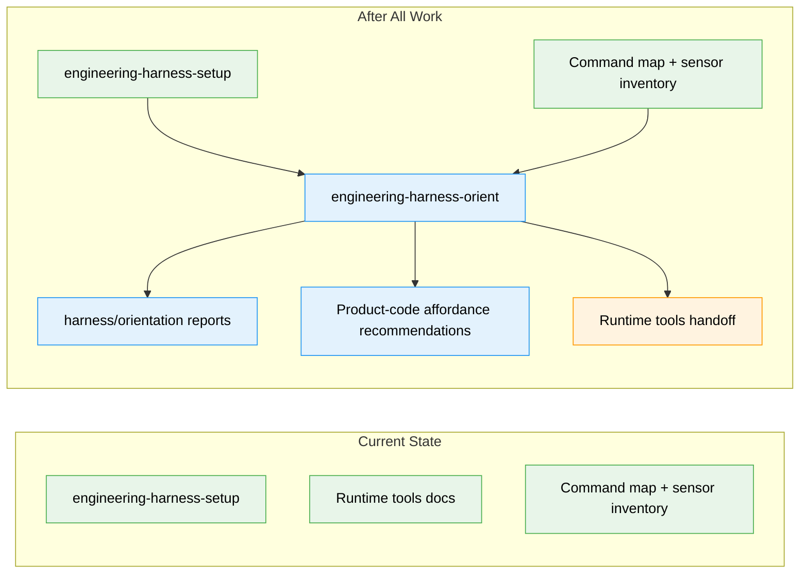

# Flight Plan: Harnessability Orientation Skill

**Spec**: [harnessability-orientation-skill-spec.md](./harnessability-orientation-skill-spec.md)  
**Plan**: [harnessability-orientation-skill-plan.md](./harnessability-orientation-skill-plan.md)  
**Generated**: 2026-06-03  
**Status**: Complete

---

## The Mission

**What we're building**: A new `engineering-harness-orient` skill that runs after `engineering-harness-setup`. It reads the installed harness front door and repository substrate, then writes a Markdown and JSON orientation report that tells a fresh human or agent how harnessable the repo is, what remains unproven, and what to do next.

**Why it matters**: A repo is not harnessable just because a harness front door exists; orient makes the next safe action explicit.

---

## Where We Are → Where We're Headed

```text
TODAY:                                      AFTER this plan:
1 setup/provisioning skill                  2 installable harness skills

🔵 engineering-harness-setup                 🔵 engineering-harness-setup
   creates the nucleus                          still creates the nucleus

❌ No target-aware orientation skill         🔴 engineering-harness-orient
                                                reports harnessability

🟡 Setup docs point to runtime tools         🟢 Skill docs explain:
                                                setup → orient → runtime

❌ No orientation report contract            🔴 harness/orientation/
                                                latest.md + latest.json + schema + runs/

❌ Product-code affordance gaps informal     🔴 codebase_affordance_recommendations[]
                                                proposal-only by default
```



**Legend**: existing (green) | changed (orange) | new (blue)

---

## Scope

**Goals**:

- Add `skills/engineering-harness-orient/` as a new installable skill package.
- Define read-only static orientation as the default mode.
- Specify Markdown and JSON report outputs under `harness/orientation/`.
- Include H0-H5 harnessability levels and L0-L6 proof levels.
- Require evidence/inference provenance, confidence, severity, target layer, encoding type, and status for findings.
- Include proposal-only product-code affordance recommendations.
- Add concise public docs and detailed skill docs.

**Non-Goals**:

- Do not merge orient into setup.
- Do not run the runtime loop or add `commands.backpressure`.
- Do not install dependencies, boot services, mutate product code, read secrets, or call external services by default.
- Do not add a formal domain registry.
- Do not create an automated test suite.

---

## Journey Map


**Legend**: green = done | yellow = active | grey = not started

---

## Phases Overview

| Phase | Title | Tasks | CS | Status |
|-------|-------|-------|----|--------|
| 1 | Orient skill package | 7 | CS-3 | Complete |

---

## Acceptance Criteria

- [x] `skills/engineering-harness-orient/SKILL.md` exists with skill metadata and clear post-setup purpose.
- [x] Shipped orient surfaces preserve setup/orient/runtime boundaries and the byte-identical canonical boundary sentence.
- [x] Default mode is documented as read-only/static and safe by default.
- [x] `harness/orientation/latest.md`, `latest.json`, `schema.json`, and timestamped run files are specified.
- [x] JSON and Markdown report contracts are specified.
- [x] H0-H5 harnessability and L0-L6 proof levels are included.
- [x] Product-code affordance recommendations are proposal-only by default.
- [x] Existing repo/manual validation appropriate to a skill package is completed, including spec-to-plan/file-contract alignment.

---

## Implementation Route

- [x] Scaffold `skills/engineering-harness-orient/` with SKILL, README, AUTHORING, templates, and canonical boundary source.
- [x] Define the read-only orient execution contract and safety defaults.
- [x] Add Markdown and JSON orientation report templates plus sanitized latest examples.
- [x] Add proposal-only product-code affordance recommendation schema.
- [x] Encode boundary and publication-safety invariants.
- [x] Update public skill docs and setup handoff docs.
- [x] Run structural validation: skill discoverability, JSON parse, shipped-surface greps, sanitized example/schema comparison, and spec-to-plan/file-contract alignment.

---

## Key Risks

| Risk | Mitigation |
|------|------------|
| Orient becomes setup v2 | Keep it a separate post-setup skill that reads and reports, not provisions the nucleus. |
| Static inspection overclaims proof | Require evidence/inference provenance and keep H3-H5 tied to configured or executed evidence. |
| Product-code recommendations look like permission to edit | Mark product-code affordances proposal-only by default with risk tiers and safety requirements. |
| Report schema sprawls | Keep a v0.1 core schema and defer optional fields. |
| Simple mode under-plans the package | Use optional workshops for schema, permissions, or affordance-model decisions if needed before `/plan-3`. |

---

## Flight Log

<!-- Updated by /plan-6 and /plan-6a after each phase completes -->

### Phase 1: Orient skill package — Complete (2026-06-03)

**What was done**: Added the `engineering-harness-orient` skill package, report templates/schema, sanitized examples, product-code affordance recommendation contract, and public setup -> orient -> runtime documentation.

**Key changes**:
- `skills/engineering-harness-orient/` — new skill package with SKILL, README, AUTHORING, and templates.
- `README.md`, `skills/README.md`, `skills/engineering-harness-setup/README.md` — concise public handoff and skill index updates.
- `execution.log.md` — structural validation evidence recorded.

**Decisions made**: Keep orient prompt/template shaped, static by default, and proposal-only for product-code affordances.
