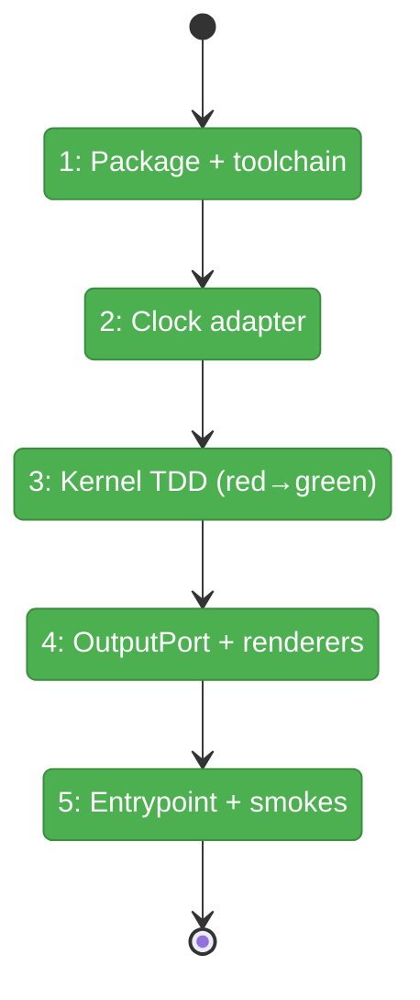
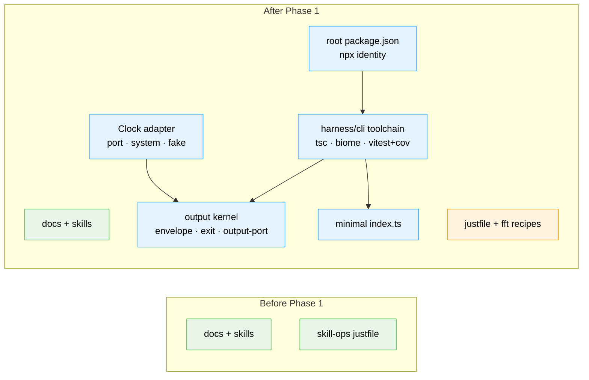

# Flight Plan: Phase 1 — Package scaffold + engineering kernel

**Plan**: [../../harness-core-plan.md](../../harness-core-plan.md)
**Phase**: Phase 1: Package scaffold + engineering kernel
**Generated**: 2026-06-08
**Status**: Landed ✅

---

## Departure → Destination

**Where we are**: An empty CLI surface. No repo-root `package.json`, no `harness/cli/` source, no TypeScript/Biome/vitest toolchain. The repo today is docs + skills + a skill-ops `justfile`. The output contract exists only as workshop 001 (a doc), and the architecture only as workshop 002.

**Where we're going**: A developer can clone the repo, run `npm install`, and get a built, `npx`-able package whose **output kernel** is real and unit-tested. `just fft` runs green with a coverage summary; `node harness/cli/dist/index.js --version` works; `npm pack --dry-run` proves the npx tarball ships `harness/cli/dist`. No user commands yet — but the contract every later command binds to is locked and tested.

---

## Domain Context

### Domains We're Changing

| Domain | What Changes | Key Files |
|--------|-------------|-----------|
| repo engineering substrate | New repo-root manifest + toolchain (TS/Biome/vitest+coverage) and `just fft` loop | `/package.json`, `/biome.json`, `/harness/cli/tsconfig.json`, `/harness/cli/vitest.config.ts`, `/justfile` |
| harness-cli | The output kernel + `Clock` adapter + a minimal entrypoint | `harness/cli/src/output/*`, `harness/cli/src/adapters/clock/*`, `harness/cli/src/index.ts` |

### Domains We Depend On (no changes)

| Domain | What We Consume | Contract |
|--------|----------------|----------|
| harness-foundations (docs) | First principles only (CLI-is-the-API, output-is-a-contract, unconfigured honesty) | None imported — principles realised, not called |

---

## Flight Status

<!-- Updated by /plan-6-v2: pending → active → done. Use blocked for problems/input needed. -->

**Legend**: grey = pending | yellow = active | red = blocked/needs input | green = done

---

## Stages

<!-- Updated by /plan-6-v2 during implementation: [ ] → [~] → [x] -->

- [x] **Stage 1: Scaffold package + toolchain** — root manifest, tsconfig, biome, vitest+coverage, and `just fft` (`/package.json`, `/biome.json`, `harness/cli/tsconfig.json`, `harness/cli/vitest.config.ts`, `/justfile`) — T001–T004
- [x] **Stage 2: Ship the Clock adapter** — port/system/fake + a determinism test, ahead of the kernel because the envelope depends on it (`harness/cli/src/adapters/clock/*` — new) — T005
- [x] **Stage 3: TDD the output kernel** — red kernel tests, then envelope/error-codes/exit green (`harness/cli/test/output/*`, `harness/cli/src/output/{envelope,error-codes,exit}.ts` — new) — T006–T007
- [x] **Stage 4: OutputPort + mode selection + renderers** — `selectMode` precedence + JSON/human renderers + tests (`harness/cli/src/output/output-port.ts` — new) — T008
- [x] **Stage 5: Prove the npx wiring** — minimal `index.ts`, build smoke + `npm pack --dry-run` (`harness/cli/src/index.ts` — new) — T009

---

## Architecture: Before & After

**Legend**: existing (green, unchanged) | changed (orange, modified) | new (blue, created)

---

## Acceptance Criteria

- [ ] AC-1: Repo-root `package.json` with `"type":"module"`, `bin.harness → ./harness/cli/dist/index.js`, `"prepare":"npm run build"`, `files` limited to built output, `engines.node >=20`.
- [ ] AC-2: CLI source/tests/config live under `harness/cli/`; `tsc` builds `src → dist`.
- [ ] AC-3: `biome.json` + `vitest` (with `@vitest/coverage-v8`) + `justfile` exposing `fix`/`format`/`test`/`fft` (`fft = fix → format → test with coverage`).
- [ ] AC-4: Output kernel implemented with unit tests — envelope `{command,status,data?,error?,evidence?,next_action?}` (+`timestamp`), human renderer (stderr) + JSON renderer (stdout), exit policy `0` ok / `1` error / `2` unconfigured.
- [ ] AC-5: `just fft` runs green locally (lint clean, format stable, tests pass, coverage reported).

## Goals & Non-Goals

**Goals**: npx-able root manifest; TS+ESM build; Biome/vitest+coverage/justfile; unit-tested output kernel + `Clock`; provable `--version` + pack smoke.

**Non-Goals**: real commands/slots (P2); fs/process/git/env adapters (P2); CI/release/branch-protection (P3); any harness-loop behaviour or extension loader (out of scope).

---

## Checklist

- [x] T001: Root `package.json` + `harness/cli/tsconfig.json`
- [x] T002: Root `biome.json`
- [x] T003: `vitest.config.ts` + `@vitest/coverage-v8` + devDep pins (commander is a runtime `dependency`, added in T001)
- [x] T004: Extend `justfile` with `fix`/`format`/`test`/`fft` (explicit working dirs)
- [x] T005: `Clock` adapter (port/system/fake) + determinism test
- [x] T006: Kernel tests (red) — envelope + exit
- [x] T007: Implement envelope/error-codes/exit (green)
- [x] T008: `output-port.ts` — `selectMode` + renderers + tests
- [x] T009: Minimal `index.ts` (version from shipped `package.json`) + build smoke + `npm pack --dry-run`
