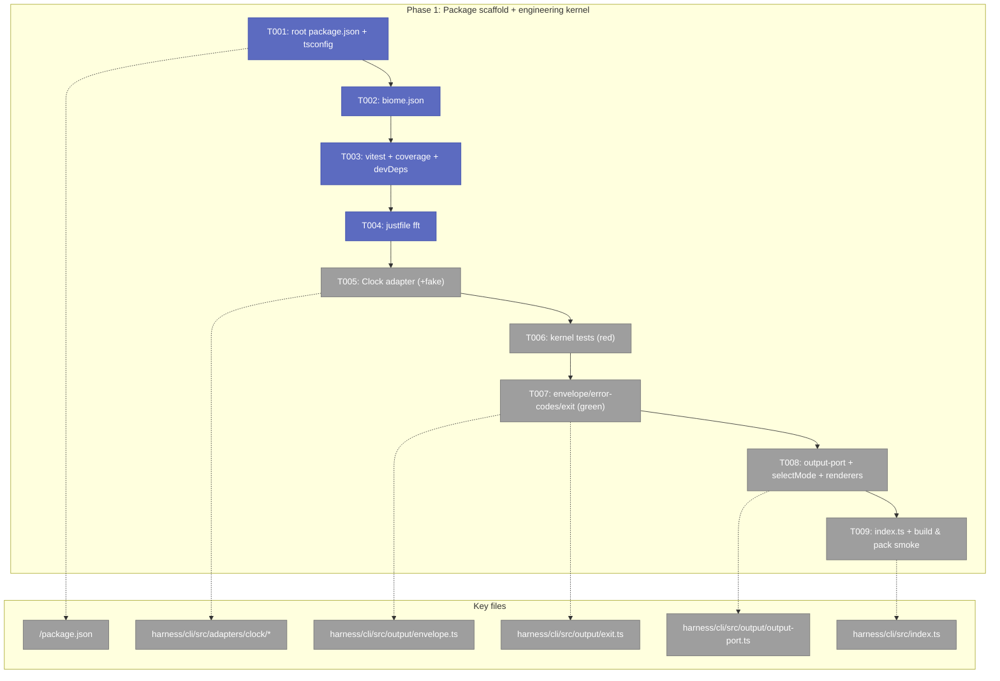
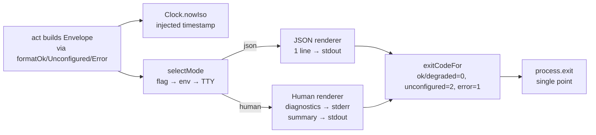
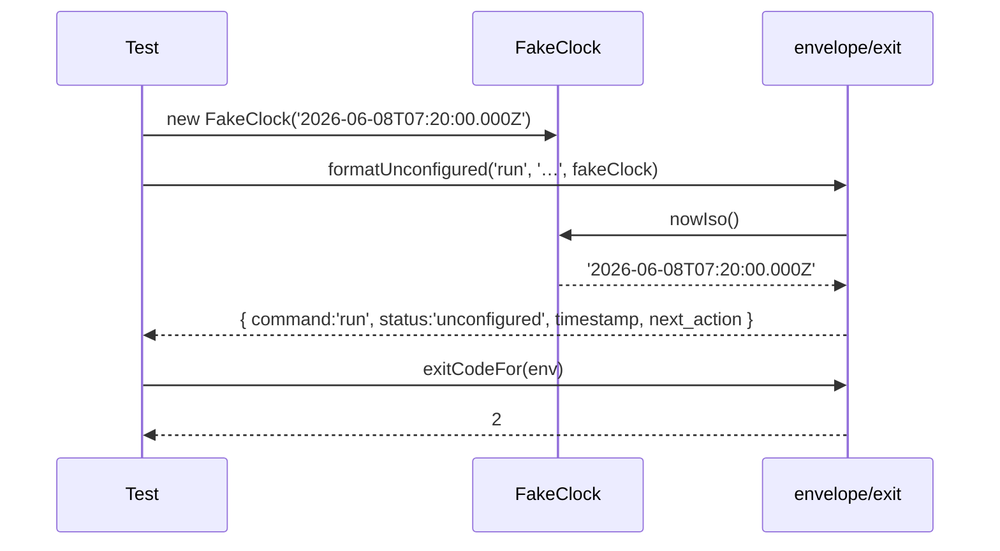

# Phase 1 — Package scaffold + engineering kernel — Tasks

**Plan**: [../../harness-core-plan.md](../../harness-core-plan.md)
**Phase**: Phase 1: Package scaffold + engineering kernel
**Spec**: [../../harness-core-spec.md](../../harness-core-spec.md)
**Generated**: 2026-06-08
**Mode**: Full · **Status**: Ready for implementation (do not start until human GO)

---

## Executive Briefing

**Purpose**: Stand up the `npx`-installable TypeScript + ESM package and the repo's engineering toolchain (Biome, vitest + coverage, `justfile`), then build and unit-test the **output kernel** that every later command and the future extension loader depend on. This phase ships zero user-facing commands — it ships the contract and the scaffolding everything binds to.

**What We're Building**:
- A **repo-root `package.json`** that makes the repo itself `npx`-able (`bin.harness`, `"prepare": "npm run build"`), with all CLI source under `harness/cli/`.
- The toolchain: `harness/cli/tsconfig.json`, root `biome.json`, `harness/cli/vitest.config.ts` (with `@vitest/coverage-v8`), and `justfile` recipes `fix` / `format` / `test` / `fft`.
- The **output kernel** (workshop 001): `Envelope` type + constructors, `ErrorCodes` table, status→exit mapping (`exitCodeFor` / `exitWithEnvelope`), `OutputPort` + `selectMode` + human/JSON renderers.
- The **`Clock` adapter** (port / system / fake) — the kernel's only adapter dependency (envelope timestamps are injected, never `new Date()`).
- A minimal `index.ts` entrypoint that proves the `bin` + `prepare` + `npx` wiring end-to-end.

**Goals**:
- ✅ `npm install` succeeds and `npm run build` emits `harness/cli/dist/`.
- ✅ `just fft` (fix → format → test-with-coverage) runs green locally and prints a coverage summary.
- ✅ The output kernel is unit-tested against workshop 001's 5 worked examples (field-presence + status→exit map), using a `FakeClock` for deterministic timestamps.
- ✅ `node harness/cli/dist/index.js --version` runs; `npm pack --dry-run` shows `harness/cli/dist/index.js` in the tarball and the `harness` bin resolves.

**Non-Goals**:
- ❌ Real commands (`help`, `doctor`, the 8 slots) — Phase 2.
- ❌ The fs / process / git / env adapters — Phase 2 (only `Clock` ships here, because the envelope depends on it).
- ❌ CI, release-please, branch protection — Phase 3.
- ❌ Any real harness-loop behaviour or runtime extension loader (out of scope for the whole feature).

---

## Prior Phase Context

**N/A — this is Phase 1 (no prior phases).** First implementation phase; nothing to carry forward.

---

## Pre-Implementation Check

| File | Exists? | Domain Check | Notes |
|------|---------|-------------|-------|
| `package.json` (repo root) | ❌ create | repo eng substrate ✓ | New repo-root manifest. **Contract** (npx identity). `commander` goes in `dependencies` (runtime), build/test tools in `devDependencies`. No existing root manifest — confirmed clean create. |
| `harness/cli/tsconfig.json` | ❌ create | repo eng substrate ✓ | `rootDir: src`, `outDir: dist`, `module: ESNext`, `moduleResolution: Bundler` (mirrors minih), `target: ES2022`. Relative imports use explicit `.js` extensions (raw `tsc` emit runs under Node ESM). |
| `biome.json` (repo root) | ❌ create | repo eng substrate ✓ | Format + lint for `harness/cli`. Ignore `**/dist`. |
| `harness/cli/vitest.config.ts` | ❌ create | repo eng substrate ✓ | `@vitest/coverage-v8`; reporters text-summary + lcov. |
| `justfile` (repo root) | ✅ **modify** | repo eng substrate ✓ | **Exists** (skill-ops recipes). Append `fix`/`format`/`test`/`fft` — do **not** clobber existing recipes (`list-skills`, `install-skills-*`, `doctor-skills`). |
| `harness/cli/src/adapters/clock/{clock-port,system-clock,fake-clock}.ts` | ❌ create | harness-cli ✓ | Kernel dependency — pulled before the envelope (Finding 04). |
| `harness/cli/src/output/{envelope,error-codes,exit,output-port}.ts` | ❌ create | harness-cli ✓ | **Contract** (envelope + error-codes). Workshop 001 is the build spec. |
| `harness/cli/test/output/*.test.ts` | ❌ create | harness-cli ✓ | Mirrors `src/output/`; fake-clock based. |
| `harness/cli/src/index.ts` | ❌ create | harness-cli ✓ | Minimal in P1 (commander root + `--version`); full surface in P2. |

> **Contract changes (higher risk)**: `package.json` (npx identity) and `output/envelope.ts` + `error-codes.ts` (the output contract) are the two contracts in this phase. Both are *new* (no existing consumers), so risk is "get it right once," not "don't break callers." `/code-concept-search-v2` not run — these are net-new files with no in-repo duplication (the repo has no prior CLI/TS source).

---

## Architecture Map



---

## Tasks

> **Ordering note**: T005 (Clock) precedes the kernel tests because the envelope constructors take an injected `clock: Clock` (workshop 001) and the kernel tests pass a `FakeClock` for deterministic timestamps. This honours Finding 04 ("Clock must ship in Phase 1 because the envelope timestamps depend on it"). Test-first discipline is preserved within the kernel: T006 (tests, red) → T007 (impl, green).
>
> **Build conventions (ESM — read before T001/T006+)**: the build is **raw `tsc` emit** (no bundler) and the package is `"type":"module"`, so **every relative import MUST carry an explicit `.js` extension** (e.g. `import { formatOk } from './envelope.js'`). The emitted `dist/*.js` runs directly under Node ESM, which does not resolve extensionless relative specifiers. tsconfig uses `module: "ESNext"` + `moduleResolution: "Bundler"` for type-checking — this **mirrors minih**, which ships `.js`-suffixed imports under raw `tsc` (`build: tsc && …`, verified). `vitest` resolves TS directly, so the same `.js`-suffixed specifiers work in tests.
>
> **Runtime-vs-dev deps**: `commander` is a **runtime `dependency`**, never a devDependency, because `npx` / distributed installs run `npm install --omit=dev` and would otherwise drop the CLI's argument parser at install time (R7 / P10; **minih ships `commander` in `dependencies`**, verified). devDependencies are build/test-only (`typescript`, `vitest`, `@vitest/coverage-v8`, `@biomejs/biome`, `@types/node`).

| Status | ID | Task | Domain | Path(s) | Done When | Notes |
|--------|-----|------|--------|---------|-----------|-------|
| [x] | T001 | Create repo-root `package.json`: `"type":"module"`, `bin.harness → ./harness/cli/dist/index.js`, `"prepare":"npm run build"`, `"build":"tsc -p harness/cli/tsconfig.json"`, `files:["harness/cli/dist","LICENSE"]`, `engines.node ">=20"`, `"dependencies": { "commander": "^13.1" }` (runtime — see Build-conventions note), and scripts mapping `test`/`lint`/`format`/`fix`. Add `harness/cli/tsconfig.json` (`rootDir:"src"`, `outDir:"dist"`, `module:"ESNext"`, `moduleResolution:"Bundler"`, `target:"ES2022"`, `strict:true`, `declaration:true`, `include:["src"]`). | repo eng substrate | `/package.json`, `/harness/cli/tsconfig.json` | `npm install` succeeds; `npm run build` emits `harness/cli/dist/`; `commander` is under `dependencies` (not `devDependencies`). | Plan 1.1 · Finding 01 · R7/P10 (runtime dep) · AC-1, AC-2 |
| [x] | T002 | Add repo-root `biome.json` (schema `~2.4.x`): formatter on (2-space, single quotes), linter `recommended`, `organizeImports` on, `files.ignore` includes `**/dist`, `**/node_modules`. Scope to `harness/cli`. | repo eng substrate | `/biome.json` | `npx biome check harness/cli` runs and reports cleanly on scaffolded files. | Plan 1.2 · mirrors minih MT-01 · AC-3 |
| [x] | T003 | Add `harness/cli/vitest.config.ts` with `@vitest/coverage-v8` (coverage reporters `text-summary` + `lcov`; `include: ['test/**/*.test.ts']`; **no coverage thresholds** — report-only this slice per R5). Install **devDeps** with starting pins: `typescript ^5.7`, `vitest ^3.2`, `@vitest/coverage-v8 ^3.2`, `@biomejs/biome ^2.4.10`, `@types/node ^22`. (`commander` is a **runtime `dependency`** added in T001, not here.) | repo eng substrate | `/harness/cli/vitest.config.ts`, `/package.json` | `cd harness/cli && npx vitest run --coverage` executes (zero tests OK initially) and prints a coverage summary; no threshold failure. | Plan 1.3 · Finding 03 (coverage net-new) · R5 (no gate) · pins from dossier MT-01/MN-01 · AC-3 |
| [x] | T004 | Extend the **existing** root `justfile` (append; preserve skill-ops recipes). Each recipe states its working directory explicitly: `fix` → `biome check --write harness/cli` (from repo root, where `biome.json` lives); `format` → `biome format --write harness/cli` (repo root); `test` → `cd harness/cli && vitest run --coverage` (so vitest finds `harness/cli/vitest.config.ts`); `fft` → runs `fix` then `format` then `test`, in that order. | repo eng substrate | `/justfile` | `just fft` (from repo root) runs all three in order with unambiguous working dirs and exits 0. | Plan 1.4 · Finding 07 (spec fft semantics, NOT minih's recipe) · AC-3, AC-5 |
| [x] | T005 | Implement the `Clock` adapter: `clock-port.ts` (`interface Clock { nowIso(): string }`), `system-clock.ts` (`SystemClock` → `new Date().toISOString()`), `fake-clock.ts` (`FakeClock` with a settable/incrementable fixed instant). Add `test/adapters/clock/fake-clock.test.ts` asserting `FakeClock` returns a deterministic, controllable ISO string. | harness-cli | `/harness/cli/src/adapters/clock/{clock-port,system-clock,fake-clock}.ts`, `/harness/cli/test/adapters/clock/fake-clock.test.ts` | `FakeClock.nowIso()` is deterministic and advances only when told; `SystemClock` returns a valid ISO-8601 string. | Plan 1.7 (pulled earlier) · Finding 04 · one fake per adapter (P10/idioms) |
| [ ] | T006 | **Test-first (red)**: write `test/output/envelope.test.ts` + `test/output/exit.test.ts` asserting workshop 001's 5 worked examples, the field-presence table (`next_action` required when `status !== 'ok'`), and the status→exit map (`ok→0, degraded→0, unconfigured→2, error→1`). Use `FakeClock` for timestamps. | harness-cli | `/harness/cli/test/output/{envelope,exit}.test.ts` | Tests exist and **fail (red)** because the kernel impl does not exist yet. | Plan 1.5 · Workshop 001 worked examples = fixtures · Hybrid/TDD for kernel logic |
| [ ] | T007 | **Implement (green)** `src/output/{envelope.ts,error-codes.ts,exit.ts}`: `Status` union, `Evidence`, `Envelope`, `formatOk`/`formatUnconfigured`/`formatError` (clock injected), `ErrorCodes` table (E100/E108/E110/E120/E130), `exitCodeFor`, `exitWithEnvelope(env, io)` (single `process.exit`). | harness-cli | `/harness/cli/src/output/{envelope,error-codes,exit}.ts` | T006 tests pass **green**; `next_action` present on every non-`ok` status; `unconfigured → 2`; `process.exit` called only here. | Plan 1.6 · Finding 02 · Workshop 001 · rules (only kernel calls process.exit) |
| [ ] | T008 | Implement `src/output/output-port.ts`: `OutputPort` interface, `selectMode(flags, env, isTty)` with precedence **flag → `HARNESS_JSON` env → TTY**, JSON renderer (`stdout.write(JSON.stringify(env)+'\n')`), human renderer (progress/diagnostics → **stderr**, final summary line → **stdout**). Add `test/output/output-port.test.ts` covering all `selectMode` precedence cases and the stdout/stderr renderer split. | harness-cli | `/harness/cli/src/output/output-port.ts`, `/harness/cli/test/output/output-port.test.ts` | `selectMode` returns the correct mode for each precedence case; JSON renderer emits exactly one parseable line to stdout; human renderer keeps the summary on stdout and diagnostics on stderr. | Plan 1.7 · Finding 04 · Workshop 001 §"Human vs JSON" |
| [ ] | T009 | Add minimal `src/index.ts` (commander root; resolve the version by reading the **repo-root** `package.json` at runtime via `readFileSync(new URL('../../../package.json', import.meta.url), 'utf8')` — npm always ships `package.json` in the tarball, and this relative path holds both in-repo and when installed; prints a help/orientation envelope via the kernel). **Smoke**: `npm run build && node harness/cli/dist/index.js --version`, **plus** `npm pack --dry-run` confirming the tarball lists `harness/cli/dist/index.js` and the `harness` bin resolves. | harness-cli | `/harness/cli/src/index.ts` | Built `dist/index.js` runs and prints the version resolved from the shipped `package.json`; `npm pack --dry-run` lists `harness/cli/dist/index.js`; `just fft` is green overall. | Plan 1.8 · Finding 01 · R1 (de-risk install-time `prepare`) · real entrypoint lands in P2 |

**Phase 1 acceptance**: AC-1..AC-5 (spec). `just fft` green; coverage reported; `node harness/cli/dist/index.js --version` runs; `npm pack --dry-run` proves the npx tarball shape.

---

## Context Brief

**Key findings from plan** (apply during implementation):
- **Finding 01 (Critical)**: `npx`-from-repo-URL works *only* with `package.json` at the **repo root** carrying `bin` + `"prepare": "npm run build"`; source stays under `harness/cli/`. → T001, T009.
- **Finding 02 (Critical)**: the envelope + exit contract is the dependency of every command and the future loader — build the kernel **first**, unit-tested. → T006, T007.
- **Finding 03 (High)**: coverage is **net-new** (neither reference repo reports it). Add `@vitest/coverage-v8`; `test` runs `--coverage`. → T003.
- **Finding 04 (High)**: Hexagonal layering makes services testable via fakes; **Clock must ship in Phase 1** because envelope timestamps depend on it. → T005 (ordered before the kernel tests).
- **Finding 07 (Medium)**: use the **spec's** `fft = fix → format → test`, not minih's broader recipe. → T004.

**Domain dependencies** (concepts/contracts this phase consumes):
- `harness-foundations` (docs): first principles only — *CLI-is-the-API*, *output is a contract*, *unconfigured honesty*. No code consumed; nothing imported. The kernel **realises** these principles; it does not call into foundations.
- No `docs/domains/registry.md` exists; domains here are conceptual labels for traceability (per spec + plan Target Domains).

**Domain constraints** (from `docs/project-rules/{architecture,rules,constitution}.md`):
- **Hexagonal (P2)**: dependencies point inward — `index.ts` (entrypoint) → acts → services → adapter **ports**. In this phase only the kernel + `Clock` exist; the kernel must not import `node:fs`/`node:child_process`. The only side-effect dependency is the injected `Clock`.
- **No raw time (rules)**: never call `new Date()` / `Date.now()` in services or the kernel — take a `Clock` port. `SystemClock` is the only place real time is read.
- **Single exit point (P6/rules)**: only the output kernel (`exitWithEnvelope`) may call `process.exit`. No `process.exit` in acts/services/adapters.
- **One fake per adapter (P3)**: `Clock` ships with exactly one `FakeClock` recording/controlling behaviour — fakes over mocks.
- **Extension-ready (P10)**: keep the contract data-driven and open; do **not** introduce a closed `SlotName` union as a registry key (slots arrive in Phase 2, but the envelope/error-code tables authored here must not assume a closed command set).
- **Runtime deps vs devDeps (R7/P10)**: any dependency the shipped `dist/` needs at runtime (here: `commander`) goes in `dependencies` — `npx`/distributed installs run `npm install --omit=dev`, which drops `devDependencies`. Build/test-only tools stay in `devDependencies`.
- **ESM `.js` extensions**: relative imports in `src/` carry explicit `.js` extensions (raw `tsc` emit + `"type":"module"`); see the Build-conventions note above the task table.

**Agent harness context**:
- **No agent harness configured** (`docs/project-rules/engineering-harness.md` / legacy `agent-harness.md` / `harness.md` absent). Implementation will use the **standard testing approach** from the plan (vitest unit tests + local `just fft` + build/pack smoke). No Boot→Interact→Observe pre-flight is available; `plan-6` will report `UNAVAILABLE` and fall back — that is expected, not an error.

**Reusable from prior phases**: none (first phase). This phase *creates* the reusable assets Phase 2 will consume: the output kernel, `FakeClock`, the `vitest` + coverage harness, the `just fft` loop, and the `tsconfig`/`biome` config.

**Mermaid flow diagram** (output kernel — value path of a single command's output):



**Mermaid sequence diagram** (deterministic kernel unit test):



---

## Discoveries & Learnings

_Populated during implementation by plan-6._

| Date | Task | Type | Discovery | Resolution | References |
|------|------|------|-----------|------------|------------|

**Types**: `gotcha` | `research-needed` | `unexpected-behavior` | `workaround` | `decision` | `debt` | `insight`

---

## Directory Layout

```
docs/plans/004-harness-core/
  ├── harness-core-plan.md
  └── tasks/phase-1-package-scaffold-engineering-kernel/
      ├── tasks.md           # this file
      ├── tasks.fltplan.md   # flight plan
      └── execution.log.md   # created by plan-6
```

---

## Validation Record (2026-06-08)

### Validation Thesis

**Raison d'être**: Turn the plan's Phase 1 into a faithfully-ordered, implementation-ready task list an agent (plan-6) can build from with minimal clarification — before the build starts.

**Value claim**: Implementation becomes faster and lower-risk; the output kernel (workshop 001) is buildable verbatim; the Clock-before-envelope dependency is pre-empted; coverage (net-new, Finding 03) is wired.

**Artifact promise**: An implementer can execute T001–T009 in order, hitting spec AC-1..AC-5, without re-deriving the plan/workshops; plan-7 and Phase 2 can rely on the kernel + `FakeClock` + toolchain produced.

**Intended beneficiaries**: implementation agent (plan-6), reviewer (plan-7), downstream Phase 2.

**Proof target**: Implementation.

**Evidence standard**: 1:1 plan-task mapping + AC coverage; correct paths; dependency-respecting order; testable Done-When; accurate references; architecture/flow/sequence diagrams.

**Thesis source**: `harness-core-plan.md` Phase 1 + `harness-core-spec.md` AC-1..AC-5 + workshop 001 (grounded, not inferred).

**Thesis verdict**: Advanced.

**Main thesis risk**: None material post-fix — the dossier stays buildable, ordered, and aligned to the kernel-first proof target.

---

| Agent | Lenses Covered | Thesis Axes Covered | Issues | Verdict |
|-------|---------------|---------------------|--------|---------|
| Source-Truth | Cross-Reference, Source Truth, Hidden Assumptions, Concept Documentation | Evidence Sufficiency | 0 | ✅ |
| Completeness-Proof | Evidence Sufficiency, Proof-Level Fit, Edge Cases, Deployment & Ops, Technical Constraints | Implementation Readiness | 3 HIGH fixed | ⚠️ → ✅ |
| Thesis-Alignment | Thesis Alignment | Thesis Alignment, Proof-Level Fit, User Value | 0 | ✅ |
| Forward-Compatibility | Forward-Compatibility, Technical Constraints, Domain Boundaries | Safety to Change, Downstream Usefulness | 1 HIGH fixed | ⚠️ → ✅ |

**Lens coverage**: 11/15 (Thesis Alignment ✓, Forward-Compatibility ✓, Evidence Sufficiency, Proof-Level Fit, Edge Cases, Deployment & Ops, Technical Constraints, Hidden Assumptions, Cross-Reference/Source-Truth, Domain Boundaries, Concept Documentation).

### Forward-Compatibility Matrix

| Consumer | Requirement | Failure Mode | Verdict | Evidence |
|----------|-------------|--------------|---------|----------|
| Phase 2 (CLI command surface) | Importable kernel + `Clock`/`FakeClock`, adapter seam, tsconfig/biome/vitest toolchain, open slot registry | encapsulation lockout | ✅ (after fix) | Runtime dep now correct (T001); kernel + FakeClock exported as importable units |
| Phase 3 (CI/release) | `just`/scripts surface + `npm pack`/build shape CI-runnable | contract drift | ✅ (after fix) | Bin's runtime `commander` no longer omitted under `--omit=dev` (T001/T003) |
| Future extension system (R7/P10) | Open slot registry (`name: string`, no closed union) + runtime deps in `dependencies` | contract drift | ✅ | Registry openness preserved (no `SlotName` union in P1); runtime-dep rule encoded (T001 + Domain constraints) |

**Thesis alignment**: Value claim advanced at the Implementation proof target with Strong evidence; main residual risk is none material after the four HIGH fixes.

**Outcome alignment**: Phase 1 advances the spec's goal of the CLI being "the **front door** to this repo's engineering harness" by shipping the contract and scaffold; the `commander`-as-runtime-dependency fix keeps that front door usable under `npx`.

**Standalone?**: No — downstream Phase 2 and Phase 3 are defined in `harness-core-plan.md` and consume this phase's kernel, `FakeClock`, adapter convention, and toolchain.

**Issues found & fixed (4 HIGH, all source-grounded and mechanical):**
1. `commander` was a devDependency → moved to runtime `dependencies` (T001/T003). `npx` runs `--omit=dev`; **minih ships `commander` in `dependencies`** (verified). [Forward-Compat]
2. ESM `.js`-extension requirement was unstated → added Build-conventions note + tsconfig `module: ESNext`/`moduleResolution: Bundler` (mirrors minih's raw-`tsc` + `.js`-suffixed imports, verified). [Completeness]
3. `justfile` `test` working-dir was ambiguous → recipes now state explicit working dirs (`cd harness/cli && vitest …`). [Completeness]
4. `--version` runtime resolution under compiled `dist/` ESM was unspecified → T009 now reads the shipped root `package.json` via `new URL('../../../package.json', import.meta.url)`. [Completeness]

Overall: ⚠️ **VALIDATED WITH FIXES** — all 4 HIGH issues fixed inline; thesis advanced at Implementation proof level; no open CRITICAL/HIGH.
