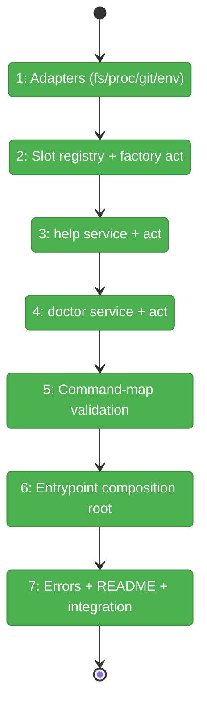
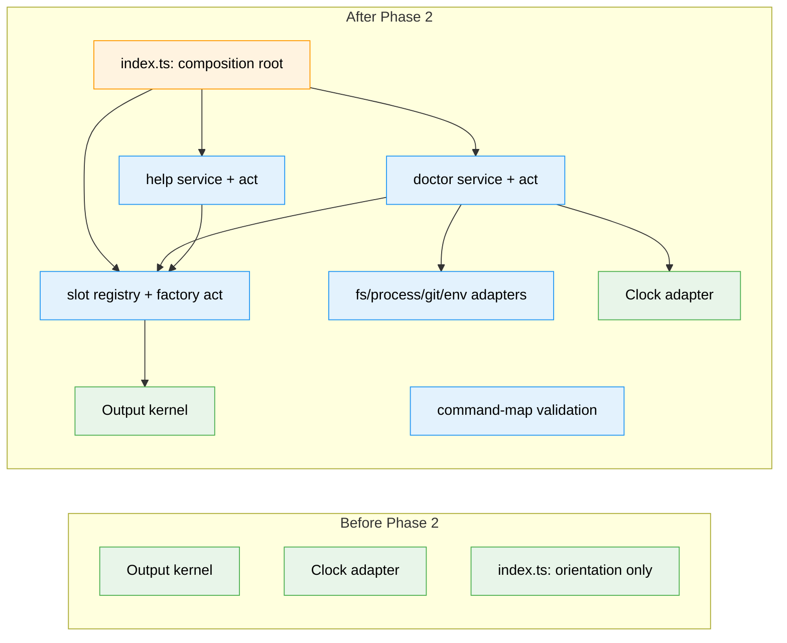

# Flight Plan: Phase 2 — CLI command surface + architecture

**Plan**: [../../harness-core-plan.md](../../harness-core-plan.md)
**Phase**: Phase 2: CLI command surface + architecture
**Generated**: 2026-06-08
**Status**: Landed

---

## Departure → Destination

**Where we are**: Phase 1 landed — the output kernel (`envelope`/`exit`/`output-port`), the `Clock` adapter (port/system/fake), and a minimal commander entrypoint that prints an orientation envelope. `just fft` is green (30 tests, 94.28% coverage). No command surface yet; the 8 future slots don't exist.

**Where we're going**: A developer or agent can run `harness help`, `harness doctor`, and any of `run/validate/build/lint/test/smoke/health/observe` and get a stable human-or-JSON envelope with correct exit codes. `help`/`doctor` genuinely work; the 8 slots are honest `unconfigured` stubs (exit 2). All services are unit-tested through fake adapters with zero real I/O, and the commander entrypoint stays thin (no business logic).

---

## Domain Context

### Domains We're Changing

| Domain | What Changes | Key Files |
|--------|-------------|-----------|
| harness-cli | New adapters (fs/process/git/env), slot registry + factory act, help & doctor services/acts, command-map validation, full composition root | `src/adapters/{fs,process,git,env}/`, `src/services/{slots,help,doctor,config}/`, `src/acts/`, `src/index.ts` |

### Domains We Depend On (no changes)

| Domain | What We Consume | Contract |
|--------|----------------|----------|
| harness-cli (Phase 1 kernel) | Envelope constructors, exit policy, output-port, clock | `output/*`, `adapters/clock/*` |
| harness-foundations (docs) | First principles (CLI-is-the-API, doctor-as-orientation, prescribe-the-fix) | consume-only, no change |

---

## Flight Status

<!-- Updated by /plan-6-v2: pending → active → done. Use blocked for problems/input needed. -->

**Legend**: grey = pending | yellow = active | red = blocked/needs input | green = done

---

## Stages

<!-- Updated by /plan-6-v2 during implementation: [ ] → [~] → [x] -->

- [x] **Stage 1: Build the adapters** — fs/process/git/env, each port + Node impl + fake recording call history (`src/adapters/{fs,process,git,env}/` — new). [T001–T004]
- [x] **Stage 2: Build the slot seam** — data-driven registry of 8 `unconfigured` slots + one factory act; `--dry-run` on run/validate (`services/slots/`, `acts/unconfigured-slot.ts` — new). [T005]
- [x] **Stage 3: Make `help` real** — service + act; `help --json` machine-readable slot list (`services/help/`, `acts/help.ts` — new). [T006]
- [x] **Stage 4: Make `doctor` real** — layered checks via injected fakes; consumes the registry (`services/doctor/`, `acts/doctor.ts` — new). [T007]
- [x] **Stage 5: Validate the command-map** — in-code map shape validation → `E120` envelope (`services/config/load-config.ts` — new). [T008]
- [~] **Stage 6: Wire the composition root** — full commander entrypoint, tri-state `--json` resolved once, all acts registered; add `makeOutputPort` (`src/index.ts` — replace, `output-port.ts` — modify). [T009]
- [x] **Stage 7: Harden + document + integrate** — actionable errors, CLI README, integration (automated `test/integration/cli-commands.test.ts` + manual smoke) + coverage pass (`acts/*`, `README.md` — new). [T010–T012]

---

## Architecture: Before & After

**Legend**: existing (green, unchanged) | changed (orange, modified) | new (blue, created)

---

## Acceptance Criteria

- [ ] **AC-6** Thin commander entrypoint selects an act, renders human/JSON, translates to exit codes — no business logic in handlers.
- [ ] **AC-7** Acts wire services+adapters; services receive adapters by injection; adapters (fs/process/git/env/clock) each have a fake.
- [ ] **AC-8** `help`/`--help` (global + per-command) explain purpose, slots, output modes, safe first actions; `help --json` machine-readable.
- [ ] **AC-9** `doctor` reports configured vs unconfigured layers with a next action per item (human stderr + JSON stdout); safe at session start.
- [ ] **AC-10** `run/validate/build/lint/test/smoke/health/observe` return `status:unconfigured` + `next_action` and exit `2`; `run`/`validate` accept `--dry-run`.
- [ ] **AC-11** Failures are actionable (what/why/next) — no raw stack traces.
- [ ] **AC-12** Services/acts unit-tested with fake adapters; command-map validated before use.

## Goals & Non-Goals

**Goals**: Hexagonal layering live; `help`+`doctor` working; 8 honest `unconfigured` slots; fakes for every adapter; thin entrypoint; actionable errors; `just fft` green with coverage.

**Non-Goals**: real harness-loop behaviour; the extension loader (seam only); reading an external config file; http/server/telemetry adapters; CI/release/branch-protection (Phase 3).

---

## Checklist

- [x] T001: fs adapter (port/impl/fake + smoke)
- [x] T002: process adapter (port/impl/fake + smoke)
- [x] T003: git adapter (port/impl/fake + smoke)
- [x] T004: env adapter (port/impl/fake + smoke)
- [x] T005: slot registry + unconfigured-slot factory act (test-first) + `makeOutputPort` helper
- [x] T006: help service + act (`help --json` machine-readable)
- [x] T007: doctor service + act (test-first, consumes registry)
- [x] T008: command-map validation (E120)
- [x] T009: entrypoint composition root (tri-state `--json`, register all acts)
- [x] T010: actionable-error hardening
- [x] T011: CLI README
- [x] T012: integration wiring + coverage pass (automated integration test + manual smoke)
