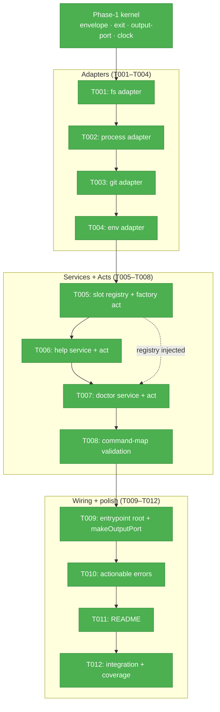
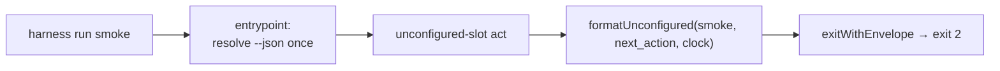

# Tasks — Phase 2: CLI command surface + architecture

**Plan**: [../../harness-core-plan.md](../../harness-core-plan.md) · **Mode**: Full · **Status**: READY
**Spec**: [../../harness-core-spec.md](../../harness-core-spec.md)
**Workshops**: [001 output contract](../../workshops/001-output-envelope-and-exit-codes.md) · [002 composition pattern](../../workshops/002-cli-composition-pattern.md)
**Generated**: 2026-06-08
**Acceptance**: AC-6 … AC-12 (spec)
**Testing approach**: Hybrid — **test-first** for services/registry (logic); lighter validation for acts/wiring.

> **Build reconciliation (post-validation)**: during the companion build the planned `makeOutputPort` helper was **superseded** by an entrypoint-resolved `CliIo {mode, writers}` injected into every act (companion finding F002) — references to `makeOutputPort` below are historical planning guidance. The flat 8-slot factory was also split into a `run <slot>` dispatcher + a 7-slot top-level factory to honour workshop 001 (F003). See `execution.log.md` for the full deviation record.

---

## Executive Briefing

- **Purpose**: Turn the Phase-1 output kernel into a real command surface. Build the Hexagonal layering (entrypoint → acts → services → adapters) so two commands genuinely work (`help`, `doctor`) and the remaining eight slots are honest `unconfigured` stubs — all unit-tested through fake adapters, zero real I/O in services.
- **What We're Building**: The fs/process/git/env adapters (port + Node impl + fake each, mirroring Phase 1's `Clock`); a data-driven slot registry + a single factory act producing all 8 stubs; `help` and `doctor` services+acts; built-in command-map validation; and a full commander composition root wiring everything with a global `--json`/`--no-json` flag. Plus the CLI's own `README.md`.
- **Goals**:
  - ✅ Thin commander entrypoint: parse → select act → render → exit, **no business logic** (AC-6).
  - ✅ Services receive adapters by injection; every adapter (fs/process/git/env + the Phase-1 clock) has a fake (AC-7).
  - ✅ `help`/`--help` explain purpose, slots, output modes, safe first actions; `help --json` is machine-readable (AC-8).
  - ✅ `doctor` reports configured vs unconfigured layers, each with a `next_action`; safe at session start (AC-9).
  - ✅ All 8 slots return `status:unconfigured` + `next_action`, exit `2`; `run`/`validate` accept `--dry-run` (AC-10).
  - ✅ Failures are actionable (what/why/next) — no raw stack traces (AC-11).
  - ✅ Services/acts unit-tested with fakes; built-in command-map validated before use (AC-12).
  - ✅ `just fft` green with coverage reported.
- **Non-Goals** (spec):
  - ❌ Real harness-loop behaviour (no slot does real work — all stay `unconfigured`).
  - ❌ The runtime extension loader (only the *seam* — slot registry kept open per Q4/R7).
  - ❌ Reading an external repo-local config file (this slice validates the **in-code** command-map only).
  - ❌ `http/server` and `telemetry` adapters (`observe` is out of scope).
  - ❌ CI / release-please / branch protection (that is Phase 3).

---

## Prior Phase Context — Phase 1 (Package scaffold + engineering kernel)

**A. Deliverables** (all under `harness/cli/`, `just fft` green, 30 tests / 94.28% coverage):
- Output kernel: `src/output/{envelope.ts, error-codes.ts, exit.ts, output-port.ts}`.
- `Clock` adapter: `src/adapters/clock/{clock-port.ts, system-clock.ts, fake-clock.ts}`.
- Minimal entrypoint: `src/index.ts` (commander root, `--version`, orientation envelope, `jsonFlag` tri-state).
- Toolchain at repo root: `package.json` (bin/prepare/files/engines), `harness/cli/tsconfig.json`, `biome.json`, `harness/cli/vitest.config.ts`, `justfile` (`fix`/`format`/`test`/`fft`).

**B. Dependencies Exported** (the contracts Phase 2 binds to — use these exact signatures):
- `Envelope { command, status, timestamp, data?, error?, evidence?, next_action? }`; `Status = 'ok'|'error'|'degraded'|'unconfigured'`.
- `formatOk(command, data, clock, opts?)` — **ok only** (no `status` override).
- `formatDegraded(command, data, next_action, clock, opts?)` — `next_action` **required**.
- `formatUnconfigured(command, next_action, clock, opts?)` — `next_action` required; `opts.data` optional (carries the `--dry-run` payload).
- `formatError(command, code, message, clock, opts?)` — `next_action` defaults to `message`.
- `exitCodeFor(env)` / `exitWithEnvelope(env, io)` — **only place** `process.exit` is called.
- `OutputPort { emit(env) }`, `Writers`, `processWriters`, `selectMode(flags, env, isTty)`, `renderJson`, `renderHuman`, `createOutputPort(mode, writers?)`.
- `Clock { nowIso() }`, `SystemClock`, `FakeClock(start?)` (records `calls[]`, `advance(ms)`, `set(instant)`).
- `ErrorCodes` table: `E100 UNKNOWN`, `E108 INVALID_ARGS`, `E110 SLOT_UNKNOWN`, `E120 CONFIG_INVALID`, `E130 DOCTOR_CHECK_FAILED`.
- `index.ts` exports `buildProgram(version)`, `jsonFlag(argv)`, `main(argv?)`.

**C. Gotchas & Debt carried forward**:
- ⚠️ **Contract drift in workshop 002 skeletons** — written *before* the F002 companion fix. The workshop shows `formatOk('doctor', {...}, clock, { status: anyFail ? 'degraded' : 'ok', next_action })` and a `makeOutputPort(...)` helper. **Neither exists as drawn.** Honor the *real* kernel: branch to `formatOk` (all pass) vs `formatDegraded` (any fail, with required `next_action`); compose output via `createOutputPort(selectMode(...))` (add a thin `makeOutputPort` helper — see T009).
- ⚠️ **`--json`/`--no-json` is tri-state, commander collapses it.** With both options registered, `program.opts().json` is a plain boolean (defaults `true` because of `--no-json`), losing the "flag absent → let env/TTY decide" state. Phase 1 solved this with `jsonFlag(argv)` reading argv directly. Phase 2 must resolve the tri-state **once** in the entrypoint `preAction` and thread the resolved mode to acts — do **not** have each act read `program.opts().json`.
- ESM: every relative import carries an explicit `.js` extension; type-only imports use `import type` (`verbatimModuleSyntax: true`).
- vitest is pinned `^4.1.8` (security); `passWithNoTests: true`; coverage report-only (no thresholds, R5). `src/index.ts` is excluded from coverage `include`.

**D. Incomplete Items**: none — Phase 1 landed fully (AC-1…AC-5 met). The real command surface (this phase) was explicitly deferred from Phase 1's `index.ts`.

**E. Patterns to Follow** (established by the `Clock` adapter — mirror exactly):
- One folder per adapter: `{x-port.ts, <impl>.ts, fake-<x>.ts}`. Port = interface only. Fake records call history on a public readonly array (fakes over mocks — assert on history).
- Services import **only port interfaces**, never Node `fs`/`child_process`. Acts construct concrete adapters and inject them.
- Tests are Test-Doc commented; use `FakeClock` for deterministic timestamps.

---

## Pre-Implementation Check

`/code-concept-search-v2` not needed — grep confirms **no** existing `makeOutputPort`/`loadSlotRegistry`/`runDoctor`/`register*Act` in `harness/cli/src` (greenfield; only the Phase-1 kernel exists). No agent harness governance doc → **standard vitest testing** (no Boot/Interact/Observe pre-flight; same as Phase 1).

| File | Exists? | Domain Check | Notes |
|------|---------|--------------|-------|
| `src/adapters/fs/{fs-port,node-fs,fake-fs}.ts` | ❌ new | harness-cli ✅ | Mirror `clock/` layout. |
| `src/adapters/process/{process-port,node-process,fake-process}.ts` | ❌ new | harness-cli ✅ | Read-only (`which`) this slice. |
| `src/adapters/git/{git-port,exec-git,fake-git}.ts` | ❌ new | harness-cli ✅ | Informational (branch/isRepo). |
| `src/adapters/env/{env-port,node-env,fake-env}.ts` | ❌ new | harness-cli ✅ | `get(name)`. |
| `src/services/slots/slot-registry.ts` | ❌ new | harness-cli (**contract**) | Extension seam — keep `name: string` open (Q4/R7). |
| `src/acts/unconfigured-slot.ts` | ❌ new | harness-cli | Factory act → all 8 stubs. |
| `src/services/help/help-service.ts` + `src/acts/help.ts` | ❌ new | harness-cli | `help --json` machine-readable. |
| `src/services/doctor/doctor-service.ts` + `src/acts/doctor.ts` | ❌ new | harness-cli | Layered, consumes the registry. |
| `src/services/config/load-config.ts` | ❌ new | harness-cli | Validates **in-code** command-map (E120). |
| `src/output/output-port.ts` | ✅ exists | harness-cli | **Modify** — add `makeOutputPort` helper (T009). |
| `src/index.ts` | ✅ exists | harness-cli | **Replace** orientation root with full composition root (T009). |
| `harness/cli/README.md` | ❌ new | harness-cli | Install + command surface + exit codes. |
| `test/**` | ❌ new (mirror src) | harness-cli | vitest, fake-adapter based. |

---

## Architecture Map



---

## Tasks

| Status | ID | Task | Domain | Path(s) | Done When | Notes |
|--------|-----|------|--------|---------|-----------|-------|
| [x] | T001 | **fs adapter** — `FsPort { exists(path):boolean; readText(path):string\|null }`, `NodeFs` (wraps `node:fs` `existsSync`/`readFileSync`), `FakeFs(files?)` recording `reads[]`. Smoke test asserts the fake records a read + returns seeded content. | harness-cli | `harness/cli/src/adapters/fs/{fs-port.ts,node-fs.ts,fake-fs.ts}`, `harness/cli/test/adapters/fs/fake-fs.test.ts` | All three files exist; `NodeFs`/`FakeFs implements FsPort`; fake records calls; test green. | Workshop 002 fs worked-example; mirror Clock layout; Finding 04. |
| [x] | T002 | **process adapter** — `ProcessPort { which(cmd):string\|null }` (read-only this slice), `NodeProcess`, `FakeProcess(which?)` recording `lookups[]`. Smoke test. | harness-cli | `harness/cli/src/adapters/process/{process-port.ts,node-process.ts,fake-process.ts}`, `harness/cli/test/adapters/process/fake-process.test.ts` | Fake returns seeded `which` results + records lookups; test green. | Workshop 002 adapter table (read-only); doctor toolchain check uses it. |
| [x] | T003 | **git adapter** — `GitPort { isRepo():boolean; currentBranch():string\|null }` (informational), `ExecGit` (wraps `git rev-parse`/branch), `FakeGit(state?)` recording `calls[]`. Smoke test. | harness-cli | `harness/cli/src/adapters/git/{git-port.ts,exec-git.ts,fake-git.ts}`, `harness/cli/test/adapters/git/fake-git.test.ts` | Fake returns seeded repo/branch + records calls; test green. | Workshop 002 (`ExecGit`); doctor uses it informationally. |
| [x] | T004 | **env adapter** — `EnvPort { get(name):string\|undefined }`, `NodeEnv` (wraps `process.env`), `FakeEnv(vars?)` recording `gets[]`. Smoke test. | harness-cli | `harness/cli/src/adapters/env/{env-port.ts,node-env.ts,fake-env.ts}`, `harness/cli/test/adapters/env/fake-env.test.ts` | Fake returns seeded vars + records gets; test green. **AC-7** (all adapters now have fakes). | Workshop 002 adapter table; selectMode already reads `process.env`, env adapter is for service-level reads/reporting. |
| [x] | T005 | **Slot registry + factory act (test-first)**. RED: `slot-registry.test.ts` asserts 8 `BUILTIN_SLOTS` all `unconfigured` with a `next_action`, and that the registry is a **list keyed by `name: string`** (no closed `SlotName` union). GREEN: `services/slots/slot-registry.ts` (`SlotStatus`, `CommandSlot {name:string,status,next_action}`, `BUILTIN_SLOTS` = run/validate/build/lint/test/smoke/health/observe, `loadSlotRegistry(fs)` returns them) + `acts/unconfigured-slot.ts` (`registerSlotAct(program, slot)`; `run`/`validate` add `--dry-run`; renders `formatUnconfigured(name, next_action, clock, {data?})` → `exitWithEnvelope` → exit 2). Also add the **`makeOutputPort` helper** to `output-port.ts` (first emitting act needs it — see T009 notes). | harness-cli (**contract**) | `harness/cli/src/services/slots/slot-registry.ts`, `harness/cli/src/acts/unconfigured-slot.ts`, `harness/cli/src/output/output-port.ts` (modify), `harness/cli/test/services/slots/slot-registry.test.ts`, `harness/cli/test/acts/unconfigured-slot.test.ts` | Each of the 8 slots → `status:unconfigured` + `next_action`, exit `2`; `--dry-run` executes nothing (carries `{dry_run:true,slot,mapped_command:null}` via `opts.data`); registry keyed by `name:string`. **AC-10**. | Finding 05; Workshop 002 seam + **Q4 guardrail** (no closed union); built **before** doctor (doctor consumes the registry). |
| [x] | T006 | **help service + act**. `services/help/help-service.ts` builds help content (purpose, output modes, exit-code semantics, safe first actions) **and** a machine-readable slot list from the registry. `acts/help.ts` (`registerHelpAct`): human output lists slots + safe first actions; `harness help --json` → `formatOk` with `data.slots[]` of `{name,status,next_action}`, exit `0`. Test the service via a fake/seeded registry. | harness-cli | `harness/cli/src/services/help/help-service.ts`, `harness/cli/src/acts/help.ts`, `harness/cli/test/services/help/help-service.test.ts` | `harness help` (human) lists slots + safe first actions; `harness help --json` → `status:ok`, `data.slots[]` of `{name,status,next_action}`, exit `0`. **AC-8**. | PL-02; front-door agent-readability; consumes T005 registry. |
| [x] | T007 | **doctor service + act (test-first)**. RED: `doctor-service.test.ts` (fakes only, zero real I/O) asserts layered checks + deterministic timestamp. GREEN: `services/doctor/doctor-service.ts` — `runDoctor(deps:{fs,proc,git,clock}, slots)`: Layer 0 toolchain (`proc.which` node/just/biome), Layer 1 cli-build (`fs.exists('harness/cli/dist/index.js')`), Layer 2 command-slots (configured vs unconfigured from injected registry); informational git branch. Returns `formatOk` if all configured else `formatDegraded(..., next_action)`. `acts/doctor.ts` (`registerDoctorAct`): human progress → **stderr**, JSON envelope → **stdout**, `exitWithEnvelope` (degraded ⇒ exit 0). | harness-cli | `harness/cli/src/services/doctor/doctor-service.ts`, `harness/cli/src/acts/doctor.ts`, `harness/cli/test/services/doctor/doctor-service.test.ts` | Doctor reports each layer (configured/unconfigured) with a `next_action`; service tested with **zero real I/O** (fakes + injected registry); timestamp deterministic under `FakeClock`; exit `0`. **AC-9**. | Workshop 002 doctor sequence + drift note (use `formatOk`/`formatDegraded`, not `formatOk({status})`); chainglass CG-01. |
| [x] | T008 | **Command-map validation**. `services/config/load-config.ts` — validate the **in-code** command-map/slot shape before use; return `formatError(..., E120 CONFIG_INVALID, ...)` envelope (never throw) on a malformed map. *No external config file is read this slice.* Unit-test valid + invalid shapes. | harness-cli | `harness/cli/src/services/config/load-config.ts`, `harness/cli/test/services/config/load-config.test.ts` | Invalid command-map → actionable `error` envelope (`code:E120`, `next_action`), not a throw; valid map passes; no external file read. | AC-12; minih MN-07; uses `ErrorCodes.CONFIG_INVALID`. |
| [x] | T009 | **Entrypoint composition root**. Replace `index.ts`'s orientation root with the full commander root: `--version`, global `--json`/`--no-json`, a `preAction` hook that resolves the **tri-state** json flag once (`jsonFlag(argv)`) and threads the resolved `OutputMode`/port to acts, then `registerHelpAct`/`registerDoctorAct`/`registerSlotAct(×8 from the registry)`. Add `makeOutputPort(flags, env, isTty) = createOutputPort(selectMode(flags, env, isTty))` to `output-port.ts` (if not already added in T005). **No fs/process/git imports in `index.ts`.** | harness-cli | `harness/cli/src/index.ts` (replace), `harness/cli/src/output/output-port.ts` (modify), `harness/cli/test/output/output-port.test.ts` (extend for `makeOutputPort`) | `node dist/index.js --help` lists `help`, `doctor`, and the 8 slots; entrypoint has no fs/process/git imports; tri-state `--json`/`--no-json`/absent all resolve correctly. **AC-6**. | Workshop 002 thin entrypoint + Q2 (acts construct adapters); drift gotcha (tri-state, makeOutputPort). |
| [x] | T010 | **Actionable-error hardening**. Ensure every act path turns bad input into `formatError` + `next_action` (no raw stack trace escapes): unknown slot → `E110 SLOT_UNKNOWN`; missing/invalid args → `E108 INVALID_ARGS`. Add tests for the error paths. | harness-cli | `harness/cli/src/acts/*` (touch as needed), `harness/cli/test/acts/errors.test.ts` | A bad invocation prints `{status:error, error.code, next_action}` and exits `1`; no stack traces. **AC-11**. | Workshop 001 error example; R6 (logic stays in services). |
| [x] | T011 | **CLI README**. `harness/cli/README.md`: purpose, `npx github:AI-Substrate/harness-engineering` install, command-surface table (help/doctor + 8 slots), output modes (`--json`/`--no-json`/env/TTY), exit-code semantics (`0` ok/degraded · `1` error · `2` unconfigured). | harness-cli | `harness/cli/README.md` | README documents install + every command + exit codes `0/1/2`. | Spec Docs Strategy; no test (docs). |
| [x] | T012 | **Integration wiring + coverage pass**. (a) **Automated**: add `test/integration/cli-commands.test.ts` driving `main(argv)` / the registered acts with injected fake `Writers` (capture stdout/stderr) + a spy on `process.exit`, asserting the envelope + exit code for `help`, `help --json`, `doctor`, `run smoke` (→ unconfigured/2), `run validate --dry-run` per workshop 001 worked examples. (b) **Manual smoke** (secondary): on the built `dist/`, `node dist/index.js help|doctor|run smoke|run validate --dry-run` confirm the same. Then `just fft` green with coverage reported. | harness-cli | `harness/cli/test/integration/cli-commands.test.ts` (new), `harness/cli/test/**` (fill gaps), build output | Automated integration test asserts each command's envelope + exit code (`help`/`doctor` → 0, slots → 2, error path → 1); manual smoke matches; `just fft` green; coverage summary printed. **AC-6,7,12 closeout** + Phase 2 acceptance AC-6…AC-12. | Spec; Hybrid — automated integration assertions + a manual smoke confirmation. |

**Status legend**: `[ ]` pending · `[~]` in progress · `[x]` complete · `[!]` blocked.

---

## Context Brief

### Key findings from plan (Phase-2 relevant)
- **Finding 02 (Critical)** — the output contract is the dependency of every command. Phase 2 consumes the Phase-1 kernel verbatim; do not reshape it.
- **Finding 04 (High)** — Hexagonal layering makes services unit-testable via fakes. fs/process/git/env ship here, one fake each; services import only ports.
- **Finding 05 (High)** — unconfigured slots must **never** fake success: `status:unconfigured` + `next_action` + exit `2`. The registry + factory act produce all 8 from data.
- **R6** — thin-handler discipline: all logic in services (tested via fakes); acts contain no fs/process imports.
- **R7 / Q4** — keep the slot registry open (`name:string`, no closed union) so a future pi-style loader can append/flip slots without a schema change; any future runtime dep goes in `dependencies`.

### Domain dependencies (concepts/contracts this phase consumes)
- `harness-cli` output kernel (Phase 1): `formatOk`/`formatDegraded`/`formatUnconfigured`/`formatError`, `exitWithEnvelope`, `selectMode`/`createOutputPort` — every act renders + exits through these.
- `harness-cli` clock adapter (Phase 1): `Clock`/`SystemClock`/`FakeClock` — injected for deterministic timestamps.
- `harness-foundations` (docs, consume-only): CLI-is-the-API, doctor-as-orientation, prescribe-the-fix — the help/doctor UX honors these; no changes.

### Domain constraints
- Dependency direction: entrypoint → acts → services → adapter **ports**. Services never import Node `fs`/`child_process`/`commander`; acts never embed business logic.
- `process.exit` is called **only** via `exit.ts` (`exitWithEnvelope`). Acts call `exitWithEnvelope`, never `process.exit`.
- ESM: relative imports carry `.js`; type-only imports use `import type` (`verbatimModuleSyntax`).
- No new runtime dependency is expected (all side effects are Node built-ins behind adapters). If one ever is needed, it goes in `dependencies`, not `devDependencies`.

### ⚠️ Contract drift to honor (workshop 002 skeletons predate the F002 fix)
1. **No `formatOk({status})`.** Branch explicitly: `formatOk(cmd, data, clock, opts?)` when all layers pass; `formatDegraded(cmd, data, next_action, clock, opts?)` when any fail.
2. **No `makeOutputPort` yet** — add it as `createOutputPort(selectMode(flags, env, isTty))`. The workshop calls `makeOutputPort(...)`; provide that thin wrapper.
3. **Tri-state `--json`/`--no-json`** — resolve once in the entrypoint `preAction` via `jsonFlag(argv)` and thread the resolved mode to acts; never read `program.opts().json` per-act (it loses the "absent" state that lets env/TTY decide).

### Agent harness context
No agent-harness governance doc (`docs/project-rules/engineering-harness.md`) exists → **standard vitest testing** only. No Boot/Interact/Observe pre-flight (same as Phase 1; this CLI *is* the harness front door but the loop itself is out of scope — plan § Agent Harness Strategy).

### Reusable from prior phases
- The **`Clock` adapter is the template** for T001–T004 (port + impl + fake-with-call-history + Test-Doc'd test).
- `FakeClock('2026-06-08T07:20:00.000Z')` for deterministic timestamps in every service test.
- The Phase-1 kernel tests show the envelope/exit assertions to mirror.
- `jsonFlag(argv)` (already in `index.ts`) is the tri-state flag reader to reuse in the `preAction`.

### Mermaid flow diagram (a slot invocation)



### Mermaid sequence diagram (doctor — services injected with real adapters)

```mermaid
sequenceDiagram
    autonumber
    actor U as Human / Agent
    participant E as Entrypoint (index.ts)
    participant A as Act (acts/doctor.ts)
    participant S as Service (runDoctor)
    participant P as Adapters (NodeFs/NodeProcess/ExecGit/SystemClock)
    participant O as Output kernel
    U->>E: harness doctor --json
    E->>E: preAction resolves json (tri-state) once
    E->>A: dispatch doctor act
    A->>P: new NodeFs(), NodeProcess(), ExecGit(), SystemClock()
    A->>S: runDoctor({fs,proc,git,clock}, loadSlotRegistry(fs))
    S->>P: proc.which('node'), fs.exists('…/dist/index.js'), git.currentBranch(), clock.nowIso()
    P-->>S: toolchain, build present?, branch, timestamp
    S-->>A: Envelope (ok | degraded + next_action)
    A->>O: emit(env) → JSON line on stdout; exitWithEnvelope → exit 0
    O-->>U: envelope + exit 0
```

---

## Discoveries & Learnings

_Populated during implementation by plan-6._

| Date | Task | Type | Discovery | Resolution | References |
|------|------|------|-----------|------------|------------|

**Types**: `gotcha` | `research-needed` | `unexpected-behavior` | `workaround` | `decision` | `debt` | `insight`

---

## Directory layout

```
docs/plans/004-harness-core/
  ├── harness-core-plan.md
  └── tasks/
      ├── phase-1-package-scaffold-engineering-kernel/   (done)
      └── phase-2-cli-command-surface-architecture/
          ├── tasks.md            (this file)
          ├── tasks.fltplan.md    (flight plan)
          └── execution.log.md    (created by plan-6)
```

**Next step**: Run `/plan-6-v2-implement-phase-companion --phase "Phase 2: CLI command surface + architecture" --plan "docs/plans/004-harness-core/harness-core-plan.md"`.

---

## Validation Record (2026-06-08)

### Validation Thesis

**Raison d'être**: Turn the plan's Phase 2 table + workshop 002 (composition) + workshop 001 (output contract) into an executable, correctly-ordered build for the harness CLI's command surface + Hexagonal layering, binding to the **actual** Phase-1 kernel signatures (not the workshop's pre-fix skeletons), so an implementer/agent builds with minimal clarification.

**Value claim**: Implementation becomes cheaper/safer — tasks ordered (adapters → slots → help → doctor → wiring), bound to real kernel contracts, with measurable done-when and the contract-drift gotchas pre-surfaced.

**Artifact promise**: `/plan-6` can consume each task; the build won't need redesign; the slot registry stays open per Q4/R7.

**Intended beneficiaries**: the `/plan-6` companion build agent, reviewers, future extension work.

**Proof target**: Implementation. **Actual**: Implementation.

**Evidence standard**: AC↔task coverage (AC-6…AC-12), correct Phase-1 kernel binding, sound ordering, workshop fidelity, Domain Manifest file coverage, self-containment.

**Thesis source**: harness-core-plan.md §Phase 2, workshops 001/002, Phase 1 execution log.

**Thesis verdict**: Advanced.

**Main thesis risk**: Closeout (T012) had a manual smoke step — strengthened by adding an explicit automated integration test; the rest is correctly ordered, kernel-bound, and agent-buildable.

---

| Agent | Lenses Covered | Thesis Axes Covered | Issues | Verdict |
|-------|---------------|---------------------|--------|---------|
| Source-Truth | Evidence Sufficiency, Technical Constraints, Concept Documentation, Hidden Assumptions | Implementation Readiness | 0 | ✅ |
| Cross-Reference & Completeness | Integration & Ripple, Edge Cases, Domain Boundaries, System Behavior | Evidence Sufficiency, AC coverage | 0 | ✅ |
| Thesis Alignment | Thesis Alignment, Proof-Level Fit, Agent Readiness | Thesis, Agent Readiness | 1 LOW — fixed (T012 automated test added) | ✅ |
| Forward-Compatibility | Forward-Compatibility, Deployment & Ops, Technical Constraints | Downstream Usefulness, Safety to Change, Contract Integrity | 0 | ✅ |

### Forward-Compatibility Matrix

| Consumer | Requirement | Failure Mode | Verdict | Evidence |
|----------|-------------|--------------|---------|----------|
| `/plan-6` Phase 2 build | Concrete paths, done-when, kernel signatures, fake-injection pattern, tri-state `--json`, `makeOutputPort` | encapsulation lockout / shape mismatch | ✅ | T001–T012 list exact paths + done-when; T005/T009 require `makeOutputPort`, tri-state `jsonFlag(argv)`, fake-based services. |
| Phase 3 CI | Real CLI + consistent scripts (`npm run build`, `vitest run --coverage`, `npx biome check harness/cli`, `npm audit`) | contract drift | ✅ | Phase 3 calls those exact commands; package scripts expose matching `build`/`test`/`lint`; `commander` in `dependencies`; no new runtime dep introduced. |
| Future pi-style extension system | Slot registry stays open (`name: string`, no closed union) | contract drift / lifecycle ownership | ✅ | T005 explicitly forbids a closed `SlotName` union and requires `name: string` (plan R7, workshop 002 Q4). |

**Thesis alignment**: Value claim advanced at Implementation proof level; main residual risk (a partly-manual closeout) was closed by adding an explicit automated integration test to T012.

**Outcome alignment**: The dossier advances "a small, agent-friendly Node CLI (TypeScript + ESM) that is the front door to this repo's engineering harness."

**Standalone?**: No — downstream consumers (`/plan-6`, Phase 3 CI, future extension system) exist and were checked.

**Overall**: VALIDATED WITH FIXES — 1 LOW (manual closeout) fixed inline; dossier remains ready for `/plan-6`.
