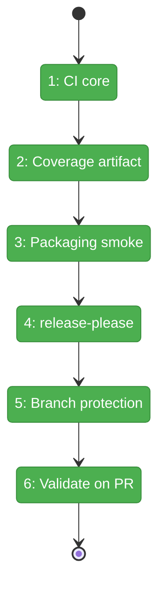
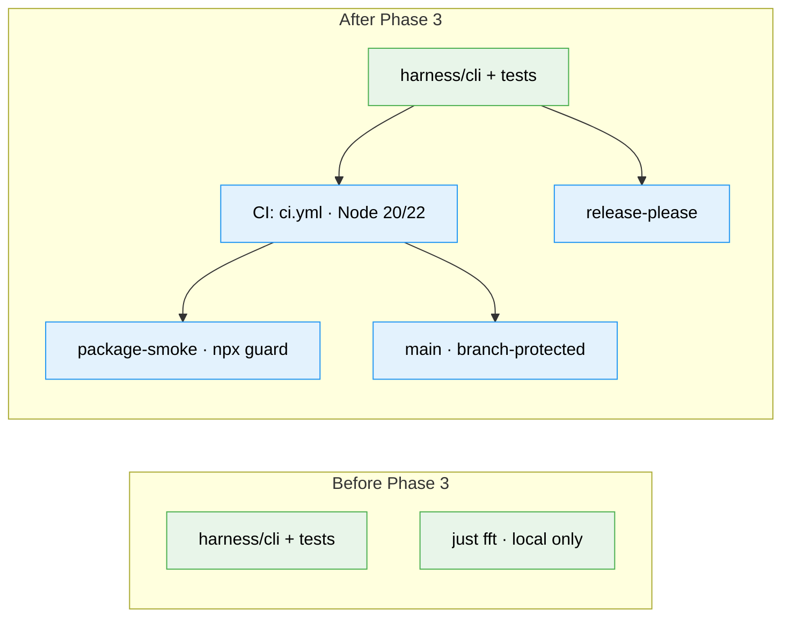

# Flight Plan: Phase 3 — CI, release automation, branch protection

**Plan**: [../../harness-core-plan.md](../../harness-core-plan.md)
**Phase**: Phase 3: CI, release automation, branch protection
**Generated**: 2026-06-08
**Status**: Landed

---

## Departure → Destination

**Where we are**: A working, npx-installable CLI lives in `harness/cli/` (Phases 1–2): full command surface (`help`/`doctor`/`run`/7 slots), ports+fakes, 96 tests / ~92% coverage, all green via `just fft`. The engineering loop (biome + build + vitest+coverage) runs **only locally**. No CI, no release automation, `main` unprotected.

**Where we're going**: Every PR and every push to `main` runs the same checks automatically on Node 20+22; coverage is visible (log summary + `lcov.info` artifact); a packaging smoke proves the `npx`/bin-symlink contract; `release-please` opens semver release PRs (tags + changelog, no npm publish); and `main` is branch-protected so the CI checks must pass before merge.

---

## Domain Context

### Domains We're Changing

| Domain | What Changes | Key Files |
|--------|-------------|-----------|
| repo engineering substrate | Add CI + release automation + branch protection + README docs | `.github/workflows/ci.yml`, `.github/workflows/release.yml`, `release-please-config.json`, `.release-please-manifest.json`, `README.md` |

### Domains We Depend On (no changes)

| Domain | What We Consume | Contract |
|--------|----------------|----------|
| harness-cli (Phases 1–2) | build/lint/test commands, bin entry, coverage output | `npm run build`, `npx biome check harness/cli`, `vitest --coverage` → `harness/cli/coverage/lcov.info`, `bin.harness` |

---

## Flight Status

<!-- Updated by /plan-6-v2: pending → active → done. Use blocked for problems/input needed. -->

**Legend**: grey = pending | yellow = active | red = blocked/needs input | green = done

---

## Stages

<!-- Updated by /plan-6-v2 during implementation: [ ] → [~] → [x] -->

- [x] **Stage 1: Wire CI core** — Node 20+22 matrix running lint → build → typecheck → test+coverage → audit (`.github/workflows/ci.yml` — new).
- [x] **Stage 2: Surface coverage** — text-summary in log + upload `harness/cli/coverage/lcov.info` artifact (`ci.yml`).
- [x] **Stage 3: Packaging smoke** — `package-smoke` job: pack→install→`harness --version`/`doctor` proving the npx/bin-symlink contract (`ci.yml`).
- [x] **Stage 4: Release automation** — `release-please` config + manifest + workflow, no npm publish (`release-please-config.json`, `.release-please-manifest.json`, `release.yml` — new).
- [x] **Stage 5: Protect main** — apply branch protection live (admin confirmed) + document the `gh api` command (`README.md`).
- [x] **Stage 6: Validate end-to-end** — push the PR, capture `gh pr checks` / `gh run view` evidence into the execution log.

---

## Architecture: Before & After

**Legend**: existing (green, unchanged) | changed (orange, modified) | new (blue, created)

---

## Acceptance Criteria

- [x] **AC-13** CI runs on PRs and `main`: build + Biome check + tests + coverage + `npm audit`.
- [x] **AC-14** CI reports test coverage.
- [x] **AC-15** `release-please` configured (config + manifest + workflow), `release-type:node`, semver tags/changelog, no npm publish.
- [x] **AC-16** `main` branch-protected so required CI must pass before merge (documented `gh` step; applied — admin confirmed).
- [x] **(F005 guard)** Packaging smoke installs the packed tarball and runs the `harness` bin (exit 0) — npx contract proven.

## Goals & Non-Goals

**Goals**: CI mirrors local loop; coverage visible; npx contract guarded; semver automated; `main` protected.
**Non-Goals**: npm publish; CLI source/behavior changes; removing `BUILTIN_SLOTS`; coverage thresholds.

---

## Checklist

- [x] T001: `.github/workflows/ci.yml` core — Node 20+22 matrix, lint/build/typecheck/test+coverage/audit.
- [x] T002: Coverage surfacing — text-summary in log + `lcov.info` artifact.
- [x] T003: `package-smoke` job — pack→install→`harness --version`/`doctor` (F005 guard, generic invocation).
- [x] T004: `release-please` config + manifest + `release.yml` (no publish).
- [x] T005: Branch protection on `main` — apply live + document `gh api` command.
- [x] T006: Validate CI end-to-end on the PR — capture `gh` evidence.
