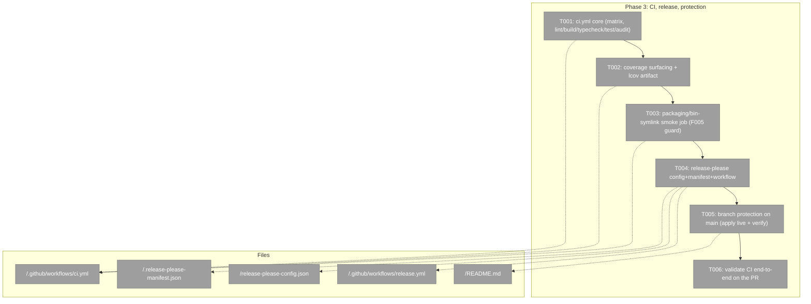
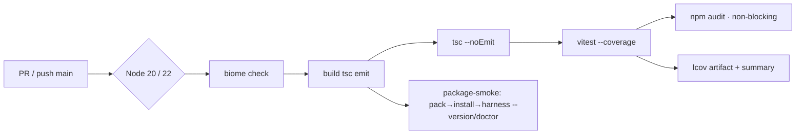
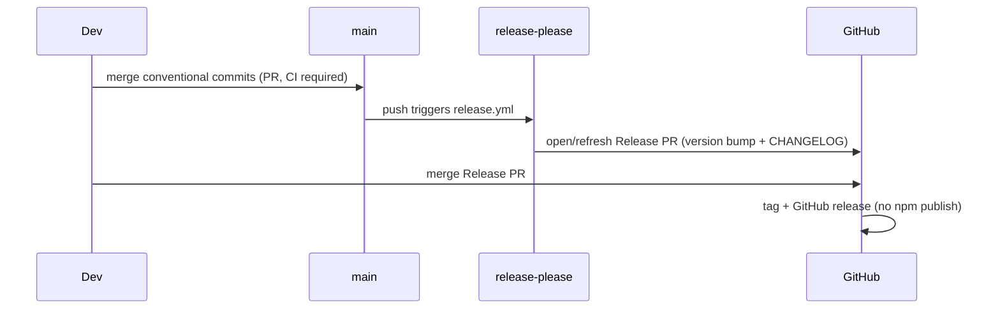

# Phase 3 — CI, release automation, branch protection · Tasks

**Plan**: [../../harness-core-plan.md](../../harness-core-plan.md)
**Phase**: Phase 3: CI, release automation, branch protection
**Generated**: 2026-06-08
**Acceptance**: AC-13..AC-16 (spec)

---

## Executive Briefing

- **Purpose**: Take the engineering loop that already runs locally (`just fft` → biome + build + vitest+coverage) and make it run *for everyone, automatically*, on every PR and on `main` — plus automate semver/changelog and protect `main` so the checks are enforced before merge.
- **What We're Building**: A GitHub Actions CI workflow (`.github/workflows/ci.yml`) on a Node 20+22 matrix; a CI-side packaging smoke that proves the `npx`/bin-symlink contract (the F005 break class); coverage surfaced in the run log + uploaded as an `lcov.info` artifact; `release-please` (config + manifest + workflow) for `release-type:node` (semver tags + changelog, **no npm publish**); and branch protection on `main` requiring the CI checks before merge.
- **Goals**:
  - ✅ CI mirrors local expectations (lint, typecheck, build, test+coverage, audit) on PRs and `main`.
  - ✅ Coverage is visible in CI (text-summary in log + `lcov.info` artifact).
  - ✅ A packaging smoke installs the packed tarball and invokes the `harness` bin generically — guards the F005 npx/bin-symlink contract.
  - ✅ `release-please` opens release PRs from conventional commits; tags + changelog only, no publish.
  - ✅ `main` is branch-protected (CI required) — **applied live** (admin confirmed) and verified via `gh api`.
- **Non-Goals**:
  - ❌ Publishing to npm (explicitly out — AC-15).
  - ❌ Any CLI source/behavior change — this phase is repo-engineering substrate only.
  - ❌ Removing or changing the temporary `BUILTIN_SLOTS` scaffolding (extension-system work, out of scope — see plan Phase 3 forward-note).
  - ❌ Adding coverage **thresholds**/gates (plan R5 — report-only for this young codebase).

---

## Prior Phase Context

### Phase 1 — Package scaffold + engineering kernel (done)

- **A. Deliverables**: Single **root** npm package `harness-engineering` (`package.json`, `type: module`, `engines.node >=20`, `bin.harness → ./harness/cli/dist/index.js`, `files: ["harness/cli/dist","LICENSE"]`); `biome.json` (root, includes `harness/cli/**/*.ts`); `harness/cli/vitest.config.ts` (v8 coverage, reporters **`['text-summary','lcov']`**, `passWithNoTests`, no thresholds); `harness/cli/tsconfig.json`; root `justfile` (`fix`/`format`/`test`/`fft`); output kernel (`output/`, `clock`, `exit`, errors).
- **B. Dependencies Exported (CI consumes)**:
  - Build: `npm run build` = `tsc -p harness/cli/tsconfig.json` → emits `harness/cli/dist`.
  - Lint: `npx biome check harness/cli` (config at repo root).
  - Test+coverage: `cd harness/cli && npx vitest run --coverage` (a.k.a. `npm test`) → `harness/cli/coverage/lcov.info`.
  - Typecheck: `npx tsc --noEmit -p harness/cli/tsconfig.json`.
  - Audit: `npm audit` (root lockfile).
- **C. Gotchas & Debt**: vitest runs with **cwd = `harness/cli`** (the `test` recipe `cd`s there) — any real-file smoke resolves paths relative to `harness/cli`. Coverage is **report-only** (no thresholds — R5).
- **E. Patterns**: explicit working dirs (biome at root, vitest at `harness/cli`); ESM with `.js` import specifiers.

### Phase 2 — CLI command surface + architecture (done)

- **A. Deliverables**: Full command surface — `help`, `doctor`, `run <slot>` dispatcher, + 7 top-level slot commands (factory); adapters (`fs`/`process`/`git`/`env`, each port+node+fake); services (`slots`/`help`/`doctor`/`config`); `app.ts` composition root; **`src/index.ts` thin bin** (shebang `#!/usr/bin/env node`, calls `main()` unconditionally — the **F005** fix so the bin works under any symlink resolution).
- **B. Dependencies Exported**: 96 unit tests, ~92% coverage, all green via `just fft`. `harness doctor` reports a **command-slots layer** (generic) — CI may assert `doctor` exits 0, **not** a fixed slot list.
- **C. Gotchas & Debt (CI-relevant)**:
  - **F005 (most load-bearing for CI)**: an ESM `isMain` guard is FALSE under an npm/npx bin symlink and silently breaks the whole npx contract. `just fft` does **not** catch this — only a real pack+install+invoke does. → **T003 packaging smoke** exists to guard it.
  - `process.exit` only in `output/exit.ts` (enforced by an architecture test).
  - `--json` tri-state resolved once in the entrypoint (`CliIo`); acts never read `program.opts()`.
- **E. Patterns**: ports+fakes; injected `CliIo`; exit map ok/degraded→0, error→1, unconfigured→2.

---

## Pre-Implementation Check

| File | Exists? | Domain | Notes |
|------|---------|--------|-------|
| `.github/workflows/ci.yml` | create | repo eng substrate | New. Node 20+22 matrix; `cache: npm`. |
| `.github/workflows/release.yml` | create | repo eng substrate | New. `googleapis/release-please-action@v4`. |
| `release-please-config.json` | create | repo eng substrate | `release-type: node`, `bump-minor-pre-major`. |
| `.release-please-manifest.json` | create | repo eng substrate | `"."` → `0.1.0` (matches root `package.json`). |
| `README.md` (root) | modify | repo eng substrate | Append branch-protection `gh api` command + CI/release notes. |
| `package.json` (root) | maybe modify | repo eng substrate | Only if a `ci`/`typecheck`/`smoke` script helps; prefer inline workflow steps (KISS). |

**Build env facts (verified)**: bin shebang present (`#!/usr/bin/env node`); `dist` builds; coverage reporters include `lcov` → artifact path **`harness/cli/coverage/lcov.info`**; current version **`0.1.0`**.

**Admin rights (verified)**: the session's `gh` token has **`admin: true`** on `AI-Substrate/harness-engineering` → **branch protection can be APPLIED live** (resolves plan risk R3 / Finding 06 — no "deferred to admin" fallback needed, though we still document the command).

**Agent harness**: No `docs/project-rules/engineering-harness.md` → no agent harness. Implementation uses the **standard testing approach** from the plan (vitest). Harness-loop task rows omitted.

---

## Architecture Map



---

## Tasks

| Status | ID | Task | Domain | Path(s) | Done When | Notes |
|--------|-----|------|--------|---------|-----------|-------|
| [x] | T001 | Add `.github/workflows/ci.yml`: triggers `pull_request` + `push` to `main`; job `build-test` on a Node **20 & 22** matrix with **first step `actions/checkout@v4`**, then `actions/setup-node@v4` (`cache: npm`); steps `npm ci` → `npx biome check harness/cli` → `npm run build` → `npx tsc --noEmit -p harness/cli/tsconfig.json` → `cd harness/cli && npx vitest run --coverage` → `npm audit --audit-level=high \|\| true`. **Also add a final aggregation job `ci-required`** (`needs: [build-test, package-smoke]`, body `run: echo ok`) so branch protection (T005) requires **one stable check name** independent of the Node matrix. | repo eng substrate | `/.github/workflows/ci.yml` | `actionlint`/`gh workflow` parses it; the workflow checks out the repo before `npm ci`; locally each step command runs green (`just fft` already proves lint/build/test); the `ci-required` gather job exists with a fixed name. | Plan 3.1; minih MT-05. Audit is **non-blocking** (`\|\| true`) — surfaces advisories without failing PRs (R-audit). The `ci-required` gather job is the documented stable required-check name (resolves the matrix check-name ambiguity flagged in validation). |
| [ ] | T002 | Surface coverage in CI: ensure the vitest **text-summary** prints in the job log, and upload `harness/cli/coverage/lcov.info` via `actions/upload-artifact@v4` (name `coverage-lcov-node${{ matrix.node }}`). | repo eng substrate | `/.github/workflows/ci.yml` | A CI run shows a coverage summary in the log and a downloadable `lcov.info` artifact. | Plan 3.2; Spec AC-14; Finding 03. Reporters already `['text-summary','lcov']` — no config change needed. |
| [ ] | T003 | Add a **packaging smoke** job `package-smoke` to `ci.yml` (needs: `build-test`): `npm ci` → `npm run build` → `npm pack` → install the resulting tarball into a temp dir (`npm i -g ./*.tgz` or `npm i --prefix "$tmp" ./*.tgz`) → invoke the installed **`harness`** bin **generically**: `harness --version` (exit 0) and `harness doctor` (exit 0, prints the command-slots layer). Assert exit codes; **do not** assert any slot list. | repo eng substrate | `/.github/workflows/ci.yml` | Job packs, installs from the tarball, and the installed `harness` bin runs (exit 0) — proving the bin-symlink/npx contract end-to-end. | **Derived from companion F005 + spec's core npx-install requirement**; augments Plan 3.1. **Forward-note compliance**: generic invocation only — never assert the temporary `BUILTIN_SLOTS` set (plan Phase 3 forward-note / Constitution P10). |
| [ ] | T004 | Add release automation: `release-please-config.json` (`release-type: node`, `bump-minor-pre-major: true`, `"."` package), `.release-please-manifest.json` (`"."` → `0.1.0`), and `.github/workflows/release.yml` (`on: push: branches:[main]`, `permissions: contents:write + pull-requests:write`, steps: **`actions/checkout@v4`** then `googleapis/release-please-action@v4`). **No npm publish step.** | repo eng substrate | `/release-please-config.json`, `/.release-please-manifest.json`, `/.github/workflows/release.yml` | Workflow parses and checks out the repo before the release-please action; config/manifest are valid JSON with version matching root `package.json` (`0.1.0`); a conventional-commit push to `main` would open a release PR; no publish step present. | Plan 3.3; Spec AC-15; minih MT-04. Manifest version MUST track `package.json`. |
| [ ] | T005 | Apply **branch protection** on `main` via a documented `gh api` step requiring the stable **`ci-required`** check (the T001 aggregation job) + a PR before merge. **Admin confirmed → apply live**, then verify with `gh api repos/AI-Substrate/harness-engineering/branches/main/protection`. Record the exact command in `README.md`. | repo eng substrate | `/README.md` (+ live `gh api` call) | `gh api .../branches/main/protection` returns the protection with the `ci-required` check required; the command is documented in README. | Plan 3.4; Spec AC-16; Finding 06 / R3 **resolved** (admin: true). Requiring the **`ci-required` gather job** (not `build-test (20)`/`(22)`) gives a matrix-independent context name — closes the check-name-matching risk surfaced in validation (thesis + forward-compat). Confirm the exact context string with `gh pr checks` in T006. |
| [ ] | T006 | Validate the CI path **end-to-end** on the feature PR: push the branch, ensure a PR exists, then capture evidence with `gh` — `gh pr checks` shows the CI jobs (`build-test` ×matrix, `package-smoke`, `ci-required`) completing; `gh run view --log` shows the coverage summary; the `lcov.info` artifact is listed (`gh run view --json`/`gh api .../artifacts`). | repo eng substrate | (CI run / PR — observational, captured via `gh`) | `gh pr checks` lists the CI workflow's jobs as completed; coverage summary appears in the job log; `lcov.info` artifact is present. Capture the command outputs into `execution.log.md` as physical evidence. | Plan 3.5; Spec AC-13,14. Evidence is **concrete & automatable via `gh`** (not a pure eyeball). Confirm the `ci-required` context string from `gh pr checks` matches what T005 protected; fix T005 if it drifted. |

> **Harness-loop rows omitted**: no agent-harness governance doc exists → standard vitest testing; `/harness-*` boot/retro rows not applicable.

---

## Context Brief

**Key findings from plan (Phase 3 relevant)**:
- **Finding 03** (coverage visibility): surface coverage in CI — text-summary + lcov artifact (T002).
- **Finding 06 / R3** (branch protection needs admin): **resolved this session** — token has `admin: true`, so apply live (T005).
- **Companion F005** (bin-symlink/npx break): not caught by `just fft`; needs a real pack+install+invoke → packaging smoke (T003).
- **R5** (coverage gating): report-only, **no thresholds** — do not add a coverage gate.
- **Phase 3 forward-note / Constitution P10** (verbs are dynamic): CI/smoke must exercise `doctor`/`help` generically, never assert the hardcoded `BUILTIN_SLOTS` set (T003).

**Domain**: `repo engineering substrate` only — no `docs/domains/` registry entry is touched; this phase adds CI/release config + a README note. No CLI source/contract changes.

**Domain constraints**: do not modify `harness/cli/src/**` behavior; keep biome-at-root / vitest-at-`harness/cli` working-dir split; keep coverage report-only.

**Agent harness context**: No agent harness configured. Agent will use the standard testing approach from the plan (vitest + `gh`-captured CI evidence).

**Reusable from prior phases**:
- Exact local commands (verified): `npm ci`, `npx biome check harness/cli`, `npm run build`, `npx tsc --noEmit -p harness/cli/tsconfig.json`, `cd harness/cli && npx vitest run --coverage`, `npm audit`.
- `just fft` (green) for the local mirror of CI's lint/build/test.
- Coverage artifact path: `harness/cli/coverage/lcov.info`.

**Mermaid — CI flow**:


**Mermaid — release + protection sequence**:


---

## Discoveries & Learnings

_Populated during implementation by plan-6._

| Date | Task | Type | Discovery | Resolution | References |
|------|------|------|-----------|------------|------------|

---

## Directory Layout

```
docs/plans/004-harness-core/
  ├── harness-core-plan.md
  └── tasks/phase-3-ci-release-automation-branch-protection/
      ├── tasks.md            (this file)
      ├── tasks.fltplan.md
      └── execution.log.md    (created by plan-6)
```

**STOP** — dossier only. Awaiting human GO before implementation (`/plan-6`).

---

## Validation Record (2026-06-08)

### Validation Thesis

**Raison d'être**: Make the local engineering loop (biome + build + vitest+coverage + audit) enforceable for everyone via CI, automate semver via release-please (no npm publish), protect `main`, and continuously prove the npx/bin-symlink contract (the F005 break class `just fft` can't catch).

**Value claim**: Every PR/`main` push is auto-checked; releases are automated; `main` can't merge red; the npx contract is guarded by a packaging smoke.

**Artifact promise**: An implementation agent can build Phase 3 with minimal clarification — exact CI commands, paths, job names, release-please config, and the branch-protection command are specified and grounded in verified repo facts.

**Intended beneficiaries**: future contributors/agents (fast CI feedback), reviewers (review compression), the merge step (`/plan-8`), and npx end users.

**Proof target**: Implementation (dossier buildable with minimal clarification); the phase reaches Validated Evidence via T006 (real CI run captured with `gh`).

**Evidence standard**: verified commands/paths/config; admin-rights confirmation for branch protection; a smoke that genuinely exercises the bin-symlink path.

**Thesis source**: `docs/plans/004-harness-core/harness-core-spec.md` (+ plan Phase 3 section).

**Thesis verdict**: Advanced.

**Main thesis risk**: Branch-protection required-check context must match GitHub's real check name — mitigated by the stable `ci-required` aggregation job (T001/T005) + `gh pr checks` confirmation (T006).

---

| Agent | Lenses Covered | Thesis Axes Covered | Issues | Verdict |
|-------|---------------|---------------------|--------|---------|
| Source-Truth | Source Truth, Technical Constraints, Deployment & Ops | Evidence Sufficiency | 0 (independently re-verified by orchestrator) | ✅ |
| Cross-Reference + Completeness | Integration & Ripple, Hidden Assumptions, Edge Cases, Deployment & Ops, Concept Docs | Downstream Usefulness | 2 MEDIUM + 1 LOW, all fixed | ⚠️ → ✅ |
| Thesis Alignment | Thesis Alignment, Evidence Sufficiency, Proof-Level Fit | Thesis Alignment, Proof-Level Fit | 0 | ✅ |
| Forward-Compatibility | Forward-Compatibility, Domain Boundaries | Safety to Change, Contract Integrity | 0 | ✅ |

**Lens coverage**: 10/15 (Thesis Alignment ✓, Forward-Compatibility ✓, Evidence Sufficiency, Proof-Level Fit, Technical Constraints, Integration & Ripple, Hidden Assumptions, Edge Cases, Deployment & Ops, Domain Boundaries).

### Forward-Compatibility Matrix

| Consumer | Requirement | Failure Mode | Verdict | Evidence |
|----------|-------------|--------------|---------|----------|
| `/plan-8` merge | Green CI on PR + stable required-check name + `main` still mergeable | contract drift / lifecycle ownership | ✅ | `ci-required` gather job gives a matrix-independent context (T001/T005); T006 confirms via `gh pr checks`; protection requires the check to pass, which it will once CI is green. |
| Extension system (future) | CI/smoke must not hardcode `BUILTIN_SLOTS` | test boundary / encapsulation lockout | ✅ | T003 invokes `harness --version`/`doctor` generically, "do not assert any slot list"; forward-note enforces it. |
| Release / npx-pin consumer | semver tags for `#vX.Y.Z`, no npm publish | contract drift | ✅ | T004 `release-type: node`, manifest `"."`→`0.1.0`, "No npm publish step"; matches spec release model. |

### Fixes Applied (this validation)

- **MEDIUM** (T001): added `actions/checkout@v4` as the first CI step (a workflow without checkout can't `npm ci`).
- **MEDIUM** (T004): added `actions/checkout@v4` before `release-please-action`.
- **LOW / residual risk** (T001/T005/T006): added a stable **`ci-required`** aggregation job (`needs: [build-test, package-smoke]`) so branch protection requires one matrix-independent check name — closes the check-name-matching risk both the Thesis and Forward-Compat agents named.

**Thesis alignment**: Value claim advanced at the Implementation proof level with strong evidence; the only residual risk (check-name matching) is now structurally mitigated by the `ci-required` gather job.

**Outcome alignment**: "Build a small, well-structured, agent-friendly Node CLI — the front door to this repo's engineering harness — installable via npx straight from the repo URL." The dossier, as written, advances it.

**Standalone?**: No — downstream consumers exist (`/plan-8` merge, future extension system, release/npx-pin consumers); Forward-Compatibility engaged.

Overall: ⚠️ VALIDATED WITH FIXES
