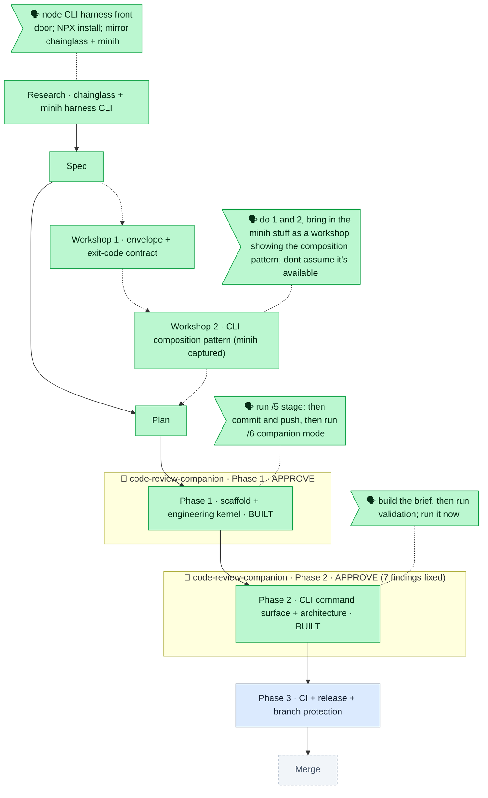

# Flight plan — harness-core

> Generated from `the-flow.json`. Do not hand-edit; regenerated each `/the-flow` turn.

**Legend**: 🟩 done · 🟧 in progress · 🟥 blocked · 🟦 known (designed) · ⬜ assumed (speculative) · 🗣 your words · 🤖 companion (wraps phases) · worker (side build)

**Now**: Phase 2 BUILT + companion-reviewed (7 findings, all fixed) → **Next**: Phase 3 tasks (`/plan-5`)
