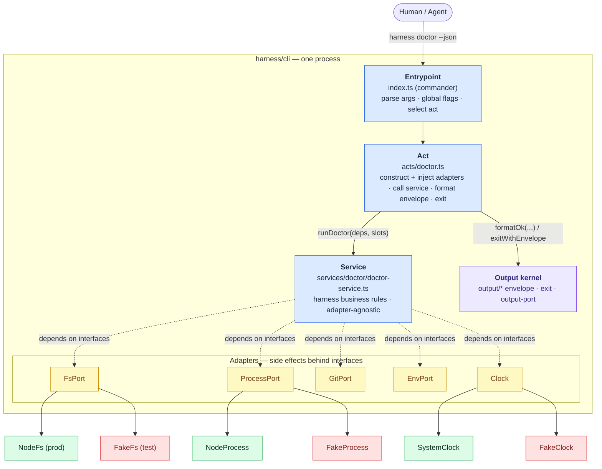
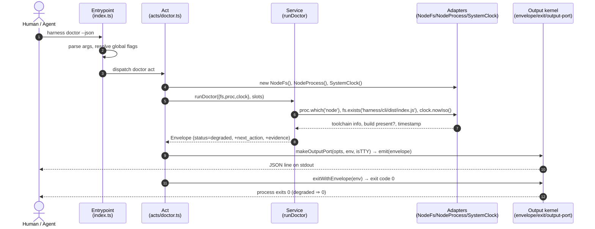
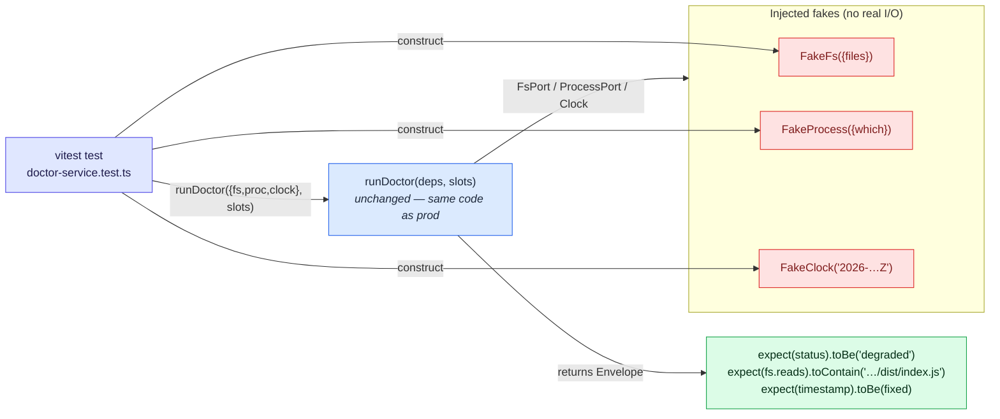

# Workshop: CLI composition pattern (entrypoint → act → service → adapter)

**Type**: Integration Pattern
**Plan**: 004-harness-core
**Spec**: [../harness-core-spec.md](../harness-core-spec.md)
**Created**: 2026-06-08
**Status**: Approved

**Value Thesis**: This workshop captures the proven `minih` clean-architecture composition pattern *as knowledge in this repo*, so implementation can build the harness CLI from this document alone — without assuming the `minih` source tree is available at build time. It fixes the layering, the dependency-injection mechanism, the adapter set, and the fake-adapter testing seam that every command and every future extension will reuse.
**Target Proof Level**: Implementation Ready
**Current Proof Level**: Implementation Ready

**Selected Value Axes**:
- **Implementation Readiness**: the folder tree, layer responsibilities, and code skeletons are directly buildable.
- **Learning Compounding**: encodes the minih pattern here so the knowledge survives without the external repo.
- **Safety to Change**: the adapter seam means future extensions add behaviour without touching command parsing.
- **Agent Readiness**: a fresh agent can place new code in the right layer without re-discovering the architecture.

**Related Documents**:
- [001-output-envelope-and-exit-codes.md](./001-output-envelope-and-exit-codes.md) — the contract the entrypoint renders + exits with.
- [../research-dossier.md](../research-dossier.md) — Reference Pattern 1 (minih architecture).

**Domain Context**:
- **Primary Domain**: harness-cli (this *is* the CLI's internal architecture).
- **Related Domains**: repo engineering substrate (vitest exercises the services/acts via fakes).

---

## Purpose

Specify how the harness CLI is layered and wired so that command handlers stay thin, business logic is unit-testable without real fs/shell/git, and external side effects sit behind injected adapters. This is the architecture Phase 2 implements, and the seam the later extension system plugs into.

## Fresh Entrant Outcome

A fresh human or agent should reach **Implementation Ready** from this doc alone. They should be able to:

- Lay out `harness/cli/src/` with the four layers in the right folders.
- Write a new command end-to-end: entrypoint registration → act → service → adapter, returning an `Envelope`.
- Inject a fake adapter into a service and assert on its call history in a vitest unit test.
- Know which adapters ship in this slice and which are deferred.

## Key Questions Addressed

1. What are the four layers and exactly what does each own?
2. How is dependency injection done (no DI container — parameter injection)?
3. Which adapters ship now (fs/process/git/env/clock) vs later (http/server/telemetry)?
4. One fake per adapter, or a shared fake factory?
5. How does a future extension register/override a command slot without reshaping the core?

---

## Value Frame

| Field | Selection | Why It Matters |
|-------|-----------|----------------|
| Target Proof Level | Implementation Ready | Phase 2 builds the layering directly from this doc. |
| Primary Value Axis | Implementation Readiness | Folder tree + skeletons are the build spec. |
| Supporting Value Axes | Learning Compounding, Safety to Change, Agent Readiness | Encodes the external pattern; protects the parsing layer; guides placement. |
| Downstream Loop Improved | Implementation + Testing + Agent execution | Right-layer placement and a ready test seam, with no external-repo dependency. |

---

## The pattern, captured from `minih` (so we don't assume it's on disk)

`minih` is a TypeScript+ESM Node CLI whose architecture we mirror. The essential, verbatim shape of its layers (sources cited so this is auditable, but the knowledge below is self-contained):

**Entrypoint** — one composition root registers every command and owns global flags (`src/cli/index.ts`):
```ts
const program = new Command()
  .name('minih')
  .version(version)
  .option('--agents-dir <path>', 'Agents directory', 'agents');

program.hook('preAction', (thisCommand) => {           // resolve a global flag once
  const opts = thisCommand.opts();
  if (opts.agentsDir) opts.agentsDir = path.resolve(opts.agentsDir);
});

registerListCommand(program);                          // each command self-registers
registerDoctorCommand(program);
// …
program.parse();
```

**Act** — a thin `register<X>Command` wires the command: read flags, call a service, format an envelope, exit (`src/cli/commands/list.ts`):
```ts
export function registerListCommand(program: Command): void {
  program.command('list').description('List available agent definitions')
    .action(() => {
      const agentsDir = program.opts().agentsDir ?? 'agents';
      const agents = listAgents(agentsDir);            // <-- service call (the logic)
      if (!process.stdout.isTTY) {                     // piped -> JSON envelope
        exitWithEnvelope(formatSuccess('list', { agents, count: agents.length }));
      }
      // …else render a human table to stderr, then exit with the same envelope
    });
}
```

**Service** — business logic, adapter-agnostic, receives its dependencies as parameters (`src/runner/*`):
```ts
// runner is "adapter-agnostic. It calls adapter.run() ... Tests inject FakeAgentAdapter."
export async function runAgent(adapter: IAgentAdapter, def, config, …) { /* logic */ }
```

**Adapter** — an interface wrapping a side effect, with a production impl and a fake (`src/adapter/interface.ts`, `fake.ts`):
```ts
export interface IAgentAdapter { run(o: AgentRunOptions): Promise<AgentResult>; /* … */ }

export class FakeAgentAdapter implements IAgentAdapter {
  private _runHistory: AgentRunOptions[] = [];
  async run(options: AgentRunOptions): Promise<AgentResult> {
    this._runHistory.push({ ...options });             // record calls for assertions
    /* return configured fake result */
  }
  getRunHistory() { return this._runHistory; }
}
```

**The five takeaways we adopt verbatim**:
1. One CLI composition root; commands self-register.
2. Acts are thin: flags → service → envelope → exit. No logic.
3. Services take adapters as **plain parameters** (no DI container).
4. Every adapter has an interface + a fake that records call history.
5. Tests inject fakes and assert on history.

---

## Our layering

### Composition at a glance



**How to read it**: the arrow of control flows down (entrypoint → act → service); the service depends **only on the port interfaces** (dashed), never on Node impls. Each port has a production impl (green) and a fake (red) — tests swap the fakes in without touching any other layer. The act is the only place that constructs concrete adapters and renders the envelope.

### Folder tree (Phase 2 target)

```
harness/cli/
├── src/
│   ├── index.ts                  # ENTRYPOINT: commander root, global flags, register all acts
│   ├── acts/                     # ACTS: one file per command slot
│   │   ├── help.ts
│   │   ├── doctor.ts
│   │   └── unconfigured-slot.ts  # factory: builds run/validate/build/lint/test/smoke/health/observe
│   ├── services/                 # SERVICES: business logic, adapters injected
│   │   ├── doctor/
│   │   │   └── doctor-service.ts
│   │   ├── slots/
│   │   │   └── slot-registry.ts  # the command-slot map (extension seam)
│   │   └── config/
│   │       └── load-config.ts    # validate command-map/config before use
│   ├── adapters/                 # ADAPTERS: side effects behind interfaces
│   │   ├── fs/        { fs-port.ts, node-fs.ts, fake-fs.ts }
│   │   ├── process/  { process-port.ts, node-process.ts, fake-process.ts }
│   │   ├── git/      { git-port.ts, exec-git.ts, fake-git.ts }
│   │   ├── env/      { env-port.ts, node-env.ts, fake-env.ts }
│   │   └── clock/    { clock-port.ts, system-clock.ts, fake-clock.ts }
│   └── output/                   # OUTPUT KERNEL (Phase 1): envelope, exit, error-codes, output-port
│       ├── envelope.ts
│       ├── exit.ts
│       ├── error-codes.ts
│       └── output-port.ts
├── test/                         # vitest unit tests (mirror src/ layout)
├── package.json? (NO — manifest is at REPO ROOT; see spec Phase 1 AC-1)
├── tsconfig.json
├── biome.json?  (NO — biome at repo root; see Phase 1)
└── README.md
```

> Reminder (spec AC-1): the **npm manifest is the repo-root `package.json`** with `bin → ./harness/cli/dist/index.js` and `"prepare": "npm run build"`. All *source* lives here under `harness/cli/`.

### Layer responsibilities

| Layer | Owns | Must NOT |
|-------|------|----------|
| **Entrypoint** (`index.ts`) | Parse args (commander), resolve global flags once, select an act, render via OutputPort, `exitWithEnvelope`. | Contain business logic; touch fs/process/git directly. |
| **Acts** (`acts/*`) | Read parsed flags, construct adapters (or receive them), call a service, turn the result into an `Envelope`. | Implement harness logic; format raw strings instead of envelopes. |
| **Services** (`services/*`) | All harness business rules: doctor checks, slot lookup, config validation, unconfigured handling. Receive adapters as params. | Import Node `fs`/`child_process` directly; call `process.exit`. |
| **Adapters** (`adapters/*`) | Wrap exactly one external resource behind an interface; provide a node impl + a fake. | Contain business rules. |

---

## Dependency injection: parameter injection (no container)

Like minih, we use **plain parameter/constructor injection** — no DI framework.

### Runtime flow: `harness doctor --json`



```ts
// services/doctor/doctor-service.ts
import type { FsPort } from '../../adapters/fs/fs-port.js';
import type { ProcessPort } from '../../adapters/process/process-port.js';
import type { Clock } from '../../adapters/clock/clock-port.js';
import { formatOk, type Envelope } from '../../output/envelope.js';

export interface DoctorDeps { fs: FsPort; proc: ProcessPort; clock: Clock; }

export function runDoctor(deps: DoctorDeps, slots: SlotRegistry): Envelope {
  const layers = [
    checkToolchain(deps.proc),        // Layer 0
    checkCliBuild(deps.fs),           // Layer 1
    checkCommandSlots(slots),         // Layer 2
  ];
  const anyFail = layers.some((l) => !l.ok);
  return formatOk('doctor', { layers }, deps.clock, {
    status: anyFail ? 'degraded' : 'ok',
    evidence: [{ label: 'doctor report', none: true }],
    next_action: anyFail ? 'Run `harness help` to see the slot map.' : undefined,
  });
}
```

The **act** is where real adapters are constructed and injected:

```ts
// acts/doctor.ts
import { Command } from 'commander';
import { NodeFs } from '../adapters/fs/node-fs.js';
import { NodeProcess } from '../adapters/process/node-process.js';
import { SystemClock } from '../adapters/clock/system-clock.js';
import { runDoctor } from '../services/doctor/doctor-service.js';
import { loadSlotRegistry } from '../services/slots/slot-registry.js';
import { exitWithEnvelope } from '../output/exit.js';
import { makeOutputPort } from '../output/output-port.js';

export function registerDoctorAct(program: Command): void {
  program.command('doctor').description('Report harness readiness and command slots')
    .action(() => {
      const deps = { fs: new NodeFs(), proc: new NodeProcess(), clock: new SystemClock() };
      const slots = loadSlotRegistry(deps.fs);
      const env = runDoctor(deps, slots);
      const io = makeOutputPort(program.opts(), process.env, process.stdout.isTTY);
      exitWithEnvelope(env, io);
    });
}
```

> The service `runDoctor` never imports Node `fs` — it only knows `FsPort`. That is what makes it unit-testable.

---

## Adapter set

### Ships in this slice

| Adapter | Port (interface) | Node impl | Wraps |
|---------|------------------|-----------|-------|
| **fs** | `FsPort` | `NodeFs` | `node:fs` reads/exists (e.g. is `dist/` built?, read config). |
| **process** | `ProcessPort` | `NodeProcess` | spawn/`which` for toolchain checks (read-only in this slice). |
| **git** | `GitPort` | `ExecGit` | `git rev-parse`, branch — used by doctor (informational). |
| **env** | `EnvPort` | `NodeEnv` | read env vars (e.g. `HARNESS_JSON`). |
| **clock** | `Clock` | `SystemClock` | `nowIso()` for envelope timestamps (deterministic in tests). |

### Deferred (do NOT build now — spec non-goals)

| Adapter | Why deferred |
|---------|--------------|
| **http/server** | No app to talk to yet (harness-loop work). |
| **telemetry** | `observe` behaviour is out of scope. |

> The interfaces are designed so deferred adapters can be added later without touching existing services.

### Port + impl + fake (worked example: fs)

```ts
// adapters/fs/fs-port.ts
export interface FsPort {
  exists(path: string): boolean;
  readText(path: string): string | null;
}

// adapters/fs/node-fs.ts
import * as fs from 'node:fs';
export class NodeFs implements FsPort {
  exists(p: string) { return fs.existsSync(p); }
  readText(p: string) { try { return fs.readFileSync(p, 'utf8'); } catch { return null; } }
}

// adapters/fs/fake-fs.ts
export class FakeFs implements FsPort {
  readonly reads: string[] = [];
  constructor(private files: Record<string, string> = {}) {}
  exists(p: string) { this.reads.push(p); return p in this.files; }
  readText(p: string) { this.reads.push(p); return this.files[p] ?? null; }
}
```

---

## Fake strategy: one fake per adapter

**Decision**: one hand-written fake **per adapter** (mirrors minih's `FakeAgentAdapter`), each recording call history on public arrays/getters. **No shared fake factory** in this slice (only 5 small adapters; a factory adds indirection without payoff). Revisit if the adapter count grows.

### Test wiring: same service, fakes swapped in



The service binary is identical in prod and test — only the adapter implementations differ. `FakeClock` makes `timestamp` deterministic; `FakeFs.reads` lets the test assert *which* paths the service probed.

### Worked unit test (service + fake, no real fs)

```ts
// test/services/doctor-service.test.ts
import { describe, it, expect } from 'vitest';
import { runDoctor } from '../../src/services/doctor/doctor-service.js';
import { FakeFs } from '../../src/adapters/fs/fake-fs.js';
import { FakeProcess } from '../../src/adapters/process/fake-process.js';
import { FakeClock } from '../../src/adapters/clock/fake-clock.js';
import { loadSlotRegistry } from '../../src/services/slots/slot-registry.js';

describe('runDoctor', () => {
  it('reports degraded when the cli build is missing', () => {
    const fs = new FakeFs({ /* no dist/ present */ });
    const deps = { fs, proc: new FakeProcess({ which: { node: '/usr/bin/node', just: '/bin/just' } }),
                   clock: new FakeClock('2026-06-08T07:20:00.000Z') };
    const env = runDoctor(deps, loadSlotRegistry(fs));

    expect(env.status).toBe('degraded');
    expect(env.timestamp).toBe('2026-06-08T07:20:00.000Z');   // deterministic via FakeClock
    expect(env.next_action).toBeDefined();                     // required on non-ok
    expect(fs.reads).toContain('harness/cli/dist/index.js');   // assert on call history
  });
});
```

This is the whole point of the architecture: a real business assertion with **zero** real fs/process/clock access.

---

## The extension seam (shape only — loader is out of scope)

The later extension system must fill command slots **without reshaping the core**. We provide the seam now: a **slot registry**.

```ts
// services/slots/slot-registry.ts
export type SlotStatus = 'configured' | 'unconfigured';

export interface CommandSlot {
  name: string;                 // 'run' | 'validate' | 'build' | 'lint' | 'test' | 'smoke' | 'health' | 'observe'
  status: SlotStatus;
  next_action: string;          // shown when unconfigured
  // FUTURE (extension system): handler?: (ctx) => Envelope;  // <- the only field extensions add
}

const BUILTIN_SLOTS: CommandSlot[] = [
  { name: 'run',      status: 'unconfigured', next_action: 'No command mapped to this slot yet. Provided later by an extension.' },
  { name: 'validate', status: 'unconfigured', next_action: 'No validation sequence mapped yet.' },
  // … build, lint, test, smoke, health, observe
];

export function loadSlotRegistry(_fs: FsPort): SlotRegistry { /* returns BUILTIN_SLOTS now;
  later reads repo-local extension config via fs and merges handlers */ }
```

- **Now**: every slot is `unconfigured`; the `unconfigured-slot` act renders `formatUnconfigured(name, slot.next_action, clock)` → exit `2`.
- **Later**: the extension loader merges a `handler` onto a slot; the same act calls the handler instead. The core's acts/services/output do **not** change — only the registry's source of slots does.

### Forward-compatibility with a pi-style extension system (checked, OOS to build)

A survey of the pi extension system (microkernel / plugin architecture: discovery → load/collect → bind real services → emit/dispatch; capability injection via a `pi` façade + lazy-getter `ctx`; runtime module substitution) was reviewed against this design. **Conclusion: nothing here precludes that model; no unpick is required.** Mapping:

| pi concept | This design's seam |
|------------|--------------------|
| Repo-local discovery (`.pi/extensions/*`, one level, dedup by path) | `loadSlotRegistry(fs)` already takes `FsPort`; a future loader scans e.g. `.harness/extensions/` |
| Collect phase vs dispatch phase | commander `register*Act` (collect) vs `.action()` (dispatch) is already this split |
| Capability injection into plugins (`pi`/`ctx`) | Our **ports** (fs/process/git/env/clock) are exactly the capabilities a plugin `ctx` façade would expose — Hexagonal makes this natural |
| Core-internal DI (parameter injection) | Our adapter→service injection — a *separate* layer that coexists with capability injection |
| Handler returns a tagged-union/patch | Our handlers return an `Envelope` |
| Module loader behind substitutable resolution (jiti alias/virtualModules) | Would be a `ModuleLoaderPort` adapter — fits the ports rule |

**Two invariants to hold now so we never unpick** (promoted to the constitution):
1. **Runtime deps discipline** — anything needed at runtime inside a *user's* repo (the future loader, a transpiler like `jiti`) must live in `dependencies`, never `devDependencies` (distributed/`npx` installs run `--omit=dev`).
2. **Registry openness stays neutral** — see Q4.


```ts
// acts/unconfigured-slot.ts — one factory builds all 8 stub acts today
export function registerSlotAct(program: Command, slot: CommandSlot): void {
  program.command(slot.name).option('--dry-run', 'Show intended behaviour without executing')
    .action(() => {
      const clock = new SystemClock();
      const env = slot.status === 'unconfigured'
        ? formatUnconfigured(slot.name, slot.next_action, clock)
        : /* FUTURE: slot.handler(ctx) */ formatUnconfigured(slot.name, slot.next_action, clock);
      exitWithEnvelope(env, makeOutputPort(program.opts(), process.env, process.stdout.isTTY));
    });
}
```

---

## Decision Space

| Option | Description | Pros | Cons | Decision |
|--------|-------------|------|------|----------|
| DI container (inversify etc.) | Framework-managed deps | Auto-wiring | Overkill for 5 adapters; indirection | **Rejected** |
| Parameter injection | Pass adapters as args | Simple, explicit, matches minih | Manual wiring in acts | **Selected** |
| One fake per adapter | Hand-written fakes | Clear, records history | Slight duplication | **Selected** |
| Shared fake factory | Generated fakes | Less code | Indirection; premature for 5 adapters | Rejected (revisit later) |
| Slots as hardcoded acts | 8 separate stub files | Explicit | Repetitive; harder to extend | Rejected |
| Slot registry + factory act | Data-driven slots | One seam for extensions; less code | One indirection | **Selected** |

## Evidence Ledger

| Evidence | Location | Supports | Status |
|----------|----------|----------|--------|
| Folder tree | This doc | Phase 2 layout | Ready |
| Layer responsibility table | This doc | Thin-handler AC | Ready |
| doctor service+act skeleton | This doc | DI mechanism | Ready |
| fs port/impl/fake | This doc | Adapter pattern | Ready |
| Worked vitest test with fakes | This doc | Fake-adapter testing AC | Ready |
| Slot registry + factory act | This doc | Unconfigured-slot AC + extension seam | Ready |
| 3 mermaid diagrams (layered composition, doctor runtime sequence, test fake-injection) | This doc | Architecture comprehension / placement | Ready |

## Attention Reduction

| Future Loop | Before Workshop | After Workshop |
|-------------|-----------------|----------------|
| Implementation | "Where does this code go? How is DI done? Is minih even here?" | Folder tree + skeletons; pattern captured locally. |
| Review | Re-derive layering rules per PR | Check against the layer table. |
| Testing | Invent a mocking approach | Copy the fake-injection test. |
| Extension work (later) | Risk reshaping the core to add slots | Slot registry is the pre-built seam. |

## Validation / Acceptance

This workshop reaches Implementation Ready when:

- A developer can scaffold `harness/cli/src/` from the folder tree and place new code correctly.
- `runDoctor` (or any service) can be unit-tested with fakes and **no** real fs/process/clock.
- All 8 unconfigured slots are produced by the registry + factory act (no per-slot files).
- The extension seam requires no change to acts/services/output to later add a handler.
- Nothing here requires the `minih` repo to be present.

## Open Questions

### Q1: One fake per adapter, or shared factory?
**RESOLVED**: One fake per adapter for this slice (5 small adapters). Revisit a factory only if the count grows substantially.

### Q2: Do acts construct adapters, or does the entrypoint?
**RESOLVED**: Acts construct the concrete adapters and inject them into services. The entrypoint only wires acts + global flags. (Keeps the entrypoint free of side-effect construction; keeps services pure.)

### Q3: Does the slot registry read repo config now?
**RESOLVED**: No. `loadSlotRegistry` returns the built-in unconfigured slots in this slice. Reading repo-local extension config is deferred to the extension system; the `FsPort` parameter is already in the signature so that addition is non-breaking.

### Q4: Is the command registry open (extensions add new commands) or closed (extensions only fill the 8 known slots)?
**DEFERRED — stay neutral (user decision 2026-06-08)**: Do **not** preclude either. The 8 `BUILTIN_SLOTS` are modelled as a **seed set**, not a closed universe — `SlotRegistry` is a list keyed by `name`, so a future loader could either flip a known slot's `status` (closed-style) *or* append a new `CommandSlot` (open-style) without a schema change. **Implementation guardrail**: do not write code or types that assume the slot set is fixed at exactly these 8 (e.g. no `type SlotName = 'run' | 'validate' | …` union used as the registry's only key; keep `name: string`). The pi-style "first registration wins / auto-suffix duplicates" question is left to the extension system. This keeps both doors open at zero cost now.
