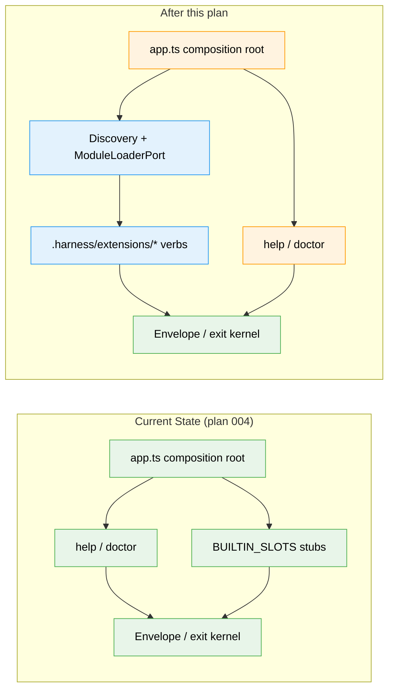

# Flight Plan: Harness Extension System

**Spec**: [harness-extension-system-spec.md](./harness-extension-system-spec.md)
**Plan**: Pending — run `/plan-3` (a WS-A workshop is recommended first)
**Generated**: 2026-06-08
**Status**: Specifying

---

## The Mission

**What we're building**: The extensibility surface for the harness CLI. Today the npx-installed `harness` core ships with only stub verbs. After this, a developer drops an extension into their repo's **`.harness/extensions/`** folder and it's **discovered + loaded at runtime** — contributing a real `harness <verb>` with its own `--help`, options, structured output, and exit codes. Each verb wraps a real repo command.

**Why it matters**: This is the focal point of the whole harness idea — making it *super easy* for a team to extend their engineering harness, so fixes get encoded into a discoverable CLI instead of scattered docs. The harness will then be **dogfooded** on this very repo.

---

## Where We Are → Where We're Headed

```
TODAY (harness core, plan 004):        AFTER this plan:
help + doctor work; verbs are stubs    extensions own the verbs; core stays small

🔵 help / doctor (core)                🟢 help / doctor (core, now extension-aware)
🟡 8 BUILTIN_SLOTS (unconfigured)      🔴 BUILTIN_SLOTS removed (P10)
❌ no .harness/extensions discovery    🔴 .harness/extensions/ discovered at runtime (NEW)
❌ verb surface is hardcoded            🔴 verb contract — each extension = a harness verb (NEW)
❌ no module loader                     🔴 ModuleLoaderPort + discovery service (NEW)
🔵 Envelope / exit kernel              🔵 Envelope / exit kernel (unchanged — reused)
```



**Legend**: existing (green, unchanged) | changed (orange, modified) | new (blue, created)

---

## Scope

**Goals**:
- Repo-local `.harness/extensions/` discovered + loaded at runtime from the developer's cwd.
- Each extension contributes a CLI verb with its own `--help`, options, Envelope output, and exit codes.
- Verb handlers get injected capabilities (incl. running a real repo command) and return an Envelope.
- `help`/`doctor`/`run` become dynamic; `doctor` enumerates + validates extensions; `BUILTIN_SLOTS` removed.
- Malformed extensions are isolated (reported by `doctor`, never fatal).
- Authoring is trivially easy (typed contract + copyable example + guide).

**Non-Goals (v1)**:
- Sandboxing untrusted extension code (trust the repo; `doctor` shows provenance + errors).
- A scaffold/codegen command, global `~/.harness/` extensions, a marketplace, or remote install.
- Lifecycle events / inter-extension messaging, a state-persistence convention, or hot reload.

---

## Journey Map


**Legend**: green = done | yellow = active | grey = not started

---

## Phases Overview

| Phase | Title | Tasks | CS | Status |
|-------|-------|-------|----|--------|
| — | **Run a WS-A workshop (`/plan-2c`) then `/plan-3` to generate phases.** | — | CS-4 (spec) | Specifying |

> The pivotal loading-mechanism decision is deferred to **WS-A**; phases are locked when `/plan-3` runs.

---

## Acceptance Criteria

- [ ] With ≥1 extension in `./.harness/extensions/`, `harness help` lists each extension verb (no `BUILTIN_SLOTS`).
- [ ] `harness <verb> --help` prints the verb's own usage/options/description.
- [ ] An extension verb emits a canonical Envelope with the correct exit code (0/1/2); never calls `process.exit`/`console.log`.
- [ ] An extension verb can wrap + run a real repo command, reflected in the Envelope (P8).
- [ ] `harness doctor` enumerates + validates installed extensions (loaded/failed/why) without invoking them (P7).
- [ ] Discovery scans the developer's cwd `.harness/extensions/`; an empty/absent folder is honest (not an error).
- [ ] `BUILTIN_SLOTS` removed; verb surface comes entirely from discovered extensions; registry stays open.
- [ ] A fixture extension works end-to-end through the installed symlinked bin (packaging smoke).

---

## Key Risks

| Risk | Mitigation |
|------|-----------|
| Loading mechanism unresolved (jiti `.ts` / compiled `.js` / native) | WS-A workshop + deepresearch; acceptance criteria are loading-mechanism-agnostic |
| Core executes arbitrary repo code (trust/security) | Trust-the-repo model; `doctor` provenance + isolated load errors; optional `--no-extensions` safe mode |
| Cold-start cost of transpiling per invocation | Weigh compiled-`.js` default with `.ts` opt-in / compiled cache (WS-A) |
| `main()` must become async (load before parse) | Confirm `app.ts` restructure in WS-A; keep Envelope/exit kernel unchanged |
| CS-4 work in Simple mode | Tight v1 scope; escalate to Full at `/plan-3` if real phase gates emerge |

---

## Flight Log

<!-- Updated by /plan-6 and /plan-6a after each phase completes -->

_No phases completed yet._
