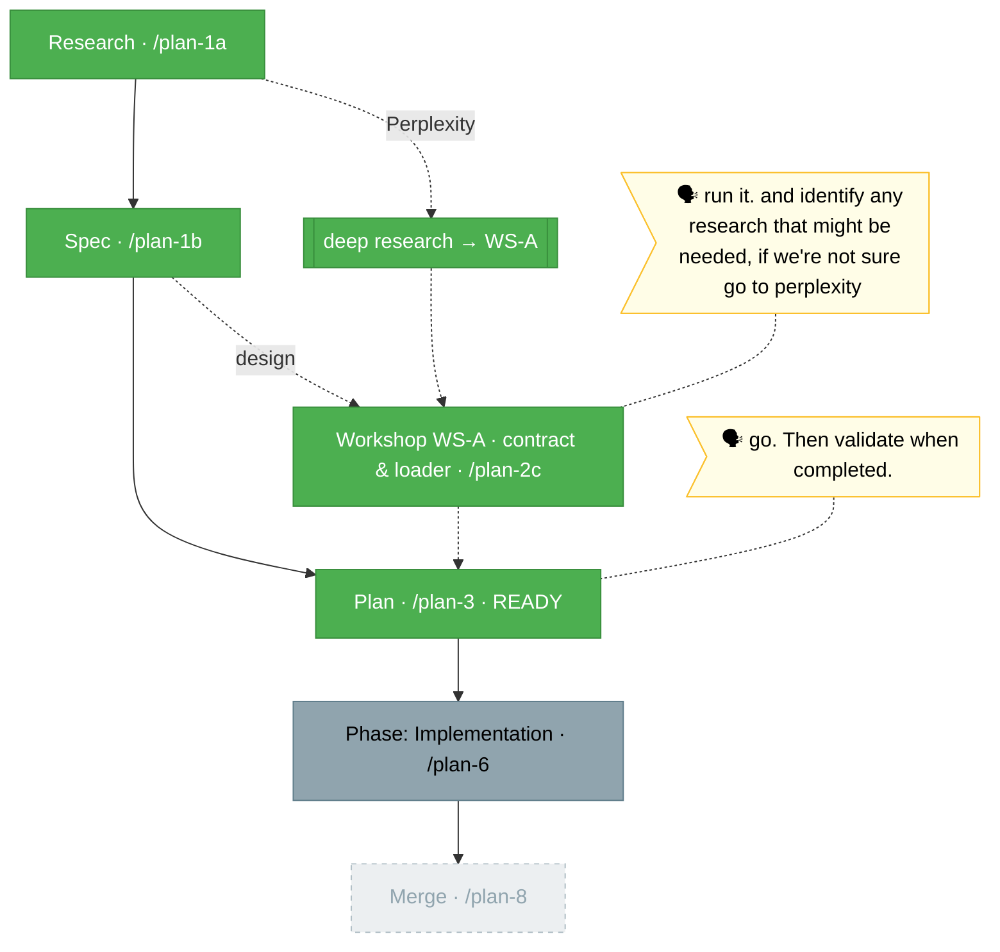

# `the-flow.md` — harness-extension-system (flight view)

> Generated from [`the-flow.json`](./the-flow.json) — never hand-edit as the primary. Plan 005. This repo has **no** engineering-harness governance doc, so the harness loop nodes (backpressure / boot / observe / retro) are omitted; the flight plan is the spine + workshops.

**Plan**: harness-extension-system · **Mode**: Simple · **Phases**: 1 (single Implementation phase, locked at /plan-3)
**Rail**: `[the-flow] ◆─◆─◆─[◐]─◇`   ·   **now**: Plan written + validated — **Status READY** (4 agents, 5 issues fixed) · **next**: Build (`/plan-6`)

**Legend**: 🟩 done · 🟧 in progress · 🟥 blocked · 🟦 known future (designed) · ⬜╴assumed future (dashed) · 🟨 🗣 verbatim user input

_Generated from `the-flow.json`. Spine: Research → Spec → **Plan (READY)** → Implementation → Merge (Simple mode, 5 milestones; 3 done). `/plan-3` landed **Status: READY** — single Implementation phase, 28 ordered test-first tasks (groups A–F). `validate-v2` ran 4 agents: thesis **ADVANCED** at the Implementation proof level (Strong evidence); forward-compatibility engaged (not standalone) and passed after fixes; **3 HIGH + 3 MED/LOW issues found and all fixed** (T017 removal scope+ordering, G6 gate wording, run/dynamic spec drift, exports types-condition, --omit=dev proof, idioms.md snippet). Next: build the phase via `/plan-6` (companion variant recommended for live review). Harness loop nodes omitted (no engineering-harness governance doc). All 005 artifacts remain **uncommitted**._
