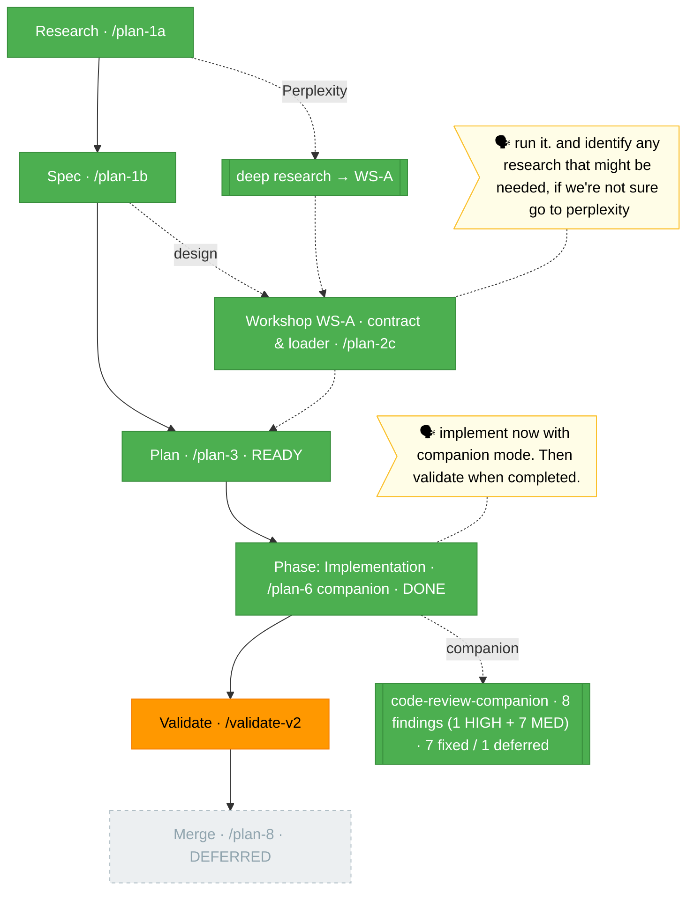

# `the-flow.md` — harness-extension-system (flight view)

> Generated from [`the-flow.json`](./the-flow.json) — never hand-edit as the primary. Plan 005. This repo has **no** engineering-harness governance doc, so the harness loop nodes (backpressure / boot / observe / retro) are omitted; the flight plan is the spine + workshops.

**Plan**: harness-extension-system · **Mode**: Simple · **Phases**: 1 (single Implementation phase, locked at /plan-3)
**Rail**: `[the-flow] ◆─◆─◆─◆─[◐]`   ·   **now**: Implementation **DONE** (companion variant) — 28 tasks + 7 finding-fixes, 145 tests green · **next**: `/validate-v2` on the code, then next phase on the same branch

**Legend**: 🟩 done · 🟧 in progress · 🟥 blocked · 🟦 known future (designed) · ⬜╴assumed future (dashed) · 🟨 🗣 verbatim user input

_Generated from `the-flow.json`. Spine: Research → Spec → Plan (READY) → **Implementation (DONE)** → Validate → Merge (Simple mode, 5 milestones; 4 done). The Implementation phase was built via `/plan-6` **companion variant** — 28 ordered test-first tasks T001–T028 (commits `c55c995`…`9baee4f`), then the live `code-review-companion` (run `2026-06-08T16-56-36-144Z-a9ad`) sent **8 findings** (1 HIGH `F006` invalid-status→undefined crash + 7 MED). **7 were fixed test-first** in the resumed session (`0853f56`, `e240ec9`, `d54321b`, `ca3f42a`, `986aa8a`, `79f7747`, `7880f81`); **F003** (symlink realpath) was deferred with an inline scope note. A rubber-duck reviewed the triage before implementing. State: **145 tests green, tsc+biome clean, 92.44% statement coverage**; installed-bin smokes pass (hello ok; invalid-status E141; named-only E140). Next: `/validate-v2` on the code changes (per the user's "Then validate when completed"), then the next phase on the shared `feat/harness-cli-core` branch. **Merge is deferred** (shared branch with plan 004). Harness loop nodes omitted (no engineering-harness governance doc)._
