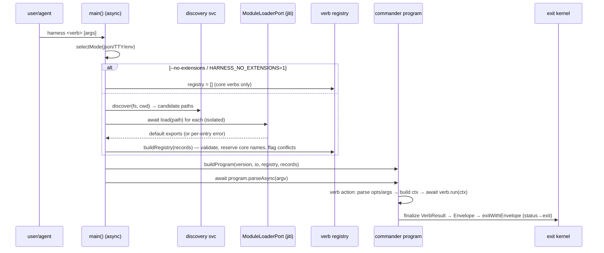

# Workshop: Extension Contract & Loader Architecture (WS-A)

**Type**: Integration Pattern
**Plan**: 005-harness-extension-system
**Spec**: [harness-extension-system-spec.md](../harness-extension-system-spec.md)
**Created**: 2026-06-08
**Status**: Approved

**Value Thesis**: Pins the six decisions that ripple through every later task — the loading mechanism, the verb contract, the `ctx`/ports set, discovery rules, the trust/isolation model, and the async-`main` restructure — so `/plan-3` becomes mechanical and an extension author (or the implementer) can build from this document with no further design discovery.
**Target Proof Level**: Contract Ready (interfaces/flows specified; some decisions taken to Preferred Direction)
**Current Proof Level**: Contract Ready

**Selected Value Axes**:
- **Implementation Readiness**: the verb contract + loader interfaces are concrete enough to TDD directly.
- **Agent Readiness**: an agent can author an extension or implement the loader from the contracts here without re-deriving the design.
- **Safety to Change**: pinning the loader behind a `ModuleLoaderPort` + an open registry means the loading mechanism can change (jiti → native Node TS) without reshaping the kernel.
- **Onboarding / Accessibility**: a copyable example verb makes the first extension trivial to write (the feature's whole point).

**Related Documents**:
- Research dossier: [../research-dossier.md](../research-dossier.md)
- Prior kernel design: [../../004-harness-core/workshops/002-cli-composition-pattern.md](../../004-harness-core/workshops/002-cli-composition-pattern.md) (§ extension seam, reserves `ModuleLoaderPort`)
- External research (this workshop): Perplexity grounded-reasoning on (a) the TS-loading mechanism for an npx CLI on Node 20/22, and (b) the plugin trust/safety norm across ESLint/Prettier/Vite/Babel/Jest. Summaries inline below; the deep-research model timed out, so `perplexity_reason` (web-grounded, recency=year) + `perplexity_ask` were used.

**Domain Context**: No domain registry in this repo; boundaries are the hexagonal **act → service → adapter** layers. New logical area: **extension-loader** (discovery + `ModuleLoaderPort` + verb contract + registry), feeding the existing **harness-cli-core**.

---

## Purpose

Settle the extension system's contract and loader so the rest of the plan is wiring, not design. Specifically: *how* extensions are loaded, *what* an author writes, *what capabilities* a verb handler gets, *how* discovery + collisions work, *how* failures + trust are handled, and *how* `main()` restructures to load-before-parse.

## Fresh Entrant Outcome

A fresh human or agent should be able to use this workshop to reach **Contract Ready** with no additional context. They should be able to:

- Write a working `harness <verb>` extension from the contract + the copyable example.
- Implement the discovery service, `ModuleLoaderPort` (jiti) adapter, `ExecPort`, and the dynamic `help`/`doctor`/registry wiring with fakes-first TDD.
- Explain why jiti is the loader today and what the Node-24 native-TS migration looks like.

## Key Questions Addressed

1. **Loading mechanism** — jiti `.ts` vs compiled `.js` vs native Node type-stripping?
2. **Verb contract shape** — declarative object vs imperative factory?
3. **`ctx` capability set** — which ports does a handler get? (confirm an `exec` capability for P8)
4. **Discovery rules** — scan layout, resolution, dedup, ordering, collision policy.
5. **Trust & failure isolation** — sandbox or trust-the-repo? how is a broken extension contained?
6. **Async `main` restructure** — load-before-parse without disturbing the Envelope/exit kernel.

---

## Value Frame

| Field | Selection | Why It Matters |
|-------|-----------|----------------|
| Target Proof Level | Contract Ready | Enough for `/plan-3` to phase + for TDD to begin; deeper validation comes from the build itself. |
| Primary Value Axis | Implementation Readiness | The plan's biggest risk was design ambiguity in the loader/contract; this removes it. |
| Supporting Value Axes | Agent Readiness, Safety to Change, Onboarding | Author + implementer can act directly; loader is swappable; first extension is easy. |
| Downstream Loop Improved | Architecture (`/plan-3`) + Implementation (`/plan-6`) | Phases become mechanical; tasks reference these contracts instead of re-deciding. |

---

## Decision 1 — Loading mechanism → **jiti v2** (with `.js` fast-path; native-TS as a future)

### Research (grounded, 2026)

- **Native Node TS**: type-stripping is **Node 22.18+ (experimental, on by default)** and **stable in Node 24**; **Node 20 LTS has no native TS** at all. Plain type-stripping also **cannot** handle enums, namespaces, parameter properties, or decorators (those need `--experimental-transform-types`, a 23+/24 experimental flag). jiti, by contrast, *fully transpiles*, so all TS works.
- **jiti v2**: runs on Node 20 + 22; clean programmatic API — `createJiti(import.meta.url).import(absPath, {default:true})` returns the default export; **transpiles full TS** (enums etc.); loaded plugins **resolve their own `node_modules`**; JIT per file per process. Maintained by unjs (Nuxt/Nitro). **pi's extension loader is built on jiti** (its loader runs with `moduleCache:false`) — so it's proven for this exact job.
- **tsx**: works on 20/22 but is a loader you run the whole process through (no clean import-by-path API) and has the heaviest cold start for a one-shot CLI.
- **Cold-start ranking** (fastest→slowest): precompiled `.js` < native type-strip < **jiti** < tsx.

### Node floor — deliberately set to **>=22 LTS** (was an inherited default)

The kernel shipped `engines.node: ">=20"` and a CI matrix `['20','22']` — an **inherited default** from the plan-004 starter (mirroring minih), **not** a deliberate decision (verified: no constitution/spec rule mandates Node 20). Two facts reframe it:

1. **Node 20 reaches EOL ~April 2026** → bumping the floor is well justified.
2. **`engines.node` constrains the *consumer*, not us** — the harness installs via `npx` into *other* developers' repos, so the floor limits *who can install it*. We keep it **broad** (Node 22 LTS, supported through 2027) rather than forcing Node 24.

**Decision (user, 2026-06-08): `engines.node` → `>=22`; CI matrix drops `20`, keeps `22` (optionally adds `24`).** A small, concrete change for `/plan-3` to phase (package.json + ci.yml). This is independent of the loader choice — jiti is recommended on its own merits, not because of the floor.

### Decision Space

| Option | Description | Pros | Cons | Decision |
|--------|-------------|------|------|----------|
| **jiti v2** | `ModuleLoaderPort` adapter calls `createJiti().import(absPath)` for `.ts`/`.tsx`; plain dynamic `import()` for `.js`/`.mjs` | Broad consumer reach (any Node 20/22+); zero-build **full-TS** authoring (enums/decorators OK); clean by-path API; plugin deps resolve; **pi parity**; already pre-approved in `dependencies` (P10) | +1 (self-contained) runtime dep; small per-invocation transpile cost for `.ts` | **Selected** |
| Compiled `.js` only | Authors ship built `.js` | No new dep; fastest cold start | Build step per extension = friction (kills the "super easy" goal) | Rejected as default (kept as the `.js` fast-path) |
| Native Node type-stripping | Plain `import()` of `.ts` (Node 22.18+ exp / 24 stable) | No dep; marginally faster; marginally simpler adapter | **Forces every consumer onto Node 24** for stable behaviour; **no enums/namespaces/decorators**; diverges from pi | Rejected today; **future fast-path** if the floor ever rises to 24 |
| tsx | Run process through tsx loader | Works on 20/22 | No by-path API; heaviest cold start | Rejected |

**Selected**: **jiti for `.ts`/`.tsx`, plain `import()` for `.js`/`.mjs`/`.cjs`**, with `engines.node >=22`. jiti goes in `dependencies` (P10, `--omit=dev`-safe). Authors write normal full TS, no build step. **Migration path**: the loader sits behind `ModuleLoaderPort`, so if the floor ever rises to **Node 24** we can add a native type-stripping fast-path for strip-types-safe `.ts` and keep jiti as the full-TS fallback — with **no** change to the contract, discovery, or kernel.

---

## Decision 2 — Verb contract shape → **declarative default export** (`HarnessVerb | HarnessVerb[]`)

A declarative object beats pi's imperative factory **for CLI verbs** because the core can **enumerate + validate a verb's metadata (name/summary/options) without executing its handler** — exactly what `doctor` needs (P7). Loading the module evaluates its top level (imports + the object literal); the `run` handler only fires on actual invocation.

### Decision Space

| Option | Description | Pros | Cons | Decision |
|--------|-------------|------|------|----------|
| **Declarative object/array** | `export default { name, summary, run, … }` (or an array) | Statically inspectable (doctor lists without running handlers); trivially maps to commander; easy to validate | Slightly less flexible than arbitrary code | **Selected** |
| Imperative factory | `export default (harness) => harness.registerVerb({…})` (pi-style) | Flexible; can compute verbs | Must execute factory to know verbs; harder to validate/inspect | Rejected (revisit if dynamic verb sets ever needed) |

### The contract (authors import these types; the core provides the impl)

```ts
// PUBLIC contract — services/extensions/contract.ts (re-exported for authors)

export type VerbStatus = 'ok' | 'degraded' | 'unconfigured' | 'error';

export interface VerbOption {
  /** commander-style flags, e.g. '--name <name>' or '-f, --force' */
  flags: string;
  description: string;
  defaultValue?: string | boolean;
}

export interface VerbArg {
  /** commander-style, e.g. '<target>' (required) or '[target]' (optional) */
  name: string;
  description: string;
}

export interface Evidence { label: string; path?: string; none?: boolean }

/** What a handler RETURNS. The core finalizes it into a full Envelope
 *  (adds `command` = verb name + `timestamp` from the clock). */
export interface VerbResult {
  status: VerbStatus;
  data?: unknown;
  error?: { code: string; message: string; details?: unknown };
  evidence?: Evidence[];
  next_action?: string;   // REQUIRED by the core for any non-`ok` status (P5)
}

export interface ExecResult { code: number; stdout: string; stderr: string; ok: boolean }

/** Injected per-invocation by the core from its ports. Authors never build this. */
export interface VerbContext {
  cwd: string;
  args: Record<string, string | undefined>;   // parsed positionals, by arg name
  options: Record<string, unknown>;            // parsed flags, by camelCased name
  /** Run a REAL repo command (P8 — "wrap, don't rebuild"). cwd defaults to ctx.cwd. */
  exec(command: string, args?: string[], opts?: { cwd?: string }): Promise<ExecResult>;
  fs: { exists(p: string): boolean; readText(p: string): string | null; readdir(p: string): string[] };
  env: { get(name: string): string | undefined };
  git: { isRepo(): boolean; currentBranch(): string | null };
  clock: { nowIso(): string };
  // Envelope helpers so authors don't import the kernel:
  ok<T>(data: T, opts?: { evidence?: Evidence[]; next_action?: string }): VerbResult;
  degraded<T>(data: T, next_action: string, opts?: { evidence?: Evidence[] }): VerbResult;
  unconfigured(next_action: string, opts?: { data?: unknown }): VerbResult;
  error(code: string, message: string, opts?: { details?: unknown; next_action?: string }): VerbResult;
}

/** The verb an extension declares. */
export interface HarnessVerb {
  name: string;            // 'build' → `harness build`
  summary: string;         // one line — shown in `help` list + `doctor`
  description?: string;    // longer `--help` body
  options?: VerbOption[];
  args?: VerbArg[];
  run(ctx: VerbContext): VerbResult | Promise<VerbResult>;
}

/** A `.harness/extensions/*` entry's DEFAULT export. */
export type ExtensionExport = HarnessVerb | HarnessVerb[];
```

**Why `run` returns a `VerbResult` (not an `Envelope`)**: the kernel stays the sole owner of `command`, `timestamp`, status→exit mapping, and `process.exit` (Constitution P4/P6). The author returns intent; the core finalizes. The `ctx.ok/degraded/unconfigured/error` helpers make the happy path one line and guarantee the `next_action`-on-non-ok rule.

---

## Decision 3 — `ctx` capability set → ports + an **`ExecPort`** (confirmed for P8)

Verbs exist to **wrap real repo commands** (P8), so the load-bearing capability is `exec`. Today's `ProcessPort` only does `which` (probe); we add a sibling **`ExecPort`** (run). All capabilities are the existing hexagonal ports, surfaced read-mostly through `ctx`.

| Capability | Backing port | New? | Notes |
|---|---|---|---|
| `exec(cmd,args,opts)` | **`ExecPort`** (`NodeExec` / `FakeExec`) | **NEW** | spawn a child in `cwd`; capture code/stdout/stderr. The P8 capability. |
| `fs.exists/readText/readdir` | `FsPort` (+ `readdir`) | extend | `readdir` is **NEW** (discovery + verbs reading repo files). |
| `env.get` | `EnvPort` | reuse | — |
| `git.isRepo/currentBranch` | `GitPort` | reuse | — |
| `clock.nowIso` | `Clock` | reuse | — |
| `ok/degraded/unconfigured/error` | output kernel | reuse | thin wrappers over `formatOk/...` bound to the verb name. |

```ts
export interface ExecPort {
  run(command: string, args: string[], opts: { cwd: string }): Promise<ExecResult>;
}
// NodeExec → child_process.spawn (no shell; args array). FakeExec → scripted results keyed by command.
```

**Not in `ctx` (v1)**: process exit, stdout/console (kernel-only), UI, network, a write-fs (defer; verbs that need to write can `exec` a real command).

---

## Decision 4 — Discovery rules

```
<cwd>/.harness/extensions/          ← scanned (developer's repo cwd, via ProcessPort.cwd or a CwdPort)
├── hello.ts                        ← direct file  → load
├── build.js                        ← direct file  → load (.js fast-path, no transpile)
├── seed/                           ← subdir
│   └── index.ts                    ← subdir index → load
└── lint/                           ← subdir
    ├── package.json  (optional: { "harness": { "extensions": ["main.ts"] } })
    └── main.ts                     ← manifest entry → load
```

| Rule | Decision |
|---|---|
| **Root** | `<cwd>/.harness/extensions/` (developer's cwd). Configurable later via `--extensions-dir`; **not** the installed-package dir. |
| **Depth** | **One level** (like pi). Direct `*.ts\|*.tsx\|*.mjs\|*.cjs\|*.js` files; or a subdir resolved by `package.json` `harness.extensions[]` → else `index.ts` → else `index.js`. |
| **Order** | **Deterministic**: entries sorted by name before load (stable "first wins"). |
| **Dedup** | By **resolved absolute path** (symlinks followed). |
| **Verb collisions** | **Core names (`help`, `doctor`, bare orientation) are reserved** and can't be overridden. Among extensions, **first (sorted) wins**; the shadowed duplicate is **recorded and surfaced by `doctor`** as a conflict warning (honest, never silent). |
| **Empty / absent** | **Not an error.** Registry is empty; `help` shows "no extensions installed yet" + `next_action`; `harness <anything>` → `unknown command` (E108) or honest "no extensions" guidance. |

```ts
export interface ExtensionRecord {
  entryPath: string;                         // resolved absolute path
  status: 'loaded' | 'failed' | 'conflict';
  verbs: HarnessVerb[];                      // declared verbs (empty if failed)
  error?: string;                            // load/validation message (status != loaded)
  shadows?: string[];                        // for 'conflict': the verb name(s) shadowed
}
export interface ModuleLoaderPort {
  /** Import by absolute path → default export. `.ts/.tsx` via jiti; `.js/.mjs/.cjs` via dynamic import(). */
  load(absPath: string): Promise<unknown>;
}
```

---

## Decision 5 — Trust & failure isolation → **trust-the-repo + per-extension isolation + `--no-extensions`**

### Research (the plugin norm)

ESLint, Prettier, Vite/Rollup, Babel, and Jest **all** load project plugins **in-process, fully trusted, no sandbox** ("if you run this repo's code, you already trust it"). Isolation is mostly *better error messages*; a thrown plugin usually fails the run. Dedicated `--no-plugins` flags are rare, and **structured "what loaded from where" UX is largely absent**.

### Decisions

| Concern | Decision |
|---|---|
| **Trust model** | **Trust the repo** (industry norm). Extensions are arbitrary code with full Node privileges. Document it plainly. **No sandbox in v1.** |
| **Load isolation** | Per extension: `try` load+validate; on error **skip it, record `status:'failed'` + reason**, continue. One broken extension never breaks the others or the CLI. |
| **Invocation isolation** | Wrap `verb.run(ctx)` in `try/catch`; a throw → `error` Envelope (`E141 EXTENSION_RUNTIME_ERROR`) + exit 1, never a raw stack trace (AC-style honesty). |
| **Safe mode** | **`--no-extensions`** flag **and** `HARNESS_NO_EXTENSIONS=1` env → skip discovery entirely (core verbs only). An easy win the surveyed tools lack. |
| **Introspection** | **`doctor` enumerates** loaded/failed/conflict + path + verbs + error (P7) — the differentiator. Optional `--extensions-dir <path>` override. |

New error codes (extend `output/error-codes.ts`, currently stops at `E130`):

| Code | Meaning |
|---|---|
| `E140 EXTENSION_LOAD_FAILED` | An extension file couldn't be imported or failed validation (surfaced by `doctor`; per-extension, non-fatal). |
| `E141 EXTENSION_RUNTIME_ERROR` | A verb handler threw at invocation time. |
| `E142 EXTENSION_VERB_CONFLICT` | Two extensions declared the same verb name (shadowed one reported). |

---

## Decision 6 — Async `main` restructure (load-before-parse)

The kernel's Envelope/exit/act/service stays unchanged; only the composition root learns to discover + load first, and `parse` becomes `parseAsync`.



- `main()` → `async`; `index.ts` still calls it unconditionally (F005 — the bin symlink can't use an `isMain` guard).
- `program.parse` → `await program.parseAsync` (verb handlers are async).
- `validateCommandMap` still runs on the assembled registry (open `name: string`, no closed union) before parse.
- `BUILTIN_SLOTS` and the `builtinSlots()` loop are **deleted**; `buildProgram` registers core `help`/`doctor` + one commander subcommand per registry verb (sequencing detail → **WS-B**).

---

## Worked Example — a `hello` verb and a `build` verb

`./.harness/extensions/hello.ts` (the copyable starter):

```ts
import type { HarnessVerb } from 'harness/contract';   // re-exported public types

const hello: HarnessVerb = {
  name: 'hello',
  summary: 'Say hello (example extension).',
  options: [{ flags: '--name <name>', description: 'who to greet', defaultValue: 'world' }],
  run(ctx) {
    return ctx.ok({ greeting: `hello, ${ctx.options.name}` }, { next_action: 'Edit .harness/extensions/hello.ts to customise.' });
  },
};
export default hello;
```

`./.harness/extensions/build.ts` (wraps a real command — P8):

```ts
import type { HarnessVerb } from 'harness/contract';

const build: HarnessVerb = {
  name: 'build',
  summary: 'Build the project (wraps `npm run build`).',
  async run(ctx) {
    const r = await ctx.exec('npm', ['run', 'build']);
    return r.ok
      ? ctx.ok({ command: 'npm run build' }, { evidence: [{ label: 'build log', none: true }] })
      : ctx.error('E1', `build failed (exit ${r.code})`, { details: r.stderr, next_action: 'Fix the build error above.' });
  },
};
export default build;
```

```
$ harness hello --name pi
{ "command": "hello", "status": "ok", "timestamp": "…", "data": { "greeting": "hello, pi" },
  "next_action": "Edit .harness/extensions/hello.ts to customise." }          # exit 0

$ harness build            # runs npm run build; exit mirrors the child (0 ok / 1 error)
$ harness --help           # lists: help, doctor, hello, build   (no BUILTIN_SLOTS)
$ harness build --help     # commander-generated usage from the verb's options/args
```

`harness doctor` (extension enumeration, P7) — no verb is invoked:

```
harness doctor — readiness report
✓ toolchain: all required tools present (node, just, biome)
✓ cli-build: harness/cli/dist/index.js present
✓ extensions: 2 loaded, 0 failed (from ./.harness/extensions)
    • hello   [loaded]  .harness/extensions/hello.ts
    • build   [loaded]  .harness/extensions/build.ts
branch: feat/harness-cli-core
```

…and with a broken extension (isolation + honesty):

```
⚠ extensions: 1 loaded, 1 failed (from ./.harness/extensions)
    • hello   [loaded]  .harness/extensions/hello.ts
    • seed    [failed]  .harness/extensions/seed/index.ts — E140: SyntaxError: Unexpected token
    → Fix or remove the failed extension; run `harness doctor` again.
```

---

## Evidence Ledger

| Evidence | Location | Supports | Status |
|----------|----------|----------|--------|
| Node-TS/jiti/tsx comparison (Perplexity, sourced) | Decision 1 | loading-mechanism choice | Validated (external sources) |
| Plugin trust/isolation norm (Perplexity, sourced) | Decision 5 | trust model + isolation + safe mode | Validated (external sources) |
| `HarnessVerb`/`VerbContext`/`VerbResult` types | Decision 2/3 | the author + dispatch contract | Ready |
| `ModuleLoaderPort`/`ExecPort`/`ExtensionRecord` | Decision 1/3/4 | loader + discovery + isolation | Ready |
| Discovery layout + collision rules | Decision 4 | discovery service | Ready |
| async-`main` sequence | Decision 6 | composition-root restructure | Ready |
| Worked `hello`/`build` + `doctor` output | Worked Example | author UX + AC-1..AC-5 | Ready |
| Kernel reuse (envelope/exit/ports) | dossier + workshop 002 | no-unpick claim | Validated (first-hand read) |

## Attention Reduction

| Future Loop | Before WS-A | After WS-A |
|-------------|-------------|------------|
| Architecture (`/plan-3`) | Had to decide loader + contract + ctx + discovery before phasing | Decisions made; phases = wire the contracts below |
| Implementation | Would re-derive the verb shape, exec capability, discovery rules | Types + ports + algorithm given; TDD against fakes |
| Authoring an extension | No reference; guess the shape | Copy `hello.ts`; full TS, one-line happy path |
| Review | Reconstruct intended behaviour | Check against this contract + AC mapping |

## Validation / Acceptance

This workshop reaches Contract Ready (met):

- [x] Loading mechanism chosen with sourced rationale + migration path.
- [x] Verb contract specified as TypeScript an author/implementer can use directly.
- [x] `ctx` capabilities enumerated; the P8 `exec` capability confirmed as `ExecPort`.
- [x] Discovery layout, ordering, dedup, and collision policy specified.
- [x] Trust + per-extension isolation + safe-mode + new error codes specified.
- [x] async-`main` restructure shown without disturbing the Envelope/exit kernel.
- [x] Worked example + `doctor` enumeration demonstrate AC-1..AC-6.

## Open Questions (deferred — not blocking `/plan-3`)

| # | Question | Routes to |
|---|----------|-----------|
| Q1 | Exact sequencing of removing `BUILTIN_SLOTS` + what bare `harness`/`run` do once verbs are real | **WS-B** |
| Q2 | Is `run <verb>` retired (top-level `harness <verb>` is primary) or kept as a passthrough alias? | WS-B |
| Q3 | Authoring scaffold (`harness new extension`) + a typed-contract package export + test fakes for `ctx` | **WS-C** (v1 = guide + example only) |
| Q4 | Disk-cache for jiti transpile to cut repeat cold-start cost | future (perf) |
| Q5 | Where exactly does the public `contract` type module live so authors can `import type` it without pulling the whole CLI? | `/plan-3` structure gate |
