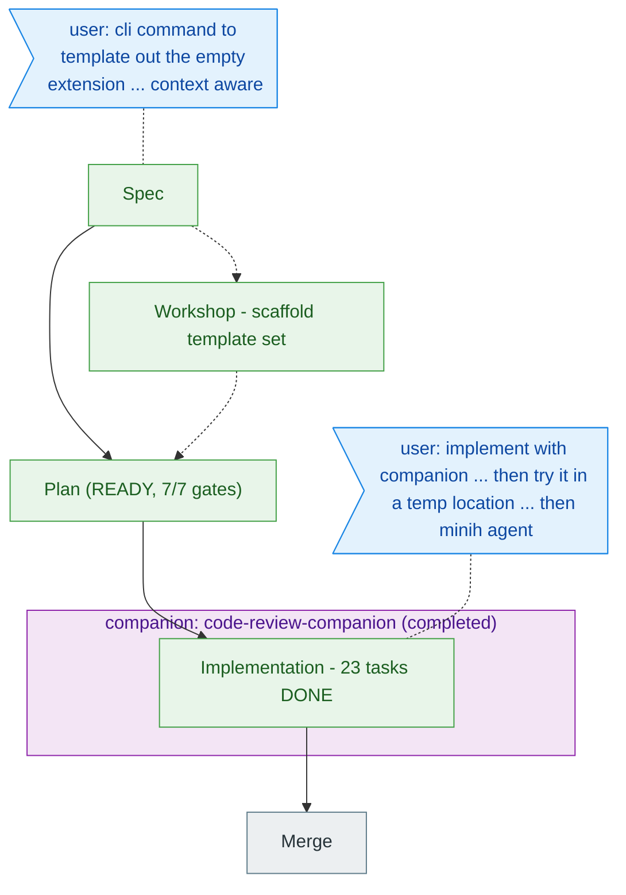

<!-- GENERATED from the-flow.json — do not hand-edit. -->
# Flight plan — add-extension-skill

**Legend**: done | known (designed) | assumed | user words | companion-wrapped phase

**Now**: build done — 191 tests, companion review clean, built-bin + minih e2e PASS. **Next**: merge (/plan-8) when ready.
