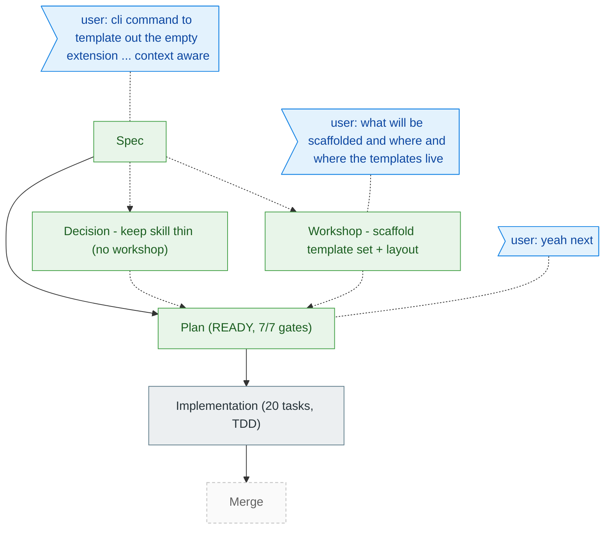

<!-- GENERATED from the-flow.json — do not hand-edit. -->
# Flight plan — add-extension-skill

**Legend**: done | in progress | known (designed) | assumed (speculative) | user words

**Now**: plan READY (validate-v2 running). **Next**: implement (/plan-6)
