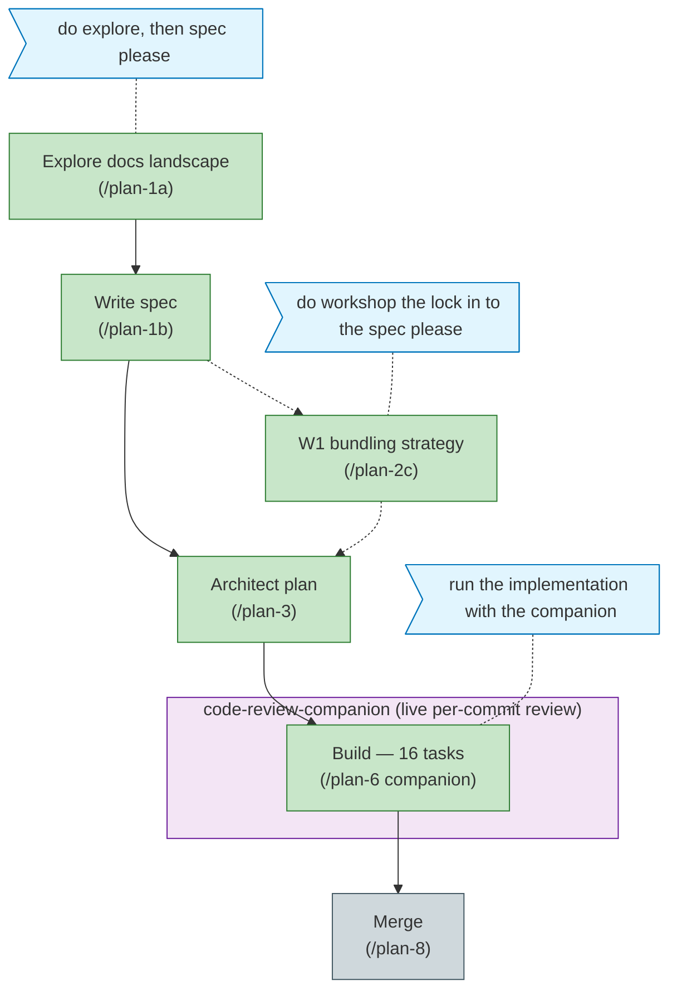

<!-- Generated from the-flow.json — do not hand-edit. -->
# Flight plan — first-class-documentation

**Legend**: done (green) · in progress (orange) · blocked (red) · known/designed (blue-grey) · assumed (dashed) · user words (blue) · companion (violet)

**Now**: Build complete — 16/16 tasks, 12/12 ACs, 213 tests pass; companion reviewed every commit (5 findings, all fixed + approved). `/plan-7` superseded. **Next**: merge analysis (`/plan-8`).
