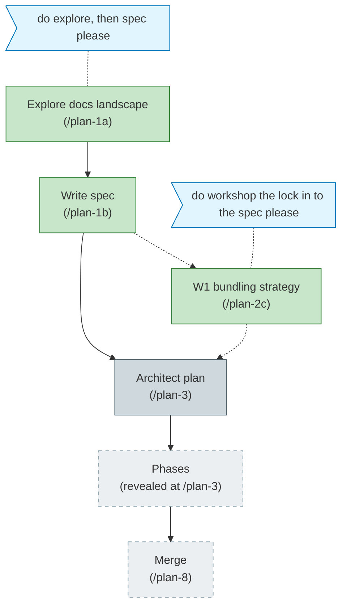

<!-- Generated from the-flow.json — do not hand-edit. -->
# Flight plan — first-class-documentation

**Legend**: done (green) · in progress (orange) · blocked (red) · known/designed (blue-grey) · assumed (dashed) · user words (blue)

**Now**: spec + W1 workshop locked (Option C). **Next**: architect (/plan-3).
