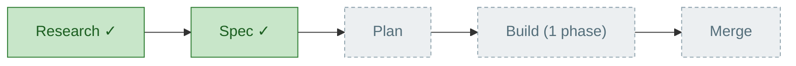
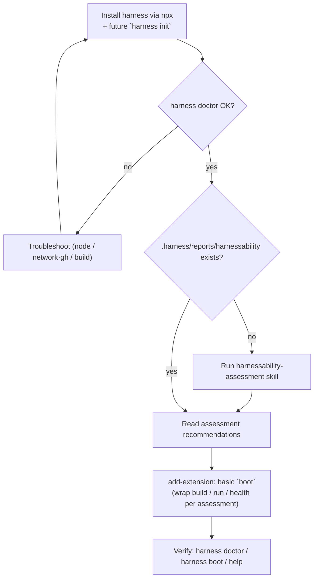

# Flight Plan — harness-setup-flow (plan level)

**Status**: Ready for takeoff (plan READY)  ·  **Mode**: Simple  ·  **CS**: CS-3 (medium)

## Journey Map

## The flow being specified (the skill's own DAG)

> **Boot is the deliverable.** Agents run `harness boot` at the top of every task: it proves the env is ready *and* re-orients them on the harness. Keep it a minimal nucleus — don't boil the ocean.

## Phases

| # | Phase | Status | Summary |
|---|-------|--------|---------|
| 1 | Rework setup skill into lean flow | pending | Rewrite SKILL.md/README.md (mermaid DAG) + AUTHORING.md; delete all 19 templates + CREATE/VALIDATE/STATUS machinery; update skills/README.md catalog; validate via the install-and-validate-test-extension e2e agent. |

## Flight Log

| When | Event |
|------|-------|
| 2026-06-09 | Research dossier written (research-dossier.md). |
| 2026-06-09 | Spec written + clarified (Simple, pure orchestration, future `harness init`, manual + e2e-agent proof). |
