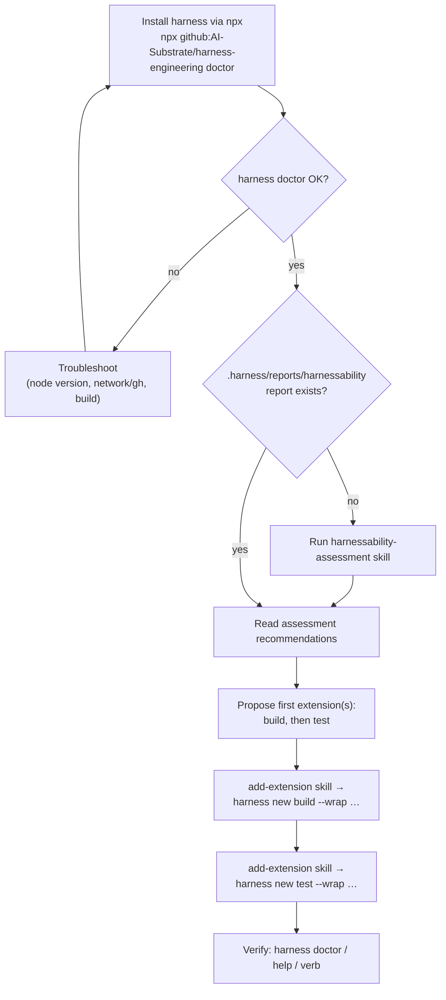

# Research Report: Rework `engineering-harness-setup` into a lean npx-install flow

**Generated**: 2026-06-08
**Research Query**: "Rework the engineering-harness-setup skill into a lean install-from-npx flow that orchestrates other skills: install the harness via npx, run harnessability-assessment if no report exists at `.harness/reports/harnessability`, then guide the user to set up an initial extension (build, test) identified from harnessability. Strip out templates/retro/known-difficulties scaffolding that now moves into the harness CLI as deterministic code. Documentation should render the flow as a simple mermaid DAG."
**Mode**: Pre-Plan
**FlowSpace**: Available (default graph scanned)
**Findings**: 7 areas, 5 open decisions

---

## Executive Summary

### What we're changing
`engineering-harness-setup` is today a **heavyweight, generative** skill (621-line `SKILL.md` + **19 templates**, ~2,039 template lines). It *generates* a governance doc, a **placeholder** `harness/cli/` (Python/Node stdlib), a `docs/harness/` scaffold, an `AGENTS.md` block, and seeds `## Known Difficulties` from the retro ledger. Most of that has been **superseded** by the real, npx-installable `harness` CLI built in plans 004–007 and by the separate `harnessability-assessment` skill (plan 003).

### Target
Turn the skill into a thin **flow** (a DAG, documented in mermaid) that orchestrates three steps and **owns no generated artifacts of its own**:

1. **Install the harness from npx** and prove it runs (`harness doctor`), guiding the user through problems.
2. **Run `harnessability-assessment`** *iff* no report exists at `.harness/reports/harnessability` (call out to that skill).
3. **Walk the user into their first extension(s)** — build, then test — chosen from the assessment's recommendations, by calling out to the `add-extension` skill (which drives `harness new`).

Everything else — retro setup, known-difficulties seeding, backpressure README, friction logs, magic-wand prompt, the placeholder CLI, the envelope/config schemas — **moves into the harness CLI as deterministic code** and is deleted from this skill.

### Key Insights
1. **The real CLI already exists and ships via npx** — package `harness-engineering`, bin `harness` → `harness/cli/dist/index.js`, installed with `npx github:AI-Substrate/harness-engineering <cmd>` (intentionally **not** npm-published). The skill should *install and use* it, not *generate* a stand-in. (`package.json:2,6-8,17-20`, `.github/workflows/release.yml:11-14`, `harness/cli/README.md:7-16,142-143`)
2. **There is no `harness init` act today** — only `help`, `doctor`, `new`, `docs`, and dynamic extension verbs (`harness/cli/src/app.ts:147-153`). `.harness/extensions/` is created **lazily** by `harness new`. So "install the harness" currently means *establish a working `harness` invocation*, not *run a bootstrap command*. **This is the single biggest open decision** (§ Open Decisions D1).
3. **A working end-to-end reference already exists**: the `install-and-validate-test-extension` minih agent already does install-core → `add-extension` skill → verify. The new human-guided flow is its interactive sibling and can reuse its exact install + verify recipe. (`agents/install-and-validate-test-extension/prompt.md:63-104`)

### Quick Stats
- **Skill being reworked**: `skills/engineering-harness-setup/` — `SKILL.md` (621 lines), `README.md`, `AUTHORING.md`, **19 templates**.
- **Skills it will orchestrate**: `harnessability-assessment`, `add-extension`.
- **CLI surface relied on**: `harness doctor`, `harness new <name> [--wrap "<cmd>"] [--js]`, `harness help`, `harness docs`, `--json` envelopes.
- **Net deletion**: all 19 templates + most of `SKILL.md` CREATE/VALIDATE/STATUS machinery.

---

## How It Currently Works (the skill being replaced)

### `engineering-harness-setup` — current behaviour
Three modes (`SKILL.md:32-65`): **CREATE** (auto when governance doc missing), **VALIDATE**, **STATUS**.

CREATE mode (`SKILL.md:69-534`) does a lot:
- **Step 1**: 2 subagents — project-type detection + interaction-surface probe.
- **Step 4**: generates `docs/project-rules/engineering-harness.md` (full governance doc: Purpose, First Principles, Harness CLI, Boot/Interact/Observe, Signals & Back Pressure, Backpressure Check, Known Difficulties, Maturity Assessment, 20-item Validation Checklist, History). (`SKILL.md:142-281`)
- **Step 4a**: seeds `## Known Difficulties` from `docs/harness/agents/**/*.retro.md`. (`SKILL.md:283-304`)
- **Step 4a.1**: creates `docs/harness/` scaffold (`_buffers/`, `agents/`, `backpressure/README.md`). (`SKILL.md:306-320`)
- **Step 4b**: generates a **placeholder CLI** under `harness/cli/` — `harness.py` **or** `harness.mjs` + `commands.json` from `templates/harness-config.json`. (`SKILL.md:322-481`)
- **Step 4c**: patches `AGENTS.md` with a sentinel-bracketed block. (`SKILL.md:483-499`)
- **Step 5/6**: validate + report.

VALIDATE/STATUS modes (`SKILL.md:546-609`) check the generated surfaces exist and are coherent.

### The 19 templates (disposition for the rework)
`wc -l skills/engineering-harness-setup/templates/*` → 2,039 lines. Mapped to the user's "move into the harness as deterministic code":

| Template | Lines | Disposition |
|---|---|---|
| `cli-python-harness.py` | 494 | **DELETE** — real CLI replaces the placeholder. |
| `cli-node-harness.mjs` | 436 | **DELETE** — same. |
| `root-HARNESS.md` | 210 | **DELETE** — governance generation moves out. |
| `cli-command-contract.md` | 126 | **DELETE** — CLI owns its contract (`harness docs`). |
| `harness-config.schema.json` | 103 | **DELETE** — CLI owns config. |
| `install-report.md` | 89 | **MAYBE KEEP** — a short "what the flow did" record may still be useful (D5). |
| `harness-onboard-agent-session.md` | 85 | **DELETE** — runtime/agent concern. |
| `cli-envelope.schema.json` | 63 | **DELETE** — CLI owns the Envelope (plan 007). |
| `harness-friction-log.md` | 58 | **DELETE** — retro/friction moves into CLI deterministic code. |
| `harness-config.json` | 53 | **DELETE** — superseded by `.harness/` + extensions. |
| `magic-wand-prompt.md` | 51 | **DELETE** — retro concern → CLI/harness-4. |
| `agents-md-snippet.md` | 51 | **DELETE / shrink** — at most a one-line pointer (D4). |
| `retrospective-schema.json` | 47 | **DELETE** — owned by `docs/harness/schemas/`. |
| `docs-harness-backpressure-README.md` | 47 | **DELETE** — backpressure surface moves out. |
| `harness-proof-note.md` | 41 | **DELETE**. |
| `harness-README.md` | 35 | **DELETE**. |
| `harness-known-difficulties.md` | 35 | **DELETE** — known-difficulties moves into CLI. |
| `friction-entry.md` | 14 | **DELETE**. |
| `canonical-boundary.txt` | 1 | **KEEP candidate** — the load-bearing boundary sentence "The agent harness drives. The engineering harness proves." may still anchor docs. |

**Net**: the rework likely keeps **0–2** templates. The flow is prompt-shaped guidance + calls to other skills, not a generator.

---

## The Real Harness CLI (what the flow installs and uses)

- **Package / bin**: `harness-engineering` → bin `harness` → `harness/cli/dist/index.js`. (`package.json:2,6-8`)
- **Install (canonical, npx)**: `npx github:AI-Substrate/harness-engineering help` / `doctor`; pin a release with `#vX.Y.Z`. **No npm publish** (by design). (`harness/cli/README.md:7-16,142-143`, `.github/workflows/release.yml:11-14`)
- **Install (into a target repo so `npx harness` resolves locally)**: `npm install github:AI-Substrate/harness-engineering` (proven by the test agent at `agents/install-and-validate-test-extension/prompt.md:84-88`).
- **`files` shipped**: `harness/cli/dist`, `LICENSE` only — docs ship **compiled into `dist`** via build-time `scripts/gen-docs.mjs`. (`package.json:17-20`, `scripts/gen-docs.mjs:5-9`)
- **Build chain**: `npm run build` = `gen:docs && tsc`; `prepare` = `npm run build` (so a git/file install self-builds `dist/`). (`package.json:24-29`)
- **Core acts** (`harness/cli/src/app.ts:147-153`):
  | Command | Purpose |
  |---|---|
  | `help` | command surface / orientation |
  | `doctor` | report loaded extensions + config state (the install sanity check) |
  | `new <name> [--wrap "<cmd>"] [--js] [--force]` | scaffold an extension into `.harness/extensions/<name>.ts\|.js` |
  | `docs [<id>]` | list / print bundled docs (plan 007) |
  | *dynamic verbs* | discovered extensions from `.harness/extensions/` |
- **Extensions**: live in `<cwd>/.harness/extensions/`; reserved names `help, doctor, new, docs`; discovery scans one level deep, subdirs use `package.json` `harness.extensions[]`. (`harness/cli/src/services/extensions/registry.ts:14-15`, `.../discovery.ts:9-24`)
- **`.harness/` is an established convention**, not new — referenced across README, acts, CI, idioms/architecture/constitution docs. (`harness/cli/README.md:3,28-38`; `acts/new.ts:29-45`; `.github/workflows/ci.yml:78-83`)

---

## `harnessability-assessment` (step 2 of the flow)

- **What**: reads the harness, scores **Operate-Today** (Axis A) + **Adaptability** (Axis B), maps back-pressure surfaces, command tiers, proof ceilings, dependency exposure, gaps, and **remediations**. Readiness ladder **H0–H5**, proof ladder **L0–L6**. (`SKILL.md:3-11,166-244`)
- **Invocation**: flags incl. `--repo`, `--markdown`, `--json`, `--output-dir`, `--execute-safe-probes`, `--deep`, `--compare`. Default = read-only static assessment + report. (`SKILL.md:67-86`)
- **Current output location**: `harness/assessment/{latest.md,latest.json,schema.json,runs/<UTC>.{md,json}}`. (`SKILL.md:88-104`) **⚠️ The user is moving this to `.harness/reports/harnessability` in a parallel update.** A repo grep for `.harness/reports/harnessability` finds **only** this plan's own files — confirming the new location is not yet wired anywhere else (D3). (agent grep: hits only in `docs/plans/008-*`)
- **Recommends extensions / next actions**: yes — remediations are executable (commands, sensors, fixtures, smoke paths). Sample JSON includes `"Add one fixture-backed smoke test hitting a single route."` (`templates/assessment-latest.json:124-130`). **This is the seam** the flow reads to propose the first extension.
- **Ordering** (explicit): `engineering-harness-setup → harnessability-assessment → tools runtime`. (`README.md:5-9`, `SKILL.md:31-37`)
- **Shape**: prompt+template, **not** a CLI command — it references `harness/cli/commands.json` as a surface but defines no executable.

---

## `add-extension` (step 3 of the flow)

- **What**: scaffolds a `harness <verb>` extension, fills `run(ctx)` from gathered intent, verifies with `doctor`/`help`. (`skills/add-extension/SKILL.md:18-26`)
- **Inputs**: verb **name**, **behavior** (wrap a real repo command vs custom), optional **TS/JS**; infers from context/spec where obvious, asks only for gaps. (`README.md:16-30`)
- **CLI it drives**: `harness new <name> --wrap "<command>"` / `harness new <name>` / `--js`; verifies via `harness doctor`, `harness help`, `harness <name> --help`, `harness <name>`. (`SKILL.md:22-25`)
- **Worked examples already exist** for exactly the two the user named:
  - **Build**: `harness new ci-smoke --wrap "just ci-smoke"`. (`docs/how/extend-the-harness.md:93-103`)
  - **Test**: `harness new test --wrap "npm test"` → `.harness/extensions/test.ts`. (`docs/how/extend-the-harness.md:44-52`)

---

## Prior Art: `install-and-validate-test-extension` agent

A single-shot minih e2e agent already encodes the **install → add-extension → verify** loop the new flow guides a human through. (`agents/install-and-validate-test-extension/`)
- Install paths: `local` = `npm install "$ROOT"`; `github` = `npm install github:AI-Substrate/harness-engineering` (proves the npx path). (`prompt.md:63-88`)
- Sanity: `npx harness doctor --json` (empty `.harness/extensions/` is **not** an error). (`prompt.md:88-89`)
- Drives the **`add-extension` skill** (never hand-writes the file), then independently verifies `doctor`/`help`/verb invocation. (`instructions.md:1-13`, `prompt.md:93-104`)

**Reuse**: the new skill's "install + sanity-check" and "verify the extension" recipes should mirror this agent verbatim, so the human-guided and automated paths stay in lockstep.

---

## Target Flow (the DAG to document)

This is the simple DAG the SKILL.md + README should render. Each box is either a CLI call or a **call out to another skill** (`harnessability-assessment`, `add-extension`).

---

## Open Decisions (resolve in spec / clarify)

**D1 — What does "install the harness" produce, and who creates the governance/`.harness/` nucleus?**
There is no `harness init` act today. Options: (a) flow only establishes a working `npx harness` + relies on lazy `.harness/extensions/` creation by `harness new` (lightest); (b) flow runs `npm install github:AI-Substrate/harness-engineering` into the target repo so `npx harness` resolves locally; (c) the harness CLI grows a deterministic `harness init`/`setup` act (out of scope here, but the flow would call it). **Recommend (b) + design the flow to call a future `harness init` when it lands** (keeps the skill thin and forward-compatible).

**D2 — Does the flow still emit `docs/project-rules/engineering-harness.md` / patch `AGENTS.md`?**
User intent says governance/retro scaffolding moves into the CLI. **Recommend: stop generating the governance doc and the `docs/harness/` scaffold from the skill.** If an `AGENTS.md` pointer is still wanted, reduce it to a single line (D4). Confirm whether the governance doc is fully retired or becomes a CLI-emitted artifact.

**D3 — Pin the assessment report-location contract.**
The flow checks `.harness/reports/harnessability` but `harnessability-assessment` still writes `harness/assessment/`. The user is updating the assessment skill in parallel. **Spec must treat `.harness/reports/harnessability` as the canonical contract** and note the cross-skill dependency / ordering so they land consistently. Decide: file path exactly (e.g. `.harness/reports/harnessability/latest.json`?) and the "exists" check semantics.

**D4 — `AGENTS.md` block: keep a one-liner, or drop entirely?**

**D5 — Templates: keep `install-report.md` (a record of the flow run) and `canonical-boundary.txt` (the boundary sentence), or delete all 19?**

**D6 — MCP forward-compat (noted, low effort).** A future MCP server will reuse the harness CLI's `docs` + extension surfaces. The flow already depends only on CLI commands/envelopes, so it doesn't preclude MCP. Keep it that way; no design work needed now.

---

## Domain & Harness Context

- **No domain registry** (`docs/domains/` absent) — this is a skills-and-CLI repo, not a domain-layered app. No domain actions needed.
- **No engineering-harness governance doc** in THIS repo (`docs/project-rules/engineering-harness.md` absent) — the repo builds the harness but hasn't installed its own nucleus. Per the-flow sentinel, harness loop nodes are omitted from the flight plan. (Not a blocker; informational.)
- **skills/README.md catalog** currently documents the old behaviour + old report location (`harness/assessment/latest.md`) at lines 37-38, 64, 126-139, 151-152 — **must be updated** as part of this rework.

---

## External Research Opportunities
None. This is an internal rework against existing, well-understood repo surfaces (the CLI, two sibling skills, one e2e agent). No external/best-practice gaps were surfaced.

---

## Recommendations

**If reworking this skill:**
1. Replace CREATE/VALIDATE/STATUS machinery with a **3-step flow**: install → (conditional) assess → add first extension(s). Document it as the mermaid DAG above in both `SKILL.md` and `README.md`.
2. **Delete ~19 templates**; keep at most `canonical-boundary.txt` and possibly `install-report.md` (pending D5).
3. Make the flow **orchestrate, not generate**: call `harnessability-assessment` and `add-extension` as sub-skills; reuse the `install-and-validate-test-extension` install + verify recipe.
4. **Pin the `.harness/reports/harnessability` contract** with the parallel assessment-skill update (D3).
5. Update `skills/README.md` catalog rows and the "Where it fits" ordering.
6. Keep dependence strictly on CLI commands/envelopes so a future **MCP server** reuses the same surfaces unchanged.

---

## Next Steps
- Pre-Plan: run `/plan-1b-v3-specify-and-clarify` to spec the rework — front-load D1–D5 as clarifying questions.
- Unresolved decisions D1–D5 will be flagged into the spec's Clarifications.

**Report Location**: `docs/plans/008-harness-setup-flow/research-dossier.md`
