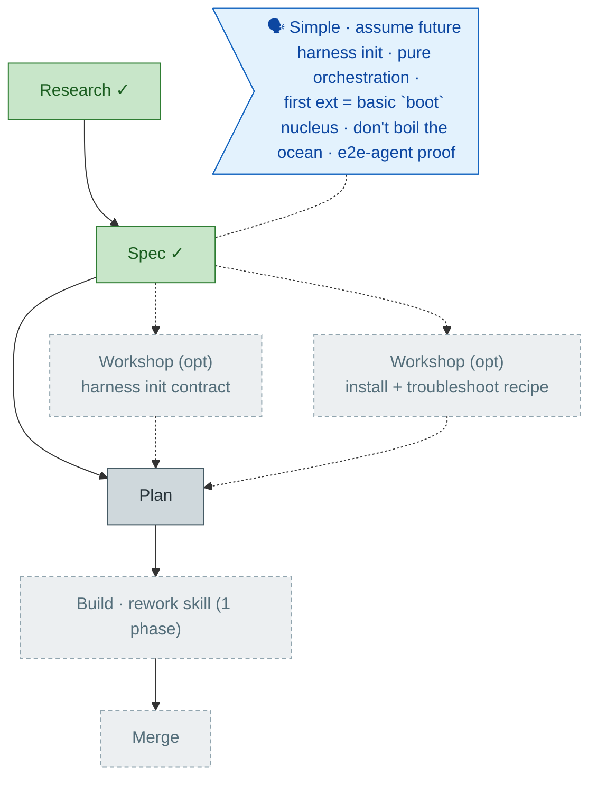

# Flight plan — harness-setup-flow

**Legend**: 🟩 done · 🟧 in progress · 🟥 blocked · 🟦 known (designed) · ⬜ assumed (speculative) · 🗣 your words

_Generated from `the-flow.json` — do not hand-edit._
