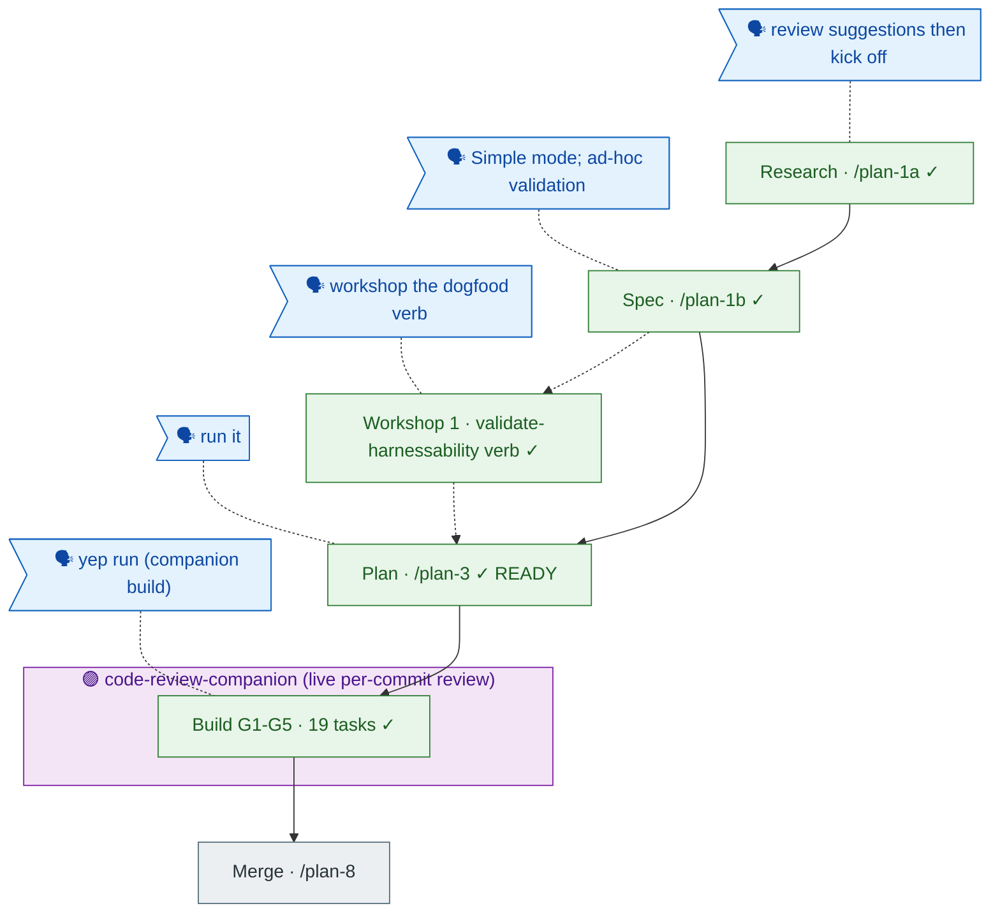

<!-- GENERATED from the-flow.json — do not hand-edit. -->
# Flight plan — harnessability-survey  (Simple)

**Legend** — 🟩 done · 🟦 known (designed) · ⬜ assumed · 🗣 user input · 🟣 companion (live review) · dotted = excursion

_Build complete: 19 tasks (G1-G5) landed + companion-reviewed (F004 HIGH shell-injection caught & fixed; F002 fixed; F001 dispositioned; F003 pre-resolved). Companion superseded /plan-7. Next: /plan-8 merge. No engineering-harness governance doc → harness-loop nodes omitted; standard structural-validation testing._
