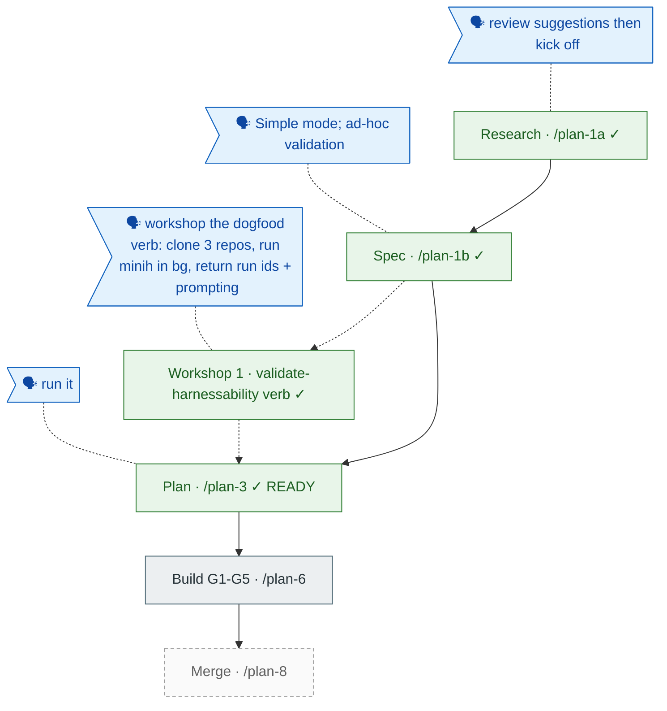

<!-- GENERATED from the-flow.json — do not hand-edit. -->
# Flight plan — harnessability-survey  (Simple)

**Legend** — 🟩 done · 🟧 in progress · 🟦 known (designed) · ⬜ assumed (speculative) · 🗣 user input · dotted = excursion

_Plan READY (G1 Clarify · G2 Constitution · G3 Architecture · G5 Structure · G6 Testing · G7 Domain all PASS; G4 ADR N/A). Deep validation: VALIDATED WITH FIXES (T016 split, T018 sub-checks decomposed). No engineering-harness governance doc → harness-loop nodes omitted; standard structural-validation testing._
