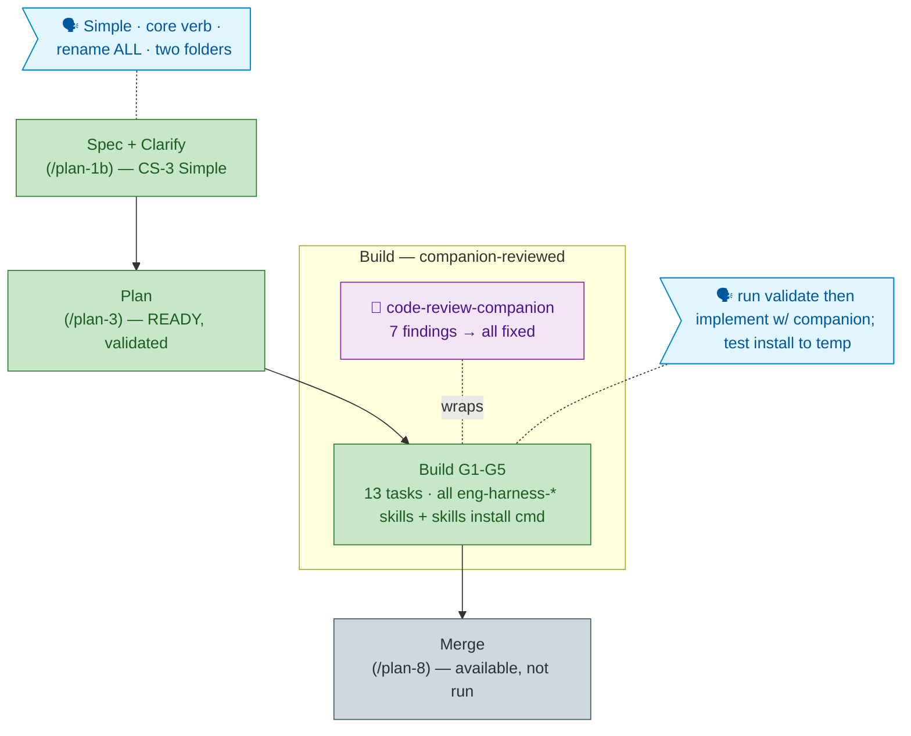

# Flight plan — harness-skills-install

> Generated from `the-flow.json` (source of truth). Do not hand-edit.

**Legend** — 🟩 done · 🟧 in-progress · 🟦 known (designed future) · ⬜ assumed · 🗣 user input · 🟪 companion

_No `docs/project-rules/engineering-harness.md` in this repo → harness-loop nodes omitted; standard testing fallback applied. Companion (minih) superseded `/plan-7`._
