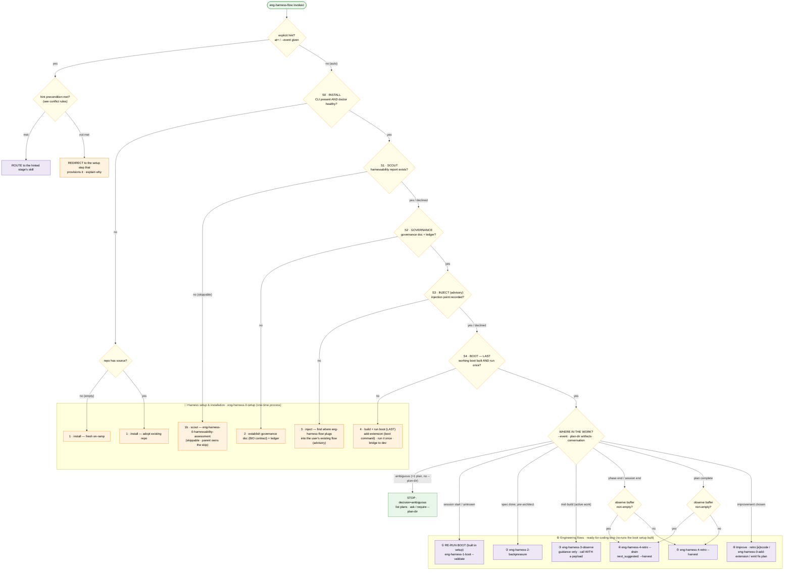
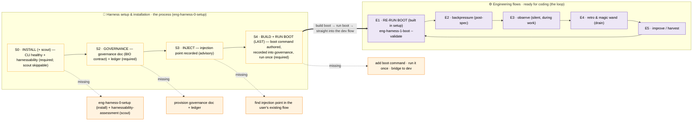

# `eng-harness-flow` — decision flow (if this state, do this)

A single, scannable branching map for the stateless router. Read top-to-bottom: the **first** matching condition wins. The router re-evaluates this whole tree on **every** call (it stores nothing).

> One call = one route. The router reads signals, picks **one** next harness command, returns it (prints + `--json`), optionally runs it on request, then forgets everything.

> **Every turn is a pleasant, legible beat** (like `the-flow`): a **progress rail** of pips, a one-line **now / next**, and a **flag beat** that surfaces anything important the user might have missed — then the single next command, offered (never forced). Because the router is stateless, the rail is **recomputed from substrate each call**, not read from a saved journey:
>
> ```
> [eng-harness-flow] 🧰 ●─●─◐─○─○  →  ⚙️ ○──↺
>  now  · establishing governance  (setup 3 of 5)
>  next · find your injection point, then build boot
>  ⚠️  governance still owed — boot will report UNAVAILABLE until it exists
> ```
>
> Beats per turn: **Orient → Flag → Insight → Suggest → Invite** (one decision, recommended default, "if unsure" path). Flags are *lifted verbatim* from the artifact, capped, silent when clean, and never a gate. Full design: the workshop's § User experience.

---

## The decision tree

Two zones, one diagram. **🧰 Harness setup & installation** is the one-time process (install + scout, **establish governance**, find the **injection point**, then **build + run boot — last**). **⚙️ Engineering flows** is the ready-for-coding loop you re-enter every session — its first step **re-runs** the boot that setup built. The yellow diamonds are the router's spine that decides which zone you land in.



**Legend** — 🟨 router spine (a question) · 🟧 **🧰 harness-setup/installation** route · 🟪 **⚙️ engineering-flow** route · 🟩 stop/no-route. The two grouping boxes keep the concepts separate: everything in 🧰 is the one-time setup *process* (install+scout → governance → inject → **build+run boot last**); everything in ⚙️ is the repeated coding-time loop. **Boot is *built last* in 🧰 (S4) and *re-run* in ⚙️ (①)** — building it flows straight into running it and then into real work; the engineering zone never creates boot.

---

## The same logic as an "if state → do this" table

Evaluated **top to bottom; first match wins.**

| # | If the state is… | …do this (the one route) | zone | `decision` |
|---|---|---|---|---|
| 1 | a valid `at=`/`--event` hint **with its precondition met** | route to that stage's skill | — | `route` |
| 2 | a hint whose **precondition is NOT met** | redirect to the setup step that provisions it, say why | — | `redirect` |
| 3 | **no harness CLI** + repo is empty | `eng-harness-0-setup` · 1 install (fresh on-ramp) | 🧰 setup | `route` |
| 4 | **no harness CLI** + repo has source | `eng-harness-0-setup` · 1 install (adopt existing) | 🧰 setup | `route` |
| 5 | CLI present, **no harnessability report** | `eng-harness-0-harnessability-assessment` · 1b scout (skippable) | 🧰 setup | `route` |
| 6 | scouted, **no governance doc / ledger** | provision the governance doc (BIO contract) + `docs/harness/` · 2 governance | 🧰 setup | `route` |
| 7 | governance exists, **no injection point** | `eng-harness-0-setup` · 3 inject — find where `eng-harness-flow` plugs into the user's existing flow (advisory) | 🧰 setup | `route` |
| 8 | inject done, **no working boot** | `eng-harness-0-add-extension` · 4 **build + run boot (LAST)** — figure out boot, record into governance, run once → bridge to dev | 🧰 setup | `route` |
| 9 | setup complete + **>1 candidate plan**, no `--plan-dir` | ask which plan / require `--plan-dir` | — | `ambiguous` |
| 10 | setup complete, **session start / position unknown** | **RE-RUN the boot setup built** — `eng-harness-1-boot --validate` | ⚙️ eng | `route` |
| 11 | setup complete, **spec done, before architect** | `eng-harness-2-backpressure` | ⚙️ eng | `route` |
| 12 | setup complete, **mid-build** | `eng-harness-3-observe` (guidance; silent call only with payload) | ⚙️ eng | `route` |
| 13 | **phase/session end**, buffer non-empty | `eng-harness-4-retro --drain` (then `--harvest`) | ⚙️ eng | `route` |
| 14 | **phase/session end OR plan complete**, buffer empty | `eng-harness-4-retro --harvest` | ⚙️ eng | `route` |
| 15 | **plan complete**, buffer non-empty | `eng-harness-4-retro --drain` first (then `--harvest`) | ⚙️ eng | `route` |
| 16 | **improvement chosen** from a retro | retro `[e]ncode` / `eng-harness-0-add-extension` / emit fix plan | ⚙️ eng | `route` |

> **Boot is the LAST setup step (row 8), re-run in engineering (row 10).** Rows 3–8 (🧰) are the one-time setup *process* — install+scout, establish governance, inject, then **build + run boot last**. Building boot flows straight into running it and into real work ("build boot, run boot, then try the harness"); row 10 is *re-running* that boot at the start of each later session.

---

## The setup gate → engineering zone (boot is built last, re-run in engineering)

The router walks the **🧰 setup gate** in order — install+scout → governance → inject → **build+run boot (last)** — and the first missing step routes to the setup action that provisions it. **Inject (S3) deliberately comes before boot (S4)** so the injection point is known the instant boot works; **building + running boot is the last setup step (S4)** and the *bridge* into the dev loop. The engineering zone's first step just **re-runs** that boot.



> **This repo today**: S0 ✅ (CLI + extension) · S1 ⚠️ (a harnessability *skill* exists but no committed report) · **S2 ❌ no governance doc** · S3 ❌ no injection point · **S4 ❌ no working boot** → the first required unmet step is S2 → route = provision governance, then inject, then **build + run boot last**. The repo is still in 🧰 — it hasn't reached the ⚙️ re-run-boot step.

---

## Hint conflict rules (row 1 vs row 2)

A hint is honoured **only if** its precondition holds; otherwise the router resolves deterministically — it never blindly runs a contradicted stage.

| Hint / `--event` | If this conflict… | `decision` | Router does |
|---|---|---|---|
| `at=boot` | no governance (S2) or boot not yet built (S4) | `redirect` | route to the missing setup step — provision governance (S2) then **build + run boot last** (S4) · `missing_rung: S2`/`S4` |
| `at=backpressure` | no spec, or >1 spec & no `--spec` | `redirect` / `ambiguous` | ask for `--spec`, or route `/plan-1b` first |
| `at=retro-drain` | buffer empty | `noop` | "nothing to drain"; suggest `--harvest` |
| `at=retro-harvest` | buffer non-empty | `redirect` | drain first · `next_suggested: --harvest` |
| `at=setup` | already set up | `noop` | "already set up"; suggest `at=boot` |
| `at=auto` | >1 plan, no `--plan-dir` | `ambiguous` | list plans · ask / require `--plan-dir` |

---

## The `--json` envelope (what every call returns)

```json
{
  "requested_stage": "boot",
  "actual_stage": "setup",
  "decision": "route | redirect | noop | ambiguous",
  "command": "<exact next harness command>",
  "why": "<one line>",
  "produces": "<artifact the routed skill will create, or null>",
  "preconditions_met": false,
  "missing_rung": "S4-build-and-run-boot",
  "next_suggested": "<command after this one, e.g. --harvest after --drain>",
  "rail":  { "zone": "setup", "setup_pips": "●●◐○○", "loop_pips": "○○○○○", "cursor": "governance" },
  "now":   "<current stage, one line>",
  "next":  "<what follows, one line>",
  "flags": [ "<must-see item lifted verbatim from the artifact>" ],
  "insight": "<one interesting real detail>"
}
```

The `rail`/`now`/`next`/`flags`/`insight` fields carry the same **rail · stage · next · flag-beat** UX a human gets, so a machine caller can render it too.

---

## Two invariants behind the whole tree

1. **The setup gate gates engineering entry.** The router never crosses into the ⚙️ engineering zone (re-run-boot first) until the required 🧰 setup steps (install → governance → **build + run boot last**) are present. Boot is *built* as the last setup step and only *re-run* in engineering. A hint cannot bypass this. (There is **no `.disabled` opt-out** — if a user doesn't want the harness, they say so in chat and the agent simply stops calling this skill.)
2. **Statelessness, on purpose.** The tree is re-run every call from deterministic substrate (CLI/doctor, governance doc, report files, plan-dir artifacts, the observe buffer). The router remembers nothing across calls; durable state lives only in the substrate that child skills own.

_Source of the full design rationale_: [`workshops/001-harness-flow-entry-points.md`](./workshops/001-harness-flow-entry-points.md).
