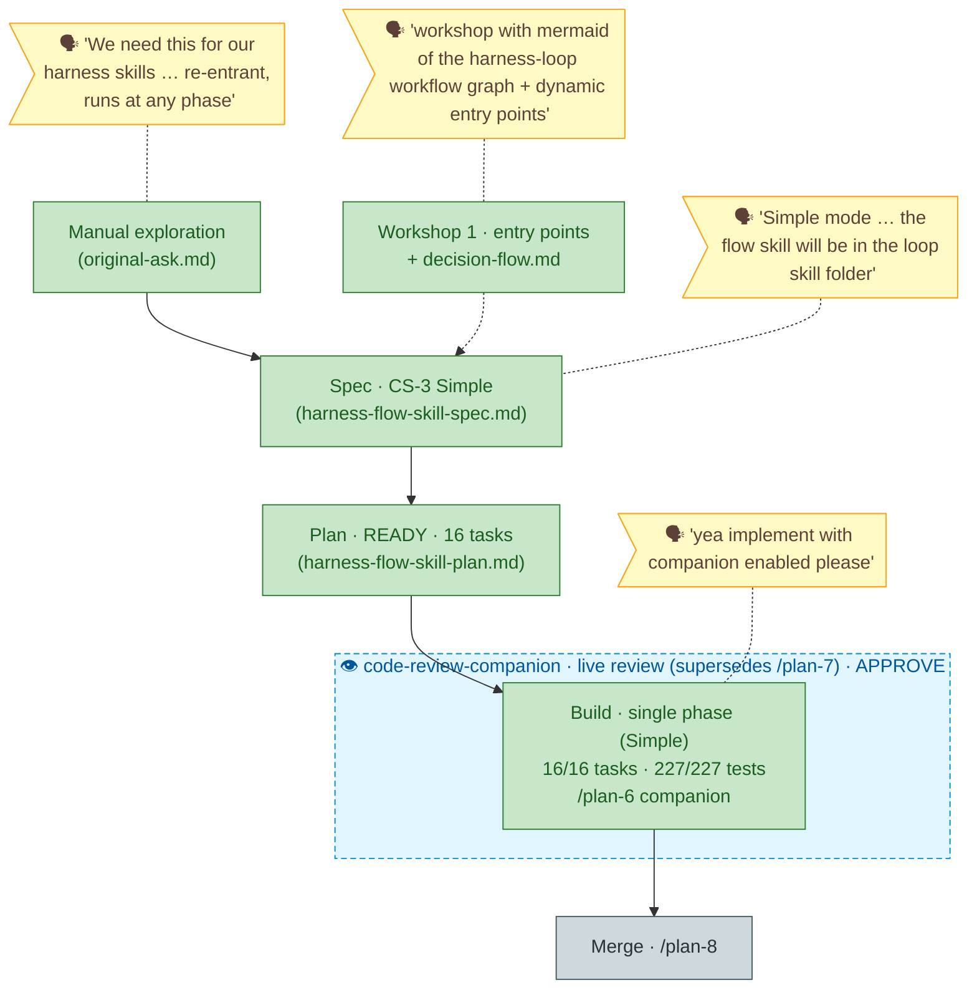

# Flight plan — `harness-flow-skill`

> Generated from `the-flow.json`. Do not hand-edit. Adopted by `/the-flow` from existing artifacts. No engineering-harness governance doc present → harness loop nodes omitted (spine + workshop only). Build ran via `/plan-6` **companion** — the live `code-review-companion` reviewed every commit and supersedes `/plan-7`, so the spine goes spec → plan → build → merge.

**Legend** — 🟩 done · 🟧 in progress · 🟥 blocked · 🟦 known (designed) · ⬜ assumed (speculative) · 🟨 🗣 your words · 🔵 👁 companion (live review).

**Now**: build done — 16/16 tasks, companion APPROVE, 227/227 CLI tests green. · **Next**: merge (`/plan-8`; merge itself needs a typed `PROCEED`).
