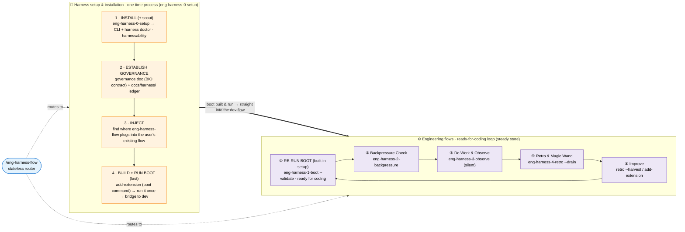
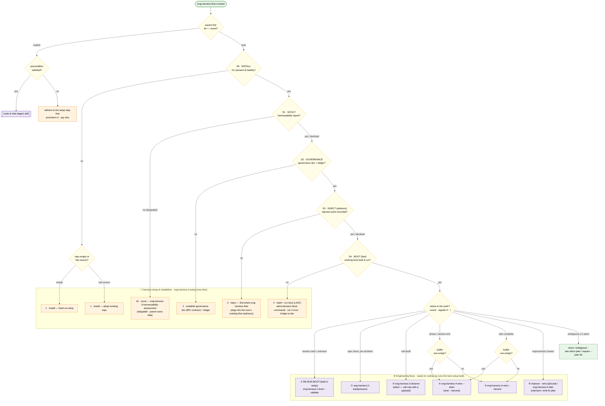
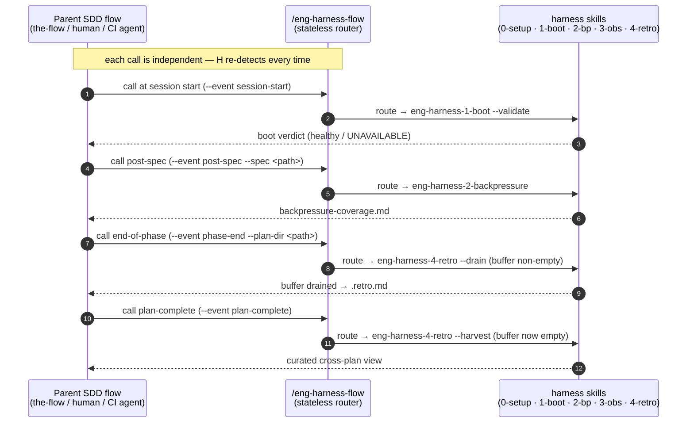

# Workshop: `eng-harness-flow` — a re-entrant harness-loop co-pilot

**Type**: Skill Flow / Dynamic-dispatch design (the harness-loop analogue of `the-flow`)
**Plan**: 011-harness-flow-skill
**Spec**: _(none yet — this workshop precedes the spec, per the ask)_
**Created**: 2026-06-09
**Status**: Draft

**Value Thesis**: Today the seven harness skills exist but a human or agent has to *know which one to run, when*. `the-flow` solved this for the SDD pipeline; nothing does it for the **harness loop**. `eng-harness-flow` is the missing front door: a **stateless router** that looks at the repo + the conversation, figures out *where on the loop you are*, and hands back the one right harness command — whether you are on an empty repo (set it up), a full repo with no harness (set it up), or mid-plan in a healthy harness (boot / backpressure / retro). It makes the loop **legible and enterable from anywhere** without the caller memorising the skill suite.

**Target Proof Level**: Decision Space → Preferred Direction (this workshop), then a thin spec.
**Current Proof Level**: Decision Space explored; one preferred direction recommended below.

**Selected Value Axes**:
- **Agent Readiness**: the skill's whole job is to *return routing prompting* — "you are at stage X, run this exact command, here is what it produces" — so a parent agent drives the loop with zero rediscovery.
- **Cost / Attention Reduction**: one entry point replaces "remember the seven `eng-harness-*` slugs and the order/conditions for each."
- **Re-entrancy**: callable again and again from any point in an externally-managed flow; no setup, no teardown, no journey to resume.
- **Composability**: a parent SDD flow (`the-flow`, a human, a CI agent) delegates *all* harness-loop decisions to this one skill instead of re-implementing the cues.

**Related Documents**:
- Reference design: `the-flow` (`skills/SDD/the-flow/` in `jakkaj/tools`) and its `references/getting-started.md`.
- The loop definition: `harness-foundations/directives.md` §Directive 2.
- The skills it routes to: `skills/eng-harness-setup/*`, `skills/eng-harness-loop/*`.
- Setup flow it delegates to (do not reinvent): `eng-harness-0-setup`.

---

## Purpose

Design a skill — provisionally **`eng-harness-flow`** — that does for the **harness loop** what `the-flow` does for the **SDD pipeline**: it is an ever-present guide that, on each invocation, *detects where you are* and routes you to the correct harness skill. It must:

1. Be **re-entrant** and enterable at **any** loop stage (the loop is cyclic, not linear).
2. **Auto-detect** the situation from deterministic repo signals + conversation history.
3. Handle the **🧰 setup on-ramp** cases by delegating to `eng-harness-0-setup`: empty repo → set it up; full repo with no harness → set it up. Setup is a *process* that **installs** the CLI, **scouts** the repo (harnessability), **establishes a working boot command + governance**, and helps **identify where to inject `eng-harness-flow`** into the user's existing flow.
4. Handle the **⚙️ engineering** cases: in a plan / mid-work → **run** boot (the one setup established), backpressure, observe (silent), retro.
5. Be callable **repeatedly from an external spec-driven flow**, accepting a light **parameter hint** from the parent agent.
6. **Own no artifacts** — unlike `the-flow`, it stores no state file, no `.json`/`.md` journey. Its child skills own *their* artifacts (harnessability reports, backpressure coverage, retro buffers).

## What the 🧰 setup process owns (and why Boot is built *last*, as the bridge into engineering)

`eng-harness-0-setup` is a **process**, not a single step. Everything that *establishes* the harness happens here, **once**, before steady-state engineering — and **boot is figured out and built last**, deliberately, so that the moment you've built it you *run* it and flow straight into the dev loop ("build boot, run boot, then try out the shiny new harness").

| # | Setup step | Skill / action | Deliverable |
|---|---|---|---|
| 1 | **Install (+ scout)** | `eng-harness-0-setup` (npx install) + `eng-harness-0-harnessability-assessment` to size up the repo | CLI present, `harness doctor` healthy; harnessability report |
| 2 | **Establish governance** | provision the governance doc (`docs/project-rules/engineering-harness.md`) + `docs/harness/` ledger — the BIO contract (health/interact/observe/signals/maturity), informed by the scout; the boot-command slot is filled in step 4 | governance doc skeleton + ledger |
| 3 | **Inject** | help the user find where in their **existing** flow (spec-driven `/plan-*`, CI, a `justfile`, or ad-hoc) to call `eng-harness-flow` | a recorded/agreed injection point |
| 4 | **Build + run boot (LAST)** | `eng-harness-0-add-extension` (figure out + author the boot command), record it into governance, then **run it once to validate** — the bridge straight into the dev flow | a *working* `harness boot`; first successful boot |

> **Boot is built last in setup, then run every session in engineering.** Figuring out and authoring the boot command — and proving it boots once — is the **final 🧰 setup** step (step 4); it doubles as the **first** engineering action, which is why it's the *bridge*. The recurring ⚙️ engineering "Boot" is *re-running that command* at the start of each subsequent coding session (`eng-harness-1-boot --validate`). Inject comes **before** boot (step 3 < step 4) so that the moment boot works, the user already knows where `eng-harness-flow` plugs into their flow and can dive into real work. Governance is *established* early (step 2) as the contract; only the boot-command slot is filled at step 4.

## Fresh-entrant outcome

A fresh agent (or human) types `/eng-harness-flow`, and **without any other context** learns:

- whether this repo even *has* a harness yet, and if not, the exact command to start one;
- if it has one, whether it is **healthy** (and the one thing to fix if not);
- **where on the loop** the current work sits, and the **single next harness command** for that stage;
- that it can call this skill again at the next seam and get the next-right answer — no bookkeeping required.

---

## The core design decision — a **stateless router**, not a stateful guide

This is the headline difference from `the-flow`, and the ask calls it out directly ("Unlike the flow will probably not store data or Md or have other artefacts").

| Dimension | `the-flow` (SDD pipeline) | `eng-harness-flow` (harness loop) |
|---|---|---|
| Topology | **Linear DAG** — spec → plan → tasks → code → review → merge | **Cyclic loop** — Boot → Backpressure → Observe → Retro → Improve → Boot |
| State | **Stateful** — `.the-flow-state.json` + `the-flow.json` + `the-flow.md`, atomic writes, resume/adopt | **Stateless** — writes nothing; re-derives position every call |
| "Where am I?" | Read from its own state file (single owner, single journey) | Re-detected from **deterministic substrate** + conversation each call |
| Re-entry after `/compact` | Reload state file | Nothing to reload — just re-detect |
| Callers | One human driving one feature journey | **Many** — a human, `the-flow`, a CI agent, another orchestrator |
| Artifacts owned | Its own flight-plan files | **None** — child skills own theirs |
| Output | Narration + print-then-offer | **Routing prompting** (machine + human) + optional offer-to-run |
| Per-turn UX | Rail pips · now/next · Flag beat · Orient→Flag→Insight→Suggest→Invite | **Same pleasant UX**, but the rail is *recomputed from substrate each call* (not read from a journey file) |

**Why stateless is the right call here** (this is the load-bearing argument):

1. **The loop has no single journey to checkpoint.** The SDD pipeline is a journey with a start and an end; the harness loop is a *cycle you re-enter wherever the work is*. There is no monotonic progress to persist.
2. **The position is already observable in deterministic substrate.** `harness doctor`, the presence of a governance doc, a harnessability report file, the plan-dir artifacts, the retro buffer — these *are* the state. Re-deriving from them each call is **more robust than a parallel state file that can drift** — and "prefer deterministic observation over remembered state" is itself a harness principle.
3. **It has many unpredictable callers.** A per-flow state file assumes one owner and one cadence. A stateless router serves `the-flow`, a human, and a CI agent identically, at any cadence, with no coordination.
4. **KISS.** No state schema, no atomic-write dance, no compaction handshake, no adoption contract, nothing to clean up. The skill is a pure function: `(repo signals, conversation, optional hint) → next harness action`.

> **Design stance**: `eng-harness-flow` is a **pure dispatcher**. It only *reads* (repo + conversation) and *routes* (prints/offers the next harness command, or runs it on request). The moment it would need to *remember* something across calls, that something belongs in deterministic substrate a child skill owns — not in this skill.

---

## Diagram 1 — the harness loop and where each skill sits

Two grouped concepts, kept separate: **🧰 Harness setup & installation** (the one-time process that *establishes* the substrate — install, scout, a **working boot command + governance**, and the injection point) and **⚙️ Engineering flows** (the repeated ready-for-coding loop that *runs* it). **Boot is established in setup**; the engineering loop only *runs* it.



The router (blue) doesn't sit *inside* either zone — it sits *beside* them and points the caller at the right step. **🧰 setup** (orange) is a one-time *process* a new repo runs once: install+scout, establish governance, find the injection point, and **build+run boot last**. **⚙️ engineering flows** (violet) is where the caller lives afterward, and step ① **re-runs** the boot setup built — it never *creates* boot. The on-ramp's `==>` edge into the loop *is* the first boot run: "build boot, run boot, then try the harness."

---

## The dynamic entry points — detection signals

The router decides purely from signals it can **read** (no state of its own). This is the catalog; Diagram 2 applies them in *decision* order (hints first, then the setup gate). There is **no `.disabled` opt-out** — opting out of the harness is a conversational act (the user says so and the agent stops calling the loop skills), not a sentinel file:

| # | Signal | How it's read | Tells us |
|---|---|---|---|
| A | **Harness CLI present** | `harness --version` resolves; or `.harness/` dir exists; or `package.json`/`npx` target present | Is there a harness at all? |
| B | **CLI healthy** | `harness doctor` **JSON envelope** read by `exit_code`/`status` field (not prose — a fresh consumer repo can report *degraded* legitimately, per `eng-harness-0-setup`) | Does the CLI itself load/run? |
| C | **Working boot command** | a `boot` verb/recipe exists (`.harness/extensions/boot.*`, a `justfile`/`package.json` boot, or governance declares it) **and** boots cleanly | Did setup establish a boot we can run? |
| D | **Governance doc** | `docs/project-rules/engineering-harness.md` (canonical) / legacy `agent-harness.md` / `harness.md` | Boot/Interact/Observe contract present (Boot needs this or it reports `UNAVAILABLE`) |
| E | **Loop substrate** | `docs/harness/_buffers/` + `docs/harness/agents/` exist (observe writes the buffer; retro reads/writes the ledger) | Can Observe/Retro actually record anything? |
| F | **Harnessability report** | any report under `.harness/reports/harnessability/` (filename TBD — see D8) | Has the repo been sized up? |
| G | **Repo shape** | source tree empty vs. has source (e.g. `src/`, `package.json`, a language toolchain) | Fresh on-ramp vs. adopt-existing |
| H | **In-a-plan position** | `docs/plans/*/` artifacts: `*-spec.md` (post-spec), `*-plan.md` (post-architect), `tasks/phase-*/` + `execution.log.md` (mid-build), `reviews/` (reviewed) | Which loop stage the work is at *(best-effort — see "limits" below)* |
| I | **Conversation history** | the live session (what the parent just did/said) | Disambiguates G/H when files are inconclusive |
| J | **Parent hint (params)** | `at=<stage>` / `--event` / `--plan-dir` / `--spec` / `--phase` (see §Parameter contract) | Lets the parent pin position and skip detection |

### Setup gate vs engineering zone (the load-bearing refinement)

A single "harness functional?" gate is **not** enough to enter the engineering loop. The **🧰 setup process** must have *established* the substrate the loop runs on, in a deliberate order ending with boot: **install (+scout) → governance → inject → build+run boot**. The router walks these in order and routes the *first missing one* to the setup step that provisions it. Crucially, **building + running boot is the *last* setup step (S4)** and doubles as the first engineering action — the bridge into the dev flow.

| Zone | Step | What setup must have established | Read via | If missing → route to (setup step) |
|---|---|---|---|---|
| 🧰 setup | **S0 · Install** | CLI present + `harness doctor` healthy | A · B | `eng-harness-0-setup` (install) — **required** |
| 🧰 setup | **S1 · Scout** | harnessability report exists | F | `eng-harness-0-harnessability-assessment` — *skippable* |
| 🧰 setup | **S2 · Governance** | governance doc (BIO contract) + `docs/harness/` ledger | D · E | provision governance doc + ledger — **required** |
| 🧰 setup | **S3 · Inject** | a recorded injection point for `eng-harness-flow` in the user's existing flow | conversation / a noted decision | `eng-harness-0-setup` (inject step) — *advisory* |
| 🧰 setup | **S4 · Build + run boot (last)** | a **working boot command** (authored, recorded into governance, **and run once**) | C | `eng-harness-0-add-extension` (figure out + author boot, validate it boots) — **required** |
| ⚙️ eng | **E1 · Re-run boot** | — (an **action**, not a presence-check) | — | **RE-RUN the boot setup built** — `eng-harness-1-boot --validate` (per coding session) |

- **Required steps** (S0 install, S2 governance, S4 boot) hard-gate the engineering zone: no governance + working boot ⇒ the loop skills report `UNAVAILABLE`/no-op, so the router stays on the 🧰 setup track.
- **Skippable/advisory steps** (S1 scout, S3 inject) are *offered*, never blocking; a parent that doesn't want them passes `--prompt-optional=false` (the router is stateless, so a skip re-offers next call unless the artifact exists).
- **Boot is the bridge.** S4 (build + first-run boot) is the **last** setup step; E1 is *re-running* it each subsequent session. **Inject (S3) deliberately comes before boot (S4)** so that the instant boot works, the user already knows where `eng-harness-flow` plugs in and dives straight into real work.

> **This repo is the worked example.** Right now `harness-engineering` has the CLI **and** one extension (`.harness/extensions/validate-harnessability.ts`) but **no governance doc and no working `boot` command** → S0 holds, **S2 fails** (and S1 scout is partial — a harnessability *skill* exists but no committed report; S3 inject + S4 boot are still owed). The router routes to `eng-harness-0-setup` to **establish governance**, then inject, then **build + run boot last** — exactly the dogfood the repo needs. The repo is still in 🧰; it has not reached the ⚙️ re-run-boot step.

---

## Diagram 2 — the dispatcher decision graph (the heart of the skill)

Given the detected signals, this is the routing logic. The **🧰 setup gate** (install → scout → governance → inject → **build+run boot last**) must clear before the router crosses into the **⚙️ engineering zone**, whose first step *re-runs* the boot setup built; every leaf is a **single harness command** the router prints/offers. (There is no `.disabled` sentinel — opting out is conversational.) The two grouping boxes keep setup and engineering visually separate.



Reading the graph:
- **Hint path first** → an explicit `at=`/`--event` is honoured *only if its precondition holds*; otherwise the router **redirects** to the setup step that provisions it and says why (never blindly runs the named stage).
- **S0=no** → 🧰 install. Empty repo *or* full repo with no harness both land in `eng-harness-0-setup`; the only difference is framing (*fresh* vs *adopt-existing*). Satisfies "empty repo → setup offer" and "full repo, no harness → set it up."
- **S1 scout** → offer harnessability (skippable). The router does **not** remember a skip (see "limits"); a parent that wants to stop re-offering passes `--prompt-optional=false` or relies on the report appearing.
- **S2 governance** → the **required** rung: provision the governance doc (the BIO contract) + ledger, informed by the scout. Without it the loop skills report `UNAVAILABLE`.
- **S3 inject (before boot)** → help the user record **where in their existing flow** (spec-driven `/plan-*`, CI, a `justfile`, ad-hoc) to call `eng-harness-flow`. Advisory; comes *before* boot so the injection point is known the instant boot works.
- **S4 build + run boot (LAST)** → figure out + author the boot command, record it into governance, and **run it once**. This is where boot is *created and validated*, and it's the **bridge**: build boot → run boot → straight into the dev flow.
- **W** → the **⚙️ engineering dispatch**: step ① **re-runs** the established boot, then backpressure / observe / retro-drain / retro-harvest / **improve**. Satisfies "if it detects we're in a plan … run harness boot or other loop skills."
- **Boot is built last in setup, re-run in engineering** → S4 *creates+runs* boot once (the bridge); ⚙️ ① *re-runs* it each session. The engineering zone is reachable only once the required setup steps (S0 install, S2 governance, S4 boot) hold.
- **Drain-before-harvest** → at phase/session/plan end, if the observe buffer is non-empty the router drains it to `.retro.md` *first* (harvest only reads `.retro.md`, so harvesting a non-drained buffer would miss the latest session). One command per call; the parent calls again for harvest.
- **Improve** → the loop only *compounds* when retro leads to an encoded improvement; the router can route a chosen improvement to retro `[e]ncode`, to `eng-harness-0-add-extension` (new verb), or emit a fix-plan command.
- **Ambiguous** → with >1 candidate plan and no `--plan-dir`, the router returns `ambiguous` and asks — it does **not** guess from conversation alone.

---

## Diagram 3 — called repeatedly along an externally-managed SDD flow

The router is designed to be **invoked again and again** by a parent that is running its *own* spec-driven flow. **The seams where the parent calls the router are exactly the "injection points" that setup step 4 helped identify** — once you know *where* in your flow to inject `eng-harness-flow`, each call is a fresh, stateless detection. The parent passes a light hint at each seam; the router returns the right harness action. It holds no memory between calls.



Note the parent keeps its own journey state (or is a human); the router is a **stateless oracle** the parent consults at each seam. This is the inversion of `the-flow`'s harness cues: instead of `the-flow` hard-coding *which* harness skill to mention at each seam, it could simply call `/eng-harness-flow at=<seam>` and let this skill own the harness-routing logic in one place.

---

## User experience — how every turn communicates (rail · stage · next · flag beat)

`the-flow` is a *pleasant* experience because every turn does four things: shows a **progress rail** (pips), says **where we are** and **what's next**, and **flags anything important the user might have missed** — all in a warm, confirming-not-nagging voice. `eng-harness-flow` adopts the same UX. The one adaptation: because the router is **stateless**, the rail is **recomputed from substrate every call** (not read from a saved journey) — but the *feel* is identical.

### 1. The host rail (pips) — always first, every turn

Every human-mode turn opens with a one-line rail on its own line, then a blank line, then the narration. The rail shows **both zones** with the cursor in the active one. Setup is a finite gate (a fill bar); the engineering loop is a cycle (a position marker with `↺`).

```
[eng-harness-flow] 🧰 ●─●─◐─○─○  →  ⚙️ ○──↺
 now  · establishing governance  (setup 3 of 5)
 next · find your injection point, then build boot
```

Once setup is done, the cursor lives in the loop:

```
[eng-harness-flow] 🧰 ●●●●●  →  ⚙️ Boot ◐ · BP ○ · Obs ○ · Retro ○ · Improve ○ ↺
 now  · running boot — proving the env is healthy before coding
 next · backpressure, once the spec lands
```

- **Glyphs** (tunable, mirroring `the-flow`): `●`/`◆` done · `◐` current · `○`/`◇` not yet · `↺` the loop continues (engineering never "completes" — it cycles).
- **Setup pips** = the 5 setup steps (install · scout · governance · inject · boot). **Engineering pips** = the 5 loop stages.
- **Stateless rail**: the fill is *derived from signals each call* (which setup rungs hold; where in the work) — never persisted. Frame it once, early, as *an at-a-glance map, not a saved journey*.
- **Status line** under the pips, in an accent colour: `now · <current>` and `next · <what follows>`. When `next` has ≥2 options, stack them (recommended first), exactly like `the-flow`.

### 2. The per-turn narration contract — Orient → Flag → Insight → Suggest → Invite

Every turn follows the same five beats (lifted from `the-flow`, one decision per turn, a recommended default + an "if unsure" path):

| Beat | What it does | Example (engineering, post-spec) |
|---|---|---|
| **Orient** | one line: which zone + stage, from the rail | "Setup's done — you're in the engineering loop, just past the spec." |
| **Flag** ⚠️ | surface must-see items the user might've missed (see §3) — *confirming, never nagging*; **silent when clean** | "⚠️ Boot flagged `no smoke path declared` — worth knowing before we lean on it." |
| **Insight** | one *interesting*, real detail about the stage or what it produces | "Backpressure writes `backpressure-coverage.md` — it tells you what's *provable* vs eyeballed before you build." |
| **Suggest** | print the **one** next command in a copyable block | `eng-harness-2-backpressure` |
| **Invite** | offer to run it; recommend the default, never force | "Want me to run it? (`yes` / run it yourself — either way I'll pick up from here.)" |

This is the same **print-then-offer** posture as `the-flow`: always show the command first (copyable anywhere), then offer to run it; one step per turn; never anything irreversible without explicit go-ahead.

### 3. The Flag beat — "just making sure you saw this" (the must-see, per stage)

Distinct from the single Insight (curiosity), the Flag beat surfaces the **decision-relevant must-sees** the user can't afford to miss (safety). Rules, lifted verbatim in spirit from `the-flow`: **lift, never derive** (quote the artifact's own alarm fields); **cap it** (a few max); **silent when clean** ("nothing flagged — clean"); **never a gate** (the user acts on it or waves past — invariant: the router never blocks).

| Stage | Scan for / flag (quote any hits) |
|---|---|
| Install / `doctor` | degraded or failed `doctor` reasons (read the JSON envelope, not prose) |
| Scout (harnessability) | Critical/High gaps — low proof ceiling, missing back-pressure surfaces, external-dependency exposure |
| Governance | still **owed** — boot will report `UNAVAILABLE` until it exists |
| Inject | no injection point recorded yet (so the parent flow won't know where to call back) |
| Build + run boot | `UNAVAILABLE`, a **failed/SLOW** boot, or a signal-readiness dimension reported "not declared" |
| Backpressure | **ABSENT / BUILDABLE** sensors (the eyeball-gaps); a recommended **Phase 0** |
| Retro drain | the `[s/t/p/e/d/a]` prompt the user just saw; N entries pending |
| Retro harvest | clustered/stale friction across the plan; unencoded magic-wands |
| Ambiguous | the candidate plans found (so the user can pick) |

### 4. Tone — make it pleasant

- **Warm and confirming**, never bureaucratic. "Nice — boot's green, you're ready to code" beats "S4 precondition satisfied."
- **One decision per turn.** Never dump the whole tree; surface the single next move + a couple of alternates.
- **Celebrate the bridge.** When setup finishes and boot first runs, say so — "🎉 boot's working — that's the harness alive; let's try it on real work." (the "shiny new harness" moment).
- **Never nag.** A skipped optional is offered at most once per call and waved past freely; flags are "just making sure you saw," never blockers.

### 5. How it folds into `--json` (machine callers get the same signals)

Human mode renders the rail/beats as prose; `--json` mode returns them as fields so a parent agent can render its own rail or relay the flags:

```jsonc
{
  "rail":  { "zone": "engineering", "setup_pips": "●●●●●", "loop_pips": "◐○○○○", "cursor": "boot" },
  "now":   "running boot — proving the env is healthy before coding",
  "next":  "backpressure, once the spec lands",
  "flags": [ "boot: no smoke path declared" ],
  "insight": "backpressure writes backpressure-coverage.md (provable vs eyeballed)",
  "command": "eng-harness-1-boot --validate",
  "decision": "route"
}
```

> **Why this matters for a *stateless* router.** `the-flow` can afford rich narration because it owns a journey file. `eng-harness-flow` gets the *same pleasant feel* with **zero stored state** — the rail, the now/next, and the flags are all *recomputed from substrate every call*. The UX is a pure function of "what the repo looks like right now," which is exactly why it survives `/compact`, serves any caller, and never drifts from reality.

---

## Parameter contract (the "basic parameter prompting from the parent agent")

The skill works with **no** arguments (full auto-detect), but a parent driving its own flow can **pin** position so detection is never ambiguous.

```
/eng-harness-flow [at=<stage>] [--event <seam>] [--plan-dir <path>] [--spec <path>]
                  [--phase <id>] [--prompt-optional <bool>] [--repo <path>] [--json]

at=auto            (default) detect from signals A–J
at=setup           force the on-ramp (install / finish setup / provision governance)
at=boot            force eng-harness-1-boot --validate
at=backpressure    force eng-harness-2-backpressure (post-spec seam)
at=observe         guidance only; with --entry-* it silently calls eng-harness-3-observe
at=retro-drain     force eng-harness-4-retro --drain (phase/session end)
at=retro-harvest   force eng-harness-4-retro --harvest (plan complete)
at=improve         route a chosen improvement (retro [e]ncode / add-extension / fix-plan)

--event <seam>     session-start | post-spec | pre-implement | task-pause |
                   phase-end | plan-complete   (a higher-level alias for at=)
--plan-dir <path>  pin the plan the loop stage refers to (disambiguates >1 plan)
--spec <path>      pin the spec for backpressure scoping
--phase <id>       pin the phase for boot/retro
--prompt-optional  <bool>  parent owns skip-suppression for optional offers (default true)
--repo <path>      operate on a repo other than cwd (multi-repo callers; v2)
--json             return the routing decision as a machine-readable envelope
```

- **`at=`/`--event` is a hint, not a command.** The router *validates the precondition* (the setup gate + the conflict matrix below). `at=boot` on a repo with no governance doc politely redirects to provisioning and says why; it never blindly runs the named stage when signals contradict it.
- **Observe needs a payload to do anything.** `eng-harness-3-observe` is a *silent producer that logs one entry per call*. So `at=observe` with no payload is **guidance only** ("observe fires silently — here's how friction gets logged"); to actually record, the parent passes the observe entry fields and the router calls observe silently.
- **Optional offers don't self-suppress.** Because the router is stateless, a skipped optional (harnessability, an offered backpressure) is *re-offered next call* unless the parent sets `--prompt-optional=false` or the child artifact now exists. The router treats only **child artifacts** as durable completion — never its own memory.
- **`--json`** returns the envelope below so a parent agent can act without parsing prose — the harness "return prompting" ethos.

```json
{
  "requested_stage": "boot",
  "actual_stage": "setup",
  "decision": "route | redirect | noop | ambiguous",
  "command": "<exact next harness command>",
  "why": "<one line>",
  "produces": "<artifact the routed skill will create, or null>",
  "preconditions_met": false,
  "missing_rung": "S4-build-and-run-boot",
  "next_suggested": "<the command after this one, e.g. --harvest after --drain>",
  "rail":  { "zone": "setup", "setup_pips": "●●◐○○", "loop_pips": "○○○○○", "cursor": "governance" },
  "now":   "<current stage, one line>",
  "next":  "<what follows, one line>",
  "flags": [ "<must-see item lifted verbatim from the artifact>" ],
  "insight": "<one interesting real detail>"
}
```

The `rail`/`now`/`next`/`flags`/`insight` fields carry the UX signals (see § User experience) so a machine caller can render the same pleasant rail + flag beat a human gets.

### Precondition / conflict matrix

When a hint conflicts with the detected signals, the router resolves deterministically (never guesses, never blindly runs):

| Hint / event | Conflict | `decision` | Router does |
|---|---|---|---|
| `at=boot` | no governance (S2) or boot not built yet (S4) | `redirect` | route to the missing step — provision governance (S2), then build+run boot last (S4); `missing_rung: S2`/`S4` |
| `at=backpressure` | no spec, or >1 spec and no `--spec` | `redirect` / `ambiguous` | ask for `--spec`, or route to `/plan-1b` first |
| `at=retro-drain` | buffer empty | `noop` | "nothing to drain"; suggest `--harvest` if `.retro.md` exist |
| `at=retro-harvest` | buffer non-empty | `redirect` | drain first; `next_suggested: --harvest` |
| `at=setup` | setup already complete | `noop` | "already set up"; suggest `at=boot` |
| `at=auto` | >1 candidate plan, no `--plan-dir` | `ambiguous` | list plans, ask / require `--plan-dir` |

### Slug resolution (avoid version drift)

Like `the-flow`'s alias table, the router maps friendly stage names → the **exact installed slug** at call time and never appends a guessed version suffix. The current map: `boot→eng-harness-1-boot`, `backpressure→eng-harness-2-backpressure`, `observe→eng-harness-3-observe`, `retro→eng-harness-4-retro`, `setup→eng-harness-0-setup`, `assess→eng-harness-0-harnessability-assessment`, `add-extension→eng-harness-0-add-extension`. If a slug fails to resolve, fall back to printing the bare stage name and point at `skills/eng-harness-*`.

---

## What `eng-harness-flow` does **not** do (recap of the stateless contract)

- ❌ **Writes no artifacts of its own** — no state file, no flight-plan `.json`/`.md`, no journey log. (Child skills own *their* artifacts: harnessability report, `backpressure-coverage.md`, retro buffers, `.retro.md`.)
- ❌ **Never gates, scores, or blocks** — every route is a *suggestion*; `at=` is a hint; the setup gate informs but never forces. (There is no `.disabled` opt-out — declining the harness is conversational.)
- ❌ **Never runs `minih`** (companions are owned by the plan-6 companion skill) and ❌ never runs `/compact`.
- ❌ **Never invents a verdict** — "is the harness healthy?" is answered by `harness doctor`, not by the router's opinion.
- ✅ **Reads** repo signals + conversation, **routes** to exactly one harness skill, optionally **runs it on request**, and is **safe to call any number of times**.

### Where statelessness has limits (and who absorbs them)

Statelessness is the right default, but it is not free. Three honest edges, and where the cost lands:

1. **Skipped optionals re-offer.** With no memory, a declined harnessability/backpressure offer comes back next call. **Absorbed by**: the parent flow (it owns skip-suppression via `--prompt-optional=false`), and by treating the **child artifact** as the only durable "done" signal. The router never nags *within* a call, but cannot remember *across* calls — by design.
2. **In-plan position is inferred, not known.** Plan-dir artifacts are ambiguous in real repos (multiple plans, stale phases, post-`/compact` context loss). `the-flow` needed an explicit state + adoption contract precisely because inference is unreliable. **Absorbed by**: the parent pinning `--plan-dir`/`--spec`/`--phase`/`--event`; when unpinned and ambiguous the router returns `ambiguous` and **asks** rather than guessing.
3. **Provisioning gaps look like engineering entry.** A repo can pass S0 (CLI installed) yet lack S2 (governance) or S4 (a *working, run-once* boot), so a naive "functional?" check would route into the engineering zone whose skills then report `UNAVAILABLE`/no-op. **Absorbed by**: the setup gate — the router refuses to enter `W` (the ⚙️ engineering dispatch) until the required setup steps (install + governance + built boot) hold. Boot is built as the *last* setup step, so the engineering zone never has to create it — it only re-runs it.

The unifying rule: **state that must persist lives in deterministic substrate a child skill owns (reports, buffers, `.retro.md`, governance doc) — never in this router.** If a need for router-owned memory ever appears, that is a signal the missing state belongs in substrate, not in `eng-harness-flow`.

---

## Relationship to existing skills (anti-reinvention)

- **`eng-harness-0-setup`** already *is* a flow (install → assess → basic boot). This workshop **expands its remit** to a five-step setup *process*, in this deliberate order: **install (+scout) → establish governance → identify the injection point → build + run boot (last)**. `eng-harness-flow` does **not** duplicate setup — when any setup step is incomplete it **delegates** to setup. Setup owns the *establishment* of the harness (governance + the boot command, which it should now provision — see D9); the router owns "which setup step is owed, or are we past setup and into engineering?" **Boot is built last** so that building it flows straight into running it and then into real work.
- **`the-flow`** owns the **SDD** journey and already narrates harness cues. The clean separation: `the-flow` = pipeline guide (stateful); `eng-harness-flow` = loop router (stateless). The **injection points** setup helps identify are exactly the seams where `the-flow` (or any parent) would call `eng-harness-flow` — so `the-flow` *could* be refactored to call it at its seams and let harness-routing logic live in **one** place (a follow-up, not a dependency).
- **The four loop skills** stay exactly as they are — the router only chooses *which* to surface and *when*.

---

## Naming & placement (decisions to confirm)

- **Name**: ✅ **`eng-harness-flow`** (confirmed) — parallels `the-flow`, fits the `eng-harness-*` family, no number because it sits *above* the numbered loop stages.
- **Placement**: it spans setup *and* loop, so it fits neither existing category folder cleanly. Options: (a) drop it in `skills/eng-harness-loop/` (loop-centric); (b) new category `skills/eng-harness-flow/eng-harness-flow/` (needs a `.minih.json` source addition — minih doesn't recurse); (c) `skills/eng-harness-setup/` (it's the front door). **Lean: (b)** — its own category keeps the "front door above the family" mental model and keeps `.minih.json` sources explicit.

---

## Governance & maturity — locked refinements (session 2026-06-09)

> These supersede earlier mentions of `docs/project-rules/engineering-harness.md` in this doc. Captured live with the user; they ride into the spec as acceptance criteria.

| # | Decision |
|---|---|
| **G1 · Path** | Governance doc lives at **`.harness/engineering-harness.md`** — keep all harness artifacts together (`.harness/` already holds `extensions/`, is tracked, not gitignored). Read order is **canonical-first**: `.harness/engineering-harness.md` → *(legacy)* `docs/project-rules/engineering-harness.md` → `agent-harness.md` → `harness.md`. |
| **G2 · Shipped references** | `eng-harness-flow` ships two reference md files: `references/governance-doc.md` (what the doc contains + when it's written) and `references/maturity-assessment.md` (the canonical **L0–L4** ladder + how to assess). **One canonical copy each** — boot/setup *link* to them, never restate. (Move the L0–L4 ladder out of `eng-harness-1-boot/SKILL.md` lines ~155–161 into `maturity-assessment.md`.) |
| **G3 · Trajectory = changelog, not a log** | `.harness/history.md` is a **harness changelog**: one row **per improvement encoded into the harness** (the *Improve* beat) — **not** per session/boot. Most loop flows add **zero** rows. A row is written only when a retro/magic-wand actually ships a harness change (new command, new sensor, faster boot, maturity-level move). |
| **G4 · Boot is read-only** | `eng-harness-1-boot` only **reads** maturity from the governance doc; it does **not** write governance or history. **Remove its Step 5 per-validate `## History` append.** No per-session writes anywhere. |
| **G5 · Governance write conditions** | Governance doc is written at **inception** (once, by setup — resolves D9); its **body** (boot cmd / signals / evidence paths / back-pressure gaps) and **current maturity snapshot** change **only at the Improve beat** when the harness gains/changes a capability. The doc keeps only the *current* maturity snapshot (thin contract); the trajectory lives in `history.md`. |

**Separation of concerns** this nails down: **governance doc = contract** (what the harness *is*, current maturity) · **`history.md` = changelog** (what *improved*, sparse) · **boot = runtime read** (reports, never writes).

---

## Decision space & open questions

| # | Question | Options | Preliminary lean |
|---|---|---|---|
| D1 | Name | `eng-harness-flow` / `-pilot` / `-guide` | **✅ DECIDED: `eng-harness-flow`** |
| D2 | Placement / minih source | loop folder / own folder / setup folder | own folder `(b)` |
| D3 | Drive vs coach | print-then-offer (like the-flow) / return-prompting only / both | **both** — return-prompting primary (`--json`), offer-to-run for humans |
| D4 | How aggressively to detect "in a plan" | files only / files + conversation / require `at=` hint | files + conversation, `at=` overrides |
| D5 | Does it ever run a child skill itself, or only print? | run on request / print only | run on request (one step), never irreversibly |
| D6 | Should `the-flow` be refactored to call it? | now / later / never | **later** (follow-up; don't couple) |
| D7 | Multi-repo (`--repo`) in v1? | yes / defer | defer to v2 unless a caller needs it |
| D8 | Harnessability report path | `latest.json` vs `<ordinal>-<slug>/report.json` (skills disagree today) | reconcile during spec — detect "any report present", note the inconsistency |
| D9 | Who provisions the **governance doc** (S2) and the **working boot** (S4)? | this router via setup / extend `eng-harness-0-setup` / out of scope | **⏭ DEFERRED to next plan** — provision via a deterministic `harness init` CLI command (already a declared forward dependency). Until then the router/boot degrade to `UNAVAILABLE`. See *Deferred — next plan*. |
| D9b | Who owns the **inject** step (S3, before boot)? | new `eng-harness-0-setup` step / separate skill / out of scope | a new advisory step in `eng-harness-0-setup` that helps the user find where to call `eng-harness-flow` in their existing flow — placed *before* boot so the injection point is known when boot first runs |
| D10 | In-loop position when **unpinned & ambiguous** | guess from conversation / return `ambiguous` + ask / require `--plan-dir` | return `ambiguous` + ask — never guess across >1 plan |
| D11 | `at=observe` shape | guidance-only / payload-call / both | both — guidance with no payload, silent observe call with `--entry-*` |
| D12 | Does the router suppress repeated optional offers? | router remembers / parent owns it | **parent owns it** (`--prompt-optional`); router stays stateless |
| D13 | Per-turn UX (rail · now/next · flag beat) | full `the-flow`-style narration / terse only / both modes | **full narration in human mode** (rail + Orient→Flag→Insight→Suggest→Invite), rail/flags folded into `--json` for machines; rail recomputed from substrate each call |

---

## Recommended direction (preferred)

> **Scope (confirmed 2026-06-09, refined)**: this plan covers the **`eng-harness-flow` router** plus the governance refactor parts that **don't require new CLI** — **G1** (path move to `.harness/engineering-harness.md`), **G2** (ship the two reference docs), **G3/G4/G5** (history.md changelog semantics, boot read-only, write-conditions). **Deferred to the next plan** (see *Deferred — next plan* below): **D9 inception/provisioning via `harness init`**. Until `harness init` ships, the router/boot **degrade gracefully to `UNAVAILABLE`** when no governance doc exists (existing behaviour) and setup keeps its current graceful-fallback call to `harness init`.

Build **`eng-harness-flow`** as a **stateless dispatcher skill**:

1. **Detect** from signals A–J. (No `.disabled` sentinel — declining the harness is conversational.)
2. **Gate on the 🧰 setup process** (install (+scout) → **establish governance** → **inject** → **build + run boot last**) — never cross into the ⚙️ engineering zone until the required steps (install + governance + built boot) hold; route the first missing step to the setup action that provisions it. Inject comes *before* boot; boot is built *last* and *re-run* in engineering.
3. **Route** via Diagram 2 to exactly one harness skill, with a one-line *why*, the artifact it produces, and a `next_suggested` (e.g. `--harvest` after `--drain`).
4. **Honour hints, validate preconditions** — resolve conflicts via the matrix; `redirect`/`noop`/`ambiguous` instead of blindly running a contradicted stage.
5. **Return prompting** (human + `--json` envelope); optionally run the routed step on an explicit go-ahead (one step, never irreversible).
6. **Communicate pleasantly, every turn** — open with the **rail** (pips), say **now / next**, run the **flag beat** (must-sees, lifted verbatim, silent when clean), give one **insight**, then **print-and-offer** the next command (Orient→Flag→Insight→Suggest→Invite). The rail/flags fold into `--json` for machine callers.
7. **Store nothing** — re-detect every call; child skills own all artifacts; the parent owns skip-suppression. The rail itself is recomputed from substrate each call.

This is the smallest thing that makes the harness loop **enterable from anywhere** by **any caller**, **any number of times**, with **no bookkeeping** — which is exactly what a *loop* (as opposed to a journey) needs.

## Deferred — next plan (`harness init` + governance inception)

> Pulled out of 011 to avoid scope creep (confirmed 2026-06-09); the user has other items for that plan too. **Resolve there**, carrying the design worked out below so it isn't re-derived:

- **D9 — who provisions the governance doc at inception.** Leaning: **a deterministic `harness init` CLI command** (not the skill). It is *already a declared forward dependency* — `eng-harness-0-setup/SKILL.md:67` already calls `npx harness init` with a graceful-fallback note, and `AUTHORING.md:20,27` reserve generation for the CLI. So this *fulfils* an anticipated gap, and keeps setup's "orchestrate, don't generate" identity intact.
- **Deterministic vs judgement split** (the design): `harness init` stamps the **skeleton** — `.harness/engineering-harness.md` with headings + placeholders, maturity seeded at **L1** ("front door exists"), links to `maturity-assessment.md`; plus an empty `.harness/history.md`. The **skill flow** (scout + `add-extension` + first boot) fills the **judgement** content (real boot command, signal inventory, evidence paths). Boot reads; the Improve beat edits body + appends history rows.
- **Open `harness init` design qs**: scope (just the two files vs also an `AGENTS.md` pointer — lean minimal); idempotent + non-clobbering with `--force` (mirrors `harness new --force`); the CLI embeds its **own** template (can't read a skill's `references/`), with a test keeping it in sync with the documented structure; sits as a sibling act in `harness/cli/src/acts/` + a `services/init/`.
- **D9b — the inject step** (help the user find where to call `eng-harness-flow` in their existing flow): advisory **skill** step in `eng-harness-0-setup`, placed *before* boot. **Lean: defer with D9** so the setup-flow edits land together.

## Suggested next steps

- Confirm D2 (placement) with the user; **D9 is deferred to the next plan** (see *Deferred* above).
- Write a spec from this workshop's recommended direction, carrying the setup gate + conflict matrix + **G1–G5** as acceptance criteria.
- Then `eng-harness-0-add-extension`-style authoring of the skill body + a `references/getting-started.md` mirroring `the-flow`'s.
