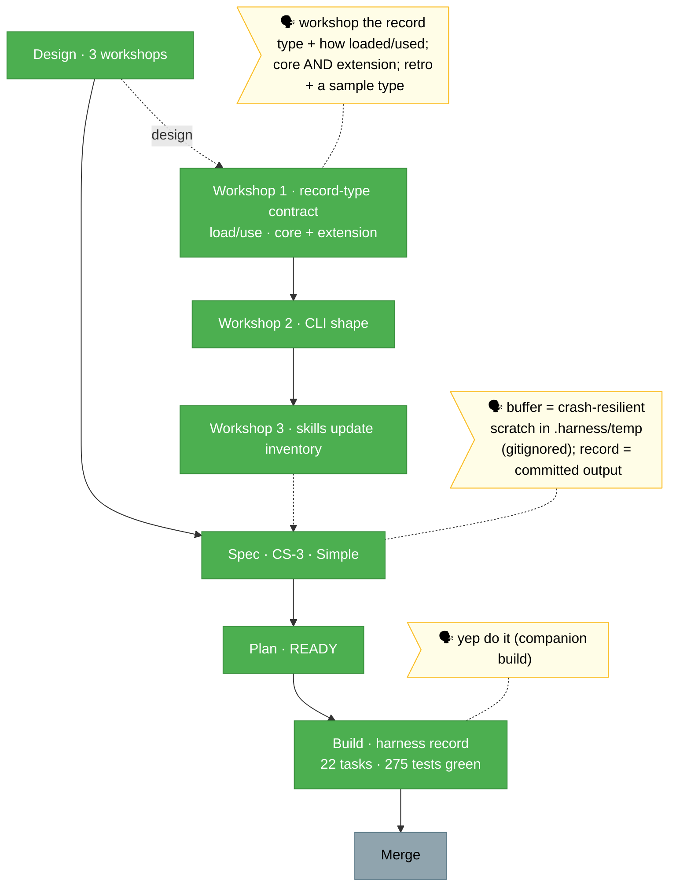

# `the-flow.md` — harness-record-command (flight view)

> Generated from `the-flow.json` (source of truth) — never hand-edit as primary.

**Plan**: harness-record-command · **Mode**: Simple · **Phases**: 1 (single-phase, 22 tasks)
**Rail**: `[the-flow] ◆─◆─◆─◆─◇`   ·   **now**: Build landed (275 tests green) · **next**: Merge

**Legend**: 🟩 done · 🟧 in progress · 🟥 blocked · 🟦 known future (designed) · ⬜╴assumed future (dashed) · 🟨 🗣 verbatim user input

_Build complete: all 22 tasks across 6 commits, `just fft` green (275 tests, 91.66% coverage), real end-to-end smokes pass for the core retro + extension dev-survey paths. The companion died after Group B (0 findings raised) so a backfill code-review pass ran → 2 LOW fixes adopted. Next: `/plan-8` analyses the merge. No harness-loop nodes (repo has no governance doc)._
