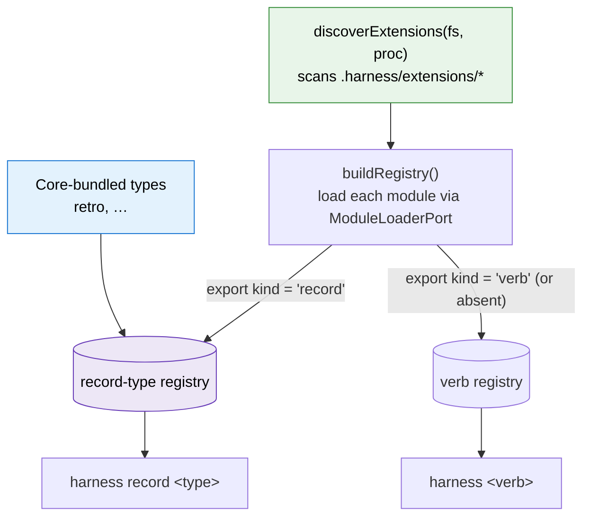
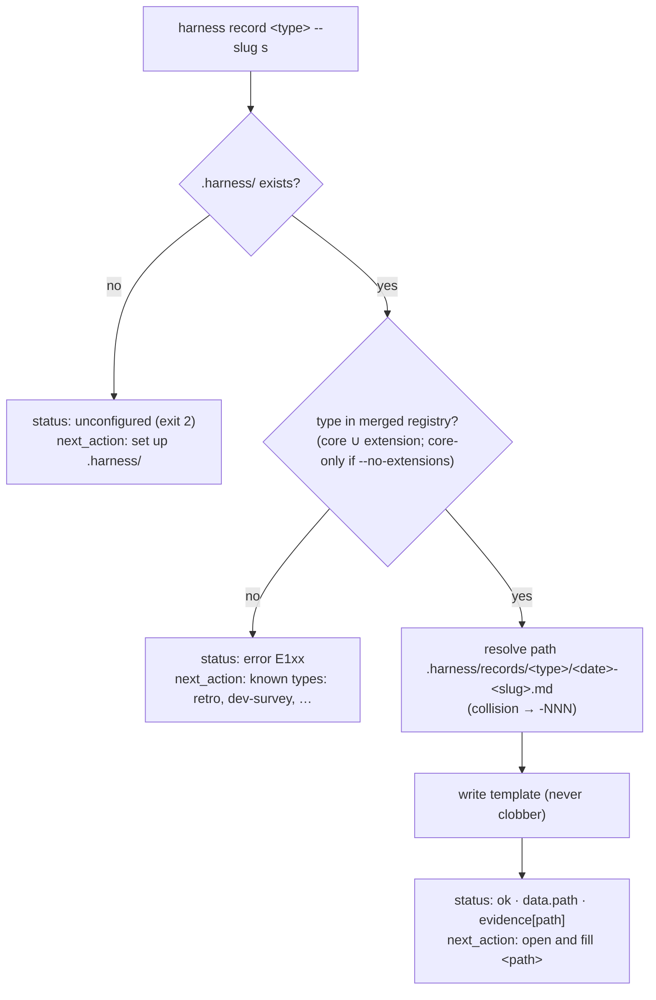

# Workshop: Record-type contract — definition, loading, and use (core + extension)

**Type**: Data Model / Integration Pattern
**Plan**: 012-harness-record-command
**Spec**: (pre-spec — grounded in [`../original-ask.md`](../original-ask.md))
**Created**: 2026-06-09T09:55:44Z
**Status**: Draft

**Value Thesis**: Pins the smallest contract that lets a record type be *defined once* and *used everywhere* — bundled in core or dropped in as an extension — so adding the next record type (survey, handover, …) is a template + four fields, not a code change to the `record` command.
**Target Proof Level**: Contract Ready
**Current Proof Level**: Preferred Direction → Contract Ready

**Selected Value Axes**:
- **Implementation Readiness**: gives `/plan-3` a concrete `HarnessRecordType` interface + loader wiring to build from.
- **Safety to Change**: the CLI stays schema-agnostic, so a record type's schema can evolve without touching `record`.
- **Learning Compounding**: the contract is the seam every future record type plugs into — decided once here.
- **Cross-Domain Coordination**: defines exactly how core-bundled and extension-provided types coexist in one registry.

**Related Documents**:
- Workshop 2 — CLI shape (the `harness record` surface that consumes this registry)
- Workshop 3 — Skills update inventory (who writes records via this contract)
- Existing extension contract: `harness/cli/src/services/extensions/{contract,discovery,registry}.ts`
- Frozen retro schema: `skills/eng-harness-loop/eng-harness-4-retro/references/retro.schema.json`

---

## Purpose

Define how a "record type" (like `retro`) is described, discovered, and resolved — identically whether it ships **in core** or arrives via an **extension** — and prove the contract is generic by working two concrete types: the existing `retro` record and a short `dev-survey` sample.

## Fresh Entrant Outcome

A fresh human or agent should be able to use this workshop to reach **Contract Ready**: implement the `HarnessRecordType` interface, wire record-type discovery into the existing loader, and resolve `harness record <type>` against the merged registry.

They should be able to:
- State the 4-field record-type contract and why nothing more is needed in v1.
- Trace a record type from a `.harness/extensions/*.record.ts` file (or a core bundle) into the registry and out through `harness record <type>`.
- Add a new record type without modifying the `record` command.

## Key Questions Addressed

- What is the minimal contract that defines a record type?
- How are core (bundled) and extension (discovered) types loaded into one registry?
- How does `harness record <type>` resolve a type and where does the "schema" live?
- What happens on name collisions, and what are the namespaces?

---

## Value Frame

| Field | Selection | Why It Matters |
|---|---|---|
| Target Proof Level | Contract Ready | `/plan-3` needs the interface + loader seam, not a finished impl. |
| Primary Value Axis | Implementation Readiness | The interface + registry wiring is the buildable artifact. |
| Supporting Value Axes | Safety to Change, Learning Compounding, Cross-Domain Coordination | CLI stays schema-agnostic; the seam is decided once; core+extension coexistence is explicit. |
| Downstream Loop Improved | Implementation + future record-type authoring | Adding a type becomes "template + 4 fields", not a command change. |

---

## 1. The contract (the whole idea)

A record type is the smallest thing that answers *"what gets scaffolded, and what's it called."* **The CLI is schema-agnostic** — it knows only these four fields; the record's *actual* schema lives inside the `template` body (as frontmatter keys + comments).

```typescript
// harness/cli/src/services/record/contract.ts  (new)

/** A record type: a named template the `record` command scaffolds into .harness/records/<type>/. */
export interface HarnessRecordType {
  kind: 'record';        // discriminator (see §3) — distinguishes from verb extensions
  type: string;          // the <type> arg + the .harness/records/<type>/ dir name.
                         //   Pattern: ^[a-z][a-z0-9-]*$ (same rule as verb names).
  description: string;   // one line, shown by `harness record --list` and `doctor`.
  template: string;      // the file body the agent fills. The record's "schema" lives
                         //   HERE as frontmatter + commented field guidance.

  // ── Deferred (NOT built in v1; reserved so the contract can grow without a break) ──
  // schema?: object;            // JSON Schema for later OPTIONAL runtime validation.
  // placement?: PlacementRule;  // override the uniform .harness/records/<type>/<date>-<slug>.md.
}
```

**Why only four fields** (the anti-over-engineering line, per the ask):
- No validation engine, no atomic buffer, no harvest/cluster in core — those evaporate because *each record is its own file the agent fills*.
- Placement is **CLI-owned and uniform** (`.harness/records/<type>/<YYYY-MM-DD>-<slug>.md`, collision → `-NNN`), so a type doesn't reinvent paths. Workshop 2 owns the placement detail.
- The `template` is the schema. A reader/validator can be added later as the optional `schema?` field without changing any existing type.

### Decision Space

| Option | Description | Pros | Cons | Decision |
|---|---|---|---|---|
| A. 4-field type, template-as-schema | `{kind,type,description,template}`; schema lives in the template | Trivial to add types; CLI never parses the body; no deps | No machine validation in v1 | **Selected** |
| B. Type carries a JSON Schema + validator | CLI validates filled records | Real refusal surface | ajv dep, schema-drift/version coupling, heavier (rubber-duck flagged) | Rejected (deferred to `schema?`) |
| C. Per-type placement rules from day 1 | Each type owns its filename/dir logic | Max flexibility | Premature; fragments the path model | Rejected (deferred to `placement?`) |

---

## 2. Two worked types (proving the contract is generic)

The CLI treats both identically — different `template`, same handling. That's the proof.

### 2a. `retro` (core, the type we already have)

Relocates the existing `.retro.md` envelope under `.harness/records/retro/`. The `template` embeds the **universal Entry** fields (mirroring the frozen `retro.schema.json`) as commented guidance; the agent fills the values.

```typescript
// harness/cli/src/services/record/core-types/retro.ts  (core-bundled)
export const retroRecordType: HarnessRecordType = {
  kind: 'record',
  type: 'retro',
  description: 'Harness loop retrospective — session friction, gifts, magic-wand wishes.',
  template: RETRO_TEMPLATE,   // ↓
};
```

```markdown
<!-- RETRO_TEMPLATE — the file body the CLI writes; the agent fills the values. -->
---
schema_version: "1.0"
retro_id: "<ISO8601Z>-<agent>-<hash>"     # e.g. 2026-06-09T09:55:00Z-github-copilot-a8f3
agent: "<your-agent-slug>"                 # lowercase kebab, e.g. github-copilot
plan_id: "<NNN-slug or null>"
started_at: "<ISO8601Z>"
ended_at: "<ISO8601Z>"
summary: "<one paragraph: what happened this session>"
entries:
  # One block per observation. id = <PREFIX>-<3+ digits> (DL/MW/GFT/INS/COORD/SUGG/CONF).
  # kind ∈ difficulty | magic-wand | gift | insight | coordination | improvement-suggestion | confusion
  - id: DL-001
    kind: difficulty
    description: "<≥10 chars — the friction, concretely>"
    target: tooling                         # project | tooling | plan | skill | doc | infra | minih | project-sensor | ...
    severity: degrading                     # blocking | degrading | annoying  (for kind: difficulty)
    workaround: "<what you did to get past it>"
    suggested_encoding: "<e.g. justfile recipe wrapping ripgrep>"
    system:
      compound:
        status: open                        # open | suggested | encoded | wontfix | stale | dismissed
        source: agent-self                  # user | agent-self
        first_seen_at: "<ISO8601Z>"
---

# Retro — <plan or session label>

<!-- Optional human narrative. The structured `entries` above are the durable signal. -->
```

> **Why template-as-schema works for retro**: the frozen `retro.schema.json` stays the canonical contract; the template is a *deployment echo* of it. A future `schema?: retroSchema` can attach the real JSON Schema for opt-in validation without changing this type's shape.

### 2b. `dev-survey` (short sample — a *different* shape)

Demonstrates the contract carries an unrelated schema with zero CLI changes — answering the ask's "maybe we collect surveys from developers."

```typescript
export const devSurveyRecordType: HarnessRecordType = {
  kind: 'record',
  type: 'dev-survey',
  description: 'Developer-experience survey — one respondent, one sitting.',
  template: DEV_SURVEY_TEMPLATE,   // ↓
};
```

```markdown
<!-- DEV_SURVEY_TEMPLATE -->
---
schema_version: "1.0"
record_type: dev-survey
respondent: "<name or anon-id>"
captured_at: "<ISO8601Z>"
context: "<what were you working on?>"
ratings:                  # 1–5
  boot_speed: 0
  observability: 0
  confidence_to_change: 0
questions:
  - q: "Time from clone to first green test?"
    a: "<answer>"
  - q: "Where did you lose the most time?"
    a: "<answer>"
  - q: "If you had a magic wand, what would you change?"
    a: "<answer>"
---

# Dev survey — <respondent> — <date>

<!-- Optional free-text notes. -->
```

**The proof**: `retro` and `dev-survey` share *nothing* in their bodies, yet need *no* difference in `record` handling. The CLI writes a template to a path and returns it; the body is the type's business.

---

## 3. Loading — core ∪ extension, one registry

Record types come from two sources, merged into a single **record-type registry** that parallels the existing **verb registry**. One discovery pass populates both.

### Discriminator (reuse the existing loader)

Today an extension's default export is a `HarnessVerb` (or array). We broaden the export union with a `kind` discriminator; **absent `kind` ⇒ `'verb'`** (back-compat — existing verb extensions are untouched).

```typescript
// extend harness/cli/src/services/extensions/contract.ts
export interface HarnessVerb { kind?: 'verb'; name: string; /* …existing… */ }

export type HarnessExtensionExport =
  | HarnessVerb
  | HarnessRecordType
  | Array<HarnessVerb | HarnessRecordType>;
```

### Discovery → routing flow



- **Core types** are compiled in (a small `coreRecordTypes` map) — always present, even in `--no-extensions` safe mode.
- **Extension types** are discovered by the *same* `discoverExtensions` + `ModuleLoaderPort` machinery that already loads verbs (jiti for `.ts`, `import()` for `.js`). Same isolation guarantees: a load failure → `E140` (recorded by `doctor`, non-fatal); a malformed type → recorded, skipped.
- Convention: record-type extension files are named `*.record.ts` for human legibility, but **routing is by the `kind` field, not the filename** (filename is a hint only).

### Example extension-provided type

```typescript
// .harness/extensions/dev-survey.record.ts  (in a CONSUMER repo, or dogfooded here)
import type { HarnessRecordType } from 'harness/contract';
const devSurvey: HarnessRecordType = {
  kind: 'record',
  type: 'dev-survey',
  description: 'Developer-experience survey — one respondent, one sitting.',
  template: `---\nrecord_type: dev-survey\n...`,
};
export default devSurvey;
```

Drop that file in → `harness doctor` shows it → `harness record dev-survey` works. (Workshop 2: `harness new dev-survey --record` scaffolds this stub for you.)

---

## 4. Use — resolving `harness record <type>`



The agent then reads + fills the returned file. (Envelope/exit-code detail = Workshop 2.)

### Registry merge + namespaces

| Concern | Rule |
|---|---|
| Namespaces | Verbs (`harness <verb>`) and record types (`harness record <type>`) are **separate** — a type named `retro` never collides with a verb. |
| Core vs extension collision | Core types are **reserved**. An extension declaring an existing core `type` → recorded as a **conflict** by `doctor` (like `E142` verb conflicts); the **core definition wins**; never fatal. |
| Extension vs extension collision | Two extensions with the same `type` → conflict recorded by `doctor`; first-loaded wins (deterministic order), the other is skipped. |
| Safe mode | `--no-extensions` / `HARNESS_NO_EXTENSIONS=1` → core types only (extensions skipped), mirroring verb behaviour. |

---

## Evidence Ledger

| Evidence | Location | Supports | Status |
|---|---|---|---|
| `HarnessRecordType` interface | §1 | the buildable contract | Ready |
| `retro` + `dev-survey` worked types | §2 | "generic contract" claim | Ready |
| Discovery→routing diagram + discriminator | §3 | core ∪ extension loading | Ready |
| Resolution flow + namespace/conflict table | §4 | `harness record <type>` semantics | Ready |

## Open Questions

### Q1: Where do CORE templates physically live — inline strings or bundled files?
**OPEN (lean: inline TS constants).** Inline `RETRO_TEMPLATE` constants ship cleanly via `npx` (no `files`/packaging change), mirror `services/scaffold/templates.ts`, and avoid the schema-not-in-package gap the rubber-duck flagged. Bundled `.md` files read nicer but need a `package.json#files` entry. **Decide at architecture.**

### Q2: Do extension record types need the `harness/contract` export to expose `HarnessRecordType`?
**RESOLVED**: Yes — the existing `exports` map already exposes `./contract` for verb authors; add `HarnessRecordType` + `HarnessExtensionExport` there. No new export surface.

### Q3: Should `kind` be required on verbs too (vs. optional/absent ⇒ verb)?
**RESOLVED**: Keep it **optional** on verbs (absent ⇒ `'verb'`) for back-compat with every existing extension; **required** on record types so routing is unambiguous.

## Attention Reduction

| Future Loop | Before | After |
|---|---|---|
| Implementation | "what defines a record type?" inferred | 4-field interface + loader seam specified |
| Authoring a new type | read the `record` command source | write a template + 4 fields (core or extension) |
| Review | reviewer reconstructs core/extension coexistence | namespace + conflict rules tabled |

## Validation / Acceptance

Reaches Contract Ready when:
- The `HarnessRecordType` interface compiles and is exported via `harness/contract`.
- The loader routes `kind:'record'` exports into a record-type registry alongside verbs, with the same isolation/safe-mode guarantees.
- `harness record retro` and a dropped-in `dev-survey.record.ts` both resolve from the merged registry with no `record`-command change.
- `doctor` can enumerate record types (core + extension) without invoking anything.
