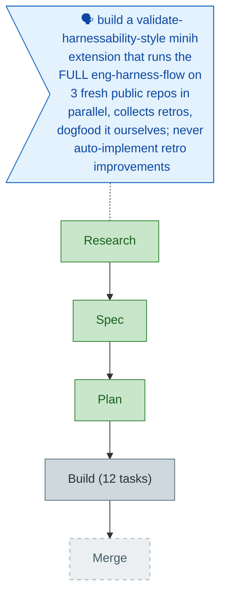

<!-- GENERATED FROM the-flow.json — do not hand-edit as the primary. -->
# Flight plan — dogfood-harness-flow (013)

**Legend** — 🟩 done · 🟧 in progress · 🟥 blocked · 🟦 known (designed) · ⬜ assumed (speculative) · 🗣 user input

**Now**: Plan written (Simple, READY, 12 tasks) + validated · **Next**: Build (/plan-6)
**No engineering-harness governance doc in this repo → harness loop nodes omitted.**
