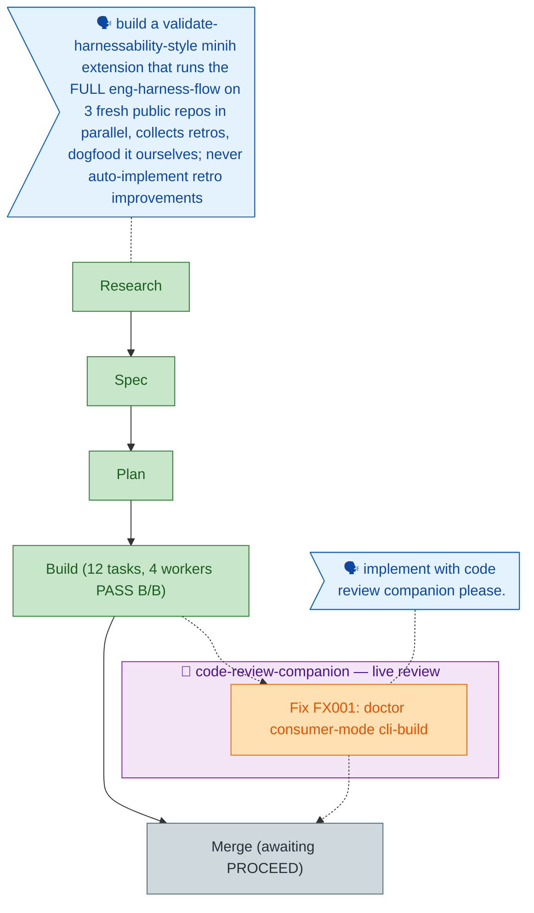

<!-- GENERATED FROM the-flow.json — do not hand-edit as the primary. -->
# Flight plan — dogfood-harness-flow (013)

**Legend** — 🟩 done · 🟧 in progress · 🟥 blocked · 🟦 known (designed) · ⬜ assumed (speculative) · 🗣 user input · 🟪 companion (wraps what it reviews)

**Now**: FX001 fix (validated) — implementing with code-review-companion · **Next**: Merge analysis (/plan-8) once the fix lands
**No engineering-harness governance doc in this repo → harness loop nodes omitted.**
**Surfaced findings ledger**: FIND-2 → FX001 (this fix) · FIND-4 → fixed (ea58be3) · bonus → AI-Substrate/minih#39 · FIND-1 (harness init) → **signal contaminated** — the worker prompt scripted the wish (de-leaked 2026-06-10); de-conflated + re-scoped (deterministic scaffold is the only shippable slice, grounding stays a skill job), see `.harness/records/retro/2026-06-10/001-init-ask-signal-correction.md` · FIND-3 → pending go.
