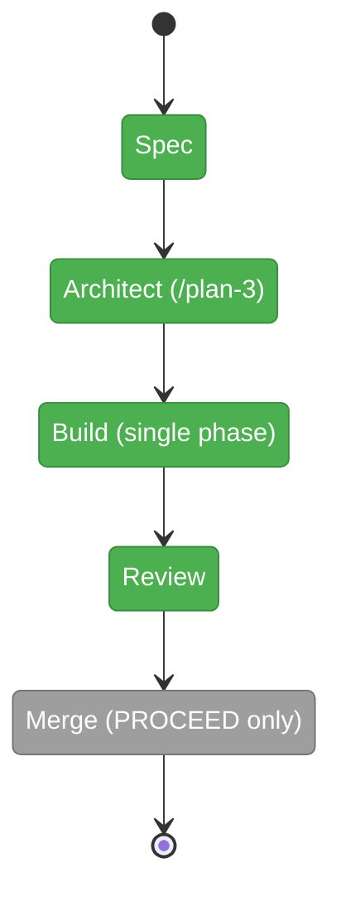

# Flight Plan: extension-enhancements-1 (014)

**Plan**: [extension-enhancements-1-plan.md](./extension-enhancements-1-plan.md) · **Spec**: [extension-enhancements-1-spec.md](./extension-enhancements-1-spec.md)
**Mode**: Simple · **CS**: 3 · **Generated**: 2026-06-10
**Status**: Build + companion review COMPLETE (T001–T017 ✅, 317/317, 14/14 ACs, 8 farewell findings fixed @ 1a6d5c9) — awaiting /plan-8 merge (typed PROCEED)

---

## Journey Map

**Legend**: grey = pending | yellow = active | red = blocked | green = done

---

## What → Why

**What**: (1) `harness instructions [verb]` — baked core agent-briefing + per-extension `instructions.md` loaded at runtime; AGENTS-START-HERE discoverability in help/doctor. (2) Folder-only extension layout: `.harness/extensions/<name>/extension.ts` + siblings; flat files unsupported. (3) Governance-path normalization: canonical `.harness/engineering-harness.md`, legacy chain removed; this repo authors its own governance doc.

**Why**: a zero-context agent should self-brief from the tool itself — verbs compute facts, instructions carry the agent's role and thesis. Folders let extensions carry their briefing beside their code. The repo finally practises what it ships.

---

## Phases

| Phase | Status | Deliverable |
|-------|--------|-------------|
| Spec | ✅ done | `extension-enhancements-1-spec.md` (14 ACs, 9 clarification rounds, Mode Simple) |
| Plan (/plan-3) | ✅ done | `extension-enhancements-1-plan.md` (READY; 17 tasks T001–T017; design decisions D1–D5 resolve spec-deferred choices) |
| Build | ✅ done | 9 commits 46c3c8a…18942c5: discovery folder-only (E143) → instructions act (E144/E145) → help banner → doctor wail → scaffold packages → fixtures+AC-14 → both extensions moved w/ briefings → skills canonical-only → `.harness/engineering-harness.md` → docs+gen:docs; `just fft` 315/315; 14/14 ACs |
| Review | ✅ done | companion run 2026-06-10T10-44-33-424Z-8149: 12 review tasks + final range sweep; farewell REQUEST_CHANGES w/ 8 findings (2 HIGH) — ALL fixed inline @ `1a6d5c9`; run exited `completed`; /plan-7 superseded |
| Merge | pending | /plan-8, explicit PROCEED |

---

## Flight Log

| Date | Event |
|------|-------|
| 2026-06-10 | Flow opened (ordinal 014); verbatim ask captured; 11 stale flows (003–013) closed for bulk merge |
| 2026-06-10 | Spec written via /plan-1b (Round 1: Simple/Hybrid/fake-ports/docs-how; Round 2: `instructions.md` convention, flat mode removed, folder-only scaffold + skills in scope, governance doc for this repo + legacy-path cleanup) |
| 2026-06-10 | validate-v2 (3 agents): **VALIDATED WITH FIXES** — AC-2/3/6/8/12 tightened (multi-verb resolution, act-scoped unconfigured, extension.js in chain + doctor new-reporting-path note, starter instructions.md defined, breadcrumb via governance template); thesis Advanced @ Contract; FC matrix ✅×4 post-fix |
| 2026-06-10 | Post-validation addendum (user): extensions are **little packages** — doctor validates convention shape (wails on missing `instructions.md`; AC-5/AC-9 flipped), package-internal imports first-class (new AC-14), genuine instructions authored for both current extensions (AC-7), GitHub installer explicitly OOS (future plan) |
| 2026-06-10 | /plan-3-v3-architect: plan **READY** (G1–G7: 6 PASS, G4 N/A) — 1 phase, 17 tasks (TDD pairs for CLI core), 2 research agents; deferred choices resolved as D1 (discovery returns rejected[]; registry synthesizes E143 failed records), D2 (missing instructions.md → doctor degraded, exit 0 — verified safe), D3 (act statuses; E145 unreadable), D4 (lazy load at invocation), D5 (contract untouched; verb→folder via record entryPath); scaffold entry = `extension.ts` (scout's index.ts suggestion overruled by spec) |
| 2026-06-10 | validate-v2 on the plan (3 agents): **VALIDATED WITH FIXES** — 14/14 AC coverage matrix complete, TDD ordering verified, all Done-Whens testable, FC ✅×4 consumers; 4 fixes applied (rejection fixture pinned to `flat-legacy.ts`, Finding 07 RESERVED_NAMES wording, T014 checklist Done-When, accepted assumptions recorded under Risks); 12+ findings dismissed (pre-implementation category errors / content already present). Status stays READY |
| 2026-06-10 | /plan-6-companion Build: T001–T017 landed in 9 atomic commits (RED/GREEN pairs); full suite 315/315 (`just fft`); all 14 ACs smoke-verified end-to-end; jiti subfolder-import risk retired at T011 before the T012 production split; companion pinged at every commit |
| 2026-06-10 | Companion debrief: farewell delivered 8 findings (2 HIGH: collect missed dated retro layout; CI smoke still flat) — all 8 ADDRESSED INLINE @ `1a6d5c9` (suite 317/317; check:docs clean). Protocol note: minih `wait_for_any` missed live pings, so the whole review arrived via the final range sweep. Companion magicWand (coordination/minih) surfaced; retro appended to docs/retros/code-review-companion.md |

### Orchestrator Retrospective (Build phase, 2026-06-10)

- **magicWand** (target: project): make the test sensor chain-safe — `just test` should propagate vitest exit through pipes (pipefail) and guard its cwd; the docs byte-compare integration test should fail with a distinguishable stale-dist message. Together these would have prevented one red commit and four false alarms this session.
- **difficulties**:
  - `OH-001` [engineering-harness/tooling, annoying]: vitest cwd sensitivity — suite must run from `harness/cli`; repo-root runs break 4 cwd-relative tests as false alarms. Workaround: always `cd harness/cli`; the justfile `cd` is load-bearing.
  - `OH-002` [engineering-harness/process, annoying]: `just test | grep` masked the vitest exit code — T016 was committed with a red test undetected. Workaround: re-ran suite after; failure was stale-dist only.
  - `OH-003` [engineering-harness/tooling, minor]: `integration/docs.test.ts` byte-compares the BUILT dist against regenerated source docs-content — any docs edit needs `npm run build` before the suite reads true.
  - `OH-004` [tooling/minih, minor]: minih outside-inbox commands silently depend on cwd (`.minih.json` resolution) — from `harness/cli` they report agent-not-found.
- **workedWell**: D1–D5 pre-resolved decisions made implementation mechanical (zero design re-derivation across 17 tasks); RED/GREEN pairs committed atomically kept every commit bisectable; T011-before-T012 ordering retired the jiti risk with a cheap fixture before the production split.
- **Companion farewell**: see the debrief row in the Flight Log above (paired stream); full retro in `docs/retros/code-review-companion.md`.
