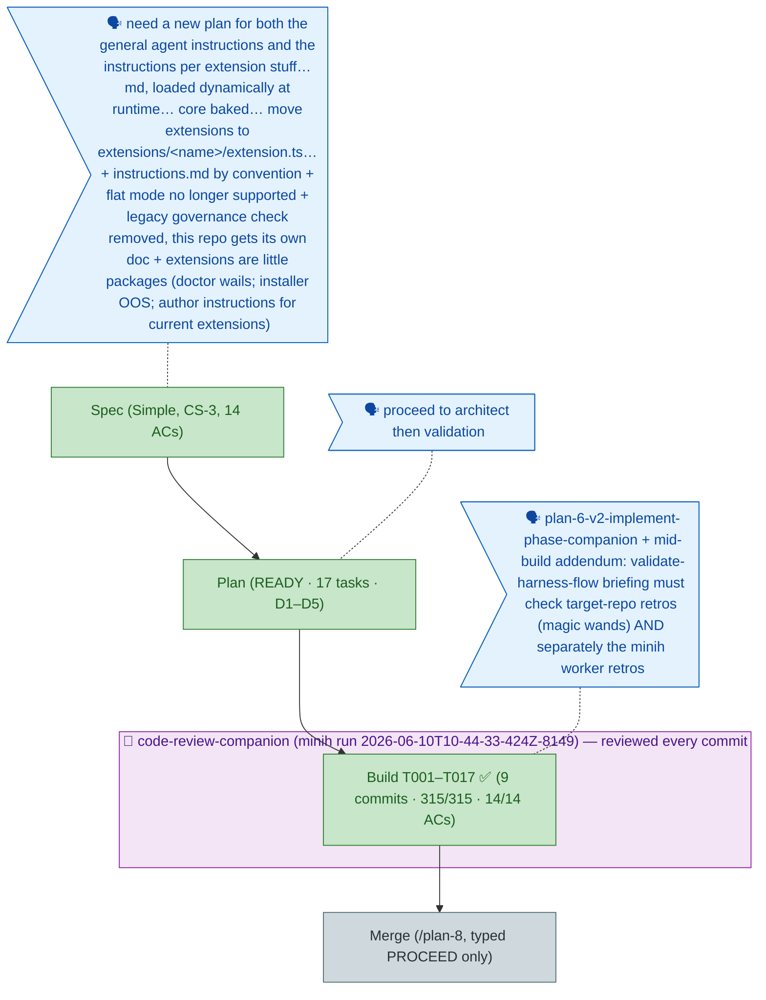

<!-- GENERATED FROM the-flow.json — do not hand-edit as the primary. -->
# Flight plan — extension-enhancements-1 (014)

**Legend** — 🟩 done · 🟧 in progress · 🟥 blocked · 🟦 known (designed) · ⬜ assumed (speculative) · 🗣 user input · 🤝 companion (wraps the phases it reviews)

**Now**: Build + companion review COMPLETE — T001–T017 in 9 atomic commits (`46c3c8a…18942c5`) + farewell fix commit `1a6d5c9` (8 findings, 2 HIGH, all addressed); suite 317/317; 14/14 ACs; companion run exited `completed` (supersedes /plan-7) · **Next**: /plan-8 merge analysis — executes only on typed PROCEED
**Build highlights**: folder-only discovery (E143 rejection records) · `harness instructions` act (E144/E145; D1–D5 honored; contract.ts untouched) · AGENTS START HERE in help · doctor convention wail (degraded, exit 0) · packages scaffolded w/ starter briefings · `flat-legacy.ts` permanent rejection fixture + `subby` AC-14 real-jiti proof · both dogfood extensions packaged w/ genuine briefings · skills canonical-only + governance-doc breadcrumb · `.harness/engineering-harness.md` authored (L2) · docs rewritten, `check:docs` clean
