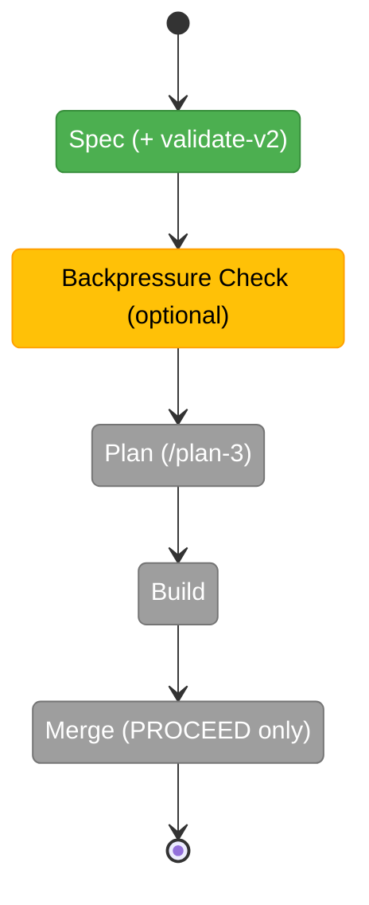

# Flight Plan: observe-retro-merge (015)

**Spec**: [observe-retro-merge-spec.md](./observe-retro-merge-spec.md) · **Plan**: _not yet generated_
**Mode**: Simple · **CS**: 3 · **Generated**: 2026-06-10
**Status**: Spec VALIDATED WITH FIXES (15 ACs, D-1..D-13) — awaiting /plan-2d (optional) or /plan-3

---

## Journey Map

**Legend**: grey = pending | yellow = active | green = done

---

## What → Why

**What**: (1) Merge `eng-harness-3-observe` into `eng-harness-4-retro` — one friction-lifecycle skill (capture judgment + drain + harvest), under 703 lines. (2) A `harness observe` CLI verb owning the deterministic half of capture: validation, IDs, timestamps, transient `.harness/temp/` storage with a gitignore guarantee, structured read-back, doctor convention check. (3) The question pair (magic wand + "what did you have to infer that the harness should have proved?") elevated to the headline signal in-flight and at drain; token-leak-via-recurrence made legible in harvest.

**Why**: the current observe skill makes the agent re-infer 186 lines of mechanics every session (and after every compaction) — exactly the inference-instead-of-determinism failure the harness exists to remove. CLI-owned capture makes friction notes lossless across context wipes, costs one command, and turns the gitignore question into a doctor-proven convention instead of prose.

---

## Phases

| Phase | Status | Deliverable |
|-------|--------|-------------|
| Spec | ✅ done | `observe-retro-merge-spec.md` (15 ACs; D-1..D-13; validate-v2: **VALIDATED WITH FIXES** — 4 agents, 1 CRITICAL [agent identity → D-11] + 4 HIGH fixed; spec's own drift claim corrected: `ensureTemp()` nested gitignore already exists, gap is capture-time + doctor only) |
| Backpressure Check (optional) | pending | `backpressure-coverage.md` if run |
| Plan (/plan-3) | pending | `observe-retro-merge-plan.md` |
| Build | pending | single phase expected (Simple) |
| Merge | pending | /plan-8, explicit PROCEED |

---

## Flight Log

| Date | Event |
|------|-------|
| 2026-06-10 | Flow opened (ordinal 015); verbatim ask + pre-flow design discussion captured in `original-ask.md` (merge is canon-restoring; CLI-owned capture per Rule 2; question pair = headline signal; storage classes; token framing; <703-line simplicity bar; drift found: observe skill overclaims CLI gitignore behavior) |
| 2026-06-10 | Spec written via /plan-1b (Simple/CS-3/Hybrid/fakes-only/docs-how — all settled from precedent + discussion per user instruction; D-5 slug default `eng-harness-4-retro`, D-6 verb default `harness observe`, both user-vetoable) |
| 2026-06-10 | validate-v2 (4 agents): **VALIDATED WITH FIXES** — CRITICAL: agent-identity resolution unspecified → D-11 (flag → env → unconfigured); HIGHs: unconfigured-repo contract (AC-4), preserved-behaviors inventory (AC-14), flow-dispatch decision (AC-12), P2-gitignore concern **dissolved** (FC agent found `ensureTemp()` nested gitignore already implemented — also corrected the spec's own overstated drift claim); MEDIUMs: `observe` → RESERVED_NAMES, read/clear flags locked (D-12), question wording locked (D-13), malformed-buffer ID-scan contract, AC-10 grep-able placements. FC matrix ✅×5 post-fix; thesis verdict Advanced @ Contract |
