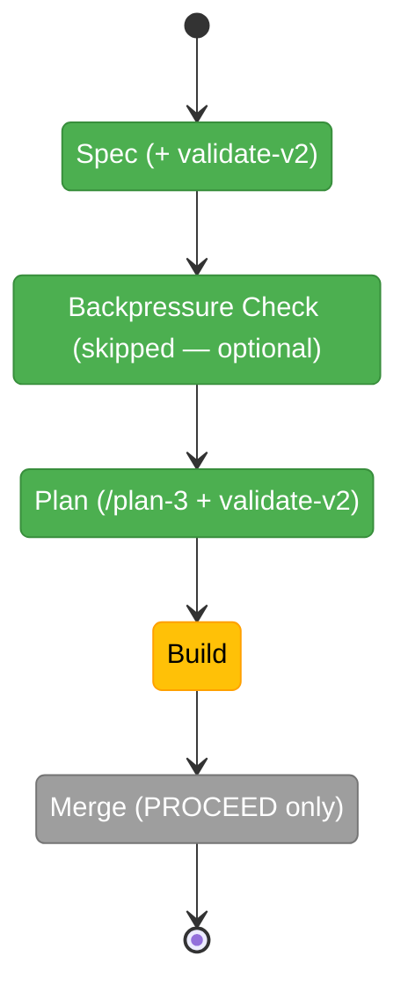

# Flight Plan: observe-retro-merge (015)

**Spec**: [observe-retro-merge-spec.md](./observe-retro-merge-spec.md) · **Plan**: [observe-retro-merge-plan.md](./observe-retro-merge-plan.md)
**Mode**: Simple · **CS**: 3 · **Generated**: 2026-06-10
**Status**: Plan **READY** + VALIDATED WITH FIXES (single phase, T000–T014, D1–D10) — awaiting /plan-6 (build)

---

## Journey Map

**Legend**: grey = pending | yellow = active | green = done

---

## What → Why

**What**: (1) Merge `eng-harness-3-observe` into `eng-harness-4-retro` — one friction-lifecycle skill (capture judgment + drain + harvest), under 703 lines. (2) A `harness observe` CLI verb owning the deterministic half of capture: validation, IDs, timestamps, transient `.harness/temp/` storage with a gitignore guarantee, structured read-back, doctor convention check. (3) The question pair (magic wand + "what did you have to infer that the harness should have proved?") elevated to the headline signal in-flight and at drain; token-leak-via-recurrence made legible in harvest.

**Why**: the current observe skill makes the agent re-infer 186 lines of mechanics every session (and after every compaction) — exactly the inference-instead-of-determinism failure the harness exists to remove. CLI-owned capture makes friction notes lossless across context wipes, costs one command, and turns the gitignore question into a doctor-proven convention instead of prose.

---

## Phases

| Phase | Status | Deliverable |
|-------|--------|-------------|
| Spec | ✅ done | `observe-retro-merge-spec.md` (15 ACs; D-1..D-13; validate-v2: **VALIDATED WITH FIXES** — 4 agents, 1 CRITICAL [agent identity → D-11] + 4 HIGH fixed; spec's own drift claim corrected: `ensureTemp()` nested gitignore already exists, gap is capture-time + doctor only) |
| Backpressure Check (optional) | — skipped | user went straight to architect; spec validation had already confirmed AC-1..AC-8 sensor-mappable |
| Plan (/plan-3) | ✅ done | `observe-retro-merge-plan.md` — **READY**, gates 6 PASS / 1 N/A; D1–D10 resolve all spec-deferred choices; validate-v2: **VALIDATED WITH FIXES** (3 agents; 1 CRITICAL — AC-14 verification hooks — + 5 HIGH fixed; FC 4/4 PASS, confidence 0.88) |
| Build (next) | pending | single phase confirmed: T000–T014 (TDD pairs for CLI, dogfood drain proof) |
| Merge | pending | /plan-8, explicit PROCEED |

---

## Flight Log

| Date | Event |
|------|-------|
| 2026-06-10 | Flow opened (ordinal 015); verbatim ask + pre-flow design discussion captured in `original-ask.md` (merge is canon-restoring; CLI-owned capture per Rule 2; question pair = headline signal; storage classes; token framing; <703-line simplicity bar; drift found: observe skill overclaims CLI gitignore behavior) |
| 2026-06-10 | Spec written via /plan-1b (Simple/CS-3/Hybrid/fakes-only/docs-how — all settled from precedent + discussion per user instruction; D-5 slug default `eng-harness-4-retro`, D-6 verb default `harness observe`, both user-vetoable) |
| 2026-06-10 | validate-v2 (4 agents): **VALIDATED WITH FIXES** — CRITICAL: agent-identity resolution unspecified → D-11 (flag → env → unconfigured); HIGHs: unconfigured-repo contract (AC-4), preserved-behaviors inventory (AC-14), flow-dispatch decision (AC-12), P2-gitignore concern **dissolved** (FC agent found `ensureTemp()` nested gitignore already implemented — also corrected the spec's own overstated drift claim); MEDIUMs: `observe` → RESERVED_NAMES, read/clear flags locked (D-12), question wording locked (D-13), malformed-buffer ID-scan contract, AC-10 grep-able placements. FC matrix ✅×5 post-fix; thesis verdict Advanced @ Contract |
| 2026-06-10 | D-11 user veto: strict identity ("error when undeterminable") softened to `--agent` → `HARNESS_AGENT` → deterministic default bucket — capture never fails on identity; `--list`/`--clear` go all-buckets by default so the drain sweeps everything (stranded-bucket risk closed). Rationale: "the agent" is almost always the one coding agent; minih workers run in cloned target repos; companions have their own feedback channel |
| 2026-06-10 | Plan via /plan-3 (backpressure check skipped by user): **READY** — single phase T000–T014; design decisions D1–D10 settle every spec-deferred choice: D1 dedicated observe service + `ensureTemp` relocated to `services/shared/temp.ts` (`placement?` hook stays reserved); D2 keep YAML-blocks-in-md at the existing buffer path (constrained codec, **no yaml dependency** — core stays commander+jiti); D3 legacy entries dissolve (same format; deviants surface as `malformed_skipped`, never silently dropped); D4 kebab-sanitized identity (extends D-11, vetoable); D5 doctor probe rides `checkConventions()` (E144 pattern); D6 edge envelopes locked (E146 for unreadable buffer); D7 flow dispatch **re-pointed** to merged skill; D8 one locked line in eng-harness-0-setup; D9 list envelope shape locked; D10 CLI writes full `system.compound`. validate-v2 (3 agents): **VALIDATED WITH FIXES** — Source-Truth agent verified all 9 findings line-accurate + constitution PASS (no Deviation Ledger); Completeness CRITICAL fixed (T012 now requires a 9-row AC-14 mapping table — section+line per preserved behavior); 5 HIGH fixed (boundary tests, empty-env, malformed-count list test, exact grep commands, flow-row `harness observe` note); preservation-drift added as explicit risk. FC 4/4 consumers PASS, confidence 0.88 |
