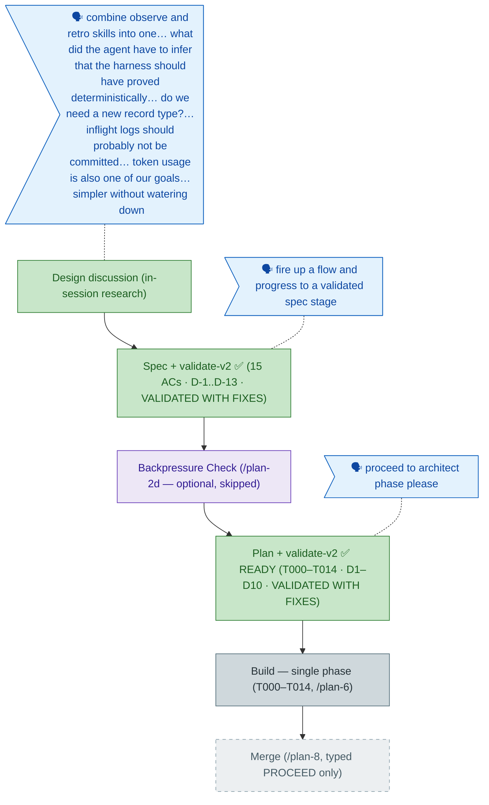

<!-- GENERATED FROM the-flow.json — do not hand-edit as the primary. -->
# Flight plan — observe-retro-merge (015)

**Legend** — 🟩 done · 🟧 in progress · 🟦 known (designed) · ⬜ assumed (speculative) · 🗣 user input · 🟪 harness loop

**Now**: Plan **READY** + VALIDATED WITH FIXES — single phase T000–T014; design decisions D1–D10 resolve every choice the spec deferred (dedicated observe service with `ensureTemp` relocated to a shared module; YAML-in-md buffer format kept so legacy hand-written entries parse natively, **no new runtime dependency**; doctor probe rides the E144 conventions pattern; flow dispatch re-pointed to the merged skill). The validators' headline catch: T012's AC-14 check was upgraded from a "read-through" to a **mandatory 9-row mapping table** (section + line per preserved behavior) — the concrete defense against the spec's stated main thesis risk, silent preservation drift · **Next**: `/plan-6` build (companion recommended; `/compact` first at this seam)
