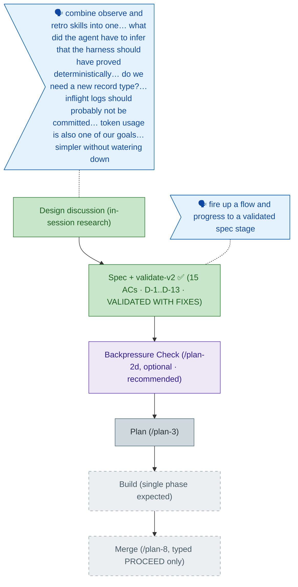

<!-- GENERATED FROM the-flow.json — do not hand-edit as the primary. -->
# Flight plan — observe-retro-merge (015)

**Legend** — 🟩 done · 🟧 in progress · 🟦 known (designed) · ⬜ assumed (speculative) · 🗣 user input · 🟪 harness loop

**Now**: Spec **VALIDATED WITH FIXES** — 15 ACs, clarifications D-1..D-13 (slug/verb/identity/flags/wording defaults all vetoable). validate-v2's headline catch: the one CRITICAL (how does the CLI know which agent is calling? → D-11 flag→env→unconfigured) plus a finding that **corrected the spec itself** — `ensureTemp()` already writes a nested `.harness/temp/.gitignore`, so the real gap is capture-time triggering + a doctor check, and no repo-root gitignore mutation is needed at all · **Next**: `/plan-2d` backpressure check (recommended, optional) → `/plan-3` architect
