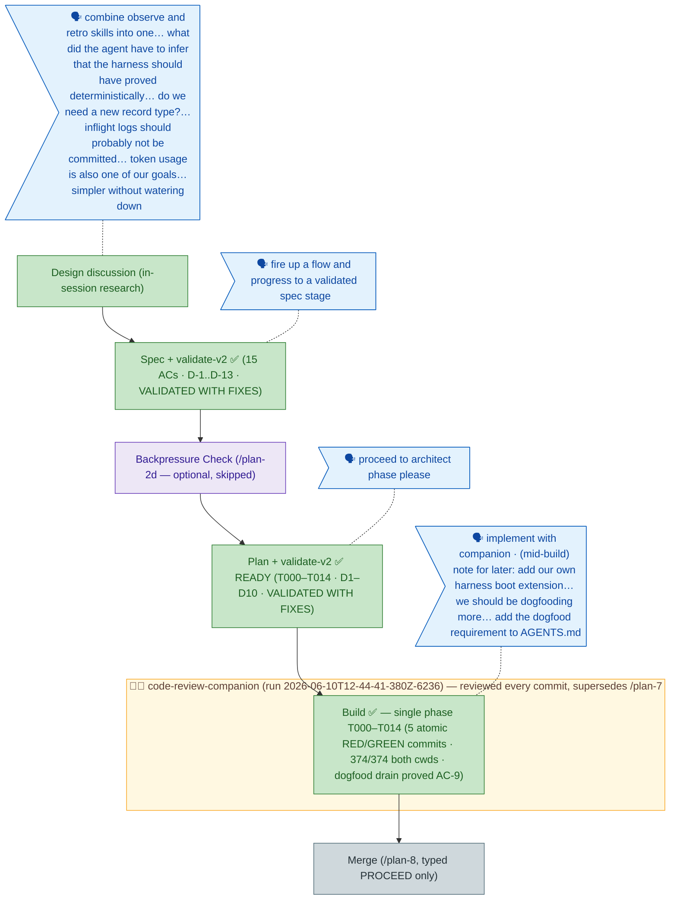

<!-- GENERATED FROM the-flow.json — do not hand-edit as the primary. -->
# Flight plan — observe-retro-merge (015)

**Legend** — 🟩 done · 🟧 in progress · 🟦 known (designed) · ⬜ assumed (speculative) · 🗣 user input · 🟨 companion · 🟪 harness loop

**Now**: Build **COMPLETE** — T000–T014 in 5 atomic RED/GREEN commits: the `harness observe` core act (capture/list/clear, all-buckets sweep, E146, reserved name), doctor temp-hygiene probe, briefing capture+drain section, and the merged **386-line** friction-lifecycle skill (vs 703 across the two it replaces; AC-14 inventory 9/9 mapped with line numbers; D-13 question pair verbatim ×2). The slug is retired from every live surface (repo-root grep: zero hits). T013 was the **first real dogfood drain**: two mid-build observations (the user's harness-boot-extension note + the FakeFs readdir fidelity gap) captured via the new verb itself, materialized into committed record `002-015-observe-retro-merge-build-drain.md` via the CLI-returned `data.path`, then cleared. Suite **374/374 from both cwds**; companion reviewed every commit · **Next**: `/plan-8` merge analysis — executes only on typed `PROCEED`
