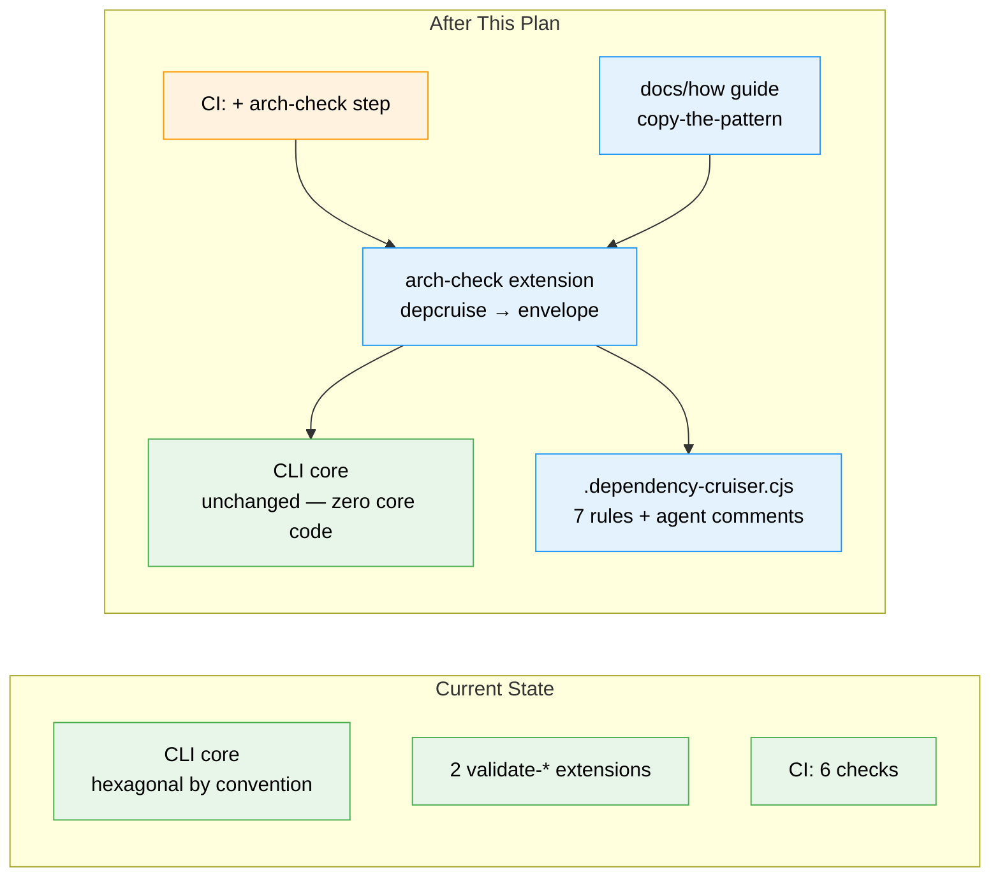

# Flight Plan: Arch Conformance Exemplar Extension (`arch-check`)

**Spec**: [arch-conformance-extension-spec.md](./arch-conformance-extension-spec.md)
**Plan**: [arch-conformance-extension-plan.md](./arch-conformance-extension-plan.md)
**Generated**: 2026-06-10 (enriched by /plan-3)
**Status**: Build complete (companion-reviewed) — merge pending (`/plan-8`, typed PROCEED)

---

## The Mission

**What we're building**: A third exemplar harness extension — a `harness arch-check` verb that runs dependency-cruiser over the CLI's source against 7 committed rules encoding the hexagonal (ports & adapters) contract, and reports the result as an honest harness envelope: green when the architecture holds; at launch every rule sits at `warn`, so a violation yields a `degraded` envelope + a CI warning annotation naming the violated rule (and quoting its plain-English explanation). Promotion to blocking `error`/red-CI is a deliberate future flip.

**Why it matters**: today the architecture is enforced by reviewer eyeballs; this makes conformance a deterministic, self-explaining sensor — and demonstrates the "encode your architecture as rules" pattern consumer repos can copy.

---

## Where We Are → Where We're Headed

```
TODAY:                                      AFTER this plan:
2 exemplar extensions                       3 exemplar extensions

🔵 validate-harnessability (same)           🔵 validate-harnessability (same)
🔵 validate-harness-flow (same)             🔵 validate-harness-flow (same)
❌ hexagonal rules: prose-only docs         🔴 .dependency-cruiser.cjs (NEW) — 7 rules, all warn at launch
❌ violations: caught by reviewers, maybe   🔴 arch-check verb (NEW) — degraded envelope + PR warning, rule + fix quoted
🟡 CI: lint · build · docs · types · test   🟡 CI: + arch-check step (verb; warns annotate, crash/missing-tool fails)
❌ failure explains itself: no              🔴 yes — each rule's comment travels with the violation
```



**Legend**: existing (green, unchanged) | changed (orange, modified) | new (blue, created)

---

## Scope

**Goals**:
- 7 PoC-proven hexagonal rules committed and continuously measured — violations become degraded envelopes + PR warning annotations at launch (red CI once severities are promoted), not review comments
- Agent-legible failures: every rule carries a `comment`; the violation envelope quotes it at the point of failure
- Exemplar quality: the extension models the contract (guardrails, briefing, honest statuses) well enough to copy
- One config, one code path: the verb, raw depcruise runs, and CI all consume the same root rules — and CI calls the verb
- Honest degradation: tool missing → `unconfigured`/exit 2 with the install command; never a crash, never a fake ok

**Non-Goals**:
- No ESLint (Biome stays the only linter) and no CodeQL — both ruled out in the investigation
- No coverage beyond `harness/cli/src`; no graph visualization (future `--graph` option)
- No new CLI core code; no custom depcruise reporter; no rule-authoring DSL
- No `examples/extensions/` starter copy — a future "install extensions from other repos" core capability is the distribution channel

---

## Journey Map


**Legend**: green = done | yellow = active | grey = not started

---

## Phases Overview

| Phase | Title | Tasks | CS | Status |
|-------|-------|-------|----|--------|
| 1 | arch-check end-to-end (Simple mode) | 11 (+2 harness-loop rows) | CS-2 overall | Complete |

---

## Acceptance Criteria

- [x] `dependency-cruiser` installed as devDependency; rules committed at root `.dependency-cruiser.cjs` with agent-readable comments (no `tsConfig` option)
- [x] Clean tree: `harness arch-check --json` → `ok`, exit 0, real module/dependency counts (66/112), empty violations
- [x] Seeded violation caught by `services-only-adapter-ports`: `degraded`, exit 0 (warn-launch), rule comment quoted in `next_action`; blocking path proven by fixtures
- [x] All six envelope states demonstrated (rows 1/3/4/5 live; rows 2/6 unit-fixture-proven)
- [x] Always `./node_modules/.bin/depcruise` — the bare-npx 0-modules gotcha encoded in source comment + briefing (+ a third gotcha discovered: json reporter exits 0 on violations — parse-first)
- [x] `doctor` loads the extension clean ("3 loaded, 0 failed"); `harness instructions arch-check` prints the briefing
- [x] CI runs the verb (never raw depcruise); any non-zero exit fails the build; `degraded` emits a `::warning::` annotation; both paths dry-run proven locally (live reading on the PR)
- [x] Mapping unit-tested over 4 fixtures (TDD half); `docs/how/` guide shipped; full suite green from both cwds (378/378)

---

## Key Risks

| Risk | Mitigation |
|------|-----------|
| depcruise version drift changes JSON shape | lockfile pin; mapping reads only pinned `summary` fields; malformed-JSON state fails loudly |
| Rules ossify the architecture | one root file, per-rule comments; how-guide documents amending a rule with the refactor that needs it |
| Consumer repos copy the exemplar without the devDependency | `unconfigured`/exit 2 envelope with the exact install command |
| Warn parking lot — violations accumulate, nobody promotes | `::warning::` on every PR + ramp doctrine in the how-guide: warn only while a named cleanup is in flight |

---

## Flight Log

<!-- Updated by /plan-6 and /plan-6a after each phase completes -->

### Phase 1: arch-check end-to-end — Complete (2026-06-10)

**What was done**: Shipped the third exemplar extension end-to-end with a live `code-review-companion` reviewing every commit (13 review-request pings; the farewell delivered 7 findings — 5 HIGH/2 MEDIUM — after a minih channel failure suppressed its in-phase replies; all reconciled post-debrief: 5 fixed, 1 partially fixed with reasoned deferral, 1 refuted with evidence). dependency-cruiser ^17.4.3 installed; 7 hexagonal rules committed at root at `warn` severity (warn-launch); pure `mapToDecision(parsed, rules)` TDD-proven over 4 real-capture fixtures; extension shell with honest preflight/degradation; CI runs the verb as the final `build-test` step with `::warning::` on degraded; how-guide + briefing framed in the harness-foundations vocabulary (user direction mid-build); governance doc reads 3 loaded; phase-seam drain materialised 12 entries (SUGG-010 P12-sanitized).

**Key changes**:
- `.dependency-cruiser.cjs` — NEW: the rule contract (7 rules, all `warn`, agent-readable comments)
- `.harness/extensions/arch-check/` — NEW: `extension.ts`, pure `mapping.ts`, 4-fixture test suite, `instructions.md`
- `harness/cli/vitest.config.ts` — include widened two-levels-up to collect extension tests
- `.github/workflows/ci.yml` — final arch-check step (verb-invoked, warn-annotating)
- `docs/how/architecture-conformance.md` — NEW: the copyable pattern guide; `README.md` pointer
- `.harness/engineering-harness.md` — 3 loaded, hexagonal-conformance sensor row

**Decisions made**: error-violation state returns a literal `VerbResult` (error factory lacks a data slot; spec pins `data.violations` whenever depcruise ran). Discovery encoded same-session: depcruise 17.4.3 json reporter exits 0 even on error violations → parse-first design (gotcha #3 in guide + briefing + tests).

#### Orchestrator Retrospective

- **magicWand** (target: `agent-harness`/minih): a cheap companion ack/heartbeat surface — per-message read/processed state on `minih outside inbox list` — so the orchestrator can distinguish reviewed-clean from never-read without breaking fire-and-forget.
- **Difficulties**: OH-001 (tooling, annoying) — depcruise 17.4.3 exits 0 from `--output-type json` even with error-severity violations; the PoC note implied exit 1. Workaround: parse-first design, pure `parseDepcruiseJson`, malformed-fixture test, gotcha #3 in guide + briefing — encoded same-session.
- **Worked well**: the validated plan executed with zero re-research (every pinned decision simply applied); seed→capture→revert fixture generation kept fixtures real and caught a wrong test expectation (112 vs 113 deps).
- **Companion farewell**: see `.harness/records/retro/2026-06-10/` paired records (companion + orchestrator).
